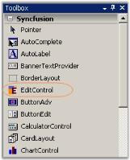
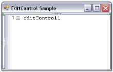

# Getting Started

This section guides you on getting started with Windows application, controls etc. It comprises the following topics:

## Control Structure

The following screen shot illustrates the structure of the Edit Control.

## Creating an Edit Control

Essential Edit provides users with a powerful editing control, modeled after the VS.NET code editor. When complete, Edit will have almost all the code editing features available in VS.NET.

In the following sections, you will learn how to create an Edit Control and use it in windows application.

### Through Designer

The following steps illustrate how to create an Edit Control through designer.

1. Open the host form (or user control) within the Visual Studio.NET designer, and drag the Edit Control from the VS.NET toolbox onto the form. This will create an instance of the Edit Control and add it to the form at the desired location.

   The following image shows Edit Control in the toolbox.

   

2. Customize the Edit Control as per your requirements by setting the properties of the control through the Properties grid.
3. Run the application.

The following illustration shows Edit Control created through designer.

### Through Code

The following steps illustrate how to create an Edit Control programmatically.

1. Import the Edit Control package in your application for easier coding experience.

   ~~~ cs

		using Syncfusion.Windows.Forms.Edit;

   ~~~
   {:.prettyprint }
   
   ~~~ vbnet

		Imports Syncfusion.Windows.Forms.Edit

   ~~~
   {:.prettyprint }

2. Create an instance of the Edit Control.

   ~~~ cs

		private Syncfusion.Windows.Forms.Edit.EditControl editControl1;

		editControl1 = new Syncfusion.Windows.Forms.Edit.EditControl();

   ~~~ 
   {:.prettyprint }
   
   ~~~ vbnet

		Private editControl1 As Syncfusion.Windows.Forms.Edit.EditControl

		editControl1 = New Syncfusion.Windows.Forms.Edit.EditControl()

   ~~~
   {:.prettyprint }

3. Set an appropriate size for the Edit Control.

   ~~~ cs

		editControl1.Size = new Size(50, 50);

   ~~~
   {:.prettyprint }
   
   ~~~ vbnet

		editControl1.Size = New Size(50, 50)

   ~~~
   {:.prettyprint }

4. Set the Dock property to the appropriate DockStyle enumeration value if desired.

   ~~~ cs

		editControl1.Dock = DockStyle.Fill;

   ~~~ 
   {:.prettyprint }

   ~~~ vbnet

		editControl1.Dock = DockStyle.Fill
   ~~~
   {:.prettyprint }

5. Set an appropriate BorderStyle to the Edit Control instance.

   ~~~ cs

		editControl1.BorderStyle = BorderStyle.Fixed3D;

   ~~~
   {:.prettyprint }

   ~~~ vbnet

		editControl1.BorderStyle = BorderStyle.Fixed3D

   ~~~
   {:.prettyprint }

6. Add this instance of the Edit Control to the Host Form or an UserControl.

   ~~~ cs

		// Adding instance of the EditControl to the Host Form.

		this.Controls.Add(editControl1);

   ~~~
   {:.prettyprint }  

   ~~~ vbnet

		' Adding instance of the EditControl to the Host Form.

		Me.Controls.Add(editControl1)

   ~~~
   {:.prettyprint }

7. Run the application.

The following illustration shows Edit Control created through code.



[Through Designer](#through-designer)

