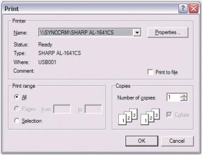
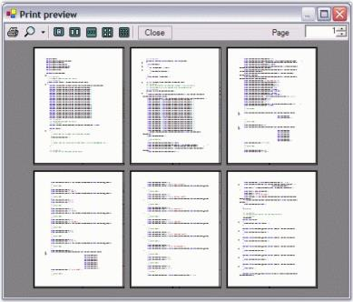
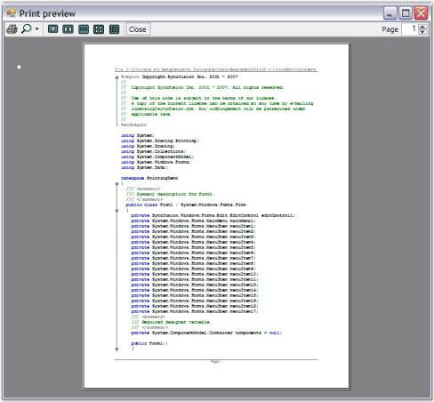

# Printing

The Edit Control provides complete support for printing its contents. You can either print the entire document, just the current page, specific pages, or selected text. The printing implementation is very similar to the one available in standard applications such as MS Office or Visual Studio.NET. A Print dialog box provides options to customize the printer settings, number of copies, the pages to be printed, and so on. Edit Control also includes a Print Preview feature that allows you to view the document before printing. Moreover, features like customizable header and footer are also available in Essential Edit.

In brief, the printing functionality of the Edit Control supports the following features.

* Print Preview
* Custom Header and Footer Text
* Document Name
* Page Numbers
* Content Dividers
* Wordwrap
* Color Printing to preserve Syntax Highlighting
* Selected Text Printing
* Line Numbers
* Printing a Specific Page or Set of Pages
* Printing Entire Document
* Creating a Printer Document
* Current Page Printing
* Printer Dialog
* Outlining Blocks

You can invoke the Print dialog box by using the Print method of the Edit Control, as shown in the below code snippet.

[C#]

// Invoke the print dialog.

this.editControl1.Print();

[VB.NET]

' Invoke the print dialog.

Me.editControl1.Print()

{  | markdownify }
{:.image }

_Figure_ _77__: Print Dialog Box_

Use the PrintPreview method to view the contents of the Edit Control before they are printed.

[C#]

// View the contents of the Edit Control before printing.

this.editControl1.PrintPreview();

[VB.NET]

' View the contents of the Edit Control before printing.

Me.editControl1.PrintPreview()

{  | markdownify }
{:.image }

_Figure_ _78__: Print Preview_

Specifying Printing Options

The following methods allow you to specify the options for printing.

<table>
<tr>
<td>
Edit Control Method</td><td>
Description</td></tr>
<tr>
<td>
PrintCurrentPage</td><td>
Prints current page on default printer.</td></tr>
<tr>
<td>
PrintNoDialog</td><td>
Prints entire document on default printer.</td></tr>
<tr>
<td>
PrintSelection</td><td>
Prints selected area on default printer.</td></tr>
<tr>
<td>
PrintPages</td><td>
Prints the pages in the specified range.</td></tr>
</table>

[C#]

// Print the current page.

this.editControl1.PrintCurrentPage();

// Print the entire document.

this.editControl1.PrintNoDialog();

// Print the selected area.

this.editControl1.PrintPages(1, 10);

// Print the pages in the specified range.

this.editControl1.PrintSelection();

[VB.NET]

' Print the current page.

Me.editControl1.PrintCurrentPage()

' Print the entire document.

Me.editControl1.PrintNoDialog()

' Print the selected area.

Me.editControl1.PrintPages(1, 10)

' Print the pages in the specified range.

Me.editControl1.PrintSelection()

Customized Header Footer

Header and Footer can be shown / hidden while printing the document by using the PageHeaderAndFooterVisible property. 

The following properties are used to print the contents of the editor, the document name as the header, and the page number as footer.

<table>
<tr>
<td>
Edit Control Property</td><td>
Description</td></tr>
<tr>
<td>
PrintDocument</td><td>
Gets print document, that can be used to print the contents of the editor.</td></tr>
<tr>
<td>
PrintDocumentName</td><td>
Gets / sets value indicating whether the document name should be printed.</td></tr>
<tr>
<td>
PrintPageNumber</td><td>
Gets / sets value indicating whether the page number should be printed.</td></tr>
</table>

Users can also specify their desired text in the header and footer by handling the PrintHeader and PrintFooter events. 

The default text in the header and footer is the fully qualified path of the file including the file name and page number respectively.

<table>
<tr>
<td>
Edit Control Property</td><td>
Description</td></tr>
<tr>
<td>
PrintHeader</td><td>
Occurs when page header is printed.</td></tr>
<tr>
<td>
PrintFooter</td><td>
Occurs when page footer is printed.</td></tr>
</table>

[C#]

private void editControl1_PrintHeader(object sender, Syncfusion.Windows.Forms.Edit.PrintHeadlineEventArgs e)

{

// Set the desired text in the header. The default text in the header is the full path and the name of the file.

e.Text = "This is the header";

}

private void editControl1_PrintFooter(object sender, Syncfusion.Windows.Forms.Edit.PrintHeadlineEventArgs e)

{

// Set desired text in the footer. The default text in the footer is the page number.

e.Text = "This is the footer";

}

[VB.NET]

Private Sub editControl1_PrintHeader(ByVal sender As Object, ByVal e As Syncfusion.Windows.Forms.Edit.PrintHeadlineEventArgs) Handles EditControl1.PrintHeader

' Set the desired text in the header. The default text in the header is the full path and the name of the file.

e.Text = "This is the header"

End Sub 'editControl1_PrintHeader

Private Sub editControl1_PrintFooter(ByVal sender As Object, ByVal e As Syncfusion.Windows.Forms.Edit.PrintHeadlineEventArgs) Handles EditControl1.PrintFooter

' Set desired text in the footer. The default text in the footer is the page number.

e.Text = "This is the footer"

End Sub

The following image shows a typical page with a header and footer in Print Preview mode.

{  | markdownify }
{:.image }

_Figure_ _79__: Preview of Header and Footer_

Page Border Settings

Edit Control provides the following methods to display page borders for the Edit Control.

<table>
<tr>
<td>
Edit Control Method</td><td>
Description</td></tr>
<tr>
<td>
SetPageBorder</td><td>
Sets parameters of border that's drawn in page preview.</td></tr>
<tr>
<td>
RemovePageBorder</td><td>
Removes border drawing in page preview.</td></tr>
</table>

[C#]

// Set the page border. 

this.editControl1.SetPageBorder(Syncfusion.Windows.Forms.Edit.Enums.FrameBorderStyle.DashDot, Color.Red, Syncfusion.Windows.Forms.Edit.Enums.BorderWeight.Bold);

// Remove the page border.

this.editControl1.RemovePageBorder();

[VB.NET]

' Set the page border. 

Me.editControl1.SetPageBorder(Syncfusion.Windows.Forms.Edit.Enums.FrameBorderStyle.DashDot, Color.Red, Syncfusion.Windows.Forms.Edit.Enums.BorderWeight.Bold)

' Remove the page border.

Me.editControl1.RemovePageBorder()

Refer to the Printing Demo sample for more information in this regard.

_..\____My Documents\Syncfusion\EssentialStudio\Version Number\Windows\Edit.Windows\Samples\Advanced Editor Functions\ActionGroupingDemo_

