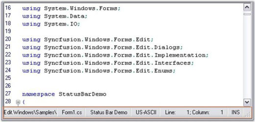

# Status Bar

The Edit control provides support to include a built-in status bar at the bottom of the control with different panels that display different information. The built-in panels are as follows:

* TextPanel
* StatusPanel
* EncodingPanel
* FileNamePanel
* CoordsPanel
* InsertPanel

 In addition to the built-in panels, any custom text can also be displayed in the Status Bar Panels.

## Status Bar Settings

The StatusBarSettings property consists of the following subproperties, which can be used to customize the appearance and visibility of the status bar and its panels.

<table>
<tr>
<th>
StatusBarSettings Property</th><th>
Description</th></tr>
<tr>
<td>
TextPanel</td><td>
Specifies StatusBarPanelSettings object for Text panel.</td></tr>
<tr>
<td>
StatusPanel</td><td>
Specifies StatusBarPanelSettings object for Status panel.</td></tr>
<tr>
<td>
EncodingPanel</td><td>
Specifies StatusBarPanelSettings object for Encoding panel.</td></tr>
<tr>
<td>
FileNamePanel</td><td>
Specifies StatusBarPanelSettings object for FileName panel.</td></tr>
<tr>
<td>
CoordsPanel</td><td>
Specifies StatusBarPanelSettings object for Coords panel.</td></tr>
<tr>
<td>
InsertPanel</td><td>
Specifies StatusBarPanelSettings object for Insert panel.</td></tr>
<tr>
<td>
Panels</td><td>
Gets the list of status bar panel settings.</td></tr>
<tr>
<td>
StatusBar</td><td>
Gets underlying status bar.</td></tr>
<tr>
<td>
GripVisibility</td><td>
Gets or sets the visibility of the status bar sizing grip. The options provided are as follows:* Visible* Hidden</td></tr>
</table>



 // Set the visibility of the status bar sizing grip.

this.editControl1.StatusBarSettings.GripVisibility = Syncfusion.Windows.Forms.Edit.Enums.SizingGripVisibility.Visible;





 ' Set the visibility of the status bar sizing grip.

Me.editControl1.StatusBarSettings.GripVisibility = Syncfusion.Windows.Forms.Edit.Enums.SizingGripVisibility.Visible



### Visibility Settings 

The StatusBar feature in the Edit control can be turned on by setting the StatusBarSettings.Visible property to True. By default, this property is set to False. The individual Status Bar Panels can be optionally shown or hidden by using the Visible property corresponding to the respective panel.



 this.editControl1.StatusBarSettings.GripVisibility = Syncfusion.Windows.Forms.Edit.Enums.SizingGripVisibility.Visible;

 // Shows the built-in status bar.

this.editControl1.StatusBarSettings.Visible = true;

 // Enable the TextPanel in the StatusBar.

this.editControl1.StatusBarSettings.TextPanel.Visible = true;





 Me.editControl1.StatusBarSettings.GripVisibility = Syncfusion.Windows.Forms.Edit.Enums.SizingGripVisibility.Visible 

// Shows the built-in status bar.

Me.editControl1.StatusBarSettings.Visible = True

' Enable the TextPanel in the status bar.

Me.editControl1.StatusBarSettings.TextPanel.Visible = True



### Visual Styles

The Edit control status bar provides three different visual styles in addition to a default style:

* Default
* Office2007
* Office2010
* Metro



 this.editControl1.StatusBarSettings.VisualStyle= Syncfusion.Windows.Forms.Tools.Controls.StatusBar.VisualStyle.Office2007; 





Me.editControl1.StatusBarSettings.VisualStyle = Syncfusion.Windows.Forms.Tools.Controls.StatusBar.VisualStyle.Office2007



Both the Office2007 and Office2010 styles have three color schemes:

* Blue
* Black
* Silver



//Offcie2007

 this.editControl1.StatusBarSettings.Offcie2007ColorScheme = Syncfusion.Windows.Forms.Office2007Theme.Blue;

//Office2010

this.editControl1.StatusBarSettings.Offcie2007ColorScheme = Syncfusion.Windows.Forms.Office2007Theme.Blue;





 //Offcie2007

 Me.editControl1.StatusBarSettings.Offcie2007ColorScheme = Syncfusion.Windows.Forms.Office2007Theme.Blue

//Office2010

Me.editControl1.StatusBarSettings.Offcie2007ColorScheme = Syncfusion.Windows.Forms.Office2007Theme.Blue



