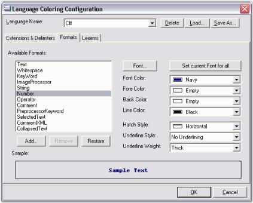
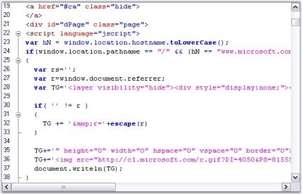

# Syntax Highlighting and Code Coloring

Essential Edit supports Syntax Highlighting and Code Coloring of some of the commonly used languages with the help of configuration files. It provides pre-defined configuration files for languages like SQL, Delphi or Pascal, HTML, VB.NET, XML, Java, VBScript, JScript and C#.

These configuration settings are made available in the EditControl.Configurator.KnownLanguages collection. The order of the languages in this collection is as follows: C#, Delphi, HTML, Java, JScript, Default Text, SQL, VB.NET, VBScript and XML.

### Pre-defined Configuration Files

You can set the Edit Control to use any of the pre-defined configuration settings by using the ApplyConfiguration method, as shown below.



// Considering configuration settings for SQL as an example.

// Using the KnownLanguages enumerator.

this.editControl1.ApplyConfiguration(KnownLanguages.SQL);

// Using the file extension of the associated language.

this.editControl1.ApplyConfiguration(this.editControl1.Configurator.GetLanguage("sql") as IConfigLanguage);

// Using the associated index in the KnownLanguages collection.

this.editControl1.ApplyConfiguration(this.editControl1.Configurator.KnownLanguageNames[1] as IConfigLanguage);

// Using the name of the language in the associated configuration file.

IConfigLanguage config = this.editControl1.Configurator.GetLanguage("sql") as IConfigLanguage;

this.editControl1.ApplyConfiguration(config.Language);





' Considering configuration settings for SQL as an example.

' Using the KnownLanguages enumerator.

Me.editControl1.ApplyConfiguration(KnownLanguages.SQL)

' Using the file extension of the associated language.

Me.editControl1.ApplyConfiguration(Me.editControl1.Configurator.GetLanguage("sql"))

' Using the associated index in the KnownLanguages collection.

Me.editControl1.ApplyConfiguration(Me.editControl1.Configurator.KnownLanguageNames(1))

' Using the name of the language in the associated configuration file.

Dim config As IConfigLanguage = Me.EditControl1.Configurator.GetLanguage("sql")

Me.editControl1.ApplyConfiguration(config.Language)



You can also load any of the configuration settings by using the ResetColoring method, as shown in the code below.



// Set the Edit Control to use the configuration settings for the default language.

this.editControl1.ResetColoring(this.editControl1.Configurator.KnownLanguages[0] as IConfigLanguage);

// Set the Edit Control to use the configuration settings for SQL.

this.editControl1.ResetColoring(this.editControl1.Configurator.KnownLanguages[1] as IConfigLanguage);

// Set the Edit Control to use the configuration settings for SQL using the file extension.

this.editControl1.ResetColoring(this.editControl1.Configurator.GetLanguage("sql") as IConfigLanguage);

// Set the Edit Control to use the configuration settings for Pascal.

this.editControl1.ResetColoring(this.editControl1.Configurator.KnownLanguages[2] as IConfigLanguage);

// Set the Edit Control to use the configuration settings for Pascal using the file extension.

this.editControl1.ResetColoring(this.editControl1.Configurator.GetLanguage("pas") as IConfigLanguage);

// Set the Edit Control to use the configuration settings for HTML (light).

this.editControl1.ResetColoring(this.editControl1.Configurator.KnownLanguages[3] as IConfigLanguage);

// Set the Edit Control to use the configuration settings for HTML (light) using the file extension.

this.editControl1.ResetColoring(this.editControl1.Configurator.GetLanguage("html") as IConfigLanguage);

// Set the Edit Control to use the configuration settings for VB.NET.

this.editControl1.ResetColoring(this.editControl1.Configurator.KnownLanguages[4] as IConfigLanguage);

// Set the Edit Control to use the configuration settings for VB.NET using the file extension.

this.editControl1.ResetColoring(this.editControl1.Configurator.GetLanguage("vb") as IConfigLanguage);

// Set the Edit Control to use the configuration settings for XML.

this.editControl1.ResetColoring(this.editControl1.Configurator.KnownLanguages[5] as IConfigLanguage);

// Set the Edit Control to use the configuration settings for XML using the file extension.

this.editControl1.ResetColoring(this.editControl1.Configurator.GetLanguage("xml") as IConfigLanguage);

// Set the Edit Control to use the configuration settings for C#.

this.editControl1.ResetColoring(this.editControl1.Configurator.KnownLanguages[6] as IConfigLanguage);

// Set the Edit Control to use the configuration settings for C# using the file extension.

this.editControl1.ResetColoring(this.editControl1.Configurator.GetLanguage("cs") as IConfigLanguage);    





' Set the Edit Control to use the configuration settings for the default language.

Me.editControl1.ResetColoring(Me.editControl1.Configurator.KnownLanguages(0))

' Set the Edit Control to use the configuration settings for SQL.

Me.editControl1.ResetColoring(Me.editControl1.Configurator.KnownLanguages(1))

' Set the Edit Control to use the configuration settings for SQL using the file extension.

Me.editControl1.ResetColoring(Me.editControl1.Configurator.GetLanguage("sql"))

' Set the Edit Control to use the configuration settings for Pascal.

Me.editControl1.ResetColoring(Me.editControl1.Configurator.KnownLanguages(2))

' Set the Edit Control to use the configuration settings for Pascal using the file extension.

Me.editControl1.ResetColoring(Me.editControl1.Configurator.GetLanguage("pas"))

' Set the Edit Control to use the configuration settings for HTML (light).

Me.editControl1.ResetColoring(Me.editControl1.Configurator.KnownLanguages(3))

' Set the Edit Control to use the configuration settings for HTML using the file extension.

Me.editControl1.ResetColoring(Me.editControl1.Configurator.GetLanguage("html"))

' Set the Edit Control to use the configuration settings for VB.NET.

Me.editControl1.ResetColoring(Me.editControl1.Configurator.KnownLanguages(4))

' Set the Edit Control to use the configuration settings for VB.NET using the file extension.

Me.editControl1.ResetColoring(Me.editControl1.Configurator.GetLanguage("vb"))

' Set the Edit Control to use the configuration settings for XML.

Me.editControl1.ResetColoring(Me.editControl1.Configurator.KnownLanguages(5))

' Set the Edit Control to use the configuration settings for XML using the file extension.

Me.editControl1.ResetColoring(Me.editControl1.Configurator.GetLanguage("xml"))

' Set the Edit Control to use the configuration settings for C#.

Me.editControl1.ResetColoring(Me.editControl1.Configurator.KnownLanguages(6))

' Set the Edit Control to use the configuration settings for C# using the file extension.

Me.editControl1.ResetColoring(Me.editControl1.Configurator.GetLanguage("cs"))



### External Configuration File

You can plug-in an external configuration file that defines a custom language to the Edit Control by using the Configurator.Open and ApplyConfiguration methods in conjunction, as shown in the below code snippet.



// Plug-in an external configuration file.

this.editControl1.Configurator.Open(configFile);

// Apply the configuration defined in the configuration file.

this.editControl1.ApplyConfiguration("CustomLanguage");





' Plug-in an external configuration file.

Me.editControl1.Configurator.Open(configFile)

' Apply the configuration defined in the configuration file.

Me.editControl1.ApplyConfiguration("CustomLanguage")



### Run Time Configuration Settings

Syntax Highlighting and Code Coloring can be implemented at run time by using the Language Coloring Configuration Editor.

The Language Coloring Configuration Editor can be invoked programmatically as follows.



IConfigLanguage activeLang = this.editControl1.Parser.Formats as IConfigLanguage;

// Create an instance of ConfigurationDialog.

ConfigurationDialog editConfig = new ConfigurationDialog(this.editControl1.Configurator, activeLang);

if(editConfig.ShowDialog(this) == DialogResult.OK && activeLang != null)

{

IConfigLanguage newLang = editConfig.Configurator.KnownLanguageNames.Contains(activeLang.Language) ? editConfig.Configurator[activeLang.Language] : editConfig.Configurator.DefaultLanguage;

    if(newLang != null)

    {

        // Set language configuration instance object.         

        this.editControl1.Configurator = editConfig.Configurator;

        // Applies coloring of the specified language to the text.

        this.editControl1.ApplyConfiguration(newLang);

    }

}





Dim activeLang As IConfigLanguage = Me.EditControl1.Parser.Formats

' Create an instance of ConfigurationDialog.

Dim editConfig As New frmConfigDialog(Me.editControl1.Configurator, activeLang)

If editConfig.ShowDialog(Me) = DialogResult.OK AndAlso Not (activeLang Is Nothing) Then

    Dim newLang As IConfigLanguage = If(editConfig.Configurator.KnownLanguageNames.Contains(activeLang.Language), editConfig.Configurator(activeLang.Language), editConfig.Configurator.DefaultLanguage) 

     If Not (newLang Is Nothing) Then

    ' Set language configuration instance object.

         Me.editControl1.Configurator = editConfig.Configurator

    ' Applies coloring of the specified language to the text.

         Me.editControl1.ApplyConfiguration(newLang)

     End If

End If



A sample which demonstrates the above features is available in the below sample installation path.

_..\____My Documents\Syncfusion\EssentialStudio\Version Number\Windows\Edit.Windows\Samples\Advanced Editor Functions\ActionGroupingDemo_



[Creating a Custom Language Configuration File](/windowsforms/edit/configuration-settings#creating-a-custom-language-configuration-file)



## XML Based Configuration Files

Syntax Highlighting is accomplished in Essential Edit through the use of XML-based configuration files.

The language-specific configuration is stored in XML files. The below given code snippet illustrates a sample configuration file that can be used for syntax highlighting a LISP-like code.



<ConfigLanguage name="Custom LISP">

        <formats>

                <format name="Text" Font="Courier New, 10pt" FontColor="Black" />

                <format name="Whitespace" Font="Courier New, 10pt" FontColor="Black" />

                <format name="KeyWord" Font="Courier New, 10pt" FontColor="Blue" />

                <format name="String" Font="Courier New, 10pt, style=Bold" FontColor="Red" />

                <format name="Number" Font="Courier New, 10pt, style=Bold" FontColor="Navy" />

                <format name="Operator" Font="Courier New, 10pt" FontColor="DarkCyan" />

                <format name="Comment" Font="Courier New, 10pt, style=Bold" FontColor="Green" />

                <format name="SelectedText" Font="Courier New, 10pt" BackColor="Highlight" FontColor="HighlightText" />

                <format name="CollapsedText" Font="Courier New, 10pt" FontColor="Black" BackColor="White"/>

        </formats>

        <extensions>

                <extension>lsp</extension>

        </extensions>

        <lexems>

                <lexem BeginBlock="(" Type="Operator" />

                <lexem BeginBlock=")" Type="Operator" />

                <lexem BeginBlock="'" Type="Operator" />

                <lexem BeginBlock="car" Type="KeyWord" />

                <lexem BeginBlock="cdr" Type="KeyWord" />

                <lexem BeginBlock="cons" Type="KeyWord" />

                <lexem BeginBlock="#Region" EndBlock="#End Region" Type="PreprocessorKeyword" IsEndRegex="true" IsComplex="true"IsCollapsable="true" AutoNameExpression="\s*(?<text>.*).*\n" AutoNameTemplate="${text} " IsCollapseAutoNamed="true" CollapseName="#Region"> 

                 <SubLexems>

                          <lexem BeginBlock="\n" IsBeginRegex="true" /> 

                 </SubLexems>

                </lexem>

        </lexems>

        <splits>

                <split>#Region</split>

                <split>#End Region</split>

        </splits>

</ConfigLanguage>



For additional information, Refer to the Creating a Custom Language Configuration File subsection under the

Configuration Settings section.



[Syntax Highlighting and Code Coloring](#syntax-highlighting-and-code-coloring), [Multiple Language Syntax Highlighting](#multiple-language-syntax-highlighting)



## Multiple Language Syntax Highlighting

Edit Control supports syntax highlighting in scenarios where more than one language is involved. For example, HTML files with embedded JScript.

A sample which demonstrates the above feature is available in the below sample installation path.

_..\____My Documents\Syncfusion\EssentialStudio\Version Number\Windows\Edit.Windows\Samples\Advanced Editor Functions\ActionGroupingDemo_



[Syntax Highlighting and Code Coloring](#syntax-highlighting-and-code-coloring), [XML Based Configuration Files](#xml-based-configuration-files)



