# Text Visualization

The various text visualization features of Edit control is elaborated under the following topics:

## Text Navigation

Edit Control offers extensive support for text navigation. You can perform navigation at character, word, line, page or entire document levels. Here is a brief summary of the APIs available at each level.

Character Level Navigation

The following APIs enable text navigation in the Edit Control, in terms of characters or columns.

<table>
<tr>
<td>
Edit Control Method</td><td>
Description</td></tr>
<tr>
<td>
MoveUp</td><td>
Moves cursor up, if possible.</td></tr>
<tr>
<td>
MoveDown</td><td>
Moves cursor down, if possible.</td></tr>
<tr>
<td>
MoveLeft</td><td>
Moves cursor left, if possible.</td></tr>
<tr>
<td>
MoveRight</td><td>
Moves cursor right, if possible.</td></tr>
</table>

[C#]

this.editControl1.MoveUp();

this.editControl1.MoveDown();

this.editControl1.MoveLeft();

this.editControl1.MoveRight();

[VB.NET]

Me.editControl1.MoveUp()

Me.editControl1.MoveDown()

Me.editControl1.MoveLeft()

Me.editControl1.MoveRight()

Word Level Navigation

The following APIs enable text navigation in the Edit Control, in terms of words.

<table>
<tr>
<td>
Edit Control Method</td><td>
Description</td></tr>
<tr>
<td>
MoveLeftWord</td><td>
Moves caret to the left by one word.</td></tr>
<tr>
<td>
MoveRightWord</td><td>
Moves caret to the right by one word.</td></tr>
</table>

[C#]

this.editControl1.MoveLeftWord();

this.editControl1.MoveRightWord();

[VB.NET]

Me.editControl1.MoveLeftWord();

Me.editControl1.MoveRightWord();

Line Level Navigation

The following APIs enable text navigation in the Edit Control, in terms of lines.

<table>
<tr>
<td>
Edit Control Method</td><td>
Description</td></tr>
<tr>
<td>
MoveToLineStart</td><td>
Moves caret to the beginning of the line. First whitespaces will be skipped.</td></tr>
<tr>
<td>
MoveToLineEnd</td><td>
Moves caret to the end of the line.</td></tr>
</table>

[C#]

this.editControl1.MoveToLineStart();

this.editControl1.MoveToLineEnd();

[VB.NET]

Me.editControl1.MoveToLineStart();

Me.editControl1.MoveToLineEnd();

Page Level Navigation

The following APIs enable text navigation in the Edit Control, in terms of pages.

<table>
<tr>
<td>
Edit Control Method</td><td>
Description</td></tr>
<tr>
<td>
MovePageUp</td><td>
Moves caret one page up.</td></tr>
<tr>
<td>
MovePageDown</td><td>
Moves caret one page down.</td></tr>
</table>

[C#]

this.editControl1.MovePageUp();

this.editControl1.MovePageDown();

[VB.NET]

Me.editControl1.MovePageUp();

Me.editControl1.MovePageDown();

Document Level Navigation

The following APIs enable text navigation in the Edit Control, in terms of documents.

<table>
<tr>
<td>
Edit Control Method</td><td>
Description</td></tr>
<tr>
<td>
MoveToBeginning</td><td>
Moves caret to the beginning of the file.</td></tr>
<tr>
<td>
MoveToEnd</td><td>
Moves caret to the end of the file.</td></tr>
</table>

[C#]

this.editControl1.MoveToBeginning();

this.editControl1.MoveToEnd();

[VB.NET]

Me.editControl1.MoveToBeginning();

Me.editControl1.MoveToEnd();

{{ '' | markdownify }}
{:.image }

_Figure_ _14_: Text Navigation Options in Edit Control_

A sample which demonstrates Text Navigation is available in the following sample installation path.

_..\_My Documents\Syncfusion\EssentialStudio\Version Number\Windows\Edit.Windows\Samples\Advanced Editor Functions\ActionGroupingDemo_

### Positions and Offsets

Edit Control has a wide array of APIs for handling text operations by using Positions and Offsets. The PhysicalLineCount property is an useful API that returns the actual number of lines in the Edit Control. The following APIs can be used to set the position of the cursor using the keyboard.

<table>
<tr>
<td>
Edit Control Property</td><td>
Description</td></tr>
<tr>
<td>
CurrentColumn</td><td>
Gets / sets the current column.</td></tr>
<tr>
<td>
CurrentLine</td><td>
Gets / sets the current line.</td></tr>
<tr>
<td>
CurrentLineInstance</td><td>
Gets instance of the current line.</td></tr>
<tr>
<td>
CurrentLineText</td><td>
Gets text of the current line.</td></tr>
<tr>
<td>
CurrentPosition</td><td>
Gets / sets current position of the cursor in virtual coordinates.</td></tr>
<tr>
<td>
PhysicalLineCount</td><td>
Gets the count of the lines in the file.</td></tr>
</table>

You can use the GoTo method to navigate to any desired position in a file.

<table>
<tr>
<td>
Edit Control Method</td><td>
Description</td></tr>
<tr>
<td>
GoTo</td><td>
Navigates to the specified position in the opened file.</td></tr>
</table>

[C#]

// Gets or sets the current column of the cursor.

this.editControl1.CurrentColumn = 10;

// Gets or sets the current line of the cursor.

this.editControl1.CurrentLine = 7;

// Gets or sets current cursor position.

this.editControl1.CurrentPosition = new Point(10, 2);

this.editControl1.GoTo(7);

[VB.NET]

' Gets or sets the current column of the cursor.

Me.editControl1.CurrentColumn = 10

' Gets or sets the current line of the cursor.

Me.editControl1.CurrentLine = 7

' Gets or sets current cursor position.

Me.editControl1.CurrentPosition = New Point (10, 2)

Me.editControl1.GoTo(7)

The coordinates associated with the above properties are referred to as Virtual (or Visible), because their values vary depending on factors that affect the state of the collapsible blocks, font size of the text, and so on.

> {{ '' | markdownify }}
{:.image }
_Note: The Virtual coordinates of the top-left corner in the Edit Control is (1,1), and it is not a zero-based coordinates system._

The following APIs are used for inter-conversion between virtual / actual positions and offsets.

<table>
<tr>
<td>
Edit Control Method</td><td>
Description</td></tr>
<tr>
<td>
PointToVirtualPosition</td><td>
Converts point in client coordinates to the virtual position in text.</td></tr>
<tr>
<td>
PointToPhysicalPosition</td><td>
Converts point in client coordinates to the physical position in text.</td></tr>
<tr>
<td>
ConvertVirtualPositionToPhysical</td><td>
Converts virtual coordinates to physical coordinates.</td></tr>
<tr>
<td>
ConvertVirtualPositionToOffset</td><td>
Converts virtual position in text to the offset in stream.</td></tr>
<tr>
<td>
ConvertOffsetToVirtualPosition</td><td>
Converts in-stream offset to virtual coordinates.</td></tr>
<tr>
<td>
ConvertVirtualPointToCoordinatePoint</td><td>
Converts point in virtual coordinates to coordinate point.</td></tr>
</table>

[C#]

// Convert coordinates associated with mouse position to virtual coordinates.

Point virtualPosition = this.editControl1.PointToVirtualPosition(Control.MousePosition);

// Converts coordinates associated with mouse position to physical coordinates.

Point physicalPosition = this.editControl1.PointToPhysicalPosition(Control.MousePosition);

// Converts virtual coordinates to physical coordinates.

Point physicalPosition = this.editControl1.ConvertVirtualPositionToPhysical(virtualPosition);

// Converts virtual coordinates to offset value.

long offset = this.editControl1.ConvertVirtualPositionToOffset(virtualPosition);

// Converts the offset value to virtual coordinates.

Point virtualPosition = this.editControl1.ConvertOffsetToVirtualPosition(offset);

// Converts point in virtual coordinates to coordinate point. 

this.editControl1.ConvertVirtualPointToCoordinatePoint(int Column, int line);

[VB.NET]

' Convert coordinates associated with mouse position to virtual coordinates. 

Dim virtualPosition As Point =  Me.editControl1.PointToVirtualPosition(Control.MousePosition)

' Converts coordinates associated with mouse position to physical coordinates. 

Dim physicalPosition As Point =  Me.editControl1.PointToPhysicalPosition(Control.MousePosition)

' Converts virtual coordinates to physical coordinates. 

Dim physicalPosition As Point =  Me.editControl1.ConvertVirtualPositionToPhysical(virtualPosition)

' Converts virtual coordinates to offset value. 

Dim offset As Long = Me.editControl1.ConvertVirtualPositionToOffset(virtualPosition)

' Converts the offset value to virtual coordinates.

Dim virtualPosition As Point =  Me.editControl1.ConvertOffsetToVirtualPosition(offset)

' Converts point in virtual coordinates to coordinate point. 

Me.editControl1.ConvertVirtualPointToCoordinatePoint(Integer Column, Integer line)

{{ '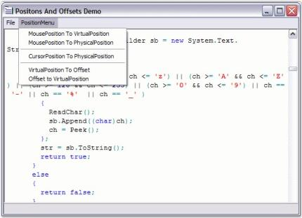' | markdownify }}
{:.image }

_Figure_ _15_: Positions and Offsets Conversion Options in Edit Control_

> {{ '' | markdownify }}
{:.image }
_Note: The Offset value is always calculated from the top-left corner of the Edit Control from the Virtual coordinates (1,1)._

A sample which demonstrates the above features is available in the following sample installation path.

_..\_My Documents\Syncfusion\EssentialStudio\Version Number\Windows\Edit.Windows\Samples\Advanced Editor Functions\ActionGroupingDemo_

See Also

Line Numbers and Current Line Highlighting

## Column Guides

Column Guides are used to highlight columns with special meaning. Essential Edit supports unlimited number of column guides.

Each column guide can be provided with a custom color and location. This can be done by setting the ShowColumnGuides property of the Edit Control to True, and then specifying the color and the location of the Column Guides using ColumnGuideItem Collection Editor. The font used to calculate the column location is customized by usingColumnGuidesMeasuringFont property.

<table>
<tr>
<td>
Edit Control Property</td><td>
Description</td></tr>
<tr>
<td>
ShowColumnGuides</td><td>
Gets / sets value that indicates whether column guides should be drawn.</td></tr>
<tr>
<td>
ColumnGuideItems</td><td>
Gets / sets array of ColumnGuideItem objects.</td></tr>
<tr>
<td>
ColumnGuidesMeasuringFont</td><td>
Gets / sets font that is used while measuring the position of the column guides.</td></tr>
</table>

[C#]

// Enable Column Guides.

this.editControl1.ShowColumnGuides = true;

// Specify the color and the location of the Column Guides.

ColumnGuideItem[] columnGuideItem = new ColumnGuideItem[2];

columnGuideItem[0] = new ColumnGuideItem(20, Color.Yellow);

columnGuideItem[1] = new ColumnGuideItem(40, Color.IndianRed);

this.editControl1.ColumnGuideItems = columnGuideItem;

// Font used to calculate the column location.

this.editControl1.ColumnGuidesMeasuringFont = new Font("Microsoft Sans Serif", 12);

[VB.NET]

' Enable Column Guides.

Me.editControl1.ShowColumnGuides = True

' Specify the color and the location of the Column Guides.

Dim columnGuideItem As ColumnGuideItem() = New ColumnGuideItem(1) {}

columnGuideItem(0) = New ColumnGuideItem(20, Color.Yellow)

columnGuideItem(1) = New ColumnGuideItem(40, Color.IndianRed) 

Me.editControl1.ColumnGuideItems = columnGuideItem

' Font used to calculate the column location.

Me.editControl1.ColumnGuidesMeasuringFont = New Font("Microsoft Sans Serif",12)

{{ '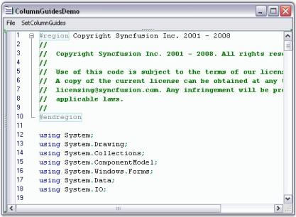' | markdownify }}
{:.image }

_Figure_ _16_: Customized Column Guide Items positioned at Equal Intervals_

A sample which illustrates the above feature is available in the following sample installation path.

_..\_My Documents\Syncfusion\EssentialStudio\Version Number\Windows\Edit.Windows\Samples\Advanced Editor Functions\ActionGroupingDemo_

## Content Dividers

Edit Control supports content dividers just like VB.NET code in Visual Studio.NET code editor. This helps in logical divisioning and better organization of the contents of the Edit Control, thereby improving the readability of the code.

{{ '' | markdownify }}
{:.image }

_Figure_ _17_: Content Dividers separating the Event Contents into Sections_

This feature can be enabled for sections of the Edit Control contents, by setting the ContentDivider field to True, within its lexem definition in the configuration file.

[XML]

// Enable content dividers within its lexem definition in the configuration file.

<lexem BeginBlock="Function" EndBlock="End Function" Type="KeyWord" IsComplex="true" IsCollapsable="true" Indent="true"

        CollapseName="{Function...End Function}" AutoNameExpression='.*Function.*\s+(?<text>\w+)\s*\(' AutoNameTemplate="Function [${text}]"

        IsCollapseAutoNamed="true" ContentDivider="true" >

        <References>

          <reference RefID="777"/>

        </References>

        <SubLexems>

          <lexem BeginBlock="\n" IsBeginRegex="true" />

        </SubLexems>  

</lexem>

A sample which demonstrates Content Dividers is available in the following sample installation path.

_..\_My Documents\Syncfusion\EssentialStudio\Version Number\Windows\Edit.Windows\Samples\Advanced Editor Functions\ActionGroupingDemo_

## Underlines, Wavelines and StrikeThrough

Underlines and Wavelines are mainly used to highlight certain sections of text, possibly to notify the user about errors or important sections of the document. Edit Control allows you to underline any desired text in its contents. The underlines can be of different styles, colors and weights, with each of them being used to convey a different meaning. Edit Control supports underlines of the following styles: Solid, Dot, Dash, Wave and DashDot styles. You can also specify the weight of the underlines to be Single or Double.

Before the underlining can be applied to the selected text, a custom underlining format has to be defined. The RegisterUnderlineFormat method of ISnippetFormat, registers the custom underline format to be used while underlining a region. You can create a custom underlining format, as shown in the code below.

[C#]

// Registers the custom underline format.

ISnippetFormat format = editControl1.RegisterUnderlineFormat (SelectedColor, SelectedStyle, SelectedWeight);

[VB.NET]

' Registers the custom underline format.

Dim format As ISnippetFormat = editControl1.RegisterUnderlineFormat(SelectedColor, SelectedStyle, SelectedWeight)

The SelectedColor value can be set to any desired color. The SelectedStyle value is specified by using the UnderlineStyle enumerator. The SelectedWeight value is specified by using the UnderlineWeight enumerator.

<table>
<tr>
<td>
Edit Control Underline Enumerator</td><td>
Description</td></tr>
<tr>
<td>
UnderlineStyle</td><td>
UnderlineStyle.Solid(default),UnderlineStyle.Dot, UnderlineStyle.Dash, UnderlineStyle.Wave, and UnderlineStyle.DashDot.</td></tr>
<tr>
<td>
UnderlineWeight</td><td>
UnderlineWeight.Thick(default) and UnderlineWeight.Double.</td></tr>
</table>

Underlining Selected Text

Underlining can be set and removed for selected text by using the below given methods.

<table>
<tr>
<td>
Edit Control Method</td><td>
Description</td></tr>
<tr>
<td>
SetUnderline</td><td>
Sets underlining of the specified text region.</td></tr>
<tr>
<td>
RemoveUnderLine</td><td>
Removes underlining in the specified region.</td></tr>
</table>

[C#]

this.editControl1.SetUnderline(this.editControl1.Selection.Top, this.editControl1.Selection.Bottom, format);

this.editControl1.RemoveUnderline(this.editControl1.Selection.Top, this.editControl1.Selection.Bottom);

[VB.NET]

Me.editControl1.SetUnderline(Me.editControl1.Selection.Top, Me.editControl1.Selection.Bottom, format)

Me.editControl1.RemoveUnderline(Me.editControl1.Selection.Top, Me.editControl1.Selection.Bottom)

Underlining using Configuration File

You can also set the underlining from the configuration file, as shown in the below example.

[XML]

<format name="Comment" Font="Courier New, 10pt, style=Bold" FontColor="Green" LineColor="Red" Weight="Thick" Underline="DashDot" />

LineColor, Weight and Underline parameters are used to specify the type of underlining to be used.

{{ '' | markdownify }}
{:.image }

_Figure_ _18_: Text with Double Solid Style, Double Dot Style, Wave Style Underlines_

A sample which demonstrates this feature is available in the below location.

_..\ My Documents\Syncfusion\EssentialStudio\Version Number\Windows\Edit.Windows\Samples\Advanced Editor Functions\ActionGroupingDemo_

Striking Through Text

The StrikeThrough method allows you to perform strikethrough operation on the text contained in the Edit Control. This is a very useful feature in denoting text that was deleted from the original document or highlighting offending code. You can also specify any custom color for the strikethrough line.

[C#]

// Strikeout the current line.

this.editControl1.StrikeThrough(this.editControl1.CurrentLine, Color.IndianRed);

// Strikeout the selected text.

this.editControl1.StrikeThrough(this.editControl1.Selection.Top, this.editControl1.Selection.Bottom, Color.Navy);

// Strikeout the text in the specified text range.

this.editControl1.StrikeThrough(startCoordinatePoint, endCoordinatePoint, Color.Aqua);

[VB.NET]

' Strikeout the current line.

Me.editControl1.StrikeThrough(Me.editControl1.CurrentLine, Color.IndianRed)

' Strikeout the selected text.

Me.editControl1.StrikeThrough(Me.editControl1.Selection.Top, Me.editControl1.Selection.Bottom, Color.Navy)

' Strikeout the text in the specified text range.

Me.editControl1.StrikeThrough(startCoordinatePoint, endCoordinatePoint, Color.Aqua)

To remove the strikethrough line, just call one of the above mentioned methods and specify the Color parameter as Color.Empty.

{{ '' | markdownify }}
{:.image }

_Figure_ _19_: Striking Through Range of Text_

A sample which demonstrates the StrikeThrough feature is available in the following sample installation path.

_..\My Documents\Syncfusion\EssentialStudio\Version Number\Windows\Edit.Windows\Samples\2.0\Advanced Editor Functions\StrikeThroughDemo_

See Also

Text Border, Text Selection

## Text Handling

Edit control offers support for text manipulation operations like append, delete and insertion of multiple lines of text, which is elaborated in the below topic:

### Appending, Deleting and Inserting Multiple Lines of Text

Edit Control offers support for text manipulation operations like append, delete and insertion of multiple lines of text by using the following APIs.

Appending Text

Text can be appended to the Edit Control by using the following method.

<table>
<tr>
<td>
Edit Control Method</td><td>
Description</td></tr>
<tr>
<td>
AppendText</td><td>
Appends the specified text to the end of the existing contents of the Edit Control.</td></tr>
</table>

[C#]

// Appends the given string to the end of the text in Edit Control.

this.editControl1.AppendText(" text to be appended ");

[VB.NET]

' Appends the given string to the end of the text in the Edit Control.

Me.editControl1.AppendText(" text to be appended ")

Inserting Text

The Insert mode can be enabled in the Edit Control by setting the InsertMode property to True.

Text can be inserted anywhere inside the Edit Control by using the InsertText method as follows.

<table>
<tr>
<td>
Edit Control Method</td><td>
Description</td></tr>
<tr>
<td>
InsertText</td><td>
Inserts a piece of text at any desired position in the Edit Control.</td></tr>
</table>

Inserting Multiple Lines

Collection of text lines can be inserted by using the property given below.

<table>
<tr>
<td>
Edit Control Property</td><td>
Description</td></tr>
<tr>
<td>
Lines</td><td>
Lets you to specify multiple lines of text to the Edit Control in the form of a string array. This feature is similar to the one in .NET RichTextBox control.</td></tr>
</table>

Inserting Text based on Conditions

The following properties can be used to insert text based on conditions that are described as follows.

<table>
<tr>
<td>
Edit Control Property</td><td>
Description</td></tr>
<tr>
<td>
AllowDrop</td><td>
Specifies whether drag and drop operations are allowed for control</td></tr>
<tr>
<td>
AllowInsertBeforeReadOnlyNewLine</td><td>
Specifies whether inserting text should be allowed at the beginning of readonly region at the start of new line.</td></tr>
<tr>
<td>
InsertDroppedFileIntoText</td><td>
Specifies whether the outer file dragged and dropped onto the Edit Control should be inserted into the current content.When this property is set to 'False', the current file is closed, and the dropped outer file is opened.</td></tr>
<tr>
<td>
RespectTabStopsOnInsertingText</td><td>
Specifies whether the tab stops should be valued on inserting blocks of text.</td></tr>
<tr>
<td>
ShowFileDropNotification</td><td>
Specifies whether the Notification message is to be displayed when the outer file is dragged and dropped onto the Edit Control.</td></tr>
</table>

[C#]

// Set the Insert mode.

this.editControl1.InsertMode = true;

// Inserts a string at the given line and column.

this.editControl1.InsertText(1, 1, " text to be inserted ");

// Specifies multiple lines of text to the EditControl in the form of a string array.

this.editControl1.Lines = new string[] {" first line ", " second line ", " third line "};

// Allows text insertion only at the beginning of the ReadOnly region at the start of a new line.

this.editControl1.AllowInsertBeforeReadonlyNewLine = true;

//To set the EditControl that allows to Drag and Dropping files

this.editControl1.AllowDrop = true; 

// Specifies whether the outer file dragged and dropped onto the EditControl should be inserted into the current content.

this.editControl1.InsertDroppedFileIntoText = true;

// To hide the notification message displayed when the outer file is dragged and dropped onto the Edit Control.

this.editControl1.ShowFileDropNotification = false;

[VB.NET]

' Set the Insert mode.

Me.editControl1.InsertMode = True

' Inserts a string at the given line and column.

Me.editControl1.InsertText(1, 1, " text to be inserted ")

' Specifies multiple lines of text to the EditControl in the form of a string array.

Me.editControl1.Lines = New String() {" first line ", " second line ", " third line "}

' Allows text insertion only at the beginning of the ReadOnly region at the start of a new line.

Me.editControl1.AllowInsertBeforeReadonlyNewLine = True

'To set the EditControl that allows to Drag and Dropping files
Me.editControl1.AllowDrop = true

‘Specifies whether the outer file dragged and dropped onto the EditControl should be inserted into the current content.

Me.editControl1.InsertDroppedFileIntoText = True

// To hide the notification message displayed when the outer file is dragged and dropped onto the Edit Control.
Me.editControl1.ShowFileDropNotification = false

Deleting Text

Text can be deleted in the Edit Control by using the below given methods.

<table>
<tr>
<td>
Edit Control Method</td><td>
Description</td></tr>
<tr>
<td>
DeleteChar</td><td>
Deletes a character to the right of the current cursor position.</td></tr>
<tr>
<td>
DeleteCharLeft</td><td>
Deletes a character to the left of the current cursor position.</td></tr>
<tr>
<td>
DeleteWord</td><td>
Deletes a word to the right of the current cursor position.</td></tr>
<tr>
<td>
DeleteWordLeft</td><td>
Deletes a word to the left of the current cursor position.</td></tr>
<tr>
<td>
DeleteAll</td><td>
Deletes all text in the document.</td></tr>
<tr>
<td>
DeleteText</td><td>
Deletes the specified text.</td></tr>
</table>

[C#]

// Deletes the character to the right of the cursor.

this.editControl1.DeleteChar();

// Deletes the character to the left of the cursor.

this.editControl1.DeleteCharLeft();

// Deletes a word to the right of the current cursor position.

this.editControl1.DeleteWord();

// Deletes a word to the left of the current cursor position.

this.editControl1.DeleteWordLeft();

// To delete all the text.

this.editControl1.DeleteAll();

// To delete a selection.

this.editControl1.DeleteText(this.editControl1.Selection.Top, this.editControl1.Selection.Bottom);

[VB.NET]

' Deletes the character to the right of the cursor.

Me.editControl1.DeleteChar()

' Deletes the character to the left of the cursor.

Me.editControl1.DeleteCharLeft()

' Deletes a word to the right of the current cursor position.

Me.editControl1.DeleteWord()

' Deletes a word to the left of the current cursor position.

Me.editControl1.DeleteWordLeft()

' Deletes all the text.

Me.editControl1.DeleteAll()

' Deletes a selection.

Me.editControl1.DeleteText(Me.editControl1.Selection.Top, Me.editControl1.Selection.Bottom)

{{ '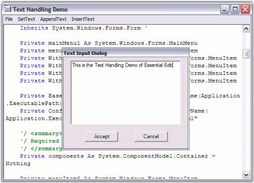' | markdownify }}
{:.image }

_Figure_ _20_: Input entered for Handling Text_

A sample that demonstrates the above features is available in the following sample installation path.

_..\ My Documents\Syncfusion\EssentialStudio\Version Number\Windows\Edit.Windows\Samples\Advanced Editor Functions\ActionGroupingDemo_

## Spaces and Tabs

Edit Control supports text operations with tabs and spaces by using the APIs discussed in this section.

Essential Edit controls the insertion of tabs using the UseTabs property, which lets you specify whether a tab (or an equivalent number of spaces) needs to be inserted, when the TAB key is pressed in the Edit Control. Similarly, tab stops can also be inserted.

<table>
<tr>
<td>
Edit Control Property</td><td>
Description</td></tr>
<tr>
<td>
UseTabs</td><td>
Specifies whether tab symbol is allowed or spaces should be used instead.Setting this property to True, allows you to insert tabs, whereas setting it to False, allows you to insert spaces.</td></tr>
<tr>
<td>
UseTabStops</td><td>
Gets / sets value that indicates whether tab stops should be used.</td></tr>
<tr>
<td>
TabStopsArray</td><td>
Gets / sets an array of tab stops.</td></tr>
</table>

[C#]

this.editControl1.UseTabs = true;

this.editControl1.UseTabStops = true;

this.editControl1.TabStopsArray = new int[] { 8, 16, 24, 32, 40};

[VB.NET]

Me.editControl1.UseTabs = True

Me.editControl1.UseTabStops = True;

Me.EditControl1.TabStopsArray = New Integer() {8, 16, 24, 32, 40}

Specifying Tab Size

The size of the tab can be specified by using the below given property.

<table>
<tr>
<td>
Edit Control Property</td><td>
Description</td></tr>
<tr>
<td>
TabSize</td><td>
Specifies tab size in spaces.</td></tr>
</table>

[C#]

// Size of the tab in terms of space.

this.editControl1.TabSize = 8;

[VB.NET]

' Size of the tab in terms of space.

Me.editControl1.TabSize = 8

TAB key Functionality

The TransferFocusOnTab property allows you to specify, if the Edit Control should process the TAB key as a text input, or transfer the focus to the next control (by the order of TabIndex property value) on the Form or the User Control hosting the Edit Control.

[C#]

// Insert tabs into the EditControl as text input. 

this.editControl1.TransferFocusOnTab = false;

// Transfer focus to the next control.

this.editControl1.TransferFocusOnTab = true;

[VB.NET]

' Insert tabs into the EditControl as text input.

this.editControl1.TransferFocusOnTab = False

' Transfer focus to the next control.

this.editControl1.TransferFocusOnTab = True

TAB key Functionality on Selected Text

The below given methods can be used convert the spaces in a selected region into tabs and vice versa. Tab symbols can also be added, inserted or removed from selected text.

<table>
<tr>
<td>
Edit Control Method</td><td>
Description</td></tr>
<tr>
<td>
TabifySelection</td><td>
Lets you convert the spaces in the selected region into equivalent number of tabs.</td></tr>
<tr>
<td>
UntabifySelection</td><td>
Lets you convert the tabs in the selected region into equivalent number of spaces.</td></tr>
<tr>
<td>
AddTabsToSelection</td><td>
Adds leading tab symbol to the selected lines, or just inserts the tab symbol.</td></tr>
<tr>
<td>
RemoveTabsFromSelection</td><td>
Removes leading tab symbol (or its spaces equivalent) from selected lines.</td></tr>
</table>

[C#]

// Covert spaces to tabs.

this.editControl1.TabifySelection();

// Converts tabs to spaces.

this.editControl1.UntabifySelection();

// Add or insert leading tab symbol to selected lines.

this.editControl1.AddTabsToSelection();

// Remove leading tab symbol from selected lines.

this.editControl1.RemoveTabsFromSelection();

[VB.NET]

' Covert spaces to tabs.

Me.editControl1.TabifySelection()

' Converts tabs to spaces. 

Me.editControl1.UntabifySelection()

' Add or insert leading tab symbol to selected lines.

Me.editControl1.AddTabsToSelection()

' Remove leading tab symbol from selected lines.

Me.editControl1.RemoveTabsFromSelection()

### WhiteSpace Indicators

Edit Control has the ability to indicatewhitespaces in its contents with default indicators, explained as follows.

1. Single Spaces are indicated by using Dots.

2. Tabs are indicated by using Right Arrows.

3. Line Feeds are indicated by using a special Line Feed Symbol.

{{ '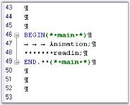' | markdownify }}
{:.image }

You can enable whitespace indicators by setting the ShowWhiteSpaces property to True. By default, this property is set to False.

<table>
<tr>
<td>
Edit Control Property</td><td>
Description</td></tr>
<tr>
<td>
ShowWhiteSpaces</td><td>
Gets / sets value indicating whether whitespaces should be shown as special symbols.</td></tr>
</table>

You can also toggle the visibility of the whitespace indicators by using the ToggleShowingWhiteSpaces method, or by setting the ShowWhiteSpaces property to False.

<table>
<tr>
<td>
Edit Control Method</td><td>
Description</td></tr>
<tr>
<td>
ToggleShowingWhiteSpaces</td><td>
Toggles showing of whitespaces.</td></tr>
</table>

[C#]

// Enabling white space indicators.

this.editControl1.ShowWhitespaces = true;

// Toggle the visibility of the white space indicators.

this.editControl1.ToggleShowingWhiteSpaces();

[VB.NET]

' Enabling white space indicators.

Me.editControl1.ShowWhitespaces = True

' Toggle the visibility of the white space indicators.

Me.editControl1.ToggleShowingWhiteSpaces()

Showing / Hiding Indicators

You can selectively show / hide the whitespace indicators by using the following subproperties of the WhiteSpaceIndicators property - ShowSpaces, ShowTabs and ShowNewLines.

<table>
<tr>
<td>
Edit Control Property</td><td>
Description</td></tr>
<tr>
<td>
ShowSpaces</td><td>
Indicates whether spaces should be replaced with symbols.</td></tr>
<tr>
<td>
ShowTabs</td><td>
Indicates whether tabs should be replaced with symbols.</td></tr>
<tr>
<td>
ShowNewLines</td><td>
Indicates whether new lines should be replaced with symbols.</td></tr>
</table>

[C#]

// Custom indicator for Line Feed.

this.editControl1.WhiteSpaceIndicators.ShowSpaces = true;

// Custom indicator for Tab.

this.editControl1.WhiteSpaceIndicators.ShowTabs = true;

// Custom indicator for Space Character.

this.editControl1.WhiteSpaceIndicators.SpaceNewLines = true;

[VB.NET]

' Custom indicator for Line Feed. 

Me.editControl1.WhiteSpaceIndicators.ShowSpaces = True 

' Custom indicator for Tab.

Me.editControl1.WhiteSpaceIndicators.ShowTabs = True 

' Custom indicator for Space Character. 

Me.editControl1.WhiteSpaceIndicators.SpaceNewLines = True

You can also set the indicators to indicate single spaces, tabs and line feeds by using the NewLineString, TabString and SpaceChar subproperties of the WhiteSpaceIndicators property, as shown below.

<table>
<tr>
<td>
Edit Control Property</td><td>
Description</td></tr>
<tr>
<td>
NewLineString</td><td>
Gets / sets string that represents line feed in WhiteSpace mode.</td></tr>
<tr>
<td>
TabString</td><td>
Gets / sets string that represents Tab in WhiteSpace mode.</td></tr>
<tr>
<td>
SpaceChar</td><td>
Gets / sets character that represents line feed in WhiteSpace mode.</td></tr>
</table>

[C#]

// Custom indicator for Line Feed.

this.editControl1.WhiteSpaceIndicators.NewLineString = "LF";

// Custom indicator for Tab.

this.editControl1.WhiteSpaceIndicators.TabString = "TAB";

// Custom indicator for Space Character.

this.editControl1.WhiteSpaceIndicators.SpaceChar = "s";

[VB.NET]

' Custom indicator for Line Feed.

Me.editControl1.WhiteSpaceIndicators.NewLineString = "LF"

' Custom indicator for Tab.

Me.editControl1.WhiteSpaceIndicators.TabString = "TAB"

' Custom indicator for Space Character.

Me.editControl1.WhiteSpaceIndicators.SpaceChar = "s"

See Also

Spaces and Tabs

## Line Numbers and Current Line Highlighting

Line Numbers can be automatically assigned to the contents of the Edit Control by enabling its ShowLineNumbers property.

The number of lines in the Edit Control can be obtained by using the PhysicalLineCount property. This property returns the actual number of lines in the Edit Control, without considering the lines that maybe hidden because of a collapsed outlining block or new lines that maybe added because of wordwrap.

<table>
<tr>
<td>
Edit Control Property</td><td>
Description</td></tr>
<tr>
<td>
ShowLineNumbers</td><td>
Gets / sets value indicating whether line numbers should be shown.</td></tr>
<tr>
<td>
PhysicalLineCount</td><td>
Gets the count of lines in the files.</td></tr>
</table>

[C#]

// Assigning Line Numbers to the contents of the Edit Control.

this.editControl1.ShowLineNumbers = true;

// Gets the number of lines in the Edit Control.

int actualLineCount = this.editControl1.PhysicalLineCount;

[VB.NET]

' Assigning Line Numbers to the contents of the Edit Control.

Me.editControl1.ShowLineNumbers = True

' Gets the number of lines in the Edit Control.

Dim actualLineCount As Integer = Me.editControl1.PhysicalLineCount

Line numbers can be customized by using the below given Edit Control properties.

<table>
<tr>
<td>
Edit Control Property</td><td>
Description</td></tr>
<tr>
<td>
LineNumbersAlignment</td><td>
Specifies the alignment of line numbers. The options provided are{{{ ''_Left_'' | markdownify }}}{{{ ''_Right_'' | markdownify }}}</td></tr>
<tr>
<td>
LineNumbersColor</td><td>
Specifies the color of line numbers.</td></tr>
<tr>
<td>
LineNumbersFont</td><td>
Specifies the font of line numbers.</td></tr>
<tr>
<td>
SelectOnLineNumberClick </td><td>
Gets / sets value indicating whether click on line numbers performs selection.</td></tr>
</table>

[C#]

// Specify the alignment of line numbers.

this.editControl1.LineNumbersAlignment = Syncfusion.Windows.Forms.Edit.Enums.LineNumberAlignment.Right;

// Assign any color to the line numbers.

this.editControl1.LineNumbersColor = Color.IndianRed;

// Assign any font to the line numbers.

this.editControl1.LineNumbersFont = new Font("Verdana", 9);

// Enabling SelectOnLineNumberClick property to perform selection on clicking the line numbers. 

this.editControl1.SelectOnLineNumberClick = true;

[VB.NET]

' Specify the alignment of line numbers.

Me.editControl1.LineNumbersAlignment = Syncfusion.Windows.Forms.Edit.Enums.LineNumberAlignment.Right

' Assign any color to the line numbers.

Me.editControl1.LineNumbersColor = Color.IndianRed

' Assign any font to the line numbers.

Me.editControl1.LineNumbersFont = new Font("Verdana", 9)

' Enabling SelectOnLineNumberClick property to perform selection on clicking the line numbers. 

Me.editControl1.SelectOnLineNumberClick = True

{{ '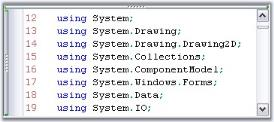' | markdownify }}
{:.image }

Highlighting Current Line at Run Time

You can highlight the current line where the mouse pointer is present by setting the HighlightCurrentLine property of the Edit Control to True. Set the color for the highlighted line by using the CurrentLineHighlightColor property.

<table>
<tr>
<td>
Edit Control Property</td><td>
Description</td></tr>
<tr>
<td>
HighlightCurrentLine</td><td>
Gets / sets value indicating whether current line should be highlighted.</td></tr>
<tr>
<td>
CurrentLineHighlightColor</td><td>
Gets / sets color of current line highlight.</td></tr>
</table>

[C#]

this.editControl1.HighlightCurrentLine = true;

this.editControl1.CurrentLineHighlightColor = Color.Orange;

[VB.NET]

Me.editControl1.HighlightCurrentLine = true

Me.editControl1.CurrentLineHighlightColor = Color.Orange

{{ '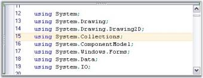' | markdownify }}
{:.image }

_Figure_ _23_: CurrentLineHighlightColor = "Orange"_

You can also highlight the selected text by using the Text Highlighting feature discussed in Background Settings.

## Bookmarks and Custom Indicators

Essential Edit enables users to locate a section or a line of a document by using the Bookmarks and Custom Indicators feature like in Visual Studio. This provides quick access to any part of the contents of the Edit Control.

The Edit Control allows any number of custom images or bookmarks to be added to a document.

> {{ '' | markdownify }}
{:.image }
_Note: At any given point of time, each line can have only one indicator or bookmark associated with it._

Displaying Bookmarks

The Edit Control provides an indicator margin for the purpose of displaying the custom indicators or bookmarks. This can be enabled by using the ShowIndicatorMargin property, as shown below.

<table>
<tr>
<td>
Edit Control Property</td><td>
Description</td></tr>
<tr>
<td>
ShowIndicatorMargin</td><td>
Gets / sets value indicating whether bookmarks and indicator margins should be visible. </td></tr>
<tr>
<td>
MarkerAreaWidth</td><td>
Gets / sets width of marker area.</td></tr>
</table>

[C#]

// Displays the Indicator margin.

this.editControl1.ShowIndicatorMargin = true;

// Sets the width of the Indicator margin.

this.editControl1.MarkerAreaWidth = 20;

[VB.NET]

' Displays the Indicator margin.

Me.editControl1.ShowIndicatorMargin = True

' Sets the width of the Indicator margin.

Me.editControl1.MarkerAreaWidth = 20

Customizing Bookmarks

You can either display the default bookmark image (like in Visual Studio.NET) or display custom images as indicators. This can be done by making use of the following methods of the Edit Control.

<table>
<tr>
<td>
Edit Control Method</td><td>
Description</td></tr>
<tr>
<td>
BookmarkToggle</td><td>
Sets bookmark to the current line.</td></tr>
<tr>
<td>
BookmarkAdd</td><td>
Sets bookmark at the specified line.</td></tr>
<tr>
<td>
BookmarkRemove</td><td>
Removes bookmark at the specified line.</td></tr>
<tr>
<td>
BookmarkGet</td><td>
Gets bookmark at the specified line.</td></tr>
<tr>
<td>
BookmarkNext</td><td>
Goes to the next bookmark.</td></tr>
<tr>
<td>
BookmarkPrevious</td><td>
Goes to the previous bookmark.</td></tr>
<tr>
<td>
BookmarkClear</td><td>
Clears all the bookmarks.</td></tr>
</table>

[C#]

// Sets bookmark at the specified line.

this.editControl1.BookmarkAdd(this.editControl1.CurrentLine);

// Removes bookmark at the specified line.

this.editControl1.BookmarkRemove(this.editControl1.CurrentLine);

this.editControl1.BookmarkRemove(this.editControl1.CurrentLine);

// Draw the bookmark with custom look and feel specified in the BrushInfo object.

BrushInfo brushInfo = new BrushInfo(GradientStyle.ForwardDiagonal, Color.IndianRed, Color.Ivory);

this.editControl1.BookmarkAdd(this.editControl1.CurrentLine, brushInfo);

// Get the Bookmark object of the current line.

IBookmark bookmark = this.editControl1.BookmarkGet(this.editControl1.CurrentLine);

[VB.NET]

' Sets bookmark at the specified line.

Me.editControl1.BookmarkAdd(Me.editControl1.CurrentLine)

' Removes bookmark at the specified line.

Me.editControl1.BookmarkRemove(Me.editControl1.CurrentLine)

' Draw the bookmark with custom look and feel specified in the BrushInfo object.

Dim brushInfo As BrushInfo = new BrushInfo(GradientStyle.ForwardDiagonal, Color.IndianRed, Color.Ivory)

Me.editControl1.BookmarkAdd(Me.editControl1.CurrentLine, brushInfo)

' Get the Bookmark object of the current line.

Dim bookmark As IBookmark = Me.EditControl1.BookmarkGet(Me.EditControl1.CurrentLine)

Setting Bookmarks

Bookmarks can be set and removed by using the below given methods.

<table>
<tr>
<td>
Edit Control Method</td><td>
Description</td></tr>
<tr>
<td>
SetCustomBookmark</td><td>
Sets custom bookmark for the desired line.</td></tr>
<tr>
<td>
RemoveCustomBookmark</td><td>
Removes the custom bookmark from the desired line.</td></tr>
</table>

> {{ '' | markdownify }}
{:.image }
_Note: To clear the bookmarks set by using the SetCustomBookmark method, you must use the BookmarkClear method with its bool argument set as True._

The bookmarks set by using the SetCustomBookmark method, do not respond to the BookmarkNext and BookmarkPrevious methods automatically. In order to enable this, you have to set the UseInBookmarkSearch property of the custom bookmark to True.

[C#]

// Sets custom bookmarks and enables it to respond to BookmarkNext and BookmarkPrevious methods.

ICustomBookmark customBookmark = this.editControl1.SetCustomBookmark(this.editControl1.CurrentLine, new BookmarkPaintEventHandler(CustomBookmarkPainter));

customBookmark.UseInBookmarkSearch = true;

// Removes the bookmark of the current line.

ICustomBookmark customBookmark = this.editControl1.RemoveCustomBookmark(this.editControl1.CurrentLine, BookmarkPaintEventHandler(CustomBookmarkPainter));

[VB.NET]

' Sets custom bookmarks and enables it to respond to BookmarkNext and BookmarkPrevious methods.

Dim customBookmark As ICustomBookmark = Me.editControl1.SetCustomBookmark(Me.editControl1.CurrentLine, New BookmarkPaintEventHandler(CustomBookmarkPainter))

customBookmark.UseInBookmarkSearch = True

' Removes the bookmark of the current line.

Dim customBookmark As ICustomBookmark = Me.editControl1.RemoveCustomBookmark(Me.editControl1.CurrentLine, BookmarkPaintEventHandler(CustomBookmarkPainter))

Setting Tooltips for Bookmarks

Tooltips can be set for bookmarks and customized by using the below given properties.

<table>
<tr>
<td>
Edit Control Property</td><td>
Description</td></tr>
<tr>
<td>
ShowBookmarkTooltip</td><td>
Specifies whether the tooltip of the bookmark is shown.</td></tr>
<tr>
<td>
BookmarkTooltipBackgroundBrush</td><td>
Gets / sets brush for bookmark tooltip background.</td></tr>
<tr>
<td>
BookmarkTooltipBorderColor</td><td>
Specifies the color of the bookmark tooltip form border.</td></tr>
</table>

[C#]

// Shows the tooltip of the bookmark.

this.editControl1.ShowBookmarkTooltip = true;

// Gets or sets brush for bookmark tooltip background.

this.editControl1.BookmarkTooltipBackgroundBrush = new Syncfusion.Drawing.BrushInfo(Syncfusion.Drawing.PatternStyle.Percent05, System.Drawing.SystemColors.WindowText, System.Drawing.Color.Gold);

// Specify the color of the bookmark tooltip form border.

this.editControl1.BookmarkTooltipBorderColor = System.Drawing.Color.Crimson;

[VB.NET]

' Shows the tooltip of the bookmark.

Me.editControl1.ShowBookmarkTooltip = True

' Gets or sets brush for bookmark tooltip background.

Me.editControl1.BookmarkTooltipBackgroundBrush = New Syncfusion.Drawing.BrushInfo(Syncfusion.Drawing.PatternStyle.Percent05, System.Drawing.SystemColors.WindowText, System.Drawing.Color.Gold)

' Specify the color of the bookmark tooltip form border.

Me.editControl1.BookmarkTooltipBorderColor = System.Drawing.Color.Crimson

{{ '' | markdownify }}
{:.image }

A sample which illustrates the above features is available in the below sample installation path.

_..\ My Documents\Syncfusion\EssentialStudio\Version Number\Windows\Edit.Windows\Samples\Advanced Editor Functions\ActionGroupingDemo_

## Comments

This section discusses how comments can be set for the text in Edit Control.

Comments can be set for a single line, selected text, and for text within a specified range by using the below given methods.

<table>
<tr>
<td>
Edit Control Method</td><td>
Description</td></tr>
<tr>
<td>
CommentLine</td><td>
Comments single line.</td></tr>
<tr>
<td>
CommentSelection</td><td>
Comments selected text.</td></tr>
<tr>
<td>
CommentText</td><td>
Comments text in the specified range.</td></tr>
</table>

[C#]

this.editControl1.CommentLine(1);

this.editControl1.CommentSelection();

this.editControl1.CommentText(new Point(1, 1), new Point(7, 7));

[VB.NET]

Me.editControl1.CommentLine(1)

Me.editControl1.CommentSelection()

Me.editControl1.CommentText(New Point(1, 1), New Point(7, 7))

Removing Comments

Comments can be removed by using the below given methods.

<table>
<tr>
<td>
Edit Control Method</td><td>
Description</td></tr>
<tr>
<td>
UnCommentLine</td><td>
UnComments single line.</td></tr>
<tr>
<td>
UnCommentSelection</td><td>
UnComments selected text.</td></tr>
<tr>
<td>
UnCommentText</td><td>
UnComments text in the specified range.</td></tr>
</table>

[C#]

this.editControl1.UnCommentLine();

this.editControl1.UncommentSelection();

this.editControl1.UncommentText(new Point(1, 1), new Point(7, 7));

[VB.NET]

Me.editControl1.UnCommentLine()

Me.editControl1.UncommentSelection()

Me.editControl1.UncommentText(New Point(1, 1), New Point(7, 7))))

## Break Points

Essential Edit allows you to set a pause at some specified location in the Edit Control by using the Break Points feature. This is done by combining the Line Background and Custom Indicator features. IndicatorMarginClick event can be handled to insert a break point.

[C#]

private void editControl1_IndicatorMarginClick(object sender, Syncfusion.Windows.Forms.Edit.IndicatorClickEventArgs e)

{

// Set breakpoint indicator.

this.editControl1.SetCustomBookmark(e.LineIndex, new BookmarkPaintEventHandler(CustomBookmarkPainter));

// Highlight the relevant line.

IBackgroundFormat format = this.editControl1.RegisterBackColorFormat(color, Color.Transparent);

this.editControl1.SetLineBackColor(e.LineIndex, true, format);

}

[VB.NET]

Private Sub editControl1_IndicatorMarginClick(sender As Object, e As Syncfusion.Windows.Forms.Edit.IndicatorClickEventArgs) Handles editControl1.IndicatorMarginClick

' Set breakpoint indicator.

Me.editControl1.SetCustomBookmark(e.LineIndex, New BookmarkPaintEventHandler(AddressOf CustomBookmarkPainter))

' Highlight the relevant line.

Dim format As IBackgroundFormat = Me.editControl1.RegisterBackColorFormat(color, Color.Transparent)

Me.editControl1.SetLineBackColor(e.LineIndex, True, format)

End Sub

{{ '' | markdownify }}
{:.image }

_Figure_ _25_: Inserting Break Points in Edit Control_

A sample which demonstrates setting custom indicators is available in the below sample installation path.

_..\_ _My Documents\Syncfusion\EssentialStudio\Version Number\Windows\Edit.Windows\Samples\Advanced Editor Functions\ActionGroupingDemo_

## Text Formatting

Edit control has some text formatting features which are discussed under the following topics:

### Bracket Highlighting and Indentation Guidelines

Edit Control has one of the most powerful and intelligent Bracket Highlighting and Indentation Guideline features. Edit Control is also capable of supporting language domains that have multiple languages, such as HTML or XML. Moreover, for each language, different brackets can be defined for highlighting. In C#, curly braces can be highlighted, while in HTML or XML, angled braces (for tags) can be highlighted.

 Consider the following example.

[C#]

public void Test()

{

   string str;

   str = "{";

}

If the cursor is positioned on the end curly brace, most editors will match to the open curly brace in the string. On the contrary, Edit Control matches to the open curly brace for the method.

The Bracket Highlighting and Indentation Guidelines functionalities are supported using the following APIs in the Edit Control.

* ShowIndentationGuidelines
* HideIndentationGuidelines
* ShowIndentGuideline
* IndentLineColor
* IndentBlockHighlightingColor
* IndentationBlockBackgroundBrush
* IndentationBlockBorderColor
* IndentationBlockBorderStyle
* JumpToIndentBlockStart
* JumpToIndentBlockEnd
* OnlyHighlightMatchingBraces

The preceding APIs are explained below in detail.

The indentation guidelines are vertical lines that connect the matching brackets. This feature enhances the readability of code. 

<table>
<tr>
<td>
Edit Control Property</td><td>
Description</td></tr>
<tr>
<td>
ShowIndentationGuidelines</td><td>
Gets / sets value indicating whether indentation guidelines should be shown.</td></tr>
</table>

The indentation guidelines can be turned on by setting the ShowIndentationGuidelines property to True. It can be turned off either by setting this property to False, or by invoking the HideIndentGuideline method.

Also, the indent guideline for the current region can be set by using the ShowIndentGuideline method.

<table>
<tr>
<td>
Edit Control Method</td><td>
Description</td></tr>
<tr>
<td>
HideIndentGuideline</td><td>
Hides indentation guideline.</td></tr>
<tr>
<td>
ShowIndentGuideline</td><td>
If possible, shows indent guideline of the current region.</td></tr>
</table>

[C#]

// Indentation Guidelines are displayed.

this.editControl1.ShowIndentationGuidelines = true;

// Hide Indentation Guideline.

this.editControl1.HideIndentGuideline();

// Show Indentation Guideline.

this.editControl1.ShowIndentGuideline();

[VB.NET]

' Indentation Guidelines are displayed.

Me.editControl1.ShowIndentationGuidelines = True

' Hide Indentation Guideline.

Me.editControl1.HideIndentGuideline()

' Show Indentation Guideline.

Me.editControl1.ShowIndentGuideline()

Bracket Highlighting

The bracket highlighting feature can be turned on by enabling the ShowIndentationGuidelines and OnlyHighlightMatchingBraces properties. Setting the OnlyHighlightMatchingBraces property to True, enables bracket highlighting whereas the indentation guidelines are not displayed.

{{ '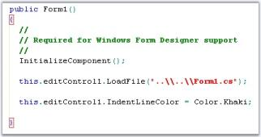' | markdownify }}
{:.image }

_Figure_ _26_: Bracket Highlighting with Indentation Guidelines_

{{ '' | markdownify }}
{:.image }

_Figure_ _27_: Bracket Highlighting without Indentation Guidelines_

Customizing the Appearance

It is possible to specify custom colors for the indentation guidelines and bracket highlighting blocks by using the below given properties.

<table>
<tr>
<td>
Edit Control Property</td><td>
Description</td></tr>
<tr>
<td>
IndentLineColor</td><td>
Specifies color of the indent line.</td></tr>
<tr>
<td>
IndentBlockHighlightingColor</td><td>
Specifies color of the indent block start and end.</td></tr>
<tr>
<td>
IndentationBlockBackgroundBrush</td><td>
Gets / sets brush for indentation block background.</td></tr>
<tr>
<td>
IndentationBlockBorderColor</td><td>
Specifies color of indentation block border line.</td></tr>
<tr>
<td>
IndentationBlockBorderStyle</td><td>
Specifies style of indentation block border line.</td></tr>
<tr>
<td>
ShowIndentationBlockBorders</td><td>
Specifies whether indentation block borders should be drawn.</td></tr>
</table>

[C#]

this.editControl1.IndentLineColor = Color.OrangeRed;

this.editControl1.IndentBlockHighlightingColor = Color.IndianRed;

this.editControl1.IndentationBlockBackgroundBrush = new Syncfusion.Drawing.BrushInfo(Syncfusion.Drawing.GradientStyle.BackwardDiagonal, System.Drawing.SystemColors.Info, System.Drawing.Color.Khaki);

this.editControl1.IndentationBlockBorderColor = System.Drawing.Color.Crimson;

this.editControl1.IndentationBlockBorderStyle = Syncfusion.Windows.Forms.Edit.Enums.FrameBorderStyle.DashDot;

this.editControl1.ShowIndentationBlockBorders = true;

[VB.NET]

Me.editControl1.IndentLineColor = Color.OrangeRed

Me.editControl1.IndentBlockHighlightingColor = Color.IndianRed

Me.editControl1.IndentationBlockBackgroundBrush = New Syncfusion.Drawing.BrushInfo(Syncfusion.Drawing.GradientStyle.BackwardDiagonal, System.Drawing.SystemColors.Info, System.Drawing.Color.Khaki)

Me.editControl1.IndentationBlockBorderColor = System.Drawing.Color.Crimson

Me.editControl1.IndentationBlockBorderStyle = Syncfusion.Windows.Forms.Edit.Enums.FrameBorderStyle.DashDot

Me.editControl1.ShowIndentationBlockBorders = True

{{ '' | markdownify }}
{:.image }

_Figure_ _28_: IndentLineColor = "OrangeRed"; IndentBlockHighlightingColor = "IndianRed"_

Positioning

It is also possible to position the caret at the beginning or end of the indentation block by using the JumpToIndentBlockStart and JumpToIndentBlockEnd methods respectively.

<table>
<tr>
<td>
Edit Control Method</td><td>
Description</td></tr>
<tr>
<td>
JumpToIndentBlockStart</td><td>
Jumps to the start of the block.</td></tr>
<tr>
<td>
JumpToIndentBlockEnd</td><td>
Jumps to the end of the block.</td></tr>
</table>

Refer to the Indentation Guidelines Demo sample for more information in this regard.

_..\_My Documents\Syncfusion\EssentialStudio\Version Number\Windows\Edit.Windows\Samples\Advanced Editor Functions\ActionGroupingDemo_

### Auto Indentation

The Edit control offers advanced text indentation support to suit the requirements of the user.

The properties given in the following table can be used to customize the auto indentation settings of the Edit control.

<table>
<tr>
<td>
Property</td><td>
Description</td></tr>
<tr>
<td>
AutoIndentMode</td><td>
Specifies mode of auto indentation. The options provided are* None* Block* Smart</td></tr>
<tr>
<td>
 AutoIndentGuideline</td><td>
Gets / sets the value that specifies whether indent guideline should be shown automatically after cursor repositioning.</td></tr>
</table>

[C#]

// Sets the AutoIntentMode.

this.editControl1.AutoIndentMode = Syncfusion.Windows.Forms.Edit.Enums.AutoIndentMode.None;

[VB.NET]

' Sets the AutoIntentMode.

Me.editControl1.AutoIndentMode = Syncfusion.Windows.Forms.Edit.Enums.AutoIndentMode.None

If Enter is pressed when the AutoIndentMode is set to None, the text is not indented.

{{ '' | markdownify }}
{:.image }

_Figure_ _29_: AutoIndentMode = "None"_

When the AutoIndentMode is set to Smart, the next line is indented by one TabSize from the first column of the previous line on pressing Enter.

{{ '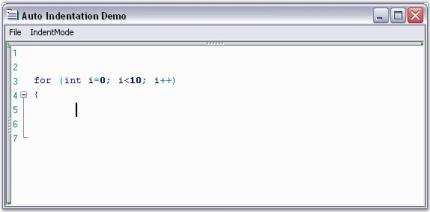' | markdownify }}
{:.image }

_Figure_ _30_: AutoIndentMode = "Smart"_

When the AutoIndentMode is set to Block, the next line begins at the same column as the previous line on pressing the ENTER key.

{{ '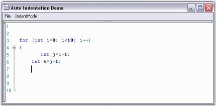' | markdownify }}
{:.image }

_Figure_ _31_: AutoIndentMode = "Block"_

The Auto Indentation characters can be specified by setting the Indent field to True in the lexem definition of the configuration file, as shown below.

[XML]

<lexem BeginBlock="{" EndBlock="}" Type="Operator" IsComplex="true" IsCollapsable="true" Indent="true"  CollapseName="{...}" IndentationGuideline="true">

A sample which demonstrates Auto Indentation is available in the below sample installation path.

_..\_My Documents\Syncfusion\EssentialStudio\Version Number\Windows\Edit.Windows\Samples\Advanced Editor Functions\ActionGroupingDemo_

#### Lexem Support for AutoIndent Block Mode

In the Edit control, the EnableSmartInBlockIndent property ensures the AutoIndent Block mode with respect to the lexem’s config.ident. With this property, the Block mode will work like Smart mode for conditional statements.

When this property is enabled, the lines will be aligned to the position of the previous indented line. The lines will begin at the original start position if disabled.

<table>
<tr>
<td>
Property</td><td>
Description</td></tr>
<tr>
<td>
EnableSmartInBlockIndent</td><td>
Gets or sets a value to make the Block mode work like Smart mode for conditional statements.</td></tr>
</table>

[C#]

// Gets or sets a value to make the Block mode work like Smart mode for conditional statements.

this.editcontrol1.EnableSmartInBlockIndent = true;

[VB.NET]

// Gets or sets a value to make the Block mode work like Smart mode for conditional statements.

Me.editcontrol1.EnableSmartInBlockIndent = True

### AutoFormatting

The Edit Control offers autoformatting and smart indentation support for code as in Visual Studio. Currently, only C# has built-in support for this feature.

AutoFormatting can be enabled by using the below given method.

<table>
<tr>
<td>
Edit Control Method</td><td>
Description</td></tr>
<tr>
<td>
AutoFormatText</td><td>
AutoFormats given range of text.</td></tr>
</table>

For example, the closing brace gets automatically aligned with the opening brace. Consider some C# code as shown in the below screenshot.

{{ '' | markdownify }}
{:.image }

_Figure_ _32_: Code is entered into the Edit Control_

Now, when the closing brace '}' is typed, it gets automatically aligned with the opening brace, as shown in the screenshot below.

{{ '' | markdownify }}
{:.image }

_Figure_ _33_: AutoFormatting support for code in Edit Control_

> {{ '' | markdownify }}
{:.image }
_Note: The_ AutoIndentMode _property for the Edit Control should be set to Smart for this purpose._

Essential Edit provides an extensible interface, IAutoFormatter, which can be implemented to provide any kind of formatter for any desired language. This can be used to take care of some of the special scenarios explained below.

* XML or HTML text of the following format - <abc> <xyz> .... </xyz> </abc> should be autoformatted as follows.

[HTML or XML]

<abc>

      <xyz>

        ...

      </xyz>

</abc>

* Similarly, when the Edit Control is using C# configuration settings, any text enclosed within '{' and '}' should get automatically indented, just as in the VS.NET editor. Also, the closing brace should be automatically indented with its matching opening brace.

* For languages like VB.NET, the End statement should get automatically indented on pressing the ENTER key, after entering the method header for the VB.NET samples.

[VB.NET]

Private sub TestMethod() '----> Method header 

                         '----> Press Enter key

End sub '----> End statement should be automatically aligned with the function header

### Unicode

Unicode is a standard used to encode all the languages of the world in computers. It is an international standard used with the goal to resolve ambiguities that traditionally arise with complex scripts like Japanese, Arabian or Chinese, on computer systems. Beside solving many Internationalization issues, Unicode-enabled programs also run faster under Windows NT, 2000 and XP.

Edit Control fully supports serializing and displaying Unicode characters. All Unicode text is saved in UTF-8 format, by default. Moving Unicode text between Edit Control and other Word Processing software programs is also straightforward through Copy / Paste clipboard functions.

Essential Edit also supports handling of all other text encoding formats specified in the System.Text.Encoding class like ASCII, UTF7, UTF8 and BigEndianUnicode.

The following screenshot illustrates the use of Chinese, Arabic, Hindi, Russian and Greek text in the Edit Control.

{{ '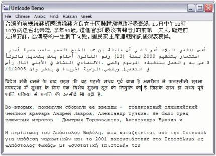' | markdownify }}
{:.image }

_Figure_ _34_: Unicode support in Edit Control_

A sample which demonstrates Unicode is available in the following sample installation path.

_..\_My Documents\Syncfusion\EssentialStudio\Version Number\Windows\Edit.Windows\Samples\Advanced Editor Functions\ActionGroupingDemo_

### Automatic Outlining

Outlining can be performed by having appropriate "lexem", "split", and "extension" tag entries in the configuration file. Refer to the Configuration Settings topic for more information regarding the configuration file. 

Essential Edit provides Visual Studio-like support for collapsing and expanding blocks of code through the use of Collapsers (plus-minus buttons). Sections of code which form the outlining blocks can be specified by using the configuration settings. The outlining blocks can be specified for code as well as for plain text.

Setting the ShowOutliningCollapsers property to True, will enable Automatic Outlining. Edit provides the following APIs to support Outlining.

<table>
<tr>
<td>
Edit Control Method</td><td>
Description</td></tr>
<tr>
<td>
Collapse</td><td>
Collapses all regions in currently selected area or in the current line.</td></tr>
<tr>
<td>
Expand</td><td>
Expands all collapsed regions in currently selected area or in the current line.</td></tr>
<tr>
<td>
SwitchCollapsingOn</td><td>
Turns on collapse and collapse all option.</td></tr>
<tr>
<td>
SwitchCollapsingOff</td><td>
Turns off collapse option.</td></tr>
<tr>
<td>
CollapseAll</td><td>
Collapses all regions.</td></tr>
<tr>
<td>
ExpandAll</td><td>
Expands all collapsed regions.</td></tr>
<tr>
<td>
ToggleLineCollapsing</td><td>
Toggles collapse option for current line.</td></tr>
</table>

[C#]

// Enabling Automatic Outlining.

this.editControl1.ShowOutliningCollapsers = true;

// Collapses all regions in currently selected area or in the current line.

this.editControl1.Collapse();

// Expands all collapsed regions in currently selected area or in the current line.

this.editControl1.Expand();

// Turns on collapse and collapse all option.

this.editControl1.SwitchCollapsingOff();

// Turns off collapse option.

this.editControl1.SwitchCollapsingOn();

// Collapses all regions.

this.editControl1.CollapseAll();

// Expands all collapsed regions.

this.editControl1.ExpandAll();

// Toggles collapse option for current line.

this.editControl1.ToggleLineCollapsing();

[VB.NET]

' Enabling Automatic Outlining.

Me.editControl1.ShowOutliningCollapsers = True

' Collapses all regions in currently selected area or in the current line.

Me.editControl1.Collapse()

' Expands all collapsed regions in currently selected area or in the current line.

Me.editControl1.Expand()

' Turns on collapse and collapse all option.

Me.editControl1.SwitchCollapsingOff()

' Turns off collapse option.

Me.editControl1.SwitchCollapsingOn()

' Collapses all regions.

Me.editControl1.CollapseAll()

' Expands all collapsed regions.

Me.editControl1.ExpandAll()

' Toggles collapse option for current line.

Me.editControl1.ToggleLineCollapsing()

Outlining Operations

The Edit Control supports the following events to handle the various Outlining operations.

<table>
<tr>
<td>
Edit Control Event</td><td>
Description</td></tr>
<tr>
<td>
OutliningBeforeCollapse</td><td>
Occurs before the region is about to collapse.</td></tr>
<tr>
<td>
OutliningBeforeExpand</td><td>
Occurs before the region is about to expand.</td></tr>
<tr>
<td>
OutliningCollapse</td><td>
Occurs when the region collapses.</td></tr>
<tr>
<td>
OutliningExpand</td><td>
Occurs when the region expands.</td></tr>
<tr>
<td>
CollapsedAll</td><td>
Occurs when CollapseAll method was called.</td></tr>
<tr>
<td>
ExpandedAll</td><td>
Occurs when ExpandedAll method was called.</td></tr>
<tr>
<td>
CollapsingAll</td><td>
Occurs when CollapseAll method is called.</td></tr>
<tr>
<td>
ExpandingAll</td><td>
Occurs when ExpandAll method is called.</td></tr>
</table>

The above events can be canceled, and can be used to optionally cancel the Outlining Collapse and Expand operations respectively. They are discussed in detail in the Edit Control Events section.

The Custom Outlining Demo sample demonstrates how the outlining feature can be used on any custom file or plain text, and not necessarily on programming language code samples. This sample is available in the following location.

_..\_My Documents\Syncfusion\EssentialStudio\Version Number\Windows\Edit.Windows\Samples\Advanced Editor Functions\ActionGroupingDemo_

#### Outlining Tooltip

Outlining Tooltip is displayed for each collapsed outlining block, and it shows the contents of the collapsed block. This feature is similar to the one available in Visual Studio.NET editor.

The Outlining Tooltip can be optionally shown / hidden by using the ShowOutliningTooltip property in the Edit Control.

[C#]

this.editControl1.ShowOutliningTooltip = true;

[VB.NET]

Me.editControl1.ShowOutliningTooltip = True

{{ '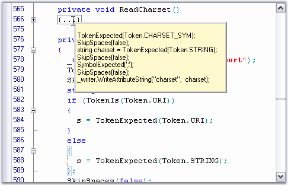' | markdownify }}
{:.image }

_Figure_ _35_: Outlining Tooltip displaying the Collapsed Block of Text_

Using Events

Edit Control supports the following Outlining Tooltip events.

<table>
<tr>
<td>
Edit Control Event</td><td>
Description</td></tr>
<tr>
<td>
OutliningTooltipBeforePopup</td><td>
Occurs when outlining tooltip is about to be shown.</td></tr>
<tr>
<td>
OutliningTooltipPopup</td><td>
Occurs when outlining tooltip is shown.</td></tr>
<tr>
<td>
OutliningTooltipClose</td><td>
Occurs when outlining tooltip is closed.</td></tr>
</table>

The OutliningTooltipBeforePopup event is used to control the visibility of the outlining tooltip. The ShowMode property of the OutliningTooltipBeforePopupEventArgs is used for this purpose. By default, the ShowMode property is set to On.

[C#]

private void editControl1_OutliningTooltipBeforePopup(object sender, Syncfusion.Windows.Forms.Edit.OutliningTooltipBeforePopupEventArgs e)

{

// To display the outlining tooltip

e.ShowMode = OutliningTooltipShowMode.On;

// To hide the outlining tooltip

e.ShowMode = OutliningTooltipShowMode.Off;

}

[VB.NET]

Private Sub editControl1_OutliningTooltipBeforePopup(sender As Object, e As Syncfusion.Windows.Forms.Edit.OutliningTooltipBeforePopupEventArgs) Handles editControl1.OutliningTooltipBeforePopup

' To display the outlining tooltip

e.ShowMode = OutliningTooltipShowMode.On

' To hide the outlining tooltip

e.ShowMode = OutliningTooltipShowMode.Off

End Sub

See Also

Automatic Outlining

### Wordwrap

Wordwrap allows users to view the entire contents of a line, by wrapping text at the edge of the control (or text area) into one or more lines, that normally would have been outside the view in the Edit Control.

Edit Control allows advanced customization by using the Wordwrap functionality.

Type of Wordwrap

Wordwrap is enabled by setting the WordWrap property of the Edit Control to True. The two types of Wordwrap in Edit Control have been explained below.

<table>
<tr>
<td>
Edit Control Property</td><td>
Description</td></tr>
<tr>
<td>
WordWrap</td><td>
Gets / sets state of the word wrapping mode.</td></tr>
<tr>
<td>
WordWrapType</td><td>
Gets / sets type of word wrapping. The options provided are* {{{ ''_WrapByChar_'' | markdownify }}} - wraps the text by individual characters* {{{ ''_WrapByWord_'' | markdownify }}} - wraps the text by individual words The default value is WrapByWord.</td></tr>
</table>

[C#]

// WordWrap property set.

this.editControl1.WordWrap = true;

// WordWrapType property set.

this.editControl1.WordWrapType = Syncfusion.Windows.Forms.Edit.Enums.WordWrapType.WrapByChar;

[VB.NET]

' WordWrap property set.

Me.editControl1.WordWrap = True

' WordWrapType property set.

Me.editControl1.WordWrapType = Syncfusion.Windows.Forms.Edit.Enums.WordWrapType.WrapByChar

Wordwrap Mode

The following properties are associated with setting the mode of Word Wrapping.

<table>
<tr>
<td>
Edit Control Property</td><td>
Description</td></tr>
<tr>
<td>
WordWrapMode</td><td>
Gets / sets state of the word wrapping mode. The options provided are{{{ ''_WordWrapMargin_' ' | markdownify }}}- wraps text at the boundary between text area and wordwrap margin of the Edit ControlThe area beyond the text area in the Edit Control is referred to asthe wordwrap margin. Hence, the width of the wordwrap margin is the difference between Edit Control's width and the TextArea width.{{{ ''_Control_' ' | markdownify }}}- wraps the text at the edge of the Edit Control{{{ ''_SpecifiedColumn -_'' | markdownify }}} wraps the text at the specified column that is specified in WordWrapColumn propertyThe default value is set to Control.</td></tr>
<tr>
<td>
WordWrapColumnMeasuringFont</td><td>
Gets / sets the font used while calculating the position of WordWrapColumn.</td></tr>
<tr>
<td>
WordWrapColumn</td><td>
Specifies column for wrapping text. Used when WordWrapMode is set to SpecifiedColumn.The default value is 100.</td></tr>
<tr>
<td>
TextAreaWidth</td><td>
Gets / sets the width of the text area of the Edit Control. The default value is 600.</td></tr>
<tr>
<td>
WrappedLinesOffset</td><td>
Specifies offset of wrapped lines.</td></tr>
</table>

[C#]

// Sets the WordWrap mode.

this.editControl1.WordWrapMode = Syncfusion.Windows.Forms.Edit.Enums.WordWrapMode.WordWrapMargin;

// Sets font that is used while calculating the position of the WordWrap column.

this.editControl1.WordWrapColumnMeasuringFont = new System.Drawing.Font("Arial", 9.75F, System.Drawing.FontStyle.Regular, System.Drawing.GraphicsUnit.Point, ((byte)(0)));

// Specifies column for wrapping text.

this.editControl1.WordWrapColumn = 125;

// Set the width of the EditControl's text area.

this.editControl1.TextAreaWidth = 300;

// Specifies offset for the wrapped lines.

this.editControl1.WrappedLinesOffset = 10;

[VB.NET]

' Sets the WordWrap mode.

Me.editControl1.WordWrapMode = Syncfusion.Windows.Forms.Edit.Enums.WordWrapMode.WordWrapMargin

' Sets font that is used while calculating the position of the WordWrap column.

Me.editControl1.WordWrapColumnMeasuringFont = New System.Drawing.Font("Arial", 9.75F, System.Drawing.FontStyle.Regular, System.Drawing.GraphicsUnit.Point, (CType((0), Byte)))

' Specifies column for wrapping text.

Me.editControl1.WordWrapColumn = 125

' Set the width of the EditControl's text area.

Me.editControl1.TextAreaWidth = 300

' Specifies offset for the wrapped lines.

Me.editControl1.WrappedLinesOffset = 10

The following illustration shows the Edit Control with the WordWrappingMode and WordWrapType properties set.

{{ '' | markdownify }}
{:.image }

_Figure_ _36_: WordWrappingMode = "Control"; WordWrapType= "WrapByWord"_

Refer to the WordWrap Demo sample in the following sample installation location.

_..\_My Documents\Syncfusion\EssentialStudio\Version Number\Windows\Edit.Windows\Samples\Advanced Editor Functions\ActionGroupingDemo_

#### Wordwrap Margin Customization and Wrapping Images

This section discusses the wordwrap margin customization settings. Also, it discusses how images can be set for the wrapped and wrapping lines of the Edit Control. 

Margin Line Style and Line Color Settings

Wordwrap margin of the Edit Control can be set and customized by using the below given properties.

<table>
<tr>
<td>
Edit Control Property</td><td>
Description</td></tr>
<tr>
<td>
WordWrapMarginVisible</td><td>
Gets / sets value indicating whether the wordwrap margin should be visible.</td></tr>
<tr>
<td>
WordWrapMarginLineStyle</td><td>
Specifies style of line that is drawn at the border of the wordwrap margin. The options provided are* Solid* Dash* Dot* DashDot* DashDotDot* Custom The default value is {{{ ''_Solid_'' | markdownify }}}.</td></tr>
<tr>
<td>
WordWrapMarginLineColor</td><td>
Sets custom color for the line that is drawn at the border of the wordwrap margin.</td></tr>
<tr>
<td>
WordWrapMarginBrush</td><td>
Gets / sets BrushInfo object that is used when the area situated after the text area is drawn.</td></tr>
</table>

[C#]

// Specifies whether the wordwrap margin should be visible.

this.editControl1.WordWrapMarginVisible = true;

// Specifies the line style of the wordwrap margin.

this.editControl1.WordWrapMarginLineStyle = DashStyle.Dash;

// Specifies the line color of the wordwrap margin.

this.editControl1.WordWrapMarginLineColor = Color.Green;

// Specifies the BrushInfo object that is used when the area situated after the text area is drawn.

this.editControl1.WordWrapMarginBrush = new Syncfusion.Drawing.BrushInfo(Syncfusion.Drawing.GradientStyle.Horizontal, System.Drawing.Color.White, System.Drawing.Color.LightSalmon);

[VB.NET]

' Specifies whether the wordwrap margin should be visible.

Me.editControl1.WordWrapMarginVisible = True

// Specifies the line style of the wordwrap margin.

Me.editControl1.WordWrapMarginLineStyle = System.Drawing.Drawing2D.DashStyle.Dash

// Specifies the line color of the wordwrap margin.

Me.editControl1.WordWrapMarginLineColor = System.Drawing.Color.Green

// Specifies the BrushInfo object that is used when the area situated after the text area is drawn.

Me.editControl1.WordWrapMarginBrush = New Syncfusion.Drawing.BrushInfo(Syncfusion.Drawing.GradientStyle.Horizontal, System.Drawing.Color.White, System.Drawing.Color.LightSalmon)

{{ '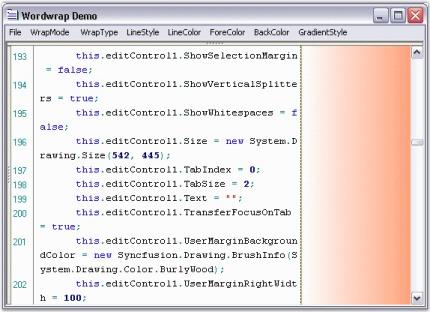' | markdownify }}
{:.image }

_Figure_ _37_: Edit Control with Character Wrapping and Custom Painted Wordwrap Margin_

Line Wrapping Images

It is also possible to associate images to indicate line wrapping. This feature can be turned on by setting the MarkLineWrapping property to True. There can be two types of image indicators:

1. Images that indicate the line that is being wrapped. These are displayed at the beginning of the line being wrapped. This can be set by using the CustomWrappedLinesMarkingImage property.

2. Images that indicate the point at which the line is being wrapped. This can be set by using the CustomLineWrappingMarkingImage property.

Also, to indicate whether wrapped lines should be marked, the MarkWrappedLines property can be used.

<table>
<tr>
<td>
Edit Control Property</td><td>
Description</td></tr>
<tr>
<td>
MarkLineWrapping</td><td>
Specifies whether line wrapping should be marked.</td></tr>
<tr>
<td>
MarkWrappedLines</td><td>
Specifies whether wrapped lines should be marked.</td></tr>
<tr>
<td>
CustomWrappedLinesMarkingImage</td><td>
Gets / sets custom image that marks wrapped lines.</td></tr>
<tr>
<td>
CustomLineWrappingMarkingImage</td><td>
Gets / sets custom image that marks wrapping lines.</td></tr>
</table>

[C#]

// Enable images to indicate line wrapping.

this.editControl1.MarkLineWrapping = true;

// Images that indicate the line that is being wrapped.

this.editControl1.CustomWrappedLinesMarkingImage = ((System.Drawing.Image)(resources.GetObject("$this.Sunset")));

// Images that indicate the point at which the line is being wrapped.

this.editControl1.CustomLineWrappingMarkingImage = ((System.Drawing.Image)(resources.GetObject("$this.Blue_hills")));

// Indicate wrapped lines.

this.editControl1.MarkWrappedLines = true;

[VB.NET]

' Enable images to indicate line wrapping.

Me.editControl1.MarkLineWrapping = True

' Images that indicate the line that is being wrapped.

Me.editControl1.CustomWrappedLinesMarkingImage = (CType((resources.GetObject("$this.Sunset")), System.Drawing.Image))

' Images that indicate the point at which the line is being wrapped.

Me.editControl1.CustomLineWrappingMarkingImage = (CType((resources.GetObject("$this.Blue_hills")), System.Drawing.Image))

' Indicate wrapped lines.

Me.editControl1.MarkWrappedLines = True

{{ '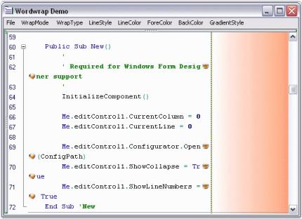' | markdownify }}
{:.image }

_Figure_ _38_: Wrapping Images indicating Wrapped Lines and Point of Wrapping_

### Read-Only Text

Edit Control allows you to specify read-only regions in the code, i.e., regions that are uneditable. This can be achieved through the following methods. 

<table>
<tr>
<td>
Edit Control Method</td><td>
Description</td></tr>
<tr>
<td>
MarkAsReadOnly</td><td>
Sets text as read-only.</td></tr>
<tr>
<td>
RemoveReadOnly</td><td>
Removes read-only status of specified region.</td></tr>
</table>

[C#]

// Specify a read-only region.

this.editControl1.MarkAsReadOnly(this.editControl1.Selection.Start, this.editControl1.Selection.End, Color.Orange, Color.Crimson);

// Reset a read-only region. 

this.editControl1.RemoveReadOnly(this.editControl1.Selection.Start, this.editControl1.Selection.End);

[VB.NET]

' Specify a read-only region.

Me.editControl1.MarkAsReadOnly(Me.editControl1.Selection.Start, Me.editControl1.Selection.End, Color.Orange, Color.Crimson)             

' Reset a read-only region.

Me.editControl1.RemoveReadOnly(Me.editControl1.Selection.Start, Me.editControl1.Selection.End)

The following screenshot shows a read-only region in the code section of the Edit Control.

{{ '' | markdownify }}
{:.image }

_Figure_ _39_: Read-Only Region with Orange Background and Crimson Text Color_

A sample which demonstrates this feature is available in the following sample installation path.

_..\_My Documents\Syncfusion\EssentialStudio\Version Number\Windows\Edit.Windows\Samples\Advanced Editor Functions\ActionGroupingDemo_

## Customizing Text

The following text customization features are discussed in this section:

### Text Color

This section discusses how the text color of the Edit Control can be changed.

The text color of the Edit Control is set by using the SetTextColor method.

[C#]

// Set the color of the text for the Edit Control.

this.editControl1.SetTextColor(new Point(1, 1), new Point(5, 5), Color.Orange);

[VB.NET]

' Set the color of the text for the Edit Control.

Me.editControl1.SetTextColor(New Point(1, 1), New Point(5, 5), Color.Orange)

### Text Border

This section discusses how borders can be set for the text in the Edit Control.

Edit Control supports borders for its text by using the methods given below.

<table>
<tr>
<td>
Edit Control Method</td><td>
Description</td></tr>
<tr>
<td>
SetTextBorder</td><td>
Sets border around text.</td></tr>
<tr>
<td>
RemoveTextBorder</td><td>
Removes border around text with given coordinates.</td></tr>
</table>

<table>
<tr>
<td>
Edit Control Border Enumerator</td><td>
Description</td></tr>
<tr>
<td>
FrameBorderStyle</td><td>
Specifies the style of border line. The options provided are* Dash* DashDot* Dot* None* Solid* Wave</td></tr>
<tr>
<td>
 BorderWeight</td><td>
Specifies the weight of the border line. The options provided are* Bold* Double* Thin</td></tr>
</table>

[C#]

// Set borders for the specified text range.

this.editControl1.SetTextBorder(new Point(1, 13), new Point(15, 13), Color.Red, FrameBorderStyle.Wave, BorderWeight.Double);

// Remove borders from the specified text range.

this.editControl1.RemoveTextBorder(new Point(1, 13), new Point(15, 13);

[VB.NET]

' Set borders for the specified text range.

Me.editControl1.SetTextBorder(New Point(1, 13), New Point(15, 13), Color.Red, FrameBorderStyle.Wave, BorderWeight.Double)

' Remove borders from the specified text range.

Me.editControl1.RemoveTextBorder(New Point(1, 13), New Point(15, 13)

{{ '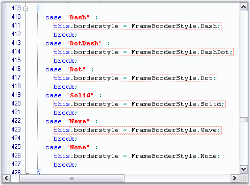' | markdownify }}
{:.image }

_Figure_ _40_: Text Borders in Edit Control_

A sample which demonstrates the above feature is available in the following sample installation path.

_..\ My Documents\Syncfusion\EssentialStudio\Version Number\Windows\Edit.Windows\Samples\Advanced Editor Functions\ActionGroupingDemo_

See Also

Underlines, Wavelines and StrikeThrough

### Encoding Text

Edit Control facilitates saving the contents of a file in any desired encoding and new line style. This can be accomplished by using the below given method.

<table>
<tr>
<td>
Edit Control Method</td><td>
Description</td></tr>
<tr>
<td>
SaveFile</td><td>
Saves content to the specified file.</td></tr>
</table>

[C#]

this.editControl1.SaveFile("EditControl", Encoding.Unicode, Syncfusion.IO.NewLineStyle.Mac);

[VB.NET]

Me.editControl1.SaveFile("EditControl", Encoding.Unicode, Syncfusion.IO.NewLineStyle.Mac)

Edit Control supports all the encoding styles supported by the System.Text.Encoding enumerator. The below given methods can be used to get / set the encoding style for the text in the Edit Control.

<table>
<tr>
<td>
Edit Control Method</td><td>
Description</td></tr>
<tr>
<td>
GetEncoding</td><td>
Gets the current text encoding.</td></tr>
<tr>
<td>
SetEncoding</td><td>
Sets the current text encoding. The options provided are* ASCII* BigEndianUnicode* Default* UTF32* UTF7* UTF8* Unicode</td></tr>
</table>

[C#]

// Gets the current text encoding.

this.editControl1.GetEncoding();

// Sets the current text encoding.

this.editControl1.SetEncoding(Encoding.ASCII);

[VB.NET]

' Gets the current text encoding.

Me.editControl1.GetEncoding()

// Sets the current text encoding.

Me.editControl1.SetEncoding(Encoding.ASCII)

It also supports all the new line styles supported by the Syncfusion.IO.NewLineStyle enumerator - Windows, Mac, Unix and Control.

<table>
<tr>
<td>
New Line Styles</td><td>
Description</td></tr>
<tr>
<td>
Windows</td><td>
\r\n</td></tr>
<tr>
<td>
Mac</td><td>
\r</td></tr>
<tr>
<td>
Unix</td><td>
\n\r</td></tr>
<tr>
<td>
Control</td><td>
\n</td></tr>
</table>

The SaveFilewithDataLoss and SaveStreamWithDataLoss events are fired whenever there is a data loss while saving the file by using the specified encoding format. Files or streams can be corrupted if you have some Unicode characters that cannot be saved using the specified encoding format. For example, if you have a file or stream that contains some specific characters of German language, and if you try to save it using ASCII encoding, then data loss will occur. If the save operation is not canceled here, characters will be saved incorrectly.

### Text Selection

The Edit Control supports text selection operations through the use of the APIs discussed in this section.

Selecting Text

Edit Control provides support to select text programmatically. The StartSelection and StopSelection methods are used to programmatically specify the starting and ending bounds for the text to be selected.

<table>
<tr>
<td>
Edit Control Method</td><td>
Description</td></tr>
<tr>
<td>
StartSelection</td><td>
Sets selection start at the specified position in text.</td></tr>
<tr>
<td>
StopSelection</td><td>
Sets selection end at the specified position in text.</td></tr>
<tr>
<td>
SetSelection</td><td>
Sets selected area of the text.</td></tr>
<tr>
<td>
SelectLine</td><td>
Selects line with specified index.</td></tr>
<tr>
<td>
SelectAll</td><td>
Selects all text.</td></tr>
</table>

Line selection in Edit Control is extended by using the ExtendSelectionToFarRight property.

<table>
<tr>
<td>
Edit Control Property</td><td>
Description</td></tr>
<tr>
<td>
ExtendSelectionToFarRight</td><td>
Gets / sets value indicating whether line selection should be extended to the far right.</td></tr>
</table>

[C#]

// Specifies start position for selecting text.

this.editControl1.StartSelection(1, 1);

// Specifies end position for selecting text.

this.editControl1.StopSelection(10, 1);

// Selects line with specified index.

this.editControl1.SelectLine(5);

// Extend line selection to far right.

this.editControl1.ExtendSelectionToFarRight = true;

[VB.NET]

' Specifies start position for selecting text.

Me.editControl1.StartSelection(1, 1)

' Specifies end position for selecting text.

Me.editControl1.StopSelection(5, 1)

' Selects line with specified index.

Me.editControl1.SelectLine(5)

' Extend line selection to far right.

Me.editControl1.ExtendSelectionToFarRight = True

Text can also be selected after drag / drop operations by using the below given property.

<table>
<tr>
<td>
Edit Control Property</td><td>
Description</td></tr>
<tr>
<td>
SelectTextAfterDragDrop</td><td>
Specifies whether text should be selected after drag / drop operations.</td></tr>
</table>

[C#]

this.editControl1.SelectTextAfterDragDrop = true;

[VB.NET]

Me.editControl1.SelectTextAfterDragDrop = True

Selected Text

The following properties can be used to get / set selected text.

<table>
<tr>
<td>
Edit Control Property</td><td>
Description</td></tr>
<tr>
<td>
SelectedText</td><td>
Gets / sets selected text.</td></tr>
<tr>
<td>
Selection</td><td>
Gets selected text range.</td></tr>
</table>

[C#]

// Returns the currently selected text in the Edit Control.

string editText = this.editControl1.SelectedText;

[VB.NET]

' Returns the currently selected text in the Edit Control.

Dim editText as String = Me.editControl1.SelectedText

Transparent Selection

Setting the TransparentSelection property to True, will highlight the selected text range with a transparent blue background (which will let you view the syntax highlighting in the text within the selected region), as shown in the following screenshot.

{{ '' | markdownify }}
{:.image }

_Figure_ _41_: Transparent Selection Enabled_

Setting the TransparentSelection property to False, will highlight the selected text range with a dark background (which will not let you view the syntax highlighting in the text within the selected region), as shown in the following screenshot.

{{ '' | markdownify }}
{:.image }

Cancelling / Resetting Selection

Text selection can be either cancelled or reset by using the below given methods.

<table>
<tr>
<td>
Edit Control Method</td><td>
Description</td></tr>
<tr>
<td>
SelectionCancel</td><td>
Removes selection and causes invalidation of the area that was selected.</td></tr>
<tr>
<td>
ResetSelection</td><td>
Resets selection.</td></tr>
</table>

[C#]

// Removes selection from text.

this.editControl1.SelectionCancel();

// Resets selection.

this.editControl1.ResetSelection();

[VB.NET]

' Removes selection from text.

Me.editControl1.SelectionCancel()

' Resets selection.

Me.editControl1.ResetSelection()

