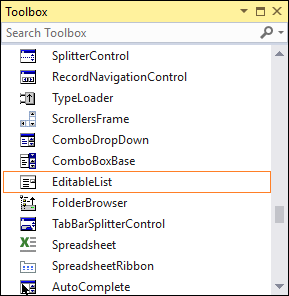
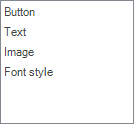

# Getting Started with Windows Forms Editable ListBox

## Assembly deployment

Refer to the [Control Dependencies](https://help.syncfusion.com/windowsforms/control-dependencies#editablelist) section to get the list of assemblies or details of NuGet package that needs to be added as a reference to use the control in any application.

Click [NuGet Packages](https://help.syncfusion.com/windowsforms/installation/install-nuget-packages) to learn how to install nuget packages in a Windows Forms application.

## Adding EditableList control via designer

1. Create a new Windows Forms application in Visual Studio.

2. The [EditableList](https://help.syncfusion.com/cr/windowsforms/Syncfusion.Windows.Forms.Tools.EditableList.html) control can be added to an application by dragging it from the toolbox to a designer view. The following dependent assemblies will be added automatically:

* Syncfusion.Shared.Base

## Adding EditableList control via code

1. Create a C# or VB application via Visual Studio.

2. Add the following reference to the project:

    * Syncfusion.Shared.Base

3. Include the required namespace.





using Syncfusion.Windows.Forms.Tools;




Imports Syncfusion.Windows.Forms.Tools




{{ codesnippet1 | OrderList_Indent_Level_1 }} 

4. Create an instance of [EditableList](https://help.syncfusion.com/cr/windowsforms/Syncfusion.Windows.Forms.Tools.EditableList.html), and add it to the form.





EditableList editableList1 = new EditableList();
this.Controls.Add(this.editableList1);





EditableList editableList1 = New EditableList()
Me.Controls.Add(Me.editableList1)




{{ codesnippet2 | OrderList_Indent_Level_1 }} 
 
5. Associate Button, TextBox, and ListBox with the EditableList control.





// Add the Button, ListBox, and TextBox controls.
editableList1.Controls.Add(this.editableList1.Button);
editableList1.Controls.Add(this.editableList1.ListBox);
editableList1.Controls.Add(this.editableList1.TextBox);

// Set size and add items.
this.editableList1.Size = new System.Drawing.Size(144, 40);

editableList.ListBox.Items.AddRange(new object[] { "Button", "Text", "Image", "Font style" });





' Add Button, ListBox, and TextBox controls
editableList1.Controls.Add(Me.editableList1.Button)
editableList1.Controls.Add(Me.editableList1.ListBox)
editableList1.Controls.Add(Me.editableList1.TextBox)

' Set size and add items.
Me.editableList1.Size = New System.Drawing.Size(144, 140)

editableList.ListBox.Items.AddRange(New Object() { "Button", "Text", "Image", "Font style" })




{{ codesnippet3 | OrderList_Indent_Level_1 }} 

## Select and edit item

### Selecting item

Click any item in the collection list at run time, and the item will be selected in the list.

This selection process can be achieved using the the following code.




editableList.ListBox.SelectedItem = "Text";




editableList.ListBox.SelectedItem = "Text"




### Editing item

At run time, select text, and double click the text or press F2 button. Now, you can edit the text.

