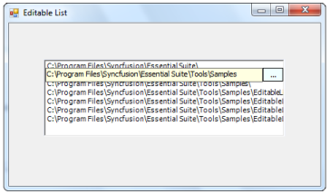

# Populating and Editing the List in Windows Forms Editable ListBox (EditableList)

## Populate the list

The List can be populated in 2 ways. One is to specify the DataSource and another is to edit the list manually in the property editor.

To populate through DataSource.




// Specifies the DataSource.
    List<string>  dataSource= new List<string>();
    dataSource.Add("item 1");
    dataSource.Add("item 2");
    dataSource.Add("item 3");
    this.editableList1.ListBox.DataSource = dataSource;





' Specifies the DataSource.
   Dim dataSource As List(Of String) = New List(Of String)()
    dataSource.Add("item 1")
    dataSource.Add("item 2")
    dataSource.Add("item 3")
    Me.editableList1.ListBox.DataSource = dataSource




Otherwise go to the property editor, expand the ListBox property of the EditableList and then select Items. This Items property is editable like any other Items property.

## Editing the list

The List can be edited in the following way during runtime:

1. Select the Item you want to edit by clicking or by using keyboard.
2.  Click again. There appears a TextBox. Now edit the text.
3.  After editing change the focus, the list will get updated.

