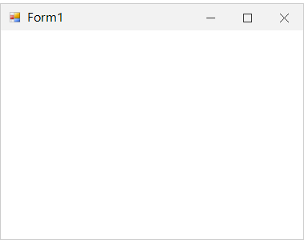
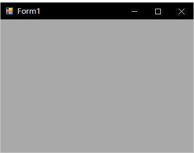
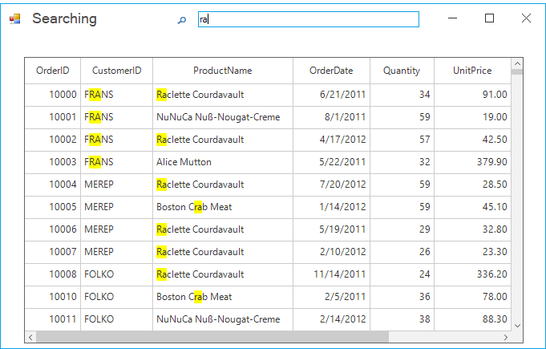

# Getting Started with Windows Forms Form (SfForm)

## Assembly Deployment

Refer [control dependencies](https://help.syncfusion.com/windowsforms/control-dependencies#sfform) section to get the list of assemblies or NuGet package needs to be added as reference to use the control in any application. 

## Converting Standard Form into SfForm

The default form can be changed into SfForm by the following steps:

**Step 1:** Create a new Windows Forms Application in Visual Studio.

**Step 2:** Add the following required assembly references to the project:

* Syncfusion.Core.WinForms.dll
* Syncfusion.Shared.Base.dll

**Step 3:** Include the following namespace to the directives list.




using Syncfusion.WinForms.Controls;


Imports Syncfusion.WinForms.Controls



{{ codesnippet1 | OrderList_Indent_Level_1 }}

**Step 4:** Change the base class of your form from `System.Windows.Forms.Form` to `SfForm`.




public partial class Form1 : SfForm
{
    public Form1()
    {
        InitializeComponent();
    }
}


Partial Public Class Form1
    Inherits SfForm
    Public Sub New()
	    InitializeComponent()
    End Sub
End Class



{{ codesnippet2 | OrderList_Indent_Level_1 }}

## Title Bar Customization

By default, the SfForm loads with the default appearance, that  can be customized by using the [TitleBarStyleInfo](https://help.syncfusion.com/cr/windowsforms/Syncfusion.WinForms.Controls.Styles.TitleBarStyleInfo.html) property. It contains all the settings for the appearance of the form.



//Sets the back color and fore color of the title bar.
this.Style.TitleBar.BackColor = Color.Black;
this.Style.TitleBar.ForeColor = Color.White;

//Sets the fore color of the title bar buttons
this.Style.TitleBar.CloseButtonForeColor = Color.White;
this.Style.TitleBar.MinimizeButtonForeColor = Color.White;
this.Style.TitleBar.MaximizeButtonForeColor = Color.White;

//Sets the hover state back color of the title bar buttons
this.Style.TitleBar.CloseButtonHoverBackColor = Color.DarkGray;
this.Style.TitleBar.MinimizeButtonHoverBackColor = Color.DarkGray;
this.Style.TitleBar.MaximizeButtonHoverBackColor = Color.DarkGray;

//Sets the pressed state back color of the title bar buttons
this.Style.TitleBar.CloseButtonPressedBackColor = Color.Gray;
this.Style.TitleBar.MaximizeButtonPressedBackColor = Color.Gray;
this.Style.TitleBar.MinimizeButtonPressedBackColor = Color.Gray;


'Sets the back color and fore color of the title bar.
Me.Style.TitleBar.BackColor = Color.Black
Me.Style.TitleBar.ForeColor = Color.White

'Sets the fore color of the title bar buttons
Me.Style.TitleBar.CloseButtonForeColor = Color.White
Me.Style.TitleBar.MinimizeButtonForeColor = Color.White
Me.Style.TitleBar.MaximizeButtonForeColor = Color.White

'Sets the hover state back color of the title bar buttons
Me.Style.TitleBar.CloseButtonHoverBackColor = Color.DarkGray
Me.Style.TitleBar.MinimizeButtonHoverBackColor = Color.DarkGray
Me.Style.TitleBar.MaximizeButtonHoverBackColor = Color.DarkGray

'Sets the pressed state back color of the title bar buttons
Me.Style.TitleBar.CloseButtonPressedBackColor = Color.Gray
Me.Style.TitleBar.MaximizeButtonPressedBackColor = Color.Gray
Me.Style.TitleBar.MinimizeButtonPressedBackColor = Color.Gray



## Border Customization

The borders of the form can be customized by using the [Style.Border](https://help.syncfusion.com/cr/windowsforms/Syncfusion.WinForms.Controls.Styles.FormVisualStyle.html#Syncfusion_WinForms_Controls_Styles_FormVisualStyle_Border) and [Style.InactiveBorder](https://help.syncfusion.com/cr/windowsforms/Syncfusion.WinForms.Controls.Styles.FormVisualStyle.html#Syncfusion_WinForms_Controls_Styles_FormVisualStyle_InactiveBorder) properties.



this.Style.Border = new Pen(Color.Black, 5);
this.Style.InactiveBorder = new Pen(Color.Gray, 5);


Me.Style.Border = New Pen(Color.Black, 5)
Me.Style.InactiveBorder = New Pen(Color.Gray, 5)



## Loading User Control to the Title Bar

You can load any user control to the title bar of the SfForm instead of the title bar text by using the [TitleBarTextControl](https://help.syncfusion.com/cr/windowsforms/Syncfusion.WinForms.Controls.SfForm.html#Syncfusion_WinForms_Controls_SfForm_TitleBarTextControl) property.



FlowLayoutPanel searchPanel = new FlowLayoutPanel();
Label searchingLabel = new Label();
searchingLabel.Text = "Searching";
TextBox searchBox = new TextBox();
searchPanel.Controls.Add(searchingLabel);
searchPanel.Controls.Add(searchBox);

//Loads the searchPanel to the title bar.
this.TitleBarTextControl = searchPanel;


Dim searchPanel As FlowLayoutPanel = New FlowLayoutPanel()
Dim searchingLabel As Label = New Label()
searchingLabel.Text = "Searching"
Dim searchBox As TextBox = New TextBox()
searchPanel.Controls.Add(searchingLabel)
searchPanel.Controls.Add(searchBox)

'Loads the searchPanel to the title bar.
Me.TitleBarTextControl = searchPanel



