# Coded UI Automation
The GridControl can be automated with Coded UI testing automation. Using Visual Studio Premium, Visual Studio Ultimate or Visual Studio Enterprise, user can create a coded UI Test Project which will be used to test and automate the UI of the GridControl. The validation can be done at grid level or cell level.

Levels of Microsoft Coded UI Test (CUIT) support,

* Level 1 - Record and Detecting the UIElement
* Level 2 – Rich text property validation
* Level 3 - Code Generation with custom classes
* Level 4 - Support of intent aware action

N> All these levels are supported in GridControl.

## Getting started
A `Coded UI Test Project` needs to be created for testing the application. The following steps are used to test the user application with Coded UI test,

1. Create Coded UI Test Project ,

   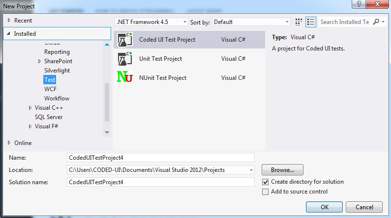

2. A `Generate Code for Coded UI test` dialog box will be opened. Click `OK` button,

   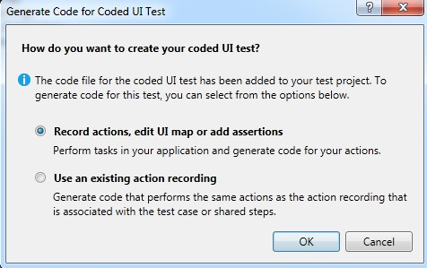

3. The Coded UI Test Builder will be displayed above the notification bar,

   

4. Then run the sample application which needs to be automated.

The GridControl supports Coded UI as the two ways,

* In-built support
* External plugin

## Control assertion
The **Coded UI Test** performs action on the user interface (UI) controls and verifies that the `UIElement` properties are displayed with the correct values. The assertion of the UI element can be done by the following steps,

1. Create the **Coded UI Test Project** as explained in the [Getting Started](#_Getting_Started) section.
2. In the **Coded UI Test Builder** dialog, select and drag the assertion button to the UI element which needs to be tested,
   
   

3. The GridControl or Cell will be highlighted with a rectangular bounds like below,
   
   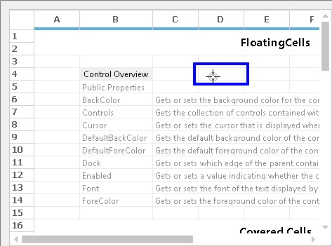

### Assertion of GridControl
For asserting the GridControl, the whole grid will be highlighted with that rectangular bounds.  After assertion, the properties related to GridControl will be displayed in **Coded UI Test Builder**.

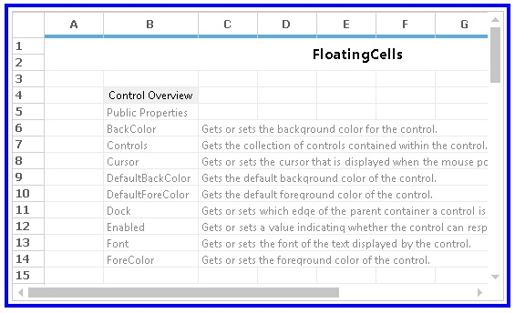

### Assertion of a Cell
For asserting a particular cell, the cell will be highlighted with that rectangular bounds.  After assertion, the properties related to that particular cell will be displayed in **Coded UI Test Builder**.

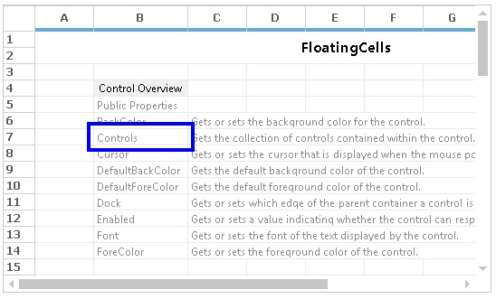

### Assertion of Merged Cells
For asserting the merged cell, the merged range will be treated as a single cell and it will be highlighted with rectangular bounds.  After assertion, the properties related to the merged cell will be displayed in **Coded UI Test Builder**.

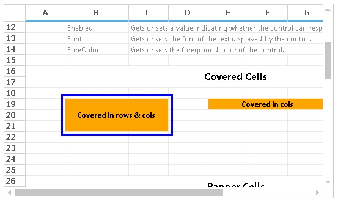

## Record and Playback
The GridControl lets you record the automation and play back those automated actions whenever application needs to be tested. 

### Recording
The following steps are used to record and playback the application,

1. Create the **Coded UI Test Project** as explained in the [Getting Started](#_Getting_Started) section,
2. Select the `Start Recording` button as follows,

   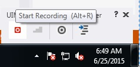

3. Perform the needed actions in the application. Ensure that a notification is displaying for each and every actions performed in the application like below,

   

4. Then Click the `Generate Code` button as follows,
   
   

5. The Coded UI test code will be generated in Coded UI Test Project as follows,
   
   

6. The each and every recorded actions will be generated in Coded UI like below,
   
   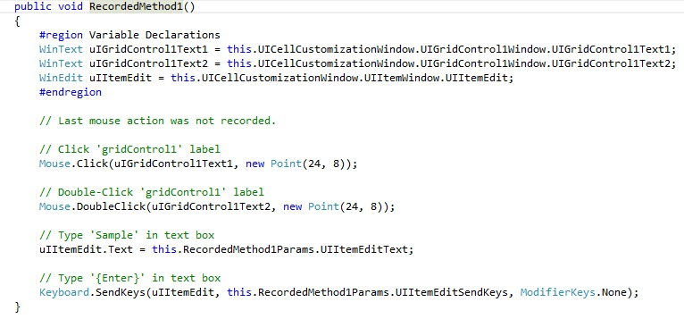

### Playback
The recorded automation codes can be played back. The following steps are used to playback the automated methods,

1. Open the Coded UI Test class file.
2. Run the application which is tested for automation.
3. Right Click on the `CodedUITestMethod1` method.
4. Select the `Run Tests` option.

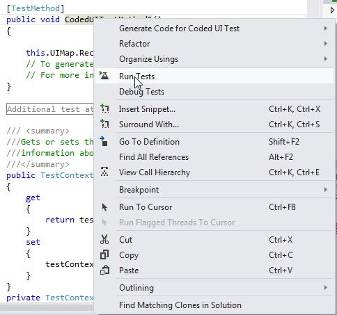

## In-built support
The GridControl supports automated UI testing with Coded UI technology without any external plugin. In this technique, the grid will be detected as an **MSAA** object and the automation code will be generated based on MSAA technology element.  

### System requirements
The following IDEs and .NET frameworks are supported for automating the GridControl.
<table>
<tr>
<td>
{{'**Visual Studio**'| markdownify }}
</td>
<td>
Premium, Ultimate, Enterprise editions of
<li>VS2010,</li>
<li>VS2012,</li>
<li>VS2013,</li>
<li>VS2015</li>
</td>
</tr>
<tr>
<td>
{{'**.Net framework**'| markdownify }}

</td>
<td>
<li>3.5,</li> <li>4.0,</li><li> 4.5,</li><li> 4.5.1,</li><li>4.6</li>
</td>
</tr>
</table>

### Enabling Coded UI support
The Coded UI support for grid can be enabled using [AccessibilityEnabled](http://help.syncfusion.com/cr/cref_files/windowsforms/Syncfusion.Grid.Windows~Syncfusion.Windows.Forms.Grid.GridControlBaseImp~AccessibilityEnabled.html) property.


this.gridControl1.AccessibilityEnabled = true;


Me.gridControl1.AccessibilityEnabled = True



### Assertion
The GridControl lets you test the user application by asserting the properties which are displayed in the **Coded UI Test Builder**. The grid and the cell bounds will be asserted as an `MSAA` object and the properties will be displayed based on cell types.

For example, TextBox cell will be asserted as `WinText` MSAA control, CheckBox cell will be asserted as `WinCheckBox` MSAA control. The GridControl will be detected as `WinWindow` MSAA control.

The following table provides the information about the cell types and its equivalent MSAA control on asserting,
<table>
<tr>
<th>
S.No
</th>
<th>
Grid Cell Type
</th>
<th>
MSAA control
</th>
</tr>
<tr>
<td>
1.
</td>
<td>
TextBox
</td>
<td>
WinText
</td>
</tr>
<tr>
<td>
2.
</td>
<td>
ComboBox
</td>
<td>
WinCombobox
</td>
</tr>
<tr>
<td>
3.
</td>
<td>
CheckBox
</td>
<td>
WinCheckBox
</td>
</tr>
<tr>
<td>
4.
</td>
<td>
PushButton
</td>
<td>
WinButton
</td>
</tr>
<tr>
<td>
5.
</td>
<td>
NumericUpDown
</td>
<td>
WinSpinner
</td>
</tr>
</table>
The below example shows the properties that are displayed in the Coded UI test builder,

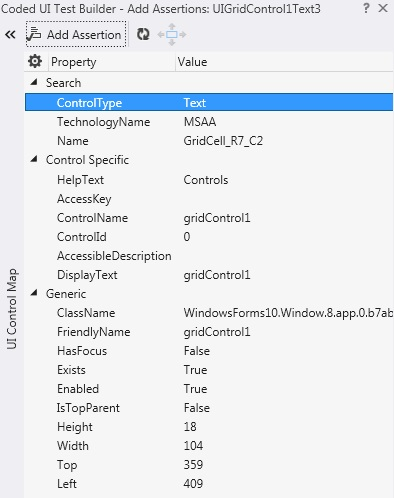

N> The properties will be displayed based on the respective **MSAA** control properties. 

### Getting cell values
As GridControl and cell are asserted like **MSAA** control, a value of a cell will be displayed in the `HelpText` property. 

The below example shows the checkbox is asserted and the checked state of the check box is displayed in `HelpText` property,

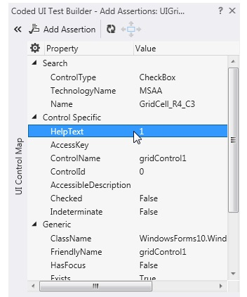

### Finding a Cell and Getting the Cell Value
To find a cell in the GridControl, `SearchProperties` property can be used and to get the cell value, `GetPropertyValue` method can be used. The corresponding cell name has to be given for searching the control. 


[TestMethod]
public void GetCellValue()
{
   UITestControl grid = this.UIMap.UICellCustomizationWindow.UIGridControl1Window;
   UITestControl cell = new UITestControl(grid);
   cell.SearchProperties["Name"] = "GridCell_R4_C2";
   if (cell.TryFind())
     {
       MessageBox.Show(cell.GetProperty("HelpText").ToString());
     }
}


<TestMethod()>
Public Sub GetCellValue()
   Dim grid As UITestControl = Me.UIMap.UICellCustomizationWindow.UIGridControl1Window
   Dim cell As New UITestControl(grid)
   cell.SearchProperties("Name") = "GridCell_R4_C2"
   If cell.TryFind() Then
      MessageBox.Show(cell.GetProperty("HelpText").ToString())
   End If
End Sub


The below example shows the getting of a cell value from grid,

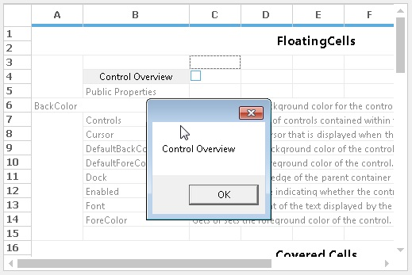

### Highlighting a Cell
To highlight a cell in GridControl, `DrawHighlight` method of corresponding `UITestControl` can be used.


[TestMethod]
public void HighlightCell()
{
   UITestControl grid = this.UIMap.UICellCustomizationWindow.UIGridControl1Window;
   UITestControl cell = new UITestControl(grid);
   cell.SearchProperties["Name"] = "GridCell_R4_C3";
   if (cell.TryFind())
     {
     cell.DrawHighlight();
     }
}


<TestMethod()>
Public Sub HighlightCell()
    Dim grid As UITestControl = Me.UIMap.UICellCustomizationWindow.UIGridControl1Window
    Dim cell As UITestControl = New UITestControl(grid)
    cell.SearchProperties("Name") = "GridCell_R4_C3"
    If cell.TryFind Then
       cell.DrawHighlight
    End If
End Sub


The below example shows the highlighting of a cell,

### Highlighting a Grid
To highlight a GridControl, `DrawHighlight` method of corresponding `UITestControl` can be used.


[TestMethod]
public void HighlightGrid()
{
   UITestControl grid = this.UIMap.UICellCustomizationWindow.UIGridControl1Window;
   if (grid.TryFind())
     {
     grid.DrawHighlight();
     }
}


<TestMethod>
Public Sub HighlightGrid()
   Dim grid As UITestControl = Me.UIMap.UICellCustomizationWindow.UIGridControl1Window
   If grid.TryFind() Then
      grid.DrawHighlight()
   End If
End Sub


The below example shows the highlighting of grid,

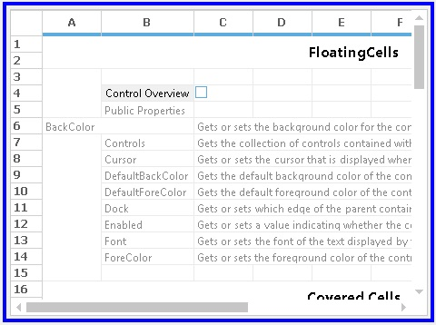

## External Plugin
The GridControl also provides Coded UI support via external plugin. In this technique, the grid will be detected as `SyncControl` technology instead of detecting as `MSAA` object. The properties will be displayed based on the inner control of the asserted cell or grid. 

### System Requirements
The following IDEs and .NET frameworks are supported for automating the GridControl.
<table>
<tr>
<td>
{{'**Visual Studio**'| markdownify }}
</td>
<td>
Premium, Ultimate, Enterprise editions of
<li>VS2010,</li>
<li>VS2012,</li>
<li>VS2013</li> 
</td>
</tr>
<tr>
<td>
{{'**.Net framework**'| markdownify }}

</td>
<td>
<li>3.5,</li><li>4.0,</li><li>4.5,</li><li>4.5.1</li>
</td>
</tr>
</table>

### Enabling Coded UI Support
To enable the Coded UI support for grid, the following steps has to be implemented,

* Deploying Extensions Assemblies
* Preparing Grid sample application

#### Deploying Extensions Assemblies
This section explains about deploying the external assemblies through batch file or manual deployment. 

* Using copydrop.bat file

  * Navigate to copydrop.bat file in UI test folder.
  * Run the batch file to place the `Extension` and `Provider` assemblies in the appropriate directories. These assemblies are needed as reference for the Visual Studio IDE. 

* Manual deployment
  
  The following Extensions assemblies can be located in the UI test folder and these should be deployed in the below mentioned directory manually,

  * Syncfusion.VisualStudio.TestTools.UITest.GridCommunication.dll
  * Syncfusion.VisualStudio.TestTools.UITest.GridExtension.dll

**Directory**

The above extension assemblies should be deployed to the following locations,

**C:\Program Files (x86)\Common Files\Microsoft shared\VSTT\&lt;Visual Studio Version&gt;\UITestExtensionPackages**
**C:\Program Files (x86)\Microsoft Visual Studio &lt;Visual Studio Version&gt;\Common7\IDE\PublicAssemblies** 
**C:\Program Files (x86)\Microsoft Visual Studio &lt;Visual Studio Version&gt;\Common7\IDE\PrivateAssemblies**

For example, these assemblies can be deployed for `Visual Studio 2013` in the following locations, 
C:\Program Files (x86)\Common Files\Microsoft shared\VSTT\12.0\UITestExtensionPackages 
C:\Program Files (x86)\Microsoft Visual Studio 12.0\Common7\IDE\PublicAssemblies 
C:\Program Files (x86)\Microsoft Visual Studio 12.0\Common7\IDE\PrivateAssemblies

### Modifying the sample application for communication
The grid application host runs with .NET Remoting channel hosted internally to communicate with test plugin through an interface. Data is then channeled across the Visual Studio Test Framework to identify the Cells and GridControl. The following steps helps the users to prepare the grid sample application to support Coded UI plugin.

* Add the Syncfusion.VisualStudio.TestTools.UITest.GridCommunication.dll which contains implementation to easily change an existing application to the test application that the plugin would require.
* Let the parent container inherit `GridControlTestApplication` class as shown below,



public class Form1 : GridControlTestApplication
{
}


Public Class Form1
    Inherits GridControlTestApplication
End Class



### Assertion
The GridControl can be detected as `Table` control type and Cell can be detected as `Cell` control type with custom rich properties. 

The following table provides the details about the list of properties that will be displayed for GridControl and Cell,

#### Asserting a GridControl
<table>
<tr>
<th>
S.No
</th>
<th>
Property name
</th>
<th>
Description
</th>
</tr>
<tr>
<td>
1.
</td>
<td>
RowCount
</td>
<td>
Indicates the number of rows in the GridControl
</td>
</tr>
<tr>
<td>
2.
</td>
<td>
ColCount
</td>
<td>
Indicates the number of columns in the GridControl
</td>
</tr>
<tr>
<td>
3.
</td>
<td>
CurrentCell
</td>
<td>
Indicates the current cell in the GridControl
</td>
</tr>
<tr>
<td>
4.
</td>
<td>
SelectedRanges
</td>
<td>
Indicates the range of selected cells in the GridControl
</td>
</tr>
</table>

The following example shows the property that displayed in the Coded UI test builder,

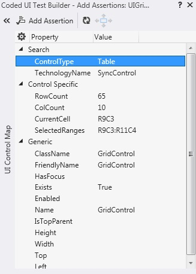

#### Asserting a cell
<table>
<tr>
<th>
S.No
</th>
<th>
Property name
</th>
<th>
Description
</th>
</tr>
<tr>
<td>
1.
</td>
<td>
CellValue
</td>
<td>
Indicates a value of a cell.
</td>
</tr>
<tr>
<td>
2.
</td>
<td>
Text
</td>
<td>
Indicates a text of a cell.
</td>
</tr>
<tr>
<td>
3.
</td>
<td>
Description
</td>
<td>
Indicates the description of a cell. This used for checkbox cell which needs to be displayed with text.
</td>
</tr>
<tr>
<td>
4.
</td>
<td>
Format
</td>
<td>
Indicates the number format of the cell.
</td>
</tr>
<tr>
<td>
5.
</td>
<td>
CellWidth
</td>
<td>
Indicates the width of a cell.
</td>
</tr>
<tr>
<td>
6.
</td>
<td>
CellHeight
</td>
<td>
Indicates the height of a cell.
</td>
</tr>
<tr>
<td>
7.
</td>
<td>
FormattedText
</td>
<td>
Indicates the formatted text of a cell.
</td>
</tr>
<tr>
<td>
8.
</td>
<td>
CellType
</td>
<td>
Indicates the type of a cell.
</td>
</tr>
<tr>
<td>
9.
</td>
<td>
FormulaTag
</td>
<td>
Indicates the formula information if it is formula cell.
</td>
</tr>
<tr>
<td>
10.
</td>
<td>
Checked
</td>
<td>
Indicates the checked state information if it is checkbox cell. 
</td>
</tr>
<tr>
<td>
11.
</td>
<td>
AutoCompleteInEditMode
</td>
<td>
Indicates the autocomplete behavior of a cell if it is combobox cell. 
</td>
</tr>
<tr>
<td>
12.
</td>
<td>
DropDownStyle
</td>
<td>
Indicates the dropdown style behavior of a cell if it is combobox cell. 
</td>
</tr>
</table>

### Finding a Cell and Getting the Cell Value
To find a cell in the GridControl, `SearchProperties` property can be used and to get a cell value, the `GetPropertyValue` method can be used. The corresponding control type, RowIndex and columnIndex has to be given for searching the control.



[TestMethod]
public void GetGridCell()
{
  var cellGrid = this.UIMap.UICellCustomizationWindow.UIGridControl1Window.UIGridControl1Table;
  UITestControl cellGridCell = new UITestControl(cellGrid);
  cellGridCell.SearchProperties["ControlType"] = "Cell";
  cellGridCell.SearchProperties["RowIndex"] = "4";
  cellGridCell.SearchProperties["ColumnIndex"] = "2";
  if (cellGridCell.TryFind())
    {
       MessageBox.Show(cellGridCell.GetProperty("CellValue").ToString());
    }
}


<TestMethod>
Public Sub GetGridCell()
  Dim cellGrid = Me.UIMap.UICellCustomizationWindow.UIGridControl1Window.UIGridControl1Table
  Dim cellGridCell As New UITestControl(cellGrid)
  cellGridCell.SearchProperties("ControlType") = "Cell"
  cellGridCell.SearchProperties("RowIndex") = "4"
  cellGridCell.SearchProperties("ColumnIndex") = "2"
  If cellGridCell.TryFind() Then
       MessageBox.Show(cellGridCell.GetProperty("CellValue").ToString())
  End If
End Sub



The below example shows the getting of a cell value from grid,

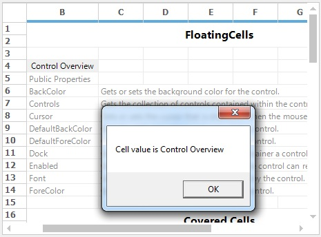

### Highlighting a Cell
To highlight a cell in GridControl, the GridControl has to be searched with the needed searching properties and `DrawHighlight` method of corresponding `UITestControl` can be used.


[TestMethod]
public void HighlightCell()
{
  var cellGrid = this.UIMap.UICellCustomizationWindow.UIGridControl1Window.UIGridControl1Table;
  UITestControl cellGridCell = new UITestControl(cellGrid);
  cellGridCell.SearchProperties["ControlType"] = "Cell";
  cellGridCell.SearchProperties["RowIndex"] = "4";
  cellGridCell.SearchProperties["ColumnIndex"] = "2";
  if (cellGridCell.TryFind())
    {
       cellGridCell.DrawHighlight();
    }
}


<TestMethod>
Public Sub HighlightCell()
  Dim cellGrid = Me.UIMap.UICellCustomizationWindow.UIGridControl1Window.UIGridControl1Table
  Dim cellGridCell As New UITestControl(cellGrid)
  cellGridCell.SearchProperties("ControlType") = "Cell"
  cellGridCell.SearchProperties("RowIndex") = "4"
  cellGridCell.SearchProperties("ColumnIndex") = "2"
  If cellGridCell.TryFind() Then
       cellGridCell.DrawHighlight()
  End If
End Sub



The below example shows the highlighting of a cell,

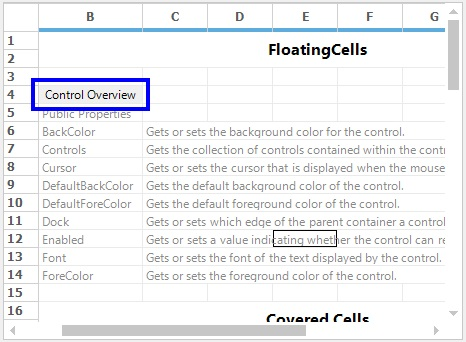

### Highlighting a Grid
To highlight a GridControl, the GridControl has to be searched with the needed searching properties and `DrawHighlight` method of corresponding `UITestControl` can be used. 


[TestMethod]
public void HighlightGrid()
{
     UITestControl cellGrid =  this.UIMap.UICellCustomizationWindow.UIGridControl1Window.UIGridControl1Table.UIGridControlTable;
     cellGrid.SearchProperties["ControlType"] = "Table";
     cellGrid.SearchProperties["RowIndex"] = "-1";
     cellGrid.SearchProperties["ColumnIndex"] = "-1";
     if (cellGrid.TryFind())
       {
         cellGrid.DrawHighlight();
       }
}


<TestMethod>
Public Sub HighlightGrid()
     Dim cellGrid As UITestControl = Me.UIMap.UICellCustomizationWindow.UIGridControl1Window.UIGridControl1Table.UIGridControlTable
     cellGrid.SearchProperties("ControlType") = "Table"
     cellGrid.SearchProperties("RowIndex") = "-1"
     cellGrid.SearchProperties("ColumnIndex") = "-1"
     If cellGrid.TryFind() Then
         cellGrid.DrawHighlight()
     End If
End Sub



The below example shows the highlighting of grid,

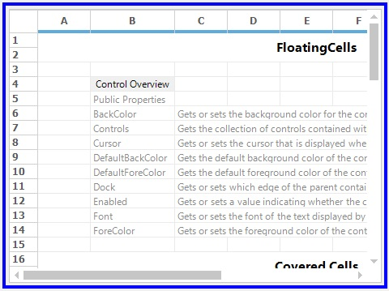

