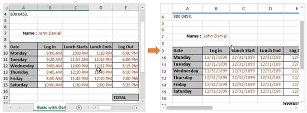
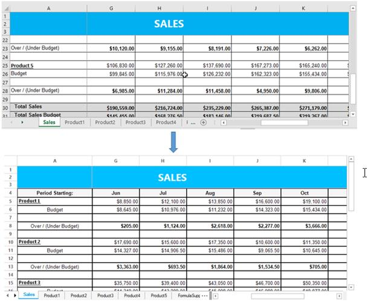

# Importing
The [GridExcelConverterControl](http://help.syncfusion.com/cr/windowsforms/Syncfusion.GridExcelConverter.GridExcelConverterControl.html) provides support to import the content from Excel sheet to GridControl. 

The following assembly files should be added to the application reference folder,

* Syncfusion.GridConverter.Windows
* Syncfusion.XlsIO.Base

N> **Syncfusion.XlsIO.Base** libraries are used to support conversion of the grid contents to Excel. 

The [ExcelToGrid](https://help.syncfusion.com/cr/windowsforms/Syncfusion.GridExcelConverter.GridExcelConverterControl.html#Syncfusion_GridExcelConverter_GridExcelConverterControl_ExcelToGrid_Syncfusion_XlsIO_IWorkbook_) method is used to import the entire Excel sheet to GridControl. In this technique, the entire cells from Excel sheet will be imported to GridControl. The following styles can be imported to GridControl from Excel,

* Font
* BackColor and ForeColor
* Alignment
* Borders
* Images
* Hyperlinks
* Merge cells
* Row height
* Column width
* Freeze panes

The following example shows the GridControl is imported from Excel sheet,


GridExcelConverterControl excelConverter = new GridExcelConverterControl();

//Import the content of Excel to the Grid
excelConverter.ExcelToGrid("Sample.xls", this.gridControl1.Model);


Dim excelConverter As New GridExcelConverterControl()

'Import the content of Excel to the Grid
excelConverter.ExcelToGrid("Sample.xls", Me.gridControl1.Model)



## Customization using Events
The `GridExcelConverterControl` provides support to customize the grid content styles while exporting to Excel. This class provides the following event,

* [QueryImportExportCellInfo](https://help.syncfusion.com/cr/windowsforms/Syncfusion.GridExcelConverter.GridExcelConverterBase.html) – This event will be raised when importing or exporting of each cells.

The following example shows the Excel sheet is imported and the row back color is changed to pink on importing,


GridExcelConverterControl excelConverter = new GridExcelConverterControl();
excelConverter.QueryImportExportCellInfo += new GridImportExportCellInfoEventHandler(excelConverter_QueryImportExportCellInfo);

//Import the content of Excel to the Grid
excelConverter.ExcelToGrid("Sample.xls", this.gridControl1.Model);

void excelConverter_QueryImportExportCellInfo(object sender, GridImportExportCellInfoEventArgs e)
 {

 // Checking whether it is Importing action
       if (e.Action == GridConverterAction.Import)
        {

// Setting backcolor for second row cells in GridControl.
            if (e.RowIndex == 9)
             {
                 e.GridCell.BackColor = Color.Pink;
                 e.GridCell.CellValue = e.ExcelCell.Value;
                 e.GridCell.Borders.Right = new GridBorder(GridBorderStyle.Solid, Color.Black);                    
                 e.GridCell.Font.Facename = "Calibri";
                 e.GridCell.Font.Size = 11;
                 e.GridCell.TextColor = Color.Black;
    
// Handled property has to be enabled to confirm the changes
                  e.Handled = true;
              }
        }
}


Private excelConverter As New GridExcelConverterControl()
Private excelConverter.QueryImportExportCellInfo += New GridImportExportCellInfoEventHandler(AddressOf excelConverter_QueryImportExportCellInfo)

'Import the content of Excel to the Grid
excelConverter.ExcelToGrid("Sample.xls", Me.gridControl1.Model)

void excelConverter_QueryImportExportCellInfo(Object sender, GridImportExportCellInfoEventArgs e)
 
 ' Checking whether it is Importing action
   If e.Action = GridConverterAction.Import Then
 
 ' Setting backcolor for second row cells in GridControl.
        If e.RowIndex = 9 Then
             e.GridCell.BackColor = Color.Pink
             e.GridCell.CellValue = e.ExcelCell.Value
             e.GridCell.Borders.Right = New GridBorder(GridBorderStyle.Solid, Color.Black)
             e.GridCell.Font.Facename = "Calibri"
             e.GridCell.Font.Size = 11
             e.GridCell.TextColor = Color.Black

' Handled property has to be enabled to confirm the changes
              e.Handled = True
        End If
   End If
End Sub



## Virtual Importing
To increase the performance of importing, the data of GridControl can be imported virtually (On-Demand mode) from the Excel sheet. This technique is the efficient way to import the Excel sheet to GridControl when it is needed. 

The following two methods are used to import the Excel as virtually,

* [ConvertExcelStylesToGridStyles](https://help.syncfusion.com/cr/windowsforms/Syncfusion.GridExcelConverter.GridExcelConverterControl.html#Syncfusion_GridExcelConverter_GridExcelConverterControl_ConvertExcelStyleToVirtualGridStyle_Syncfusion_Windows_Forms_Grid_GridStyleInfo_Syncfusion_XlsIO_IWorksheet_Syncfusion_XlsIO_IRange_)
* [ExcelToVirtualGrid](https://help.syncfusion.com/cr/windowsforms/Syncfusion.GridExcelConverter.GridExcelConverterControl.html#Syncfusion_GridExcelConverter_GridExcelConverterControl_ExcelToVirtualGrid_Syncfusion_Windows_Forms_Grid_GridModel_Syncfusion_XlsIO_IWorksheet_)

The ` ConvertExcelStylesToGridStyles` method is used to convert the Excel cell to grid cell. Using this method, the Excel cell’s font styles, BackColor, alignment, TextColor, borders will be imported. 

N> This method has to be used in [QueryCellInfo](https://help.syncfusion.com/cr/windowsforms/Syncfusion.Windows.Forms.Grid.GridControl.html) event. 

The `ExcelToVirtualGrid` method is used to convert the layout of the Excel sheet to grid layout. The layout includes the followings,

* Row heights
* Column widths
* Merge cells
* Images
* Hyperlinks
* Freeze panes
* Named ranges
* Combobox
* GridLines

The following example shows the Excel sheet is imported as virtually,



public void Model_QueryCellInfo(object sender, Syncfusion.Windows.Forms.Grid.GridQueryCellInfoEventArgs e)
{
    if (e.RowIndex <= 0 || e.ColIndex <= 0)
    {
        if (e.ColIndex == 0)
            e.Style.HorizontalAlignment = GridHorizontalAlignment.Center;
        return;
    }

    GridModel gridModel = sender as GridModel;
    int index = this.tabBarSplitterControl.ActivePageIndex;
    IWorksheet sheet = workbook.Worksheets[index];

    if (!e.Style.IsChanged && e.Style.IsEmpty)
    {
        if (sheet != null)
        {
            IRange range = sheet.Range;
            if (e.RowIndex >= range.Row && e.ColIndex >= range.Column)
            {
                IRange rangeToConvert = sheet.Range[e.RowIndex, e.ColIndex];

                //Used to set the styles of the Excel cell to grid.  
                excelConverter.ConvertExcelStyleToVirtualGridStyle(e.Style, sheet, rangeToConvert);
                
            }
        }
}

void gridModel_SaveCellInfo(object sender, GridSaveCellInfoEventArgs e)
{
      int index = this.tabBarSplitterControl.ActivePageIndex;
      IWorksheet Worksheet = workbook.Worksheets[index];

    //Used to save the changes made in grid to Excel sheet which is currently in view. 
       excelConverter.SaveCellInfoToExcelsheet(Worksheet, sender as GridModel, e.Style);
}



Public Sub Model_QueryCellInfo(ByVal sender As Object, ByVal e As Syncfusion.Windows.Forms.Grid.GridQueryCellInfoEventArgs)
    If e.RowIndex <= 0 OrElse e.ColIndex <= 0 Then
        If e.ColIndex = 0 Then
            e.Style.HorizontalAlignment = GridHorizontalAlignment.Center
        End If
        Return
    End If

    Dim gridModel As GridModel = TryCast(sender, GridModel)
    Dim index As Integer = Me.tabBarSplitterControl.ActivePageIndex
    Dim sheet As IWorksheet = workbook.Worksheets(index)

    If (Not e.Style.IsChanged) AndAlso e.Style.IsEmpty Then
        If sheet IsNot Nothing Then
            Dim range As IRange = sheet.Range
            If e.RowIndex >= range.Row AndAlso e.ColIndex >= range.Column Then
                Dim rangeToConvert As IRange = sheet.Range(e.RowIndex, e.ColIndex)

'Used to set the styles of the Excel cell to grid.  
                excelConverter.ConvertExcelStyleToVirtualGridStyle(e.Style, sheet, rangeToConvert)
          End If
        End If
    End If
End Sub
void gridModel_SaveCellInfo(Object sender, GridSaveCellInfoEventArgs e)
      Dim index As Integer = Me.tabBarSplitterControl.ActivePageIndex
      Dim Worksheet As IWorksheet = workbook.Worksheets(index)

'Used to save the changes made in grid to Excel sheet which is currently in view. 
       excelConverter.SaveCellInfoToExcelsheet(Worksheet, TryCast(sender, GridModel), e.Style)
End Sub



N> Please refer to the following dashboard sample for more details about Virtual importing.
N> &lt;Installed_Location&gt;\Syncfusion\EssentialStudio\[Version_No]\Windows\Grid.Windows\Samples\Importing\Virtual Importing\CS

### Importing without Borders and Styles
By default, the styles and borders will be imported to GridControl when importing as a virtual grid. This functionality can be handled by using [ImportBorders](https://help.syncfusion.com/cr/windowsforms/Syncfusion.GridExcelConverter.GridExcelConverterControl.html#Syncfusion_GridExcelConverter_GridExcelConverterControl_ImportBorders) and [ImportStyles](https://help.syncfusion.com/cr/windowsforms/Syncfusion.GridExcelConverter.GridExcelConverterControl.html#Syncfusion_GridExcelConverter_GridExcelConverterControl_ImportStyles) properties.

N> The performance of the virtual importing can also be increased by disabling the `ImportBorders` and `ImportStyles` properties.



GridExcelConverterControl excelConverter = new GridExcelConverterControl();
excelConverter.ImportBorders = false;
excelConverter.ImportStyles = false;

//Import the content of Excel to the Grid as virtual
excelConverter.ExcelToVirtualGrid("Sample.xls", this.gridControl1.Model);


Dim excelConverter As GridExcelConverterControl = New GridExcelConverterControl
excelConverter.ImportBorders = False
excelConverter.ImportStyles = False

'Import the content of Excel to the Grid as virtual
excelConverter.ExcelToVirtualGrid("Sample.xls", Me.gridControl1.Model)

