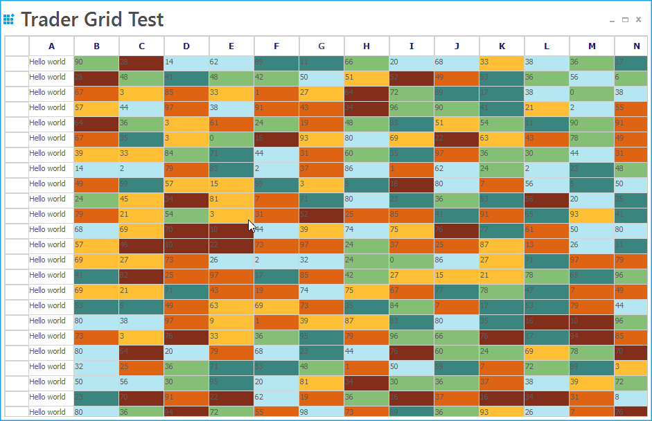
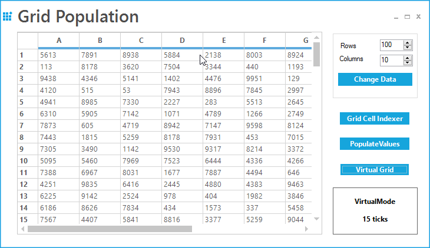

# Performance in Windows Forms Grid Control
GridControl has an extremely high performance standard. It can handle high frequency updates and work with large amounts of data without its performance being affected.

## High Frequency Real Time Updates
GridControl supports frequent updates that occur in random cells across the grid while keeping CPU usage to a minimum level.

Let’s consider an example, in which a timer, changes the value of cells in short intervals. This example draws cell changes directly to the graphics context instead of performing an Invalidate. It shows user text using GDI instead of GDI+ and also shows how to optimize updates for inserting and removing rows. User can start multiple instances without slowing down the machine and can confirm the same by viewing Task Manager CPU usage while the sample runs. 

A sample demonstrating this feature is available under the following sample installation path.  
**&lt;Install Location&gt;\Syncfusion\EssentialStudio\[Version Number]\Windows\Grid.Windows\Samples\Performance\Trader Grid Test Demo**

## Data Handling
GridControl can support large amount of data without a performance hit.

The example explained here will step you through following three ways of populating the GridControl. The first technique just loops through cells and uses an indexer on the GridControl to set the values. The second uses `PopulateValues` method that optimally places data from a data source into a grid range. The third technique uses the GridControl in a virtual manner.

User can specify the size of the grid that is to be populated and then can try all the three methods to compare the performance. However, the .NET Framework JIT slows the first population owing to one-time **jitting** of the code.

### Using Indexer
This technique loops through the cells and uses an indexer on the GridControl to set values.


for (int i = 0; i < this.numberOfArrayRows; ++i)
    for (int j = 0; j < this.numberOfArrayCols; ++j)
        this.gridControl1[i + 1, j + 1].CellValue = this.intArray[i, j];


For i As Integer = 0 To Me.numberOfArrayRows - 1
For j As Integer = 0 To Me.numberOfArrayCols - 1
Me.gridControl1(i + 1, j + 1).CellValue = Me.intArray(i, j)
Next j
Next i



N> To know more about the indexer technique, refer the link over [here](http://help.syncfusion.com/windowsforms/grid/populating-data#indexer-technique).

### Populating Values
`PopulateValues` method is used to move values from a given data source into the specified grid range. The first parameter specifies range of destination cells where data is to be copied and the second parameter specifies data source to the destination cells.



gridControl1.Model.PopulateValues(GridRangeInfo.Cells(top, left, bottom, right), this.intArray);


gridControl1.Model.PopulateValues(GridRangeInfo .Cells(top, left, bottom, right), Me.intArray)



N> To know more about PopulateValues method, refer the link over [here](http://help.syncfusion.com/windowsforms/grid/populating-data#populatevalues-method).

### Implementing Virtual Mode
Three events need to be handled in order to implement a virtual mode in GridControl. They perform the following actions:

[QueryRowCount](https://help.syncfusion.com/cr/windowsforms/Syncfusion.Windows.Forms.Grid.GridModel.html) - Determine number of rows 
[QueryColCount](https://help.syncfusion.com/cr/windowsforms/Syncfusion.Windows.Forms.Grid.GridControl.html) - Determine number of columns 
[QueryCellInfo](https://help.syncfusion.com/cr/windowsforms/Syncfusion.Windows.Forms.Grid.GridControl.html) - Pass value to a cell from a data source.



//Determines number of rows.      
this.gridControl1.QueryRowCount += new GridRowColCountEventHandler(GridQueryRowCount); 
private void GridQueryRowCount(object sender, GridRowColCountEventArgs e)
{ 
    e.Count = this.numberOfArrayRows;
    e.Handled = true;
}  

//Determines number of columns.
this.gridControl1.QueryColCount += new GridRowColCountEventHandler(GridQueryColCount);       
private void GridQueryColCount(object sender, GridRowColCountEventArgs e)
{
    e.Count = this.numberOfArrayCols;
    e.Handled = true;
}

//Passes value to a cell from a given data source.
this.gridControl1.QueryCellInfo += new GridQueryCellInfoEventHandler(QueryCellInfoHandler);
private void GridQueryCellInfo(object sender, GridQueryCellInfoEventArgs e)
{
    if(e.ColIndex > 0 && e.RowIndex > 0)
    {
        //By using indexers, passes value to a cell from a given data source.
        e.Style.CellValue = this.intArray[e.RowIndex - 1, e.ColIndex - 1];
        e.Handled = true;
    }
}



'Determines number of rows.
Private Me.gridControl1.QueryRowCount += New GridRowColCountEventHandler(AddressOf GridQueryRowCount)
Private Sub GridQueryRowCount(ByVal sender As Object, ByVal e As GridRowColCountEventArgs)
e.Count = Me.numberOfArrayRows
e.Handled = True
End Sub

'Determines the number of columns.
Private Me.gridControl1.QueryColCount += New GridRowColCountEventHandler(AddressOf GridQueryColCount)
Private Sub GridQueryColCount(ByVal sender As Object, ByVal e As GridRowColCountEventArgs)
e.Count = Me.numberOfArrayCols
e.Handled = True
End Sub

'Passes value to a cell from a given data source.
Private Me.gridControl1.QueryCellInfo += New GridQueryCellInfoEventHandler(AddressOf QueryCellInfoHandler)
Private Sub GridQueryCellInfo(ByVal sender As Object, ByVal e As GridQueryCellInfoEventArgs)
If e.ColIndex > 0 AndAlso e.RowIndex > 0 Then

'By using indexers, passes value to a cell from a given data source.
e.Style.CellValue = Me.intArray(e.RowIndex - 1, e.ColIndex - 1)
e.Handled = True
End If
End Sub



N> To know about the Virtual mode in GridControl, refer the link over [here](http://help.syncfusion.com/windowsforms/grid/virtual-grid).

A sample demonstrating this feature is available under the following sample installation path. 
***&lt;Install Location&gt;\Syncfusion\EssentialStudio\[Version Number]\Windows\Grid.Windows\Samples\Virtual Grid\Grid Population Demo\\***

## Scrolling
GridControl provides smooth scrolling support for large number of data. If GridControl contains a large number of rows then some optimizations has to be done to tweak the performance. In GridControl it is necessary to override a couple of virtual methods to make it perform well and use binary tree structures to quickly get the row index for an absolute pixel position and the other way around.

Create a custom derived GridControl and override the following methods for optimizing the vertical scrolling.

* [RowIndexToVScrollPixelPos](https://help.syncfusion.com/cr/windowsforms/Syncfusion.Windows.Forms.Grid.GridControlBase.html#Syncfusion_Windows_Forms_Grid_GridControlBase_RowIndexToVScrollPixelPos_System_Int32_) 
* [VScrollPixelPosToRowIndex](https://help.syncfusion.com/cr/windowsforms/Syncfusion.Windows.Forms.Grid.GridControlBase.html#Syncfusion_Windows_Forms_Grid_GridControlBase_VScrollPixelPosToRowIndex_System_Int32_System_Int32__System_Int32__) 
* [GetVScrollPixelHeight](https://help.syncfusion.com/cr/windowsforms/Syncfusion.Windows.Forms.Grid.GridControlBase.html#Syncfusion_Windows_Forms_Grid_GridControlBase_GetVScrollPixelHeight) 

Refer the below code on how to increase the vertical pixel scrolling of GridControl for large number of rows.




public class DerivedGridControl : GridControl
{
// Gets the Scroll Position for the pixel scrolling of a row.
public override int RowIndexToVScrollPixelPos(int rowIndex)
{

// Takes separate height for the column headers into account.
    rowIndex = Math.Min(rowIndex, Model.RowCount);
    if (rowIndex > 0)
        return (rowIndex - 1) * Model.Rows.DefaultSize +
        Model.RowHeights[0];
    else
        return Model.RowHeights[0];
}

// Gets the value for the vertical pixel Position.
public override int GetVScrollPixelHeight()
{

//Checks the number of rows in the Grid.
    if (Model.RowCount == 0)
        return 0;

// Returns the vertical pixel position.
    return (Model.RowCount - 1) * Model.Rows.DefaultSize +
    Model.RowHeights[0];
}

// Gets the row and pixel Delta to the scroll position of the row for the specified scroll position.
public override void VScrollPixelPosToRowIndex(int pixelPos, out
int rowIndex, out int pixelDelta)
{
    if (pixelPos < pixelPos - Model.RowHeights[0])
    {
        rowIndex = 0;
        pixelDelta = pixelPos;
    }
    rowIndex = (pixelPos - Model.RowHeights[0]) /
    Model.Rows.DefaultSize + 1;
    pixelDelta = (pixelPos - Model.RowHeights[0]) %
    Model.Rows.DefaultSize;
}



Public Class DerivedGridControl
                Inherits GridControl
'Gets the Scroll Position for the pixel scrolling of a row.
Public Overrides Function RowIndexToVScrollPixelPos(ByVal rowIndex As Integer) As Integer
   
'Takes separate height for the column headers into account.
    rowIndex = Math.Min(rowIndex, Model.RowCount)
    If rowIndex > 0 Then
        Return (rowIndex - 1) * Model.Rows.DefaultSize + Model.RowHeights(0)
    Else
        Return Model.RowHeights(0)
    End If
End Function

'Gets the value for the vertical pixel position.
Public Overrides Function GetVScrollPixelHeight() As Integer

'Checks the number of rows in the Grid.
    If Model.RowCount = 0 Then
        Return 0
    End If

'Returns the vertical pixel Position.
    Return (Model.RowCount - 1) * Model.Rows.DefaultSize + Model.RowHeights(0)
End Function

'Gets the row and pixel Delta to the scroll position of the row for the specified scroll position.
Public Overrides Sub VScrollPixelPosToRowIndex(ByVal pixelPos As Integer, <System.Runtime.InteropServices.Out()> ByRef rowIndex As Integer, <System.Runtime.InteropServices.Out()> ByRef pixelDelta As Integer)
    If pixelPos < pixelPos - Model.RowHeights(0) Then
        rowIndex = 0
        pixelDelta = pixelPos
    End If
    rowIndex = (pixelPos - Model.RowHeights(0)) / Model.Rows.DefaultSize + 1
    pixelDelta = (pixelPos - Model.RowHeights(0)) Mod Model.Rows.DefaultSize
End Sub



After creating the custom grid, make sure to use this customized grid in the application to increase the performance. Also it is necessary to set the [VScrollPixel](https://help.syncfusion.com/cr/windowsforms/Syncfusion.Windows.Forms.Grid.GridControlBase.html#Syncfusion_Windows_Forms_Grid_GridControlBase_VScrollPixel) property to `true`.



//Sets VScrollPixel value to true to enable pixel scrolling.
this.gridControl1.VScrollPixel = true;


'Sets VScrollPixel value to true to enable pixel scrolling.
Me.gridControl1.VScrollPixel = True



For sample and other information, refer the KB article over [here](https://www.syncfusion.com/kb/663/how-can-i-optimize-pixel-scrolling-in-the-gridcontrol).

GridControl provides a property named [UseOldHiddenScrollLogic](https://help.syncfusion.com/cr/windowsforms/Syncfusion.Windows.Forms.Grid.GridControlBase.html#Syncfusion_Windows_Forms_Grid_GridControlBase_UseOldHiddenScrollLogic) which increases the performance while scrolling when huge number of rows are hidden. If this property is set to true then it will switch back to the old logic for scrolling while rows or columns are hidden.



// Enables the old logic for scrolling while hiding the rows and columns.
GridControlBase.UseOldHiddenScrollLogic = true;


'Enables the old logic for scrolling while hiding the rows and columns.
GridControlBase.UseOldHiddenScrollLogic = True



N> There is a separate topic named Scrolling which explains all the properties and methods about scrolling. Refer that topic for more information on scrolling.

## Exporting
GridControl provides a rich set of options for exporting data to Microsoft Excel file formats, word, PDF, CSV with proficient performance. Exporting performance can be improved, if styles for the grid is not been exported. This can be achieved by setting the [ExportStyle](https://help.syncfusion.com/cr/windowsforms/Syncfusion.GridExcelConverter.GridExcelConverterBase.html#Syncfusion_GridExcelConverter_GridExcelConverterBase_ExportStyle) property as `false`.



// Indicates to stop exporting the styles in GridControl
converter.ExportStyle = false;


'Indicates to stop exporting the styles in GridControl
converter.ExportStyle = True



N> To know more on how to export and other properties, methods related to it please refer our Exporting topic.

## Importing
GridControl gives support for importing the Microsoft Excel contents with smooth performance. To optimize the importing process, GridControl provides virtual importing support. Virtual importing will import the data from excel sheet only when on demand. This technique is the efficient way to import the Excel sheet to GridControl when it is needed. And also, importing performance can be significantly improved if styles and borders have been restricted while importing. 



GridExcelConverterControl excelConverter = new GridExcelConverterControl();
excelConverter.ImportBorders = false;
excelConverter.ImportStyles = false;


Dim excelConverter As New GridExcelConverterControl()
excelConverter.ImportBorders = False
excelConverter.ImportStyles = False



N> To know more how to use virtual import, refer our [Importing](http://help.syncfusion.com/windowsforms/grid/importing#virtual-importing) topic
