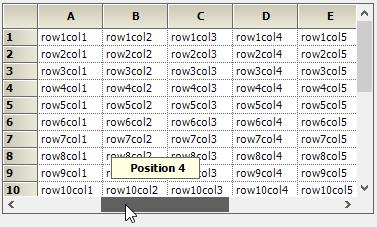
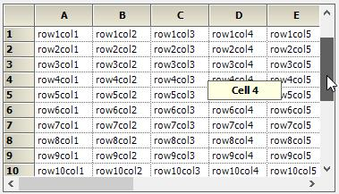
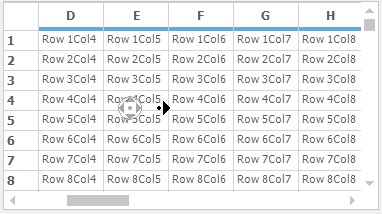
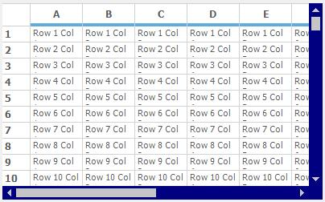

# Scrolling in Windows Forms Grid Control
GridControl has provide the built in support for scrolling. This section will explain about types of scrolling and different types of scrollbars available for GridControl.

## Enable Auto Scrolling 
The auto scrolling can be enabled or disabled for both horizontal and vertical scrollbars by setting the [AutoScrolling](https://help.syncfusion.com/cr/windowsforms/Syncfusion.Windows.Forms.ScrollControl.html#Syncfusion_Windows_Forms_ScrollControl_AutoScrolling) property to `ScrollBars.Both`. This can also enabled separately for horizontal and vertical scrollbars.


//Enables AutoScrolling.
this.gridControl1.AutoScrolling = ScrollBars.Both;


'Enables AutoScrolling.
Me.gridControl1.AutoScrolling = ScrollBars.Both



## Pixel scrolling 
By default the grid will scroll to the next cell position. So that the grid can perform the scrolling based on the index of the cells. The Pixel scrolling is used to scroll the contents of the grid pixel by pixel. 


//Enable Pixel Scrolling
this.gridControl1.VScrollPixel = true;
this.gridControl1.HScrollPixel = true;


'Enable Pixel Scrolling
Me.gridControl1.VScrollPixel = True
Me.gridControl1.HScrollPixel = True



N> In normal scrolling, the hidden rows and columns are considered as existing rows and columns. So that it will takes a long time to scroll the multiple hidden rows/column. Whereas the pixel scrolling will excludes the hidden rows and columns while scrolling the grid and also improve the performance.

### Optimized Pixel Scrolling
The pixel scrolling is not optimized for large row scenarios. To optimize the pixel scrolling set create the derived GridControl and override a couple of virtual methods to make it perform well. Also use the binary tree structures to quickly get the row index for an absolute pixel position and vice versa.

1. The following methods are need to be override in the derived GridControl for Optimized Vertical scrolling,

* [RowIndexToVScrollPixelPos](https://help.syncfusion.com/cr/windowsforms/Syncfusion.Windows.Forms.Grid.Grouping.GridTableControl.html#Syncfusion_Windows_Forms_Grid_Grouping_GridTableControl_RowIndexToVScrollPixelPos_System_Int32_)(int rowIndex)
* [VScrollPixelPosToRowIndex](https://help.syncfusion.com/cr/windowsforms/Syncfusion.Windows.Forms.Grid.Grouping.GridTableControl.html#Syncfusion_Windows_Forms_Grid_Grouping_GridTableControl_VScrollPixelPosToRowIndex_System_Int32_System_Int32__System_Int32__)(int pixelPos, out int rowIndex, out int pixelDelta)
* [GetVScrollPixelHeight](https://help.syncfusion.com/cr/windowsforms/Syncfusion.Windows.Forms.Grid.Grouping.GridTableControl.html#Syncfusion_Windows_Forms_Grid_Grouping_GridTableControl_GetVScrollPixelHeight)()



public class DerivedGridControl : GridControl
{
 
//Gets the Scroll Position for the pixel scrolling of a row. 
    public override int RowIndexToVScrollPixelPos(int rowIndex)
    {

//Takes separate height for column headers into account. 
        rowIndex = Math.Min(rowIndex, Model.RowCount);
        if (rowIndex > 0) return (rowIndex - 1) * Model.Rows.DefaultSize + Model.RowHeights[0];
        else
            return Model.RowHeights[0];
    }

//Gets the value for the vertical pixel Position. 
    public override int GetVScrollPixelHeight()
    {

//Checks the number of rows in the Grid.
        if (Model.RowCount == 0) return 0;

//Returns the vertical pixel Position. 
        return (Model.RowCount - 1) * Model.Rows.DefaultSize + Model.RowHeights[0];
    }

//Gets the row and pixel Delta to the scroll position of the row for the specified scroll position. 
    public override void VScrollPixelPosToRowIndex(int pixelPos, out int rowIndex, out int pixelDelta)
    {
        if (pixelPos < pixelPos - Model.RowHeights[0])
        {
            rowIndex = 0; pixelDelta = pixelPos;
        }
        rowIndex = (pixelPos - Model.RowHeights[0]) / Model.Rows.DefaultSize + 1; pixelDelta = (pixelPos - Model.RowHeights[0]) % Model.Rows.DefaultSize;
    }
}


Public Class DerivedGridControl
	Inherits GridControl

'Gets the Scroll Position for the pixel scrolling of a row. 
	Public Overrides Function RowIndexToVScrollPixelPos(ByVal rowIndex As Integer) As Integer

'Takes separate height for column headers into account. 
		rowIndex = Math.Min(rowIndex, Model.RowCount)
		If rowIndex > 0 Then
			Return (rowIndex - 1) * Model.Rows.DefaultSize + Model.RowHeights(0)
		Else
			Return Model.RowHeights(0)
		End If
	End Function

'Gets the value for the vertical pixel Position. 
	Public Overrides Function GetVScrollPixelHeight() As Integer

'Checks the number of rows in the Grid.
		If Model.RowCount = 0 Then
			Return 0
		End If

'Returns the vertical pixel Position. 
		Return (Model.RowCount - 1) * Model.Rows.DefaultSize + Model.RowHeights(0)
	End Function

'Gets the row and pixel Delta to the scroll position of the row for the specified scroll position. 
	Public Overrides Sub VScrollPixelPosToRowIndex(ByVal pixelPos As Integer, <System.Runtime.InteropServices.Out()> ByRef rowIndex As Integer, <System.Runtime.InteropServices.Out()> ByRef pixelDelta As Integer)
		If pixelPos < pixelPos - Model.RowHeights(0) Then
			rowIndex = 0
			pixelDelta = pixelPos
		End If
		rowIndex = (pixelPos - Model.RowHeights(0)) / Model.Rows.DefaultSize + 1
		pixelDelta = (pixelPos - Model.RowHeights(0)) Mod Model.Rows.DefaultSize
	End Sub
End Class



2. Assign the New custom control to the GridControl.
​


//Sets the derived GridControl to the grid.
this.gridControl1 = new VerticalScrollOptimization.DerivedGridControl();


'Sets the derived GridControl to the grid.
Me.gridControl1 = New VerticalScrollOptimization.DerivedGridControl()



{{ codesnippet1 | OrderList_Indent_Level_1 }}

3. Set the `VScrollPixel` property to true.
​


//Enables pixel scrolling.
this.gridControl1.VScrollPixel = true;


'Enables pixel scrolling.
Me.gridControl1.VScrollPixel = True



{{ codesnippet2 | OrderList_Indent_Level_1 }}

## Scrolling Options
This topic will discuss about the properties and methods available for scrolling in GridControl. 

### Setting the Visibility of Scrollbars
The visibility of the vertical and horizontal scrollbars of the grid can be get/set by using the [VScroll](https://help.syncfusion.com/cr/windowsforms/Syncfusion.Windows.Forms.Grid.GridControlBase.html#Syncfusion_Windows_Forms_Grid_GridControlBase_VScroll) and [HScroll](https://help.syncfusion.com/cr/windowsforms/Syncfusion.Windows.Forms.Grid.GridControlBase.html#Syncfusion_Windows_Forms_Grid_GridControlBase_HScroll) properties. It will return `true` while displaying the scrollbars otherwise return false.


//Get the visibility of the Horizontal and vertical scrollbars
bool hasVScroll = this.gridControl1.VScroll;
bool hasHScroll = this.gridControl1.HScroll;


'Get the visibility of the Horizontal and vertical scrollbars
Dim hasVScroll As Boolean = Me.gridControl1.VScroll
Dim hasHScroll As Boolean = Me.gridControl1.HScroll



### Enable Real Time Scrolling
The grid can be scroll to the horizontal and vertical direction by tracking the thumbs of the scrollbar. The grid will scroll the grid contents when leaving the thumb track. To update the contents of the grid when tracking the thumbs, set the [VerticalThumbTrack](https://help.syncfusion.com/cr/windowsforms/Syncfusion.Windows.Forms.Grid.GridControl.html#Syncfusion_Windows_Forms_Grid_GridControl_VerticalThumbTrack) and [HorizontalThumbTrack](https://help.syncfusion.com/cr/windowsforms/Syncfusion.Windows.Forms.Grid.GridControl.html#Syncfusion_Windows_Forms_Grid_GridControl_HorizontalThumbTrack) value as `true`.


//Used to repaint the grid while scrolling the thumb track
this.gridControl1.VerticalThumbTrack = true;
this.gridControl1.HorizontalThumbTrack = true;


'Used to repaint the grid while scrolling the thumb track
Me.gridControl1.VerticalThumbTrack = True
Me.gridControl1.HorizontalThumbTrack = True



N> The Metro scrollbars have the real time scrolling as default behavior.

### Scroll and View a Specific Cell 
To scroll the contents of the grid to the particular cell, use the [ScrollCellInView](https://help.syncfusion.com/cr/windowsforms/Syncfusion.Windows.Forms.Grid.GridModel.html#Syncfusion_Windows_Forms_Grid_GridModel_ScrollCellInView_Syncfusion_Windows_Forms_Grid_GridRangeInfo_Syncfusion_Windows_Forms_Grid_GridScrollCurrentCellReason_) method. This method is used to get the given cell or range of cells into the view.


int rowIndex = 15;
int colIndex = 4;

//Scroll the cell in view
this.gridControl1.ScrollCellInView(rowIndex, colIndex);

//Move the current cell into the specific index
this.gridControl1.ScrollCellInView(rowIndex, colIndex, GridScrollCurrentCellReason.MoveTo);


Dim rowIndex As Integer = 15
Dim colIndex As Integer = 4

'Scroll the cell in view
Me.gridControl1.ScrollCellInView(rowIndex, colIndex)

'Move the current cell into the specific index
Me.gridControl1.ScrollCellInView(rowIndex, colIndex, GridScrollCurrentCellReason.MoveTo)


It can be used to scrolling the grid to the top of the given range as of follows,


GridRangeInfo range = GridRangeInfo.Row(14);
//Scroll the content of the grid using the 14th row
this.gridControl1.ScrollCellInView(range);


Dim range As GridRangeInfo = GridRangeInfo.Row(14)
'Scroll the content of the grid using the 14th row
Me.gridControl1.ScrollCellInView(range)



## Displaying Scroll Tips
The scroll tips can be displayed while dragging a horizontal/vertical scroll bar thumb by setting the [HorizontalScrollTips](https://help.syncfusion.com/cr/windowsforms/Syncfusion.Windows.Forms.Grid.GridControl.html#Syncfusion_Windows_Forms_Grid_GridControl_HorizontalScrollTips)/[VerticalScrollTips](https://help.syncfusion.com/cr/windowsforms/Syncfusion.Windows.Forms.Grid.GridControl.html#Syncfusion_Windows_Forms_Grid_GridControl_VerticalScrollTips) property to `true`. The default value is set to *false*.


// Display the horizontal and Vertical Scroll tips
this.gridControl1.HorizontalScrollTips = true;
this.gridControl1.VerticalScrollTips = true;


' Display the horizontal and Vertical Scroll tips
Me.gridControl1.HorizontalScrollTips = True
Me.gridControl1.VerticalScrollTips = True



The scroll tips text can be changed by setting the [ScrollTipFormat](https://help.syncfusion.com/cr/windowsforms/Syncfusion.Windows.Forms.ScrollControl.html#Syncfusion_Windows_Forms_ScrollControl_ScrollTipFormat) property value as of follows,


//Sets the text to be displayed in the ScrollTip window with a place holder for scroll position.
this.gridControl1.ScrollTipFormat = "Cell {0}";


'Sets the text to be displayed in the ScrollTip window with a place holder for scroll position.
Me.gridControl1.ScrollTipFormat = "Cell {0}"



### Setting Scroll Behavior for Frozen Cells
The scrolling behavior of the current cell moves within the frozen range using the arrow keys can be set by enabling the [ScrollFrozen](https://help.syncfusion.com/cr/windowsforms/Syncfusion.Windows.Forms.Grid.GridModelOptions.html#Syncfusion_Windows_Forms_Grid_GridModelOptions_ScrollFrozen) property. The default value is set to `true`.


//Defines scroll behavior in frozen cells.
this.gridControl1.ScrollFrozen = true;


'Defines scroll behavior in frozen cells.
Me.gridControl1.ScrollFrozen = True



### Scroll Current Cell into View when its Activated
The current cell can be scrolled to the view when it is activated by setting the [AllowScrollCurrentCellInView](https://help.syncfusion.com/cr/windowsforms/Syncfusion.Windows.Forms.Grid.GridControl.html#Syncfusion_Windows_Forms_Grid_GridControl_AllowScrollCurrentCellInView) property to desired [GridScrollCurrentCellReason](http://help.syncfusion.com/cr/windowsforms/Syncfusion.Windows.Forms.Grid.GridScrollCurrentCellReason.html) enumeration.


//Get the current cell scroll into the view when its activated
this.gridControl1.AllowScrollCurrentCellInView = GridScrollCurrentCellReason.Activate;


'Get the current cell scroll into the view when its activated
Me.gridControl1.AllowScrollCurrentCellInView = GridScrollCurrentCellReason.Activate



### Getting the First Row Index of the View Layout
The first row index of the view layout can be get by using the [TopRowIndex](https://help.syncfusion.com/cr/windowsforms/Syncfusion.Windows.Forms.Grid.GridControlBase.html#Syncfusion_Windows_Forms_Grid_GridControlBase_TopRowIndex) property. It will be varied while scrolling the grid. At any time this will return the first row index of the view layout. Similarly, the top row index can be changed or scrolled into view by setting `TopRowIndex` property.


//Used to scroll the given row index to the top of the Grid
this.gridControl1.TopRowIndex = 3;


'Used to scroll the given row index to the top of the Grid
Me.gridControl1.TopRowIndex = 3



## Intelligence Mouse Scrolling 
The contents of the grid can be automatically scrolled by setting the [EnableIntelliMouse](https://help.syncfusion.com/cr/windowsforms/Syncfusion.Windows.Forms.ISupportIntelliMouse.html#Syncfusion_Windows_Forms_ISupportIntelliMouse_EnableIntelliMouse) property to `true`. 


//Enable intelligent Mouse scroll
this.gridControl1.EnableIntelliMouse = true;


'Enable intelligent Mouse scroll
Me.gridControl1.EnableIntelliMouse = True



## Hidden Row or Column Scrolling
The scrolling logic for hidden rows and columns can be applied to the GridControl by enabling [UseOldHiddenScrollLogic](https://help.syncfusion.com/cr/windowsforms/Syncfusion.Windows.Forms.Grid.GridControlBase.html#Syncfusion_Windows_Forms_Grid_GridControlBase_UseOldHiddenScrollLogic) property.This is a static property, it must be assigned before the ` `InitializeComponent` method.

By default the thumbs are used the visible row and column index to update the positions on the Scrollbars. The [UseOldHiddenScrollLogic](https://help.syncfusion.com/cr/windowsforms/Syncfusion.Windows.Forms.Grid.GridControlBase.html#Syncfusion_Windows_Forms_Grid_GridControlBase_UseOldHiddenScrollLogic) property is used to avoid the unwanted space leave for the Hidden Row/Column headers.


//Enable Hidden scroll logic
GridControlBase.UseOldHiddenScrollLogic = true;
InitializeComponent();


'Enable Hidden scroll logic
GridControlBase.UseOldHiddenScrollLogic = True
InitializeComponent()



N> Consider the case “The grid have 1000 number of rows and the rows in between 5 and 990 are gets hidden”. In this case the thumb size of the vertical scrollbar is set based on the overall row count of the grid. By enabling the [UseOldHiddenScrollLogic](https://help.syncfusion.com/cr/windowsforms/Syncfusion.Windows.Forms.Grid.GridControlBase.html#Syncfusion_Windows_Forms_Grid_GridControlBase_UseOldHiddenScrollLogic) static property, the hidden columns is not taken to the account for scrolling. Therefore the scrollbar thumb will draw based only on the visible rows.

The following screenshot shows the grid with applied hidden scroll logic,

Vertical scrollbar thumb size changed according to the overall row count without using the hidden scroll logic is shows as follows,

N> The same behavior of the hidden scroll logic can be achieved by enabling the pixel scrolling.

## Scrollbars
The columns and rows of the GridControl can be scrolled horizontally and vertically using built-in scrollbars. The appearance of the scrollbar can be applied using GridOfficeScrollbars property. The default scrollbar is `OfficeScrollBars.None`. The following are the different styles of scrollbars available for GridControl,

* Metro
* Office2007
* Office2010
* None



//Set Office Scrollbars to the Grid control
this.gridControl1.GridOfficeScrollBars = Syncfusion.Windows.Forms.OfficeScrollBars.Metro;


'Set Office Scrollbars to the Grid control
Me.gridControl1.GridOfficeScrollBars = Syncfusion.Windows.Forms.OfficeScrollBars.Metro



### Setting the Color Scheme for Office Scrollbars 
The themes can be applied for the office scrollbars by setting the appropriate color scheme. Following are the color schemes available for the GridControl.

[Office2007ScrollBarsColorScheme](https://help.syncfusion.com/cr/windowsforms/Syncfusion.Windows.Forms.Grid.GridModelOptions.html#Syncfusion_Windows_Forms_Grid_GridModelOptions_Office2007ScrollBarsColorScheme) – Used to apply the color scheme for Office 2007 Scrollbars
[Office2010ScrollBarsColorScheme](https://help.syncfusion.com/cr/windowsforms/Syncfusion.Windows.Forms.Grid.GridControlBase.html#Syncfusion_Windows_Forms_Grid_GridControlBase_Office2010ScrollBarsColorScheme) – Used to apply color scheme for Office 2010 scrollbars



//Set the color scheme
this.gridControl1.Office2007ScrollBarsColorScheme = Syncfusion.Windows.Forms.Office2007ColorScheme.Black;


'Set the color scheme
Me.gridControl1.Office2007ScrollBarsColorScheme = Syncfusion.Windows.Forms.Office2007ColorScheme.Black



N> There is no color scheme available for metro theme.

### Scrollbar Context Menu
Scrollbars have the default context menu strip for setting the scrolling options. It will popup when right click on the scrollbar. The grid will scroll the contents based on the options selected in the context menu.

### Disabling the Scrollbar Context Menu
The scrollbar context menu can be disabled by handling the [ShowContextMenu](https://help.syncfusion.com/cr/windowsforms/Syncfusion.Windows.Forms.ScrollControl.html) event of the GridControl as follows,


this.gridControl1.ShowContextMenu += new Syncfusion.Windows.Forms.ShowContextMenuEventHandler(gridControl1_ShowContextMenu);
void gridControl1_ShowContextMenu(object sender, Syncfusion.Windows.Forms.ShowContextMenuEventArgs e)
{
    Point pt = this.gridControl1.GridPointToClient(e.Point);

//Check for clicking in the region of Vertical and Horizontal scrollbar 
    if (this.gridControl1.ClientRectangle.Width < pt.X  || this.gridControl1.ClientRectangle.Height < pt.Y)
    {

//context menu has been handled
        e.Cancel = true;
    }
}


AddHandler gridControl1.ShowContextMenu, AddressOf gridControl1_ShowContextMenu
Private Sub gridControl1_ShowContextMenu(ByVal sender As Object, ByVal e As Syncfusion.Windows.Forms.ShowContextMenuEventArgs)
	Dim pt As Point = Me.gridControl1.GridPointToClient(e.Point)

'Check for clicking in the region of Vertical and Horizontal scrollbar 
	If Me.gridControl1.ClientRectangle.Width < pt.X OrElse Me.gridControl1.ClientRectangle.Height < pt.Y Then

'context menu has been handled
		e.Cancel = True
	End If
End Sub



N>The context menu of the overall grid can be disabled by setting the e.Cancel as `true` in the [ShowContextMenu](https://help.syncfusion.com/cr/windowsforms/Syncfusion.Windows.Forms.ScrollControl.html) event.

## Shared Scrollbars 
The GridControl can share the scroll bars with other controls by setting the [HScrollBehavior](https://help.syncfusion.com/cr/windowsforms/Syncfusion.Windows.Forms.Grid.GridControlBase.html#Syncfusion_Windows_Forms_Grid_GridControlBase_HScrollBehavior) and [VScrollBehavior](https://help.syncfusion.com/cr/windowsforms/Syncfusion.Windows.Forms.Grid.GridControlBase.html#Syncfusion_Windows_Forms_Grid_GridControlBase_VScrollBehavior)  property value as `GridScrollbarMode.Shared`. This can be used to synchronize the scrolling of multiple grids. 


//Set the shared scrollbar mode 
this.gridControl1.HScrollBehavior = GridScrollbarMode.Shared;
this.gridControl1.VScrollBehavior = GridScrollbarMode.Shared;

//Enable the Shared Scrollbars
this.gridControl1.UseSharedScrollBars = true;

//Set the inner scrollbar which is shared to the grid this.gridControl1.HScrollBar.InnerScrollBar = hScrollBar1;
this.gridControl1.VScrollBar.InnerScrollBar = vScrollBar1;


'Set the shared scrollbar mode 
Me.gridControl1.HScrollBehavior = GridScrollbarMode.Shared
Me.gridControl1.VScrollBehavior = GridScrollbarMode.Shared

'Enable the Shared Scrollbars
Me.gridControl1.UseSharedScrollBars = True

'Set the inner scrollbar which is shared to the grid this.gridControl1.HScrollBar.InnerScrollBar = hScrollBar1;
Me.gridControl1.VScrollBar.InnerScrollBar = vScrollBar1




### Indicating the Last Row/Column while Scrolling
To notify the last row/column reached while scrolling the grid, invoke the [Scroll](https://help.syncfusion.com/cr/windowsforms/Syncfusion.Windows.Forms.ScrollBarWrapper.html) event of the scroll bars as of follows, 


//Used to get the scroll index
this.gridControl1.VScrollBar.Scroll += VScrollBar_Scroll;

private int lastValue = -1;
void VScrollBar_Scroll(object sender, ScrollEventArgs e)
{
    if (lastValue == e.NewValue && Control.MouseButtons == MouseButtons.Left)
    {
        Console.WriteLine("No Move...");
    }
    lastValue = e.NewValue;
}


'Used to get the scroll index
Private Me.gridControl1.VScrollBar.Scroll += AddressOf VScrollBar_Scroll

Private lastValue As Integer = -1
Private Sub VScrollBar_Scroll(ByVal sender As Object, ByVal e As ScrollEventArgs)
	If lastValue = e.NewValue AndAlso Control.MouseButtons = MouseButtons.Left Then
		Console.WriteLine("No Move...")
	End If
	lastValue = e.NewValue
End Sub



## Scrolling Events
This section will explain about the events used for the scrolling in GridControl.

### Disable the Pixel Scrolling using Events
The pixel scrolling of the GridControl can be restricted by handling the [HScrollPixelPosChanging](https://help.syncfusion.com/cr/windowsforms/Syncfusion.Windows.Forms.Grid.GridControlBase.html) and [VScrollPixelPosChanging](https://help.syncfusion.com/cr/windowsforms/Syncfusion.Windows.Forms.Grid.GridControlBase.html) events. This events will be raised while scrolling the grid through the scrollbar when[pixel scrolling](#_Pixel_scrolling "") is enabled. 


this.gridControl1.HScrollPixelPosChanging += new GridScrollPositionChangingEventHandler(gridControl1_HScrollPixelPosChanging);
this.gridControl1.VScrollPixelPosChanging += new GridScrollPositionChangingEventHandler(gridControl1_VScrollPixelPosChanging);
void gridControl1_HScrollPixelPosChanging(object sender, GridScrollPositionChangingEventArgs e)
{
    MessageBox.Show(e.ScrollPosition.ToString());

//Cancel the Horizontal Pixel scrolling of grid through the thumb track
    e.Cancel = true;
}
void gridControl1_VScrollPixelPosChanging(object sender, GridScrollPositionChangingEventArgs e)
{
    MessageBox.Show(e.ScrollPosition.ToString());

//Cancel the Vertical Pixel scrolling of the grid through the thumb track
    e.Cancel = true;
}


AddHandler gridControl1.HScrollPixelPosChanging, AddressOf gridControl1_HScrollPixelPosChanging
AddHandler gridControl1.VScrollPixelPosChanging, AddressOf gridControl1_VScrollPixelPosChanging
Private Sub gridControl1_HScrollPixelPosChanging(ByVal sender As Object, ByVal e As GridScrollPositionChangingEventArgs)
	MessageBox.Show(e.ScrollPosition.ToString())

'Cancel the Horizontal Pixel scrolling of grid through the thumb track
	e.Cancel = True
End Sub
Private Sub gridControl1_VScrollPixelPosChanging(ByVal sender As Object, ByVal e As GridScrollPositionChangingEventArgs)
	MessageBox.Show(e.ScrollPosition.ToString())

'Cancel the Vertical Pixel scrolling of the grid through the thumb track
	e.Cancel = True
End Sub


Once the pixel scrolling is done on the grid, it can be notified by invoking the [HScrollPixelPosChanged](https://help.syncfusion.com/cr/windowsforms/Syncfusion.Windows.Forms.Grid.GridControlBase.html) and [VScrollPixelPosChanged](https://help.syncfusion.com/cr/windowsforms/Syncfusion.Windows.Forms.Grid.GridControlBase.html) events.



//To notify the Horizontal and vertical pixel scrolling 
this.gridControl1.HScrollPixelPosChanged += new GridScrollPositionChangedEventHandler(gridControl1_HScrollPixelPosChanged);
this.gridControl1.VScrollPixelPosChanged += new GridScrollPositionChangedEventHandler(gridControl1_VScrollPixelPosChanged);
void gridControl1_HScrollPixelPosChanged(object sender, GridScrollPositionChangedEventArgs e)
{
    MessageBox.Show("Horizontal scrollbar pixel position is changed");
}
void gridControl1_VScrollPixelPosChanged(object sender, GridScrollPositionChangedEventArgs e)
{
    MessageBox.Show("Vertical scrollbar pixel position is changed");
}


'To notify the Horizontal and vertical pixel scrolling 
AddHandler gridControl1.HScrollPixelPosChanged, AddressOf gridControl1_HScrollPixelPosChanged
AddHandler gridControl1.VScrollPixelPosChanged, AddressOf gridControl1_VScrollPixelPosChanged
Private Sub gridControl1_HScrollPixelPosChanged(ByVal sender As Object, ByVal e As GridScrollPositionChangedEventArgs)
	MessageBox.Show("Horizontal scrollbar pixel position is changed")
End Sub
Private Sub gridControl1_VScrollPixelPosChanged(ByVal sender As Object, ByVal e As GridScrollPositionChangedEventArgs)
	MessageBox.Show("Vertical scrollbar pixel position is changed")
End Sub



### Setting the Maximum Scrolling Position through Events 
The [HorizontalScroll](https://help.syncfusion.com/cr/windowsforms/Syncfusion.Windows.Forms.ScrollControl.html) and [VerticalScroll](https://help.syncfusion.com/cr/windowsforms/Syncfusion.Windows.Forms.ScrollControl.html) events will be raised when the scrollbar position is changed. By using this event, user can restrict the maximum scrolling position of the scrollbar.


this.gridControl1.HorizontalScroll += new ScrollEventHandler(gridControl1_HorizontalScroll);
void gridControl1_HorizontalScroll(object sender, ScrollEventArgs e)
{
    if(e.NewValue > 230)
    {

//Set the maximum scroll position
        e.NewValue = 230;
    }            
}


Private Me.gridControl1.HorizontalScroll += New ScrollEventHandler(AddressOf gridControl1_HorizontalScroll)
Private Sub gridControl1_HorizontalScroll(ByVal sender As Object, ByVal e As ScrollEventArgs)
	If e.NewValue > 230 Then

'Set the maximum scroll position
		e.NewValue = 230
	End If
End Sub



## Custom Scrollbar
For customizing the appearance of the Scrollbars, need to add the [ScrollersFrame](http://help.syncfusion.com/cr/windowsforms/Syncfusion.Windows.Forms.ScrollersFrame.html) control into the grid. It can be drag and drop to the application from the Toolbox window.


//Attach the scroll Frame to the Grid control
this.scrollersFrame1.AttachedTo = this.gridControl1;


'Attach the scroll Frame to the Grid control
Me.scrollersFrame1.AttachedTo = Me.gridControl1



The [ScrollersFrame](http://help.syncfusion.com/cr/windowsforms/Syncfusion.Windows.Forms.ScrollersFrame.html) can be applied with the different visual styles as of follows,

* Office2007
* Office2010
* WindowsXP
* Classic
* Office2007Generic
* Metro



// Custom visual styles available for ScrollersFrame
this.scrollersFrame1.VisualStyle = Syncfusion.Windows.Forms.ScrollBarCustomDrawStyles.Office2007;


' Custom visual styles available for ScrollersFrame
Me.scrollersFrame1.VisualStyle = Syncfusion.Windows.Forms.ScrollBarCustomDrawStyles.Office2007



### Changing the Back Color for the Metro Scrollbars 
The back color of the metro scrollbars can be customized to the desired color by using [ScrollerBackground](https://help.syncfusion.com/cr/windowsforms/Syncfusion.Windows.Forms.MetroColorTable.html#Syncfusion_Windows_Forms_MetroColorTable_ScrollerBackground) property of the `MetroColorTable`.


//Set the color for scroll bar for metro visual style

this.gridControl1.GridOfficeScrollBars = Syncfusion.Windows.Forms.OfficeScrollBars.Metro;
this.gridControl1.MetroColorTable.ScrollerBackground = Color.Navy;


'Set the color for scroll bar for metro visual style

Me.gridControl1.GridOfficeScrollBars = Syncfusion.Windows.Forms.OfficeScrollBars.Metro
Me.gridControl1.MetroColorTable.ScrollerBackground = Color.Navy



