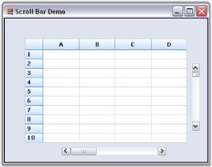
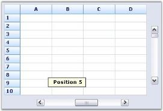
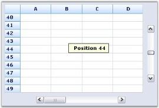

# Grid Properties

Essential Grid provides support to customize the appearance and behavior of grid cells. This section would provide you more insight on the properties affecting Appearance, Print Styles, and Scroll Bar Settings available. It includes the following topics.

Appearance Properties

The properties that majorly affect the appearance cells and data in cells of a grid can be named as Appearance properties.

The following properties are used to customize the appearance of Grid.

* TransparentBackground - Specifies whether to display grid with background image. When this property is set to false, the background image will not be displayed even if it is set by using BackgroundImage property.

The following code examples can be used to set this property:



//Enables TransparentBackground property.

this.gridControl1.TransparentBackground = true;





'Enables TransparentBackground property.

Me.gridControl1.TransparentBackground = True


The following illustration shows how the Grid in "Figure 1" is transformed when the TransparentBackground property is set to true.

* DisplayHorzLines - Specifies whether horizontal grid lines marking the cells are to be displayed. Default value is set to _true_.

The following code examples can be used to set this property:



//Enables DisplayHorzLines property.

this.gridControl1.Properties.DisplayHorzLines = false;





'Enables DisplayHorzLines property.

Me.gridControl1.Properties.DisplayHorzLines = False


The following illustration shows how the Grid in "Figure 1" is transformed when the Properties.DisplayHorzLines property is set to false.

* DisplayVertLines-Specifies whether vertical grid lines marking the cells are to be displayed. Default value is set to _true_.

The following code examples can be used to set this property:



//Enables DisplayVertLines property.

this.gridControl1.Properties.DisplayVertLines = false;




'Enables DisplayVertLines property.

Me.gridControl1.Properties.DisplayVertLines = False



The following illustration shows how the Grid in "Figure 1" is transformed when the Properties.DisplayVertLines property is set to false.

* ColHeaders-Specifies whether column headers are to be displayed. Default value is set to _true_.

The following code examples can be used to set this property:



//Hides the column headers.

this.gridControl1.Properties.ColHeaders = false;





'Hides the column headers.

Me.gridControl1.Properties.ColHeaders = False



The following illustration shows how the Grid in "Figure 1" is transformed when Properties.ColHeaders property is set to false.

* RowHeaders - Specifies whether row headers are to be displayed. Default value is set to _true_.

The following code examples can be used to set this property:



//Hides the row headers.

this.gridControl1.Properties.RowHeaders = false;





'Hides the row headers.

Me.gridControl1.Properties.RowHeaders = False


The following illustration shows how the Grid in "Figure 1" is transformed when the Properties.RowHeaders property is set to false.

* Buttons3D - Specifies if the row and column headers should have a three dimensional look, which in turn makes headers visually appealing. If this property is set to false, the row and column headers will appear flat. Default value is set to _true_.

The following code examples can be used to set this property:



//Enables Buttons3D property.

this.gridControl1.Properties.Buttons3D = false;





'Enables Buttons3D property.

Me.gridControl1.Properties.Buttons3D = False


The following illustration shows how the Grid in "Figure 1" is transformed when Properties.Buttons3D property is set to false.

* GridLineColor - Specifies the color for the grid lines (for example, active border). Default value is set to _GrayText_.

The following code examples can be used to set this property:



//Specifiesthe color for the grid lines.

this.gridControl1.Properties.GridLineColor = System.Drawing.Color.IndianRed;





'Specifies the color for the grid lines.

Me.gridControl1.Properties.GridLineColor = System.Drawing.Color.IndianRed



The following illustration shows how the Grid in "Figure 1" is transformed when the Properties.GridLineColor property is set to IndianRed.

* BackgroundImage - Enables background image to be inserted for the grid.

The following code examples can be used to set this property:



// Specifies the background image.

this.gridControl1.BackgroundImage = Image.FromFile(FindImageFile(@"..\..\..\..pic.jpg"));





'Specifies the background image.

Me.gridControl1.BackgroundImage = Image.FromFile(FindImageFile("..\..\..\..pic.jpg"))


The following illustration shows how the Grid in "Figure 1" is transformed when the BackgroundImage property is set.

* TextColor-Specifies the color of the text in the grid.

The following code examples can be used to set this property:



//Sets grid text color.

this.gridControl1.TableStyle.TextColor = Color.MidnightBlue;




'Sets grid text color.

Me.gridControl1.TableStyle.TextColor = Color.MidnightBlue



The following illustration shows how the Grid in "Figure 1" is transformed when TableStyle.TextColor property is set to MidnightBlue.

* BackColor-Specifies the color of the grid line marker when the user resizes rows or columns by dragging row or column headers. Default value is set to _Red_.

The following code examples can be used to set this property:



//Sets the grid background color.

this.gridControl1.BackColor = Color.Beige;





'Sets the grid background color.

Me.gridControl1.BackColor = Color.Beige


The following illustration shows how the Grid in "Figure 1" is transformed when the BackColor property is set to Beige.

* ResizingCellsLinesColor - Specifies the color for the grid lines (for example, active border). Default value is set to _GrayText_.

The following code examples can be used to set this property:



//Specifies the color for the grid line marker while resizing rows and columns.

this.gridControl1.Properties.ResizingCellsLinesColor = Color.PaleVioletRed;





'Specifies the color for the grid line marker while resizing rows and columns.

Me.gridControl1.Properties.ResizingCellsLinesColor = Color.PaleVioletRed



* Borders - Specifies settings for Top, Left, Bottom, and Right borders.

The following code examples can be used to set this property:



//Sets border settings for the grid.

this.gridControl1.TableStyle.Borders.All = new GridBorder(GridBorderStyle.Solid, Color.SteelBlue);




'Sets border settings for the grid.

Me.gridControl1.TableStyle.Borders.All = New GridBorder(GridBorderStyle.Solid, Color.SteelBlue)



* FixedLinesColor - Specifies the color of frozen grid lines (for example, row or column headers). Default value is set to _ActiveCaption_.

The following code examples can be used to set this property:

 

//Sets the color of frozen grid lines.

this.gridControl1.Properties.FixedLinesColor = Color.YellowGreen;





'Sets the color of frozen grid lines.

Me.gridControl1.Properties.FixedLinesColor = Color.YellowGreen


A sample demonstrating these properties is available under the following sample installation path.

<Install Location>\Syncfusion\EssentialStudio\[Version Number]\Windows\Grid.Windows\Samples\Appearance\Properties Demo

Print Properties

   The following properties are associated with printing in Grid. They are generally referred to as Print Styles.

* BlackWhite - Specifies if the grid should be printed only in black and white.

The following code examples illustrate how to set this property:



//Specifies if the grid should print only in black and white.

this.gridControl1.Properties.BlackWhite = true;


 

'Specifies if the grid should print only in black and white.

Me.gridControl1.Properties.BlackWhite = True


* Printing - Prints the grid.

The following code examples illustrate how to set this property:



//Prints the grid.

this.gridControl1.Properties.Printing = true;




'Prints the grid.

Me.gridControl1.Properties.Printing = True


* PrintFrame - Specifies the appearance of a frame around the grid while printing.

The following code examples illustrate how to set this property:



//Specifies if a frame should be drawn around the grid while printing.

this.gridControl1.Properties.PrintFrame = true;





' Specifies if a frame should be drawn around the grid while printing.

Me.gridControl1.Properties.PrintFrame = True



* PrintColHeader - Specifies if column headers should be printed.

The following code examples illustrate how to set this property:



// Specify if column headers should be printed.

this.gridControl1.Properties.PrintColHeader = true;


 

'Specifies if column headers should be printed.

Me.gridControl1.Properties.PrintColHeader = True



* PrintRowHeader - Specifies if row headers should be printed.

 The following code example illustrates how to set this property:



//Specifies if row headers should be printed.

this.gridControl1.Properties.PrintRowHeader = true;





'Specifies if row headers should be printed.

Me.gridControl1.Properties.PrintRowHeader = True



* CenterVertical - Specifies if the grid should be centered vertically on printing.

The following code examples illustrate how to set this property:

 

//Specifies if the grid should be centered vertically on printing.

this.gridControl1.Properties.CenterVertical = true;





'Specifies if the grid should be centered vertically on printing.

Me.gridControl1.Properties.CenterVertical = True



* PrintHorzLines - Specifies if horizontal lines of the grid should be printed.

The following code example illustrates how to set this property:

 

//Specifies if horizontal lines of the grid should be printed.

this.gridControl1.Properties.PrintHorzLines = true;





'Specifies if horizontal lines of the grid should be printed.

Me.gridControl1.Properties.PrintHorzLines = True



* PrintVertLines - Specifies if vertical lines of the grid should be printed.

The following code example illustrates how to set this property:

 

//Specifies if vertical lines of the grid should be printed.

this.gridControl1.Properties.PrintVertLines = true;




'Specifies if vertical lines of the grid should be printed.

Me.gridControl1.Properties.PrintVertLines = True


* CenterHorizontal - Specifies if a grid should be centered horizontally while printing.

The following code example illustrates how to set this property in Grid control. 



//Specifies if the grid should be centered horizontally while printing.

this.gridControl1.Properties.CenterHorizontal = true;




'Specifies if the grid should be centered horizontally while printing.

Me.gridControl1.Model.Properties.CenterHorizontal = False


A sample demonstrating these properties is available under the following sample installation path.

<Install Location>\Syncfusion\EssentialStudio\[Version Number]\Windows\Grid.Windows\Samples\Printing\Print Grid Demo

Scroll Bar Properties

Essential Grid provides support to control functionalities and appearance of the grid scroll bars.

The following properties are associated with scrolling in grid.

* HscrollPixel - Specifies whether to enable or disable horizontal pixel scrolling for the grid. Default value is set to _false_.

The following code examples can be used to set this property:



//Enables horizontal pixel scrolling for the grid.

this.gridControl1.HScrollPixel = true;





'Enables horizontal pixel scrolling for the grid.

Me.gridControl1.HScrollPixel = True



* VscrollPixel - Specifies whether to enable or disable vertical pixel scrolling for the grid. Default value is set to _false_.

The following code examples can be used to set this property:

 

//Enables vertical pixel scrolling for the grid.

this.gridControl1.VScrollPixel = true;





'Enables vertical pixel scrolling for the grid.

Me.gridControl1.VScrollPixel = True


* HorizontalScrollTips - Specifies if the control should display scroll tips while the user is dragging a horizontal scroll bar thumb. Default value is set to _false_.

The following code examples can be used to set this property:

 

//Specifies whether scroll tips should be displayed while dragging the horizontal scroll bar thumb.

this.gridControl1.HorizontalScrollTips = true;





'Specifies whether scroll tips should be displayed while dragging the horizontal scroll bar thumb.

Me.gridControl1.HorizontalScrollTips = True


The following illustration shows how the Grid in "Figure 1" is transformed when thorizontalScrollTips if  property is set to true.

* VerticalScrollTips - Specifies if the control should display scroll tips while the user is dragging a vertical scroll bar thumb. Default value is set to _false_.

The following code examples can be used to set this property:

 

//Specifieswhether scroll tips should be displayed while dragging the vertical scroll bar thumb.

this.gridControl1.VerticalScrollTips = true;





'Specifies whether scroll tips should be displayed while dragging the vertical scroll bar thumb.

Me.gridControl1.VerticalScrollTips = True


The following illustration shows how the Grid in "Figure 1" is transformed when the VerticalScrollTips property is set to true.

* HscrollBehavior - Specifies the behavior of the horizontal scroll bar. GridScrollbarMode enumeration provides the following options to control the scroll bar behavior: Automatic, AutoScroll, DetectIfShared, DisableAutoScroll, Disabled, Enabled, and Shared_._

The following code example can be used to set this property:

 

//Sets the behavior of the horizontal scroll bar.

this.gridControl1.HScrollBehavior = GridScrollbarMode.Shared;




'Sets the behavior of the horizontal scroll bar.

Me.gridControl1.HScrollBehavior = GridScrollbarMode.Shared



* VScrollBehavior - Specifies the behavior of the vertical scroll bar. GridScrollbarMode enumeration provides the following options to control the scroll bar behavior: Automatic, AutoScroll, DetectIfShared, DisableAutoScroll, Disabled, Enabled, and Shared_._

The following code example can be used to set this property:



//Sets the behavior of the vertical scroll bar.

this.gridControl1.VScrollBehavior = GridScrollbarMode.Shared;





'Sets the behavior of the vertical scroll bar.

Me.gridControl1.VScrollBehavior = GridScrollbarMode.Shared



* HorizontalThumbTrack - Specifies whether the control should scroll while the user is dragging the horizontal scroll bar thumb. Default value is set to _false_.

The following code example can be used to set this property:

 

//Specifies whether the control should scroll while dragging the horizontal scroll bar thumb.

this.gridControl1.HorizontalThumbTrack = true;





'Specifies whether the control should scroll while dragging the horizontal scroll bar thumb.

Me.gridControl1.HorizontalThumbTrack = True



The following illustration shows how the Grid in "Figure 1" is transformed when the HorizontalThumbTrack property is set to true.

* VerticalThumbTrack - Specifies whether the control should scroll while the user is dragging vertical scroll bar thumb. Default value is set to _false_.

The following code examples can be used to set this property:

 

//Specifies whether the control should scroll while dragging the vertical scroll bar thumb.

this.gridControl1.VerticalThumbTrack = true;




'Specifies whether the control should scroll while dragging the vertical scroll bar thumb.

Me.gridControl1.VerticalThumbTrack = True



The following illustration shows how the Grid in "Figure 1" is transformed when the VerticalThumbTrack property is set to true.

* Office2007ScrollBars - Toggles between standard and Office 2007 scroll bars. Default value is set to _false_.

The following code examples can be used to set this property:

 

//Toggles to Office 2007 scroll bar.

this.gridControl1.Office2007ScrollBars = true;



 

'Toggles to Office 2007 scroll bar.

Me.gridControl1.Office2007ScrollBars = True



* Office2007ScrollBarsColorScheme - Specifies the style for Office 2007 scroll bars. Default value is set to _Blue_.

The following code example can be used to set this property:

 

//Sets the style for Office 2007 scroll bar.

this.gridControl1.Office2007ScrollBarsColorScheme = Office2007ColorScheme.Blue;





'Sets the style for Office 2007 scroll bar.

Me.gridControl1.Office2007ScrollBarsColorScheme = Office2007ColorScheme.Blue


* ScrollFrozen - Defines scroll behavior when user moves current cell with arrow keys into frozen cells area. Default value is set to _true_.

The following code examples can be used to set this property:

 

//Defines scroll behavior in frozen cells.

this.gridControl1.ScrollFrozen = true;





'Defines scroll behavior in frozen cells.

Me.gridControl1.ScrollFrozen = True



* ScrollTipFormat - Specifies the text to be displayed in the ScrollTip window with a place holder for scroll position.

The following code example can be used to set this property:



//Sets the text to be displayed in the ScrollTip window with a place holder for scroll position.

this.gridControl1.ScrollTipFormat = "Position {0}";





'Sets the text to be displayed in the ScrollTip window with a place holder for scroll position.

Me.gridControl1.ScrollTipFormat = "Position {0}"


* AutoScrolling - Specifies whether to enable or disable automatic scrolling.

The following code example can be used to set this property:

 

//Enables AutoScrolling.

this.gridControl1.AutoScrolling = true;



 

'Enables AutoScrolling.

Me.gridControl1.AutoScrolling = True



* Hscroll - Specifies whether to enable orv disable horizontal scroll bar.

The following code examples can be used to set this property:

 

//Enables horizontal scroll bar.

this.gridControl1.HScroll = true;





'Enables horizontal scroll bar.

Me.gridControl1.HScroll = True



* VScroll - Specifies whether to enable or disable vertical scroll bar.

The following code example can be used to set this property:

 

//Enables vertical scroll bar.

this.gridControl1.VScroll = true;





' Enables vertical scroll bar.

Me.gridControl1.VScroll = True


A sample demonstrating these properties is available under the following sample installation path.

             <Install Location>\Syncfusion\EssentialStudio\[Version Number]\Windows\Grid.Windows\Samples\Zoom and Scroll\ScrollBar Demo

