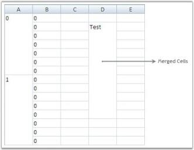

# Merge Cells Feature

Merge Cells feature merges two or more adjacent cells with the same value into one cell and displays the content in the merged cell. A single cell is created by combining two or more selected cells.

Note: The data in the merged cells will be displayed on the first cell of the merged range.

To use merge cells, you need to set Model.Options.MergeCellsMode and MergeCell properties of the cells to select the required merge behavior for cells.

1. The GridMergeCellsMode enumeration specifies behavior of the merged cells in a grid. Following is the list of options under this enumeration:
* None-

Merge cells behavior is disabled.

* OnDemandCalculation-

The number of cells to be merged are calculated before the merged cells are displayed and the results are saved. Floating cells will only be recalculated if the width or content of the cells change.

* BeforeDisplayCalculation-

The number of cells to be merged are always calculated before cells are displayed.

* MergeRowsInColumn-

Enables merging of neighboring cells among rows in the same column.

* MergeColumnsInRow-

Enables merging of neighboring cells among columns in the same row.

* SkipHiddenCells-

Skips hidden rows and columns while merging the cells. This means that the hidden rows or columns in the grid are not considered during the merge process.

2. GridMergeCellDirection enumeration specifies the merge behavior for an individual cell when merging cells feature has been enabled. Here is the list of options offered:
* None-

Merging cells is disabled.

* ColumnsInRow-

Merges with neighboring columns in the same row.

* RowsInColumn-

Merges with neighboring rows in the same column.

The following code examples illustrate how to set the MergeCellsMode and MergeCell properties.



this.gridControl1.Model.Options.MergeCellsMode = GridMergeCellsMode.OnDemandCalculation | GridMergeCellsMode.MergeRowsInColumn;

//Merges cells in column 2.

this.gridControl1.ColStyles[2].MergeCell = GridMergeCellDirection.RowsInColumn;





Me.gridControl1.Model.Options.MergeCellsMode = GridMergeCellsMode.OnDemandCalculation Or GridMergeCellsMode.MergeRowsInColumn

'Merges cells in column 2.

Me.gridControl1.ColStyles(2).MergeCell = GridMergeCellDirection.RowsInColumn


The following screen shots illustrate the merge cells feature in Essential Grid.

