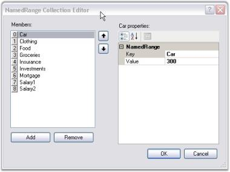

# Named Ranges

Essential Grid supports named ranges along with Grid Formula Engine. Named ranges let the users to set up names for expressions or ranges, and then use these names in formulas. For example, if you name the range, "B4:B12" as "Expenses", you can use formula =Sum(Expenses) instead of =Sum(B4:B12).

Example

The following example illustrates the creation and usage of named ranges in Grid controls. You can call AddNamedRange method by using an instance of Grid Formula Engine and pass two parameters-Name and Value to be set for the range.



GridFormulaEngine engine;

this.engine = ((GridFormulaCellModel)gridCashFlow.Model.CellModels["FormulaCell"]).Engine;

this.engine.AddNamedRange("Car", "300");





Dim engine As GridFormulaEngine

Me.engine = (CType(gridCashFlow.Model.CellModels("FormulaCell"), GridFormulaCellModel)).Engine

Me.engine.AddNamedRange("Car", "300")


You can edit the named ranges by using NamedRange Collection Editor. The following code uses the ShowNamedRangeDialog method to display the editor.



GridFormulaNamedRangesEditHelper.ShowNamedRangesDialog(this.engine);





GridFormulaNamedRangesEditHelper.ShowNamedRangesDialog(Me.engine)



In the above dialog box, you will notice the named ranges (Members) displayed in the left pane and their corresponding properties to the right pane (Properties). You can select a Named Range and edit its value as follows.

You can also edit the title of this editor by handling ShowingNamedRangesDialog event. The following code example illustrates this.



GridFormulaNamedRangesEditHelper.ShowingNamedRangesDialog += new ControlEventHandler(helper_ShowingNamedRangesDialog);

//Event handler changes the title of NamedRange Collection Editor dialog box.

private void helper_ShowingNamedRangesDialog(object sender, ControlEventArgs e)

{

Form f = e.Control as Form;

if(f != null)

{

//Sets title for the dialog box.

f.Text = "CashFlow Inputs";

}

}




Private GridFormulaNamedRangesEditHelper.ShowingNamedRangesDialog += New ControlEventHandler(AddressOf helper_ShowingNamedRangesDialog)

'Event handler changes the title of NamedRange Collection Editor dialog box.

Private Sub helper_ShowingNamedRangesDialog(ByVal sender As Object, ByVal e As ControlEventArgs)

Dim f As Form = TryCast(e.Control, Form)

If f IsNot Nothing Then

'Sets title for the dialog box.

f.Text = "CashFlow Inputs"

End If

End Sub



Custom Title for ShowNamedRange dialog is set to "CashFlow Inputs" by using the above code.

> Note: The following sample illustrates the use of Cross Sheet References and Named Ranges with Grid Formula Engine.  <Install Location>\Syncfusion\EssentialStudio\[Version Number]\Windows\Grid.Windows\Samples\Formula Support\Named Range Demo

