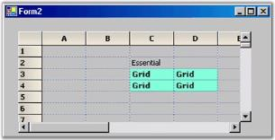
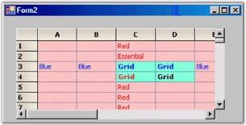
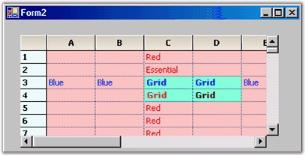
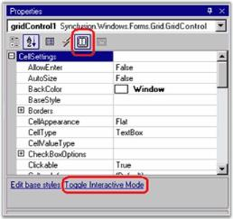

#Setting GridStyleInfo Properties

There are several ways of setting GridStyleInfo properties. If you want to set them for a particular cell, you need to use row and column values as indexers on GridControl object to retrieve GridStyleInfo object that is associated with a particular cell. But, to change BaseStyle, ColumnStyle, or RowStyle, you will have to use different accessory methods to retrieve the style which is under consideration. The code samples that follow will show you several ways of changing particular styles. 

Note: This section shows working with cell-oriented Grid control allows explicit setting of individual cell and row properties. Column-oriented Grid Data Bound Grid does not support explicit setting of individual cell and row properties. Instead, events are used to set these properties on demand. You can see samples in the DataBound Grid section.

##Through Code

Given below is the code to help you create GridStyleInfo properties.



//Adds some text to cell (2,3).

gridControl1[2, 3].CellValue = "Essential";

// Creates a GridStyleInfo.

GridStyleInfo style = new GridStyleInfo();

// Sets some properties.

style.BackColor = Color.Aquamarine;

style.CellValue = "Grid";

style.Font.Facename = "Verdana";

style.Font.Size = 8.2f;

style.Font.Bold = true;

// Applies this style to several cells.

this.gridControl1.ChangeCells(GridRangeInfo.Cells(3, 3, 4, 4), style);





'Adds some text to cell (2,3).

gridControl1(2, 3).CellValue = "Essential"

'Creates a GridStyleInfo.

Dim style As GridStyleInfo

style = New GridStyleInfo()

'Sets some properties.

style.BackColor = Color.Aquamarine

style.CellValue = "Grid"

style.Font.Facename = "Verdana"

style.Font.Size = 8.2!

style.Font.Bold = True

' Applyies this style to several cells.

Me.gridControl1.ChangeCells(GridRangeInfo.Cells(3, 3, 4, 4), style)




//Changes the back color of the grid by using TableStyle.

this.gridControl1.TableStyle.BackColor = Color.FromArgb(255, 192, 192);





'Changes the back color of the grid using TableStyle.

Me.gridControl1.TableStyle.BackColor = Color.FromArgb(255, 192, 192)





//Changes a row style and a column style.

this.gridControl1.RowStyles[3].TextColor = Color.Blue;

this.gridControl1.RowStyles[3].CellValue = "Blue";

this.gridControl1.ColStyles[3].TextColor = Color.Red;

this.gridControl1.ColStyles[3].CellValue = "Red";




'Changes a row style and a column style.

Me.gridControl1.RowStyles(3).TextColor = Color.Blue

Me.gridControl1.RowStyles(3).CellValue = "Blue"

Me.gridControl1.ColStyles(3).TextColor = Color.Red

Me.gridControl1.ColStyles(3).CellValue = "Red"





//Changes a base style, eg. Row Header.

gridControl1.BaseStylesMap["Row Header"].StyleInfo.BackColor = Color.FromArgb(228, 255, 255);





'Changes a base style, eg. Row Header.

gridControl1.BaseStylesMap("Row Header").StyleInfo.BackColor = Color.FromArgb(228, 255, 255)



##Through Designer

To edit cell styles from the designer, you must select the grid on the design surface and then click Toggle Interactive Mode verb shown at the bottom of the PropertyGrid. This will allow you to select cells that are within the Grid control on the design surface. To change any of the style settings of the selected cells, you must first click the Cell Settings tool bar button at the top of PropertyGrid. This will display the cell style settings that are within the PropertyGrid and will allow you to change them. The changes will affect the currently selected range or the current cell if no range is selected. 

