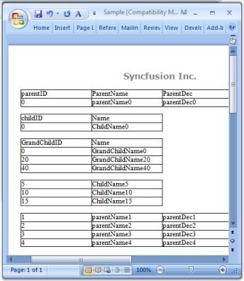

# Word Converter

Export to Word is one of the most common functionalities that is required in the .NET world. Essential Grid Control has in-built support for Word Export. Users can download data from the Grouping Grid control into a Word document for offline verification and/or computation. This can be achieved by making use of GroupingGridWordConverter class. This section will walk you through the conversion of the contents of the grid to a word file as well as discuss the various converter options.

GroupingGridWordConverter class derives from GridWordConverterBase. It contains a number of methods that helps in exporting different components of the grouping grid. You can export NestedTables as well.

The following table lists the properties offered by Grouping Grid Word Converter. By setting these properties, you can choose the elements you need to export.

_Table 108: Properties_

<table>
<tr>
<th>
PROPERTIES</th><th>
DESCRIPTION</th></tr>
<tr>
<td>
ShowHeader</td><td>
Specifies if header should be displayed.</td></tr>
<tr>
<td>
ShowFooter</td><td>
Specifies if footer should be displayed.</td></tr>
</table>

### Method

Grouping Grid Word Converter control provides a method called GroupingGridToWord. This is the method that does the conversion of grouping grid contents to a word file. It accepts two parameters: grouping grid to be converted and filename of the destination Word document.

#### Syntax



GroupingGridWordConverter converter = new GroupingGridWordConverter();

converter.GroupingGridToWord("Grid.doc", this.gridGroupingControl1);





Dim converter As GroupingGridWordConverter = New GroupingGridWordConverter()

converter.GroupingGridToWord("Grid.doc", Me.gridGroupingControl1)



### Events

DrawHeader and DrawFooter are the events offered by Grouping Grid Word Converter that aids in adding as well as customizing header and footer in the destination Word document. 

#### Sample Output

The images below depict the conversion of grid content to a Word file.

> Note: For more details, refer to the following browser sample:
>
> &lt;Install Location&gt;\Syncfusion\EssentialStudio\[Version Number]\Windows\Grid.Grouping.Windows\Samples\Exporting\Word Converter Demo
