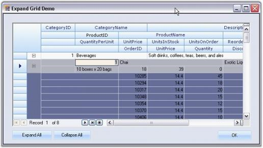
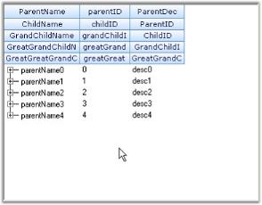

# Data Relations

This section illustrates the following topics.

## Nested Drop-down Grids

Nested Drop-down grids are used to represent multi-level data in a grid. For example, if a bank wants to load all the accounts of an enrolled user in grid control for a financial project, and some of the accounts have subaccounts with options to be selected under each subaccount, which need to be loaded/ shown as a subelement to that account, Nested Drop-down grids can be used to represent data. Data can be distributed in parent (primary) grid, child grid, and so on. Grid Data Bound Grid control can display hierarchical data using Nested Drop-down grids.

### Example

In the code example below, the parent (primary) grid is the 'Customers' table from NorthWind database. On clicking a row of this table, the 'Orders' table will be displayed in a new grid providing details on orders placed by the customers. On clicking any of the rows in Orders table, another grid named 'Order_Details' table is displayed providing details on the order details of the selected row in the Orders table.  

This example has a derived GridDataBoundGrid class called GridHierDataBoundGrid used for all the grids to be displayed. In the constructor for this class, the tables for parent and child are to be passed.


//Parent table to Child table.

//Creates the outermost grid for customers table-uses GridHierDataBoundGrid class.

this.customerGrid1 = new GridHierDataBoundGrid(this, this.dataSet11.Customers,

this.dataSet11.Orders, this.orderGrid2, new QueryFilterStringEventHandler(ProvideOrdersFilterStrings),

new QueryFormatGridEventHandler(ProvideOrderFormat), true);




'Parent table to Child table.

'Creates the outermost grid for customers table and uses GridHierDataBoundGrid class.

Me.customerGrid1 = New GridHierDataBoundGrid(Me, Me.dataSet11.Customers, Me.dataSet11.Orders, Me.orderGrid2, New QueryFilterStringEventHandler(AddressOf ProvideOrdersFilterStrings), New QueryFormatGridEventHandler(AddressOf ProvideOrderFormat), True)



Finally, to specify a relationship between a parent table and a child table, an event handler must be passed for the QueryFilterString event. The event should specify the FilterString that defines the relationship between the parent table and the child table.



// Parent table to Child table.

private void ProvideOrdersFilterStrings(object sender, QueryFilterStringEventArgs e)

{

if (this.customerGrid1.Model[e.Row, e.Column + 1].Text != "")

//Adds 1 to get to Customer ID.

e.FilterString = string.Format("CustomerID = '{0}'", this.customerGrid1.Model[e.Row, e.Column + 1].Text);

}




'Parent table to Child table.

Private Sub ProvideOrdersFilterStrings(ByVal sender As Object, ByVal e As QueryFilterStringEventArgs)

If Me.customerGrid1.Model(e.Row, e.Column + 1).Text <> "" Then

' Adds 1 to get to Customer ID.

e.FilterString = String.Format("CustomerID = '{0}'", Me.customerGrid1.Model(e.Row, e.Column + 1).Text)

End If

End Sub



A sample demonstrating this feature is available under the following sample installation path.

_<Install Location>\Syncfusion\EssentialStudio\[Version Number]\Windows\GridDataBound.Windows\Samples\Customization\Drop Grid Demo_

## Multiple Nested Relations

Grid Data Bound Grid control supports multiple nested relations. A relation can be added in the data source and the data source can be set to GridDataBoundGrid. Then the name of the relation can be passed through Grid.Binder.AddRelation function to show a hierarchical pattern.

### Example:

The following code example illustrates the display of a DataSet with multiple nested relations. The sample displays NorthWind's 'Category', 'Products' and the 'Orders_Details' table, and allows you to expand and collapse the order details for each order and products for each category. After adding a relation in the dataset and setting DataSource to the grid, the name of the relation is passed through Grid.Binder.AddRelation function in order to show hierarchical pattern.


GridHierarchyLevel hlCategory_Products = gridBinder.AddRelation("Category_Products");

GridHierarchyLevel hlProducts_OrderDetails = gridBinder.AddRelation("Products_OrderDetails");




Dim hlCategory_Products As GridHierarchyLevel = gridBinder.AddRelation("Category_Products")

Dim hlProducts_OrderDetails As GridHierarchyLevel = gridBinder.AddRelation("Products_OrderDetails")

 

A sample demonstrating this feature is available under the following sample installation path.

_<Install Location>\Syncfusion\EssentialStudio\[Version Number]\Windows\GridDataBound.Windows\Samples\Hierarchy\Expand Grid Demo_

## Hierarchical Grid with Tree Lines

Grid Data Bound Grid supports display of hierarchical grid with tree lines. This can be achieved by setting the ShowTreeLines property to _true_. 


this.gridDataBoundGrid1.ShowTreeLines = true;




Me.gridDataBoundGrid1.ShowTreeLines = True



With ShowTreeLines property set to true, there is no separate column allotted for plus or minus buttons, instead the indented text in the first column can be seen. 

 

A sample demonstrating this feature is available under the following sample installation path.

_<Install Location>\Syncfusion\EssentialStudio\[Version Number]\Windows\GridDataBound.Windows\Samples\Hierarchy\GDBG Tree Lines Demo_

## ExpandAll and CollapseAll Methods

1. ExpandAll
1. Using this method will enable the user to view expanded nodes in DataBound Grid, i.e., the parent, child and subsequent sublevel nodes.

   The following code illustrates how to set this method for DataBound Grid:

          this.gridDataBoundGrid1.ExpandAll();
          Me.gridDataBoundGrid1.ExpandAll()

   

2. CollapseAll
3. Using this method will enable the user to view collapsed nodes in DataBound Grid, i.e., only the parent node can be viewed with its corresponding expansion icon.

   The following code illustrates how to set this method for DataBound Grid:

   this.gridDataBoundGrid1.CollapseAll();

   Me.gridDataBoundGrid1.CollapseAll()

    

   {:.prettyprint}

