# Appearance and Formatting
This section will explain how to control the appearance and formatting of GridGroupingControl at design time as well as at run time. The overall appearance and also the appearance of each element of the grid can be changed by using the [Appearance](http://help.syncfusion.com/cr/cref_files/windowsforms/grid/Syncfusion.Grid.Grouping.Windows~Syncfusion.Windows.Forms.Grid.Grouping.GridGroupingControl~Appearance.html) property.

[Appearance](http://help.syncfusion.com/cr/cref_files/windowsforms/grid/Syncfusion.Grid.Grouping.Windows~Syncfusion.Windows.Forms.Grid.Grouping.GridGroupingControl~Appearance.html) contains a list of [GridTableCellAppearance](http://help.syncfusion.com/cr/cref_files/windowsforms/grid/Syncfusion.Grid.Grouping.Windows~Syncfusion.Windows.Forms.Grid.Grouping.GridTableCellAppearance.html) properties. Each of `GridTableCellAppearance` contains the [GridStyleInfo](http://help.syncfusion.com/cr/cref_files/windowsforms/grid/Syncfusion.Grid.Windows~Syncfusion.Windows.Forms.Grid.GridStyleInfo.html) properties such as back color, Font and cell type, which defines the look and behavior of a grid cell. Each of these properties identifies a particular set of cells that make up GridGroupingControl. 

Let’s consider three of the `GridStyleInfo` properties for better explanation. [AnyCell](http://help.syncfusion.com/cr/cref_files/windowsforms/grid/Syncfusion.Grid.Grouping.Windows~Syncfusion.Windows.Forms.Grid.Grouping.GridTableCellAppearance~AnyCell.html), [AnyRecordFieldCell](http://help.syncfusion.com/cr/cref_files/windowsforms/grid/Syncfusion.Grid.Grouping.Windows~Syncfusion.Windows.Forms.Grid.Grouping.GridTableCellAppearance~AnyRecordFieldCell.html) and [AlternateRecordFieldCell](http://help.syncfusion.com/cr/cref_files/windowsforms/grid/Syncfusion.Grid.Grouping.Windows~Syncfusion.Windows.Forms.Grid.Grouping.GridTableCellAppearance~AlternateRecordFieldCell.html). 




// Applies back color as LightGreen for all the cells in the Grid.
this.gridGroupingControl1.Appearance.AnyCell.BackColor = Color.LightGreen;



'Applies back color as LightGreen for all the cells in the Grid.
Me.gridGroupingControl1.Appearance.AnyCell.BackColor = Color.LightGreen



N> For enabling the styles to be changes in the headers also, then you have to see the [ThemesEnabled](http://help.syncfusion.com/cr/cref_files/windowsforms/grid/Syncfusion.Grid.Windows~Syncfusion.Windows.Forms.Grid.GridControlBase~ThemesEnabled.html) property as false.

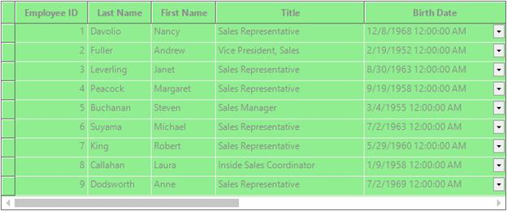




// Applies back color as LightPink for all the records in the Grid.
this.gridGroupingControl1.Appearance.AnyRecordFieldCell.BackColor = Color.LightPink;



'Applies back color as LightPink for all the records in the Grid.
Me.gridGroupingControl1.Appearance.AnyRecordFieldCell.BackColor = Color.LightPink



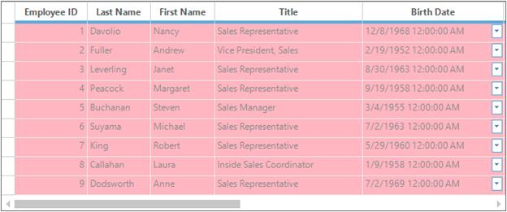




// Applies back color as LightSalmon for alternative records in the Grid.
this.gridGroupingControl1.Appearance.AlternateRecordFieldCell.BackColor = Color.LightSalmon;



'Applies back color as LightSalmon for alternative records in the Grid.
Me.gridGroupingControl1.Appearance.AlternateRecordFieldCell.BackColor = Color.LightSalmon



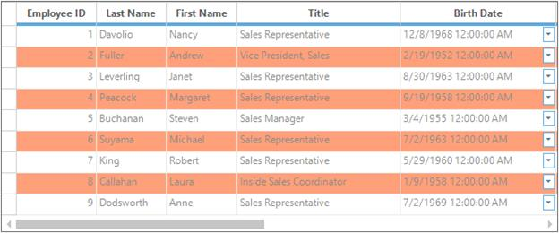

## Table Level Appearance
Appearance can be customized for parent table level and child table level by using the [TableDescriptor.Appearance](http://help.syncfusion.com/cr/cref_files/windowsforms/grid/Syncfusion.Grid.Grouping.Windows~Syncfusion.Windows.Forms.Grid.Grouping.GridTableDescriptor~Appearance.html) property. To set the appearance for the child table, get the table descriptor of the particular child table manually and then use that `Appearance` property for customizing it.

### Parent Level changes
For changing the appearance of the parent level table make use of the `Appearance` property which contains all the [GridTableCellAppearance](http://help.syncfusion.com/cr/cref_files/windowsforms/grid/Syncfusion.Grid.Grouping.Windows~Syncfusion.Windows.Forms.Grid.Grouping.GridTableCellAppearance.html) class members. Use the members of this class to customize styles like in below code.




//Column Header Cell styles.
this.gridGroupingControl1.Appearance.ColumnHeaderCell.CellTipText = "ColumnHeader";
this.gridGroupingControl1.Appearance.ColumnHeaderCell.Interior = new BrushInfo(GradientStyle.Vertical, Color.FromArgb(214, 220, 232), Color.FromArgb(106, 111, 151));
this.gridGroupingControl1.Appearance.ColumnHeaderCell.TextColor = System.Drawing.Color.White;

//Record Field Cell style.
this.gridGroupingControl1.Appearance.RecordFieldCell.Interior = new BrushInfo(Color.Lavender);

//Row Header Cell styles.
this.gridGroupingControl1.Appearance.RowHeaderCell.Interior = new Syncfusion.Drawing.BrushInfo(Syncfusion.Drawing.GradientStyle.Horizontal, SystemColors.Window, Color.FromArgb(206, 213, 231));
this.gridGroupingControl1.Appearance.RowHeaderCell.Themed = false;

//Top Left Header Cell style.
this.gridGroupingControl1.Appearance.TopLeftHeaderCell.Interior = new BrushInfo(GradientStyle.PathRectangle, SystemColors.Window, Color.FromArgb(255, 228, 221));




'Column Header Cell styles.
Me.gridGroupingControl1.Appearance.ColumnHeaderCell.CellTipText = "ColumnHeader"
Me.gridGroupingControl1.Appearance.ColumnHeaderCell.Interior = New BrushInfo(GradientStyle.Vertical, Color.FromArgb(214, 220, 232), Color.FromArgb(106, 111, 151))
Me.gridGroupingControl1.Appearance.ColumnHeaderCell.TextColor = System.Drawing.Color.White

'Record Field Cell style.
Me.gridGroupingControl1.Appearance.RecordFieldCell.Interior = New BrushInfo(Color.Lavender)

'Row Header Cell styles.
Me.gridGroupingControl1.Appearance.RowHeaderCell.Interior = New Syncfusion.Drawing.BrushInfo(Syncfusion.Drawing.GradientStyle.Horizontal, SystemColors.Window, Color.FromArgb(206, 213, 231))
Me.gridGroupingControl1.Appearance.RowHeaderCell.Themed = False

'Top Left Header Cell style.
Me.gridGroupingControl1.Appearance.TopLeftHeaderCell.Interior = New BrushInfo(GradientStyle.PathRectangle, SystemColors.Window, Color.FromArgb(255, 228, 221))



### Child Level changes
To set the appearance for the child table, get the table descriptor of the particular child table manually and then use that `Appearance` property for customizing it. Refer the below code,




// Get the TableDescriptor for the Child Table named "Orders".
GridTableDescriptor tableDescriptor = this.gridGroupingControl1.GetTableDescriptor("Orders");

//Record Field Cell styles.
tableDescriptor.Appearance.AnyRecordFieldCell.BackColor = Color.FromArgb(223, 247, 252);
tableDescriptor.Appearance.AlternateRecordFieldCell.BackColor = Color.FromArgb(255, 229, 201);

//Column Header Cell styles.
tableDescriptor.Appearance.ColumnHeaderCell.Interior = new BrushInfo(GradientStyle.Vertical, Color.FromArgb(203, 201, 202), Color.FromArgb(253, 247, 215));
tableDescriptor.Appearance.ColumnHeaderCell.TextColor = Color.Black;

//Group Caption Cell styles.
tableDescriptor.Appearance.GroupCaptionCell.Interior = new BrushInfo(Color.FromArgb(255, 238, 220));
tableDescriptor.Appearance.GroupCaptionCell.Borders.Bottom = new GridBorder(GridBorderStyle.Solid, Color.FromArgb(242, 158, 32), GridBorderWeight.Medium);



'Get the TableDescriptor for the Child Table named "Orders".
Dim tableDescriptor As GridTableDescriptor = Me.gridGroupingControl1.GetTableDescriptor("Orders")

'Record Field Cell styles.
tableDescriptor.Appearance.AnyRecordFieldCell.BackColor = Color.FromArgb(223, 247, 252)
tableDescriptor.Appearance.AlternateRecordFieldCell.BackColor = Color.FromArgb(255, 229, 201)

'Column Header Cell styles.
tableDescriptor.Appearance.ColumnHeaderCell.Interior = New BrushInfo(GradientStyle.Vertical, Color.FromArgb(203, 201, 202), Color.FromArgb(253, 247, 215))
tableDescriptor.Appearance.ColumnHeaderCell.TextColor = Color.Black

'Group Caption Cell styles.
tableDescriptor.Appearance.GroupCaptionCell.Interior = New BrushInfo(Color.FromArgb(255, 238, 220))
tableDescriptor.Appearance.GroupCaptionCell.Borders.Bottom = New GridBorder(GridBorderStyle.Solid, Color.FromArgb(242, 158, 32), GridBorderWeight.Medium)



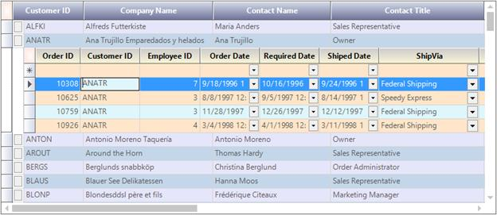

## Group Level Appearance
This section explains how to customize the appearances of different group elements. You can provide unique appearances to every element of a group such as [GroupCaptionCell](http://help.syncfusion.com/cr/cref_files/windowsforms/grid/Syncfusion.Grid.Grouping.Windows~Syncfusion.Windows.Forms.Grid.Grouping.GridTableCellAppearance~GroupCaptionCell.html) and group header or footer cells. This can be done by using the some of the properties under the appearance section like [GroupCaptionCell](http://help.syncfusion.com/cr/cref_files/windowsforms/grid/Syncfusion.Grid.Grouping.Windows~Syncfusion.Windows.Forms.Grid.Grouping.GridTableCellAppearance~GroupCaptionCell.html), [GroupCaptionPlusMinusCell](http://help.syncfusion.com/cr/cref_files/windowsforms/grid/Syncfusion.Grid.Grouping.Windows~Syncfusion.Windows.Forms.Grid.Grouping.GridTableCellAppearance~GroupCaptionPlusMinusCell.html), [GroupHeaderSectionCell](http://help.syncfusion.com/cr/cref_files/windowsforms/grid/Syncfusion.Grid.Grouping.Windows~Syncfusion.Windows.Forms.Grid.Grouping.GridTableCellAppearance~GroupHeaderSectionCell.html), [GroupIndentCell](http://help.syncfusion.com/cr/cref_files/windowsforms/grid/Syncfusion.Grid.Grouping.Windows~Syncfusion.Windows.Forms.Grid.Grouping.GridTableCellAppearance~GroupIndentCell.html), [GroupFooterSectionCell](http://help.syncfusion.com/cr/cref_files/windowsforms/grid/Syncfusion.Grid.Grouping.Windows~Syncfusion.Windows.Forms.Grid.Grouping.GridTableCellAppearance~GroupFooterSectionCell.html), [GroupPreviewCell](http://help.syncfusion.com/cr/cref_files/windowsforms/grid/Syncfusion.Grid.Grouping.Windows~Syncfusion.Windows.Forms.Grid.Grouping.GridTableCellAppearance~GroupPreviewCell.html). 



this.gridGroupingControl1.Appearance.AnyGroupCell.Interior = new BrushInfo(Color.Black);
this.gridGroupingControl1.Appearance.AnyGroupCell.Themed = false;
this.gridGroupingControl1.Appearance.GroupCaptionCell.Borders.Bottom =new GridBorder(GridBorderStyle.Solid, Color.FromArgb(157, 179, 200));
this.gridGroupingControl1.Appearance.GroupCaptionRowHeaderCell.Interior = new BrushInfo(GradientStyle.BackwardDiagonal, SystemColors.Window, Color.DarkOrange);


Me.gridGroupingControl1.Appearance.AnyGroupCell.Interior = New BrushInfo(Color.Black)
Me.gridGroupingControl1.Appearance.AnyGroupCell.Themed = False
Me.gridGroupingControl1.Appearance.GroupCaptionCell.Borders.Bottom = New GridBorder(GridBorderStyle.Solid, Color.FromArgb(157, 179, 200))
Me.gridGroupingControl1.Appearance.GroupCaptionRowHeaderCell.Interior = New BrushInfo(GradientStyle.BackwardDiagonal, SystemColors.Window, Color.DarkOrange)



## Header Images
Images can be added to the header of GridGroupingControl by using the [HeaderImage](http://help.syncfusion.com/cr/cref_files/windowsforms/grid/Syncfusion.Grid.Grouping.Windows~Syncfusion.Windows.Forms.Grid.Grouping.GridColumnDescriptor~HeaderImage.html) property. Also the alignment of the header image can be altered by using the[HeaderImageAlignment](http://help.syncfusion.com/cr/cref_files/windowsforms/grid/Syncfusion.Grid.Grouping.Windows~Syncfusion.Windows.Forms.Grid.Grouping.GridColumnDescriptor~HeaderImageAlignment.html) property.



this.gridGroupingControl1.TableDescriptor.Columns["Title"].HeaderImage = Image.FromFile(@"\..\..Contact.PNG");
this.gridGroupingControl1.TableDescriptor.Columns["Title"].HeaderImageAlignment = HeaderImageAlignment.Right;


Me.gridGroupingControl1.TableDescriptor.Columns("Title").HeaderImage = Image.FromFile(@"\..\..Contact.PNG")
Me.gridGroupingControl1.TableDescriptor.Columns("Title").HeaderImageAlignment = HeaderImageAlignment.Right


N> The images in header will also be shown in the grouped column headers which is visible in the `GroupDropArea`.

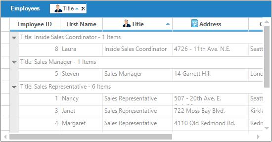

## Column-Based Formatting
Unique appearance for different columns in GridGroupingControl can be achieved by using the [GridColumnDescriptor.Appearance](http://help.syncfusion.com/cr/cref_files/windowsforms/grid/Syncfusion.Grid.Grouping.Windows~Syncfusion.Windows.Forms.Grid.Grouping.GridTableDescriptor~Appearance.html) property. Column formatting can be done in two ways, through design time and programmatically.

### Formatting through Designer
Once the data source is set, select [TableDescriptor.Columns](http://help.syncfusion.com/cr/cref_files/windowsforms/grid/Syncfusion.Grid.Grouping.Windows~Syncfusion.Windows.Forms.Grid.Grouping.GridTableDescriptor~Columns.html) property in the property window of the GridGroupingControl. This will open the [GridColumnDescriptor](http://help.syncfusion.com/cr/cref_files/windowsforms/grid/Syncfusion.Grid.Grouping.Windows~Syncfusion.Windows.Forms.Grid.Grouping.GridTableDescriptor.html) collection editor that is populated with the columns in the data source. You can modify the appearance of the desired column by setting `Appearance` property of that column in this editor.

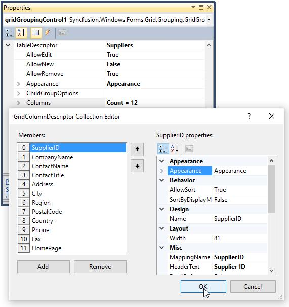

### Formatting through Code
[GridColumnDescriptor](http://help.syncfusion.com/cr/cref_files/windowsforms/grid/Syncfusion.Grid.Grouping.Windows~Syncfusion.Windows.Forms.Grid.Grouping.GridTableDescriptor.html) provides the mapping information for each columns of the underlying data source. Then using the [Appearance](http://help.syncfusion.com/cr/cref_files/windowsforms/grid/Syncfusion.Grid.Grouping.Windows~Syncfusion.Windows.Forms.Grid.Grouping.GridTableDescriptor~Appearance.html) property of this column you can customize the appearance in code behind.



GridColumnDescriptor desc1 = new GridColumnDescriptor();
desc1.MappingName = "EmployeeID";
desc1.Appearance.AnyRecordFieldCell.Interior = new BrushInfo(Color.FromArgb(237, 240, 246));

GridColumnDescriptor desc2 = new GridColumnDescriptor();
desc2.MappingName = "LastName";
desc2.Appearance.AnyRecordFieldCell.Interior = new BrushInfo(Color.FromArgb(218, 229, 245));

GridColumnDescriptor desc3 = new GridColumnDescriptor();
desc3.MappingName = "FirstName";
desc3.Appearance.AnyRecordFieldCell.Interior = new BrushInfo(Color.FromArgb(102, 110, 152));

GridColumnDescriptor desc4 = new GridColumnDescriptor();
desc4.MappingName = "Title";
desc4.Appearance.AnyRecordFieldCell.Interior = new BrushInfo(Color.FromArgb(252, 172, 38));


Dim desc1 As New GridColumnDescriptor()
desc1.MappingName = "EmployeeID"
desc1.Appearance.AnyRecordFieldCell.Interior = New BrushInfo(Color.FromArgb(237, 240, 246))

Dim desc2 As New GridColumnDescriptor()
desc2.MappingName = "LastName"
desc2.Appearance.AnyRecordFieldCell.Interior = New BrushInfo(Color.FromArgb(218, 229, 245))

Dim desc3 As New GridColumnDescriptor()
desc3.MappingName = "FirstName"
desc3.Appearance.AnyRecordFieldCell.Interior = New BrushInfo(Color.FromArgb(102, 110, 152))

Dim desc4 As New GridColumnDescriptor()
desc4.MappingName = "Title"
desc4.Appearance.AnyRecordFieldCell.Interior = New BrushInfo(Color.FromArgb(252, 172, 38))



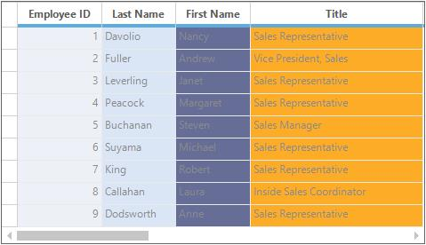

N> For more details, refer the following browser sample: &lt;Install Location&gt;\Syncfusion\EssentialStudio\[Version Number]\Windows\Grid.Grouping.Windows\Samples\Styling and Formatting\Column Styles

## BaseStyles
[BaseStyles](http://help.syncfusion.com/cr/cref_files/windowsforms/grid/Syncfusion.Grid.Grouping.Windows~Syncfusion.Windows.Forms.Grid.Grouping.GridGroupingLookAndFeel~BaseStyles.html) is one of the parent-type style which is used to customize the cell’s appearance. `BaseStyles` are `GridStyleInfo` objects which can be associated with an arbitrary collection of cells. `BaseStyles` can be applied to GridGroupingControl through designer as well as code wise.

### Applying BaseStyles through Designer
To add style templates at design time, `BaseStyles` property has to accessed in the property editor. This will open `GridTableStyle Collection Editor` that lists [StyleInfo](http://help.syncfusion.com/cr/cref_files/windowsforms/grid/Syncfusion.Grid.Grouping.Windows~Syncfusion.Windows.Forms.Grid.Grouping.GridTableBaseStyle~StyleInfo.html) properties that can be associated to a grid cell. In here make the changes for the required cells.

After creating the base styles, assign it to the required grid cells by using the [BaseStyles](http://help.syncfusion.com/cr/cref_files/windowsforms/grid/Syncfusion.Grid.Grouping.Windows~Syncfusion.Windows.Forms.Grid.Grouping.GridGroupingLookAndFeel~BaseStyles.html) property. For example, if this base style is needed to be added for the alternative record fields then use the created base styles in `Appearance.AlternateRecordFieldCell.BaseStyle` property.

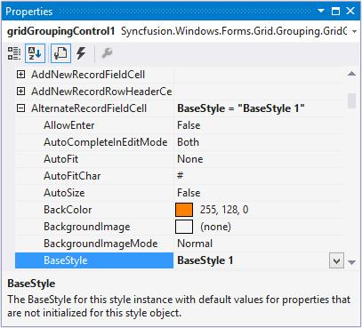

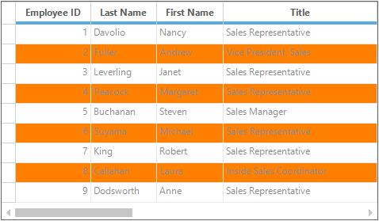

### Applying BaseStyles through Code
Base styles can be added through code by using the [BaseStyles](http://help.syncfusion.com/cr/cref_files/windowsforms/grid/Syncfusion.Grid.Grouping.Windows~Syncfusion.Windows.Forms.Grid.Grouping.GridGroupingLookAndFeel~BaseStyles.html) property. The following code example illustrates how to create and apply the styles to grid.



GridTableBaseStyle style1 = new GridTableBaseStyle("BaseStyle 1");
style1.Name = "BaseStyle 1";
style1.StyleInfo.Font.Facename = "Verdana";
style1.StyleInfo.BackColor = Color.LightBlue;
 
gridGroupingControl1.BaseStyles.Add(style1);
gridGroupingControl1.Appearance.AlternateRecordFieldCell.BaseStyle = "BaseStyle 1";


Dim style1 As New GridTableBaseStyle("BaseStyle 1")
style1.Name = "BaseStyle 1"
style1.StyleInfo.Font.Facename = "Verdana"
style1.StyleInfo.BackColor = Color.LightBlue

gridGroupingControl1.BaseStyles.Add(style1)
gridGroupingControl1.Appearance.AlternateRecordFieldCell.BaseStyle = "BaseStyle 1"


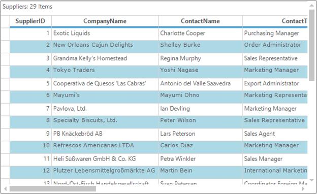

## Table Options
[TableOptions](http://help.syncfusion.com/cr/cref_files/windowsforms/grid/Syncfusion.Grid.Grouping.Windows~Syncfusion.Windows.Forms.Grid.Grouping.IGridTableOptionsSource~TableOptions.html) lets you set various properties that will affect the look and behavior of a GridGroupingControl across all groups and child groups. Properties such as default height of a Caption Row, group header and Footer, PreviewRow, or whether TreeLines are visible between PlusMinus cells are controlled by this property. All the properties are stored in the [GridTableOptionsStyleInfo](http://help.syncfusion.com/cr/cref_files/windowsforms/grid/Syncfusion.Grid.Grouping.Windows~Syncfusion.Windows.Forms.Grid.Grouping.GridTableOptionsStyleInfo_properties.html) class.


this.gridGroupingControl1.TopLevelGroupOptions.ShowCaption = true;
this.gridGroupingControl1.TableOptions.RecordPreviewRowHeight = 55;
this.gridGroupingControl1.TableOptions.ShowRowHeader = false;
this.gridGroupingControl1.TableOptions.SelectionBackColor = Color.FromArgb(255, 128, 128);
this.gridGroupingControl1.TableOptions.SelectionTextColor = Color.Maroon;
this.gridGroupingControl1.TableOptions.ListBoxSelectionMode = SelectionMode.MultiExtended;
this.gridGroupingControl1.TableOptions.DefaultColumnWidth = 65;
this.gridGroupingControl1.TableOptions.CaptionRowHeight = 22;


Me.gridGroupingControl1.TopLevelGroupOptions.ShowCaption = True
Me.gridGroupingControl1.TableOptions.RecordPreviewRowHeight = 55
Me.gridGroupingControl1.TableOptions.ShowRowHeader = False
Me.gridGroupingControl1.TableOptions.SelectionBackColor = Color.FromArgb(255, 128, 128)
Me.gridGroupingControl1.TableOptions.SelectionTextColor = Color.Maroon
Me.gridGroupingControl1.TableOptions.ListBoxSelectionMode = SelectionMode.MultiExtended
Me.gridGroupingControl1.TableOptions.DefaultColumnWidth = 65
Me.gridGroupingControl1.TableOptions.CaptionRowHeight = 22



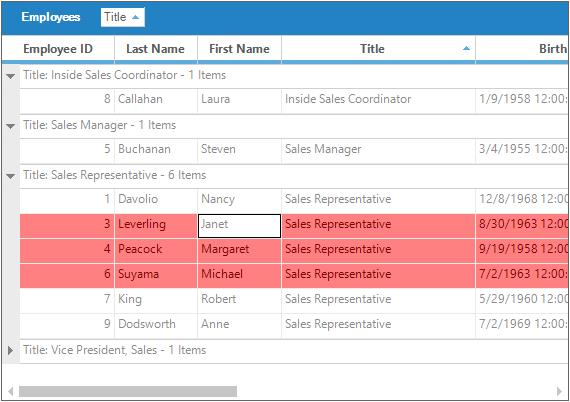

**Sample Location**
&lt;Installed_Location&gt;\Syncfusion\EssentialStudio\[Version_Number]\Windows\Grid.Grouping.Windows\Samples\Grouping Grid Options\Table Options Demo

## FormatCell Dialog box
GridGroupingControl has an option to show FormatCell dialog which imitates Excel behavior. Using this dialog box, appearance of the grid can be customized. Using this dialog box, you can make changes in Font, Number, Background and Alignment options. To avail this option make use of the [GroupingGridFormatCellDialog](http://help.syncfusion.com/cr/cref_files/windowsforms/grid/Syncfusion.GridHelperClasses.Windows~Syncfusion.GridHelperClasses.GridFormatCellDialog~_ctor.html)  class. and pass GridGroupingControl as a parameter.




// Shows FormatCell Dialog box
GroupingGridFormatCellDialog dialog = new GroupingGridFormatCellDialog(this.gridGroupingControl1);
dialog.ShowDialog(); 



'Shows FormatCell Dialog box
Dim dialog As New GroupingGridFormatCellDialog(Me.gridGroupingControl1)
dialog.ShowDialog()



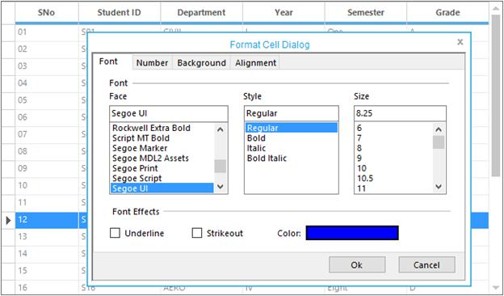

## Conditional Formatting
Conditional Formatting can be specified by accessing the [TableDescriptor.ConditionalFormats](http://help.syncfusion.com/cr/cref_files/windowsforms/grid/Syncfusion.Grid.Grouping.Windows~Syncfusion.Windows.Forms.Grid.Grouping.GridTableDescriptor~ConditionalFormats.html) property. You need to add the filter criteria either by adding [RecordFilters](http://help.syncfusion.com/cr/cref_files/windowsforms/grid/Syncfusion.Grid.Grouping.Windows~Syncfusion.Windows.Forms.Grid.Grouping.GridConditionalFormatDescriptor~RecordFilters.html) or by an expression in the [GridConditionalFormatDescriptor](http://help.syncfusion.com/cr/cref_files/windowsforms/grid/Syncfusion.Grid.Grouping.Windows~Syncfusion.Windows.Forms.Grid.Grouping.GridConditionalFormatDescriptor.html) class. Using this descriptor, you can specify the filter criteria for the cells and the style to be applied for filtered cells. Check the topic [Conditional Formatting](http://help.syncfusion.com/windowsforms/gridgrouping/conditional-formatting) for detailed explanation. 




//Define Conditional Format Descriptor and specify filter criteria and style to be applied.

//Applies the following style to the records whose CustomerID starts with 'A'.
GridConditionalFormatDescriptor format1 = new GridConditionalFormatDescriptor();
format1.Appearance.AnyRecordFieldCell.Interior = new BrushInfo(Color.FromArgb(255, 191, 52));
format1.Appearance.AnyRecordFieldCell.TextColor = Color.White;
format1.Expression = "[CustomerID]  LIKE \'A*\'";
format1.Name = "ConditionalFormat 1";

//Applies the following style to the records whose ContactTitle = 'Sales Representative'.
GridConditionalFormatDescriptor format2 = new GridConditionalFormatDescriptor();
format2.Appearance.AnyRecordFieldCell.Font.Bold = true;
format2.Appearance.AnyRecordFieldCell.Interior = new BrushInfo(Color.FromArgb(102, 110, 152));
format2.Appearance.AnyRecordFieldCell.TextColor = Color.White;
format2.Expression = "[ContactTitle] LIKE \'Sales Representative\'";
format2.Name = "ConditionalFormat 2";

// Add the descriptor to the TableDescriptor.ConditionalFormats property.
this.gridGroupingControl1.TableDescriptor.ConditionalFormats.Add(format1);
this.gridGroupingControl1.TableDescriptor.ConditionalFormats.Add(format2);



'Define Conditional Format Descriptor and specify filter criteria and style to be applied.

'Applies the following style to the records whose CustomerID starts with 'A'.
Dim format1 As New GridConditionalFormatDescriptor()
format1.Appearance.AnyRecordFieldCell.Interior = New BrushInfo(Color.FromArgb(255, 191, 52))
format1.Appearance.AnyRecordFieldCell.TextColor = Color.White
format1.Expression = "[CustomerID]  LIKE 'A*'"
format1.Name = "ConditionalFormat 1"

'Applies the following style to the records whose ContactTitle = 'Sales Representative'.
Dim format2 As New GridConditionalFormatDescriptor()
format2.Appearance.AnyRecordFieldCell.Font.Bold = True
format2.Appearance.AnyRecordFieldCell.Interior = New BrushInfo(Color.FromArgb(102, 110, 152))
format2.Appearance.AnyRecordFieldCell.TextColor = Color.White
format2.Expression = "[ContactTitle] LIKE 'Sales Representative'"
format2.Name = "ConditionalFormat 2"

'Add the descriptor to the TableDescriptor.ConditionalFormats property.
Me.gridGroupingControl1.TableDescriptor.ConditionalFormats.Add(format1)
Me.gridGroupingControl1.TableDescriptor.ConditionalFormats.Add(format2)


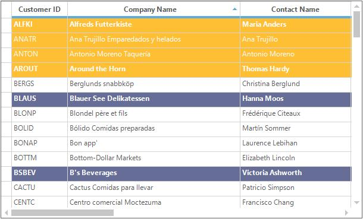

**Sample Location** 
&lt;Installed_Location&gt;\Syncfusion\EssentialStudio\[Version_Number]\Windows\Grid.Grouping.Windows\Samples\Styling and Formatting\Conditional Formatting

## Dynamic Formatting
Style settings can be applied to different grid elements dynamically at run time. This can be achieved by proper handling of the [QueryCellStyleInfo](http://help.syncfusion.com/cr/cref_files/windowsforms/grid/Syncfusion.Grid.Grouping.Windows~Syncfusion.Windows.Forms.Grid.Grouping.GridGroupingControl~QueryCellStyleInfo_EV.html) event. It provides `GridStyleInfo` object for a cell on demand.

[QueryCellStyleInfo](http://help.syncfusion.com/cr/cref_files/windowsforms/grid/Syncfusion.Grid.Grouping.Windows~Syncfusion.Windows.Forms.Grid.Grouping.GridGroupingControl~QueryCellStyleInfo_EV.html) is raised randomly for each cell and any type of formatting can be done in this event. For instance, you can apply style settings for a given [CellType](http://help.syncfusion.com/cr/cref_files/windowsforms/grid/Syncfusion.Grid.Grouping.Windows~Syncfusion.Windows.Forms.Grid.Grouping.GridTableCellStyleInfo~CellType.html) by using [TableCellIdentity.TableCellType](http://help.syncfusion.com/cr/cref_files/windowsforms/grid/Syncfusion.Grid.Grouping.Windows~Syncfusion.Windows.Forms.Grid.Grouping.GridTableCellStyleInfoIdentity~TableCellType.html) property for a given cell.



this.gridGroupingControl1.QueryCellStyleInfo += new GridTableCellStyleInfoEventHandler(gridGroupingControl1_QueryCellStyleInfo);
void gridGroupingControl1_QueryCellStyleInfo(object sender, GridTableCellStyleInfoEventArgs e)
{
    if (e.TableCellIdentity.TableCellType == GridTableCellType.RecordFieldCell)
    {

        if (e.TableCellIdentity.ColIndex % 2 == 0)
        {
            e.Style.BackColor = Color.FromArgb(255, 187, 111);
            e.Style.Font.FontStyle = FontStyle.Bold;
        }

        else
        {
            e.Style.TextColor = Color.White;
            e.Style.BackColor = Color.FromArgb(55, 91, 114);
        }
    }
    
    else if (e.TableCellIdentity.TableCellType == GridTableCellType.AlternateRecordFieldCell)
    {
    
        if (e.TableCellIdentity.ColIndex % 2 == 0)
        {
            e.Style.Font.FontStyle = FontStyle.Underline;
            e.Style.BackColor = Color.FromArgb(0, 21, 84);
            e.Style.TextColor = Color.White;
        }
    
        else
        {
            e.Style.BackColor = Color.FromArgb(255, 188, 112);
            e.Style.Font.FontStyle = FontStyle.Italic;
        }
    }
}


AddHandler gridGroupingControl1.QueryCellStyleInfo, AddressOf gridGroupingControl1_QueryCellStyleInfo

Private Sub gridGroupingControl1_QueryCellStyleInfo(ByVal sender As Object, ByVal e As GridTableCellStyleInfoEventArgs)

    If e.TableCellIdentity.TableCellType = GridTableCellType.RecordFieldCell Then

        If e.TableCellIdentity.ColIndex Mod 2 = 0 Then
            e.Style.BackColor = Color.FromArgb(255, 187, 111)
            e.Style.Font.FontStyle = FontStyle.Bold

        Else
            e.Style.TextColor = Color.White
            e.Style.BackColor = Color.FromArgb(55, 91, 114)
        End If

    ElseIf e.TableCellIdentity.TableCellType = GridTableCellType.AlternateRecordFieldCell Then

        If e.TableCellIdentity.ColIndex Mod 2 = 0 Then
            e.Style.Font.FontStyle = FontStyle.Underline
            e.Style.BackColor = Color.FromArgb(0, 21, 84)
            e.Style.TextColor = Color.White

        Else
            e.Style.BackColor = Color.FromArgb(255, 188, 112)
            e.Style.Font.FontStyle = FontStyle.Italic
        End If
    End If
End Sub



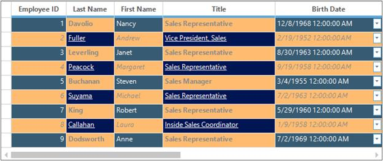

**Sample Location** 
&lt;Installed_Location&gt;\Syncfusion\EssentialStudio\[Version_Number]\Windows\Grid.Grouping.Windows\Samples\Filters and Expressions\Dynamic Filter
