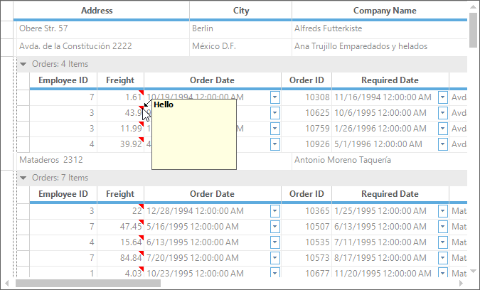
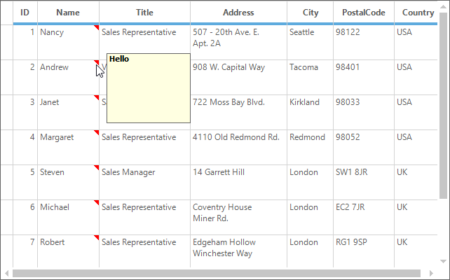
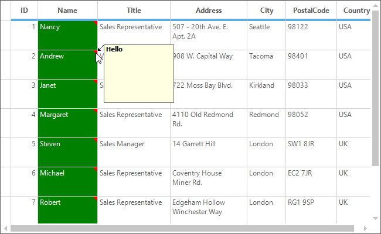

# Comment Tip 
The Excel-like comment tip can be added to the individual cells. This allows a user to show more information about the particular cell on mouse hover. 
A user can customize an appearance of the comment tip window and comment indicator of the individual cells. The user can also add the images to the comment tip window.

## Adding comment tip
The `CommentTip` property provides the various options to customize the comment tip of the cells. The comment tip can be added to the particular cell by setting the `CommentText` property in the `QueryCellStyleInfo` event. The comment text will be displayed in the comment tip window.


this.gridGroupingControl1.QueryCellStyleInfo +=new GridTableCellStyleInfoEventHandler(gridGroupingControl1_QueryCellStyleInfo);
void gridGroupingControl1_QueryCellStyleInfo(object sender, GridTableCellStyleInfoEventArgs e)
{

    if (e.Style.TableCellIdentity.Column != null && e.Style.TableCellIdentity.Column.Name == "FirstName")
    {

        //Setting the comment tip text

        if (e.TableCellIdentity.DisplayElement != null && e.TableCellIdentity.DisplayElement.Kind == DisplayElementKind.Record)
        {
            e.Style.CommentTip.CommentText = "Hello";
        }
    }
}


AddHandler gridGroupingControl1.QueryCellStyleInfo, AddressOf gridGroupingControl1_QueryCellStyleInfo

Private Sub gridGroupingControl1_QueryCellStyleInfo(ByVal sender As Object, ByVal e As GridTableCellStyleInfoEventArgs)

	If e.Style.TableCellIdentity.Column IsNot Nothing AndAlso e.Style.TableCellIdentity.Column.Name = "FirstName" Then

		'Setting the comment tip text

		If e.TableCellIdentity.DisplayElement IsNot Nothing AndAlso e.TableCellIdentity.DisplayElement.Kind Is DisplayElementKind.Record Then
			e.Style.CommentTip.CommentText = "Hello"
		End If
	End If
End Sub



### Adding image to comment tip
The comment tip for the cells can also be added by setting the `CommentImage` property. The given image will be displayed as the comment tip for the cells.


this.gridGroupingControl1.QueryCellStyleInfo +=new GridTableCellStyleInfoEventHandler(gridGroupingControl1_QueryCellStyleInfo);
void gridGroupingControl1_QueryCellStyleInfo(object sender, Syncfusion.Windows.Forms.Grid.Grouping.GridTableCellStyleInfoEventArgs e)
{

    if (e.Style.TableCellIdentity.Column != null && e.Style.TableCellIdentity.Column.Name == "FirstName"
        && e.TableCellIdentity.DisplayElement != null && e.TableCellIdentity.DisplayElement.Kind == Syncfusion.Grouping.DisplayElementKind.Record)
    {

        //Set the comment image for the cell.
        e.Style.CommentTip.CommentImage = Image.FromFile(@"../../Images/" + e.Style.Text + ".png");
    }
}


AddHandler gridGroupingControl1.QueryCellStyleInfo, AddressOf gridGroupingControl1_QueryCellStyleInfo

Private Sub gridGroupingControl1_QueryCellStyleInfo(ByVal sender As Object, ByVal e As Syncfusion.Windows.Forms.Grid.Grouping.GridTableCellStyleInfoEventArgs)

	If e.Style.TableCellIdentity.Column IsNot Nothing AndAlso e.Style.TableCellIdentity.Column.Name = "FirstName" AndAlso e.TableCellIdentity.DisplayElement IsNot Nothing AndAlso e.TableCellIdentity.DisplayElement.Kind Is Syncfusion.Grouping.DisplayElementKind.Record Then

		'Set the comment image for the cell.
		e.Style.CommentTip.CommentImage = Image.FromFile("../../Images/" & e.Style.Text & ".png")
	End If
End Sub



N> The comment tip can be added to the particular cell by either setting the `CommentText` property or `CommentImage` property.

### Adding comment tip for column 
The comment tip can be added to the specific column by setting the `Appearance.AnyRecordFieldCell.CommentTip.CommentText` property of the particular column descriptor. It will enable the comment tip for all the cells in the column with the same comment text.


// Setting comment tip text for particular column.
this.gridGroupingControl1.TableDescriptor.Columns["ColumnName"].Appearance.AnyRecordFieldCell.CommentTip.CommentText = "Hello";



' Setting comment tip text for particular column.
Me.gridGroupingControl1.TableDescriptor.Columns("ColumnName").Appearance.AnyRecordFieldCell.CommentTip.CommentText = "Hello"



### Adding comment tip to nested table
The comment tip can be added for the nested tables by getting the table descriptor using the [GetTableDescriptor](http://help.syncfusion.com/cr/cref_files/windowsforms/Syncfusion.Grid.Grouping.Windows~Syncfusion.Windows.Forms.Grid.Grouping.GridGroupingControl~GetTableDescriptor.html) method and setting the `CommentTip.CommentText` to the column that you want. 


// Adding Comment text for nested table cells
this.gridGroupingControl1.GetTableDescriptor("Orders").Columns["Freight"].Appearance.AnyRecordFieldCell.CommentTip.CommentText = "Hello";



' Adding Comment text for nested table cells
Me.gridGroupingControl1.GetTableDescriptor("Orders").Columns("Freight").Appearance.AnyRecordFieldCell.CommentTip.CommentText = "Hello"



N> The comment tip events for the nested table can be accessed by getting the specific nested table's table control using the [GetTableControl](http://help.syncfusion.com/cr/cref_files/windowsforms/Syncfusion.Grid.Grouping.Windows~Syncfusion.Windows.Forms.Grid.Grouping.GridGroupingControl~GetTableControl.html) method.

## Removing comment tip 
The comment tip for the cell can be removed by using the `ResetCommentTip` method.  It will reset the comment tip properties to the default values.


// Remove the comment tip for particular column
this.gridGroupingControl1.TableDescriptor.Columns["ColumnName"].Appearance.AnyRecordFieldCell.ResetCommentTip();


' Remove the comment tip for particular column
Me.gridGroupingControl1.TableDescriptor.Columns("ColumnName").Appearance.AnyRecordFieldCell.ResetCommentTip()



## Customizing an appearance of comment tip
The `CommentTip` property provides the list of properties that are used to customize an appearance of the comment tip window.
 
### Comment indicator
The size and color of the comment indicator can be customized by using the `CommentIndicatorSize` and `CommentIndicatorColor` properties of the `CommentTip`. By default, it will be displayed as the red color triangle at the top-right corner of the cell.


// Setting the Color and Size for the comment indicator
this.gridGroupingControl1.TableDescriptor.Columns["ColumnName"].Appearance.AnyRecordFieldCell.CommentTip.CommentIndicatorColor = Color.Green;
this.gridGroupingControl1.TableDescriptor.Columns["ColumnName"].Appearance.AnyRecordFieldCell.CommentTip.CommentIndicatorSize = new Size(20, 20);


' Setting the Color and Size for the comment indicator
Me.gridGroupingControl1.TableDescriptor.Columns("ColumnName").Appearance.AnyRecordFieldCell.CommentTip.CommentIndicatorColor = Color.Green
Me.gridGroupingControl1.TableDescriptor.Columns("ColumnName").Appearance.AnyRecordFieldCell.CommentTip.CommentIndicatorSize = New Size(20, 20)



### Comment arrow
The size and color of the comment arrow can be customized by using the `CommentArrowSize` and `CommentArrowColor` property. 


// Setting Color and Size for the Comment Arrow
this.gridGroupingControl1.TableDescriptor.Columns["ColumnName"].Appearance.AnyRecordFieldCell.CommentTip.CommentArrowSize = new Size(5, 40);
this.gridGroupingControl1.TableDescriptor.Columns["ColumnName"].Appearance.AnyRecordFieldCell.CommentTip.CommentArrowColor = Color.Green;


' Setting Color and Size for the Comment Arrow
Me.gridGroupingControl1.TableDescriptor.Columns("ColumnName").Appearance.AnyRecordFieldCell.CommentTip.CommentArrowSize = New Size(5, 40)
Me.gridGroupingControl1.TableDescriptor.Columns("ColumnName").Appearance.AnyRecordFieldCell.CommentTip.CommentArrowColor = Color.Green



### Hiding the comment arrow
The comment arrow can be hidden by setting the width of the `CommentArrowSize` property to zero. 


this.gridGroupingControl1.TableDescriptor.Columns["FirstName"].Appearance.AnyRecordFieldCell.CommentTip.CommentText = "Hello";
// Setting Color and Size for the Comment Arrow
this.gridGroupingControl1.TableDescriptor.Columns["FirstName"].Appearance.AnyRecordFieldCell.CommentTip.CommentArrowSize = new Size(0, 10);


Me.gridGroupingControl1.TableDescriptor.Columns("FirstName").Appearance.AnyRecordFieldCell.CommentTip.CommentText = "Hello"
' Setting Color and Size for the Comment Arrow
Me.gridGroupingControl1.TableDescriptor.Columns("FirstName").Appearance.AnyRecordFieldCell.CommentTip.CommentArrowSize = New Size(0, 10)



N> If the height of the `CommentArrowSize` is set to zero, the comment arrow will be hidden and the comment tip window will be shown near to the top-right corner of a cell.

### Comment tip window
The size and font of the comment tip window can be customized by using the `CommentWindowSize` and `CommentFont` properties respectively. 
The foreground and background colors of the comment tip window can be changed by using the `ForeColor` and `BackColor` properties of the `CommentTip`.


this.gridGroupingControl1.QueryCellStyleInfo +=new GridTableCellStyleInfoEventHandler(gridGroupingControl1_QueryCellStyleInfo);
void gridGroupingControl1_QueryCellStyleInfo(object sender, Syncfusion.Windows.Forms.Grid.Grouping.GridTableCellStyleInfoEventArgs e)
{

    if (e.Style.TableCellIdentity.Column != null && e.Style.TableCellIdentity.Column.Name == "ColumnName"
        && e.TableCellIdentity.DisplayElement != null && e.TableCellIdentity.DisplayElement.Kind == Syncfusion.Grouping.DisplayElementKind.Record)
    {

        //Set the comment text, comment font and fore color.
        {
            e.Style.CommentTip.CommentWindowSize = new Size(100, 30);
            e.Style.CommentTip.CommentFont = new Font("sans serif", 12, FontStyle.Italic);
            e.Style.CommentTip.ForeColor = Color.White;
            e.Style.CommentTip.BackColor = Color.Purple;
        }
    }
}


AddHandler gridGroupingControl1.QueryCellStyleInfo, AddressOf gridGroupingControl1_QueryCellStyleInfo

Private Sub gridGroupingControl1_QueryCellStyleInfo(ByVal sender As Object, ByVal e As Syncfusion.Windows.Forms.Grid.Grouping.GridTableCellStyleInfoEventArgs)

	If e.Style.TableCellIdentity.Column IsNot Nothing AndAlso e.Style.TableCellIdentity.Column.Name = "ColumnName" AndAlso e.TableCellIdentity.DisplayElement IsNot Nothing AndAlso e.TableCellIdentity.DisplayElement.Kind Is Syncfusion.Grouping.DisplayElementKind.Record Then

		'Set the comment text, comment font and fore color.
			e.Style.CommentTip.CommentWindowSize = New Size(100, 30)
			e.Style.CommentTip.CommentFont = New Font("sans serif", 12, FontStyle.Italic)
			e.Style.CommentTip.ForeColor = Color.White
			e.Style.CommentTip.BackColor = Color.Purple
	End If
End Sub



## Events
The following events are used to customize an appearance of the comment tip,
 
* DrawCommentIndicator
* CommentTipShowing
* CommentTipShown

### DrawCommentIndicator event
This event is used to customize an appearance of the comment indicator by changing its shape, color and location through the event arguments.


this.gridGroupingControl1.TableControl.DrawCommentIndicator += new DrawCommentIndicatorEventHandler(TableControl_DrawCommentIndicator);
void TableControl_DrawCommentIndicator(object sender, DrawCommentIndicatorEventArgs e)
{
     Console.WriteLine("CommentRow {0} CommentColumn {1}", e.RowIndex, e.ColIndex);
}


AddHandler gridGroupingControl1.TableControl.DrawCommentIndicator, AddressOf TableControl_DrawCommentIndicator

Private Sub TableControl_DrawCommentIndicator(ByVal sender As Object, ByVal e As DrawCommentIndicatorEventArgs)
     Console.WriteLine("CommentRow {0} CommentColumn {1}", e.RowIndex, e.ColIndex)
End Sub



### CommentTipShowing event
An appearance of the comment tip window can be customized by using the `CommentTipShowing` event. This can be also used to change the text, size, color and location of the comment tip window. This event will be raised before comment tip window is displayed.


this.gridGroupingControl1.TableControl.CommentTipShowing += new CommentTipShowingEventHandler(TableControl_CommentTipShowing);
void TableControl_CommentTipShowing(object sender, CommentTipShowingEventArgs e)
{
     Console.WriteLine("CommentRow {0} CommentColumn {1}", e.RowIndex, e.ColIndex);
}


AddHandler gridGroupingControl1.TableControl.CommentTipShowing, AddressOf TableControl_CommentTipShowing

Private Sub TableControl_CommentTipShowing(ByVal sender As Object, ByVal e As CommentTipShowingEventArgs)
     Console.WriteLine("CommentRow {0} CommentColumn {1}", e.RowIndex, e.ColIndex)
End Sub



### CommentTipShown event
This event will be raised after comment tip window is shown. This is used to get the notification of the showing of comment tip window on specific cell. 


this.gridGroupingControl1.TableControl.CommentTipShown += new CommentTipShownEventHandler(TableControl_CommentTipShown);
void TableControl_CommentTipShown(object sender, CommentTipShownEventArgs e)
{
    Console.WriteLine("Comment tip is shown for the cell [" + e.RowIndex + "," + e.ColIndex + "].");
}


AddHandler gridGroupingControl1.TableControl.CommentTipShown, AddressOf TableControl_CommentTipShown

Private Sub TableControl_CommentTipShown(ByVal sender As Object, ByVal e As CommentTipShownEventArgs)
	Console.WriteLine("Comment tip is shown for the cell [" & e.RowIndex & "," & e.ColIndex & "].")
End Sub



## Customization using events
The `CommentTipShowing` and `DrawCommentIndicator` events are used to customize an appearance of the comment tip window. This section explains about the customization of comment tip using these events.

### Changing the color and location of the comment indicator 
The color and location of the comment indicator can be customized by using the `DrawCommentIndicator` event. 


this.gridGroupingControl1.TableControl.DrawCommentIndicator += new DrawCommentIndicatorEventHandler(TableControl_DrawCommentIndicator);
void TableControl_DrawCommentIndicator(object sender, DrawCommentIndicatorEventArgs e)
{

    //Set the color for the comment indicator.
    e.Style.CommentTip.CommentIndicatorColor = Color.Green;

    // Modify the indicator location
    e.IndicatorBounds = new Rectangle(e.IndicatorBounds.Left, e.IndicatorBounds.Top + e.CellBounds.Height - 8, 8, 8);
}


AddHandler gridGroupingControl1.TableControl.DrawCommentIndicator, AddressOf TableControl_DrawCommentIndicator

Private Sub TableControl_DrawCommentIndicator(ByVal sender As Object, ByVal e As DrawCommentIndicatorEventArgs)

	'Set the color for the comment indicator.
	e.Style.CommentTip.CommentIndicatorColor = Color.Green

	' Modify the indicator location
	e.IndicatorBounds = New Rectangle(e.IndicatorBounds.Left, e.IndicatorBounds.Top + e.CellBounds.Height - 8, 8, 8)
End Sub



### Changing the shape of the comment indicator
By default, the comment indicator will be drawn in a triangle shape at the top right corner of the cell. The default shape of the comment indicator can be changed by using the `DrawCommentIndicator` event. 
Using the event argument `e.Graphics`, the shape can be filled that you want to display as the comment indicator. The default location of the comment indicator can be get by using the `e.IndicatorBounds` property. 


this.gridGroupingControl1.TableControl.DrawCommentIndicator += new DrawCommentIndicatorEventHandler(TableControl_DrawCommentIndicator);
void TableControl_DrawCommentIndicator(object sender, DrawCommentIndicatorEventArgs e)
{

    if (e.ColIndex == 2)
    {
        e.Cancel = true;

        //Set the comment indicator color and shape.
        e.Graphics.FillRectangle(new SolidBrush(Color.Orange), e.IndicatorBounds);
    }
}


AddHandler gridGroupingControl1.TableControl.DrawCommentIndicator, AddressOf TableControl_DrawCommentIndicator

Private Sub TableControl_DrawCommentIndicator(ByVal sender As Object, ByVal e As DrawCommentIndicatorEventArgs)

	If e.ColIndex = 2 Then
		e.Cancel = True

		'Set the comment indicator color and shape.
		e.Graphics.FillRectangle(New SolidBrush(Color.Orange), e.IndicatorBounds)
	End If
End Sub



### Disabling the comment indicator 
The `DrawCommentIndicator` event is used to avoid displaying the comment indicator by setting the `e.Cancel` to true.


this.gridGroupingControl1.TableControl.DrawCommentIndicator += new DrawCommentIndicatorEventHandler(TableControl_DrawCommentIndicator);
void TableControl_DrawCommentIndicator(object sender, DrawCommentIndicatorEventArgs e)
{

     //Cancel the displaying of the comment tip indicator.
     e.Cancel = true;
}


AddHandler gridGroupingControl1.TableControl.DrawCommentIndicator, AddressOf TableControl_DrawCommentIndicator

Private Sub TableControl_DrawCommentIndicator(ByVal sender As Object, ByVal e As DrawCommentIndicatorEventArgs)

	'Cancel the displaying of the comment tip indicator.
	e.Cancel = True
End Sub



### Disabling the comment tip window 
The displaying of comment tip window on mouse hover at the comment tip cell can be restricted by canceling the `CommentTipShowing` event.


this.gridGroupingControl1.TableControl.CommentTipShowing += new CommentTipShowingEventHandler(TableControl_CommentTipShowing);
void TableControl_CommentTipShowing(object sender, CommentTipShowingEventArgs e)
{

    //Cancel the displaying of the comment tip window.
    e.Cancel = true;
}


AddHandler gridGroupingControl1.TableControl.CommentTipShowing, AddressOf TableControl_CommentTipShowing

Private Sub TableControl_CommentTipShowing(ByVal sender As Object, ByVal e As CommentTipShowingEventArgs)

	'Cancel the displaying of the comment tip window.
	e.Cancel = True
End Sub



### Changing the location of comment tip window
The location of the comment tip window can be modified dynamically by handling the `CommentTipShowing` event. In this event, the location of the comment tip window can be set through the `CommentTipWindow.Location` property.


this.gridGroupingControl1.TableControl.CommentTipShowing += new CommentTipShowingEventHandler(TableControl_CommentTipShowing);
void TableControl_CommentTipShowing(object sender, CommentTipShowingEventArgs e)
{
    Point pt = e.CommentTipWindow.Location;

    //Display the comment tip window at the given point.
    e.CommentTipWindow.Location = new Point(pt.X + 40, pt.Y + 10);
}


AddHandler gridGroupingControl1.TableControl.CommentTipShowing, AddressOf TableControl_CommentTipShowing

Private Sub TableControl_CommentTipShowing(ByVal sender As Object, ByVal e As CommentTipShowingEventArgs)
	Dim pt As Point = e.CommentTipWindow.Location

	'Display the comment tip window at the given point.
	e.CommentTipWindow.Location = New Point(pt.X + 40, pt.Y + 10)
End Sub



### Setting custom comment text 
The text displayed on the comment tip window can be customized by using the `CommentTipShowing` event.


this.gridGroupingControl1.TableControl.CommentTipShowing += new CommentTipShowingEventHandler(TableControl_CommentTipShowing);
void TableControl_CommentTipShowing(object sender, CommentTipShowingEventArgs e)
{
    string comment = "Employee Name is " + e.Style.CellValue.ToString();
    e.Style.CommentTip.CommentText = comment;       
}


AddHandler gridGroupingControl1.TableControl.CommentTipShowing, AddressOf TableControl_CommentTipShowing

Private Sub TableControl_CommentTipShowing(ByVal sender As Object, ByVal e As CommentTipShowingEventArgs)
	Dim comment As String = "Employee Name is " & e.Style.CellValue.ToString()
	e.Style.CommentTip.CommentText = comment
End Sub



## Highlighting the comment tip cell
To highlight the cells or customize the cells if that cell has comment tip, check whether the `CommentText` and `CommentImage` properties are changed in the `PrepareViewStyleInfo` event. 


this.gridGroupingControl1.QueryCellStyleInfo +=new GridTableCellStyleInfoEventHandler(gridGroupingControl1_QueryCellStyleInfo);
void gridGroupingControl1_QueryCellStyleInfo(object sender, GridTableCellStyleInfoEventArgs e)
{

    //Check whether the cell has comment tip or not.

    if (e.Style.CommentTip.CommentText != "" || e.Style.CommentTip.CommentImage != null)
    {
        e.Style.BackColor = Color.Green;
        e.Style.TextColor = Color.White;
    }
}


AddHandler gridGroupingControl1.QueryCellStyleInfo, AddressOf gridGroupingControl1_QueryCellStyleInfo

Private Sub gridGroupingControl1_QueryCellStyleInfo(ByVal sender As Object, ByVal e As GridTableCellStyleInfoEventArgs)

	'Check whether the cell has comment tip or not.

	If e.Style.CommentTip.CommentText <> "" OrElse e.Style.CommentTip.CommentImage IsNot Nothing Then
		e.Style.BackColor = Color.Green
		e.Style.TextColor = Color.White
	End If
End Sub



