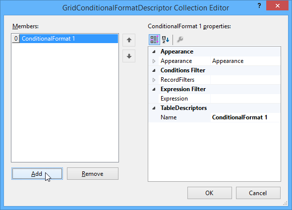
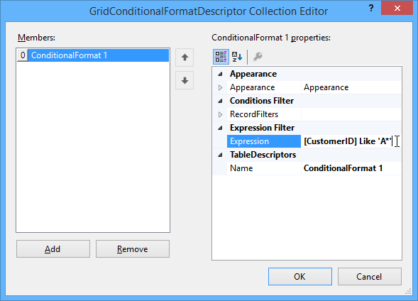

# Conditional Formatting
GridGroupingControl provides built-in support for Conditional Formatting. It is used to format grid cells based on a certain conditions. The conditional formatting can be added to the GridGroupingControl by defining the [GridConditionalFormatDescriptor](http://help.syncfusion.com/cr/cref_files/windowsforms/grid/Syncfusion.Grid.Grouping.Windows~Syncfusion.Windows.Forms.Grid.Grouping.GridConditionalFormatDescriptor.html). This descriptor is used to specify the filter criteria for the cells and the style to be applied for filtered cells.  

The following steps are used to add the conditional formatting through the editor,

1. Navigate the Property window of GridGroupingControl to the **TableDescriptor -> ConditionalFormats** and click the browse button to open the `GridConditionalColumnDescriptor` collection editor,
  
  

2. Click the `Add` button of the editor. It will add a new conditional format to the collection

3. Add the expression to the Expression filed option. (Ex: [ColumnName] like ‘A*’) 

4. Set the style for the records that satisfies the filter criteria by using the Appearance option

5.  Click the `OK` button and run the application. The conditional formatting will be applied to the records as of follows,

    

## Programmatic Conditional Formatting 
The conditional formatting can be programmatically added to the GridGroupingControl by defining the `GridConditionalFormatDescriptor` collection. It can be used to add the number of formatters to set the filter criteria and appearance. The filter criteria can be specified either by adding [RecordFilters](http://help.syncfusion.com/cr/cref_files/windowsforms/grid/Syncfusion.Grid.Grouping.Windows~Syncfusion.Windows.Forms.Grid.Grouping.GridConditionalFormatDescriptor~RecordFilters.html) or by an [Expression](http://help.syncfusion.com/cr/cref_files/windowsforms/grid/Syncfusion.Grid.Grouping.Windows~Syncfusion.Windows.Forms.Grid.Grouping.GridConditionalFormatDescriptor~Expression.html). 



//Define Conditional Format Descriptor and specify filter criteria and style to be applied.
//Applies the following style to the records whose CustomerID starts with 'A'.
GridConditionalFormatDescriptor format1 = new GridConditionalFormatDescriptor();
format1.Appearance.AnyRecordFieldCell.Interior = new BrushInfo(Color.FromArgb(255, 191, 52));
format1.Appearance.AnyRecordFieldCell.TextColor = Color.White;
format1.Expression = "[CustomerID]  LIKE \'A*\'";
format1.Name = "ConditionalFormat 1";

//Applies the following style to the records whose ContactTitle = 'Sales Representative'.
GridConditionalFormatDescriptor format2 = new GridConditionalFormatDescriptor();
format2.Appearance.AnyRecordFieldCell.Font.Bold = true;
format2.Appearance.AnyRecordFieldCell.Interior = new BrushInfo(Color.FromArgb(102, 110, 152));
format2.Appearance.AnyRecordFieldCell.TextColor = Color.White;
format2.Expression = "[ContactTitle] LIKE \'Sales Representative\'";
format2.Name = "ConditionalFormat 2";

// Add the descriptor to the TableDescriptor.ConditionalFormats property.
this.gridGroupingControl1.TableDescriptor.ConditionalFormats.Add(format1);
this.gridGroupingControl1.TableDescriptor.ConditionalFormats.Add(format2);



'Define Conditional Format Descriptor and specify filter criteria and style to be applied.
'Applies the following style to the records whose CustomerID starts with 'A'.
Dim format1 As New GridConditionalFormatDescriptor()
format1.Appearance.AnyRecordFieldCell.Interior = New BrushInfo(Color.FromArgb(255, 191, 52))
format1.Appearance.AnyRecordFieldCell.TextColor = Color.White
format1.Expression = "[CustomerID]  LIKE 'A*'"
format1.Name = "ConditionalFormat 1"

'Applies the following style to the records whose ContactTitle = 'Sales Representative'.
Dim format2 As New GridConditionalFormatDescriptor()
format2.Appearance.AnyRecordFieldCell.Font.Bold = True
format2.Appearance.AnyRecordFieldCell.Interior = New BrushInfo(Color.FromArgb(102, 110, 152))
format2.Appearance.AnyRecordFieldCell.TextColor = Color.White
format2.Expression = "[ContactTitle] LIKE 'Sales Representative'"
format2.Name = "ConditionalFormat 2"

'Add the descriptor to the TableDescriptor.ConditionalFormats property.
Me.gridGroupingControl1.TableDescriptor.ConditionalFormats.Add(format1)
Me.gridGroupingControl1.TableDescriptor.ConditionalFormats.Add(format2)



N> The conditional formatting is implemented in the following dashboard sample,
&lt;Install_Location&gt;\Syncfusion\EssentialStudio\[Version_Number]\Windows\Grid.Grouping.Windows\Samples\Styling and Formatting\Conditional Formatting Demo

## Formatting Preview Rows
The appearance of the record [preview ](http://help.syncfusion.com/windowsforms/gridgrouping/faq/layout-and-appearance/how-to-set-texts-in-the-preview-record)row can be customized by using the conditional formatting.



//Enable Record Preview Rows 
this.gridGroupingControl1.TableOptions.ShowRecordPreviewRow = true;

GridConditionalFormatDescriptor conditionalFormat1 = new GridConditionalFormatDescriptor();
conditionalFormat1.Appearance.RecordPreviewCell.Interior = new BrushInfo(Color.FromArgb(255, 191, 52));
conditionalFormat1.Expression = "[City]  Like \'L*\' ";

GridConditionalFormatDescriptor conditionalFormat2 = new GridConditionalFormatDescriptor();
conditionalFormat2.Appearance.RecordPreviewCell.Interior = new BrushInfo(Color.FromArgb(102, 110, 152));
conditionalFormat2.Expression = "[CompanyName]  Like \'A*\' ";
//Adding conditional format to the grid
this.gridGroupingControl1.TableDescriptor.ConditionalFormats.Add(conditionalFormat1);
this.gridGroupingControl1.TableDescriptor.ConditionalFormats.Add(conditionalFormat2);


'Enable Record Preview Rows 
Me.gridGroupingControl1.TableOptions.ShowRecordPreviewRow = True

Dim conditionalFormat1 As New GridConditionalFormatDescriptor()
conditionalFormat1.Appearance.RecordPreviewCell.Interior = New BrushInfo(Color.FromArgb(255, 191, 52))
conditionalFormat1.Expression = "[City]  Like 'L*' "

Dim conditionalFormat2 As New GridConditionalFormatDescriptor()
conditionalFormat2.Appearance.RecordPreviewCell.Interior = New BrushInfo(Color.FromArgb(102, 110, 152))
conditionalFormat2.Expression = "[CompanyName]  Like 'A*' "
'Adding conditional format to the grid
Me.gridGroupingControl1.TableDescriptor.ConditionalFormats.Add(conditionalFormat1)
Me.gridGroupingControl1.TableDescriptor.ConditionalFormats.Add(conditionalFormat2)



## Formatting Based on Checkbox Value
The back color of the record can be changed dynamically based on the checkbox value of the particular column. The following code snippet is demonstrates how to add the filter criteria for check box column,



//Setting the Checkbox column 
this.gridGroupingControl1.TableDescriptor.Columns["CompanyName"].Appearance.AnyRecordFieldCell.CellType = "CheckBox";

GridConditionalFormatDescriptor format1 = new GridConditionalFormatDescriptor();
format1.Appearance.AnyRecordFieldCell.Interior = new BrushInfo(Color.FromArgb(255, 191, 52));
format1.Appearance.AnyRecordFieldCell.TextColor = Color.White;
format1.Expression = "[CompanyName]  Like \'true\'";
format1.Name = "ConditionalFormat 1";

// Add the descriptor to the TableDescriptor.ConditionalFormats property.
this.gridGroupingControl1.TableDescriptor.ConditionalFormats.Add(format1);


'Setting the Checkbox column 
Me.gridGroupingControl1.TableDescriptor.Columns("CompanyName").Appearance.AnyRecordFieldCell.CellType = "CheckBox"

Dim format1 As New GridConditionalFormatDescriptor()
format1.Appearance.AnyRecordFieldCell.Interior = New BrushInfo(Color.FromArgb(255, 191, 52))
format1.Appearance.AnyRecordFieldCell.TextColor = Color.White
format1.Expression = "[CompanyName]  Like 'true'"
format1.Name = "ConditionalFormat 1"

' Add the descriptor to the TableDescriptor.ConditionalFormats property.
Me.gridGroupingControl1.TableDescriptor.ConditionalFormats.Add(format1)



After applying the conditional formatting the color will be changed for the records which are checked in the check box field.

## Data Bar
Data bar is an Excel Inspired Data bar which is used to visualize the negative and positive values of the column in a different range of colors. The data bars will be drawn based on the criteria given in the expression of the [ConditionalFormats](http://help.syncfusion.com/cr/cref_files/windowsforms/grid/Syncfusion.Grid.Grouping.Windows~Syncfusion.Windows.Forms.Grid.Grouping.GridTableDescriptor~ConditionalFormats.html).



//Initialize the GridConditionalFormatDescriptor and ConditionalFormatDataBarRule.
GridConditionalFormatDescriptor conditionalDescriptor = new GridConditionalFormatDescriptor();
//object for data bar rule
ConditionalFormatDataBarRule conditionDataBarRule1 = new ConditionalFormatDataBarRule();
//Assigning column for data bar
conditionDataBarRule1.ColumnName = "Profit";
//Adding the rule to rules collection
conditionalDescriptor.Rules.Add(conditionDataBarRule1);
//Adding descriptor.
this.gridGroupingControl1.TableDescriptor.ConditionalFormats.Add(conditionalDescriptor);


'Initialize the GridConditionalFormatDescriptor and ConditionalFormatDataBarRule.
Dim conditionalDescriptor As New GridConditionalFormatDescriptor()
'object for data bar rule
Dim conditionDataBarRule1 As New ConditionalFormatDataBarRule()
'Assigning column for data bar
conditionDataBarRule1.ColumnName = "Profit"
'Adding the rule to rules collection
conditionalDescriptor.Rules.Add(conditionDataBarRule1)
'Adding descriptor.
Me.gridGroupingControl1.TableDescriptor.ConditionalFormats.Add(conditionalDescriptor)



## Dynamic Formatting
The cells can be formatted dynamically based on the given condition by using the [QueryCellStyleInfo](http://help.syncfusion.com/cr/cref_files/windowsforms/grid/Syncfusion.Grid.Grouping.Windows~Syncfusion.Windows.Forms.Grid.Grouping.GridEngine~QueryCellStyleInfo_EV.html) event. The appearance of the cells can be changed dynamically by using this formatting.



this.gridGroupingControl1.QueryCellStyleInfo += new GridTableCellStyleInfoEventHandler(gridGroupingControl1_QueryCellStyleInfo);
void gridGroupingControl1_QueryCellStyleInfo(object sender, GridTableCellStyleInfoEventArgs e)
{
    if (e.Style.Text.StartsWith("A"))
    {
        e.Style.BackColor = Color.LightGreen;
    }
}


AddHandler gridGroupingControl1.QueryCellStyleInfo, AddressOf gridGroupingControl1_QueryCellStyleInfo
Private Sub gridGroupingControl1_QueryCellStyleInfo(ByVal sender As Object, ByVal e As GridTableCellStyleInfoEventArgs)
    If e.Style.Text.StartsWith("A") Then
        e.Style.BackColor = Color.LightGreen
    End If
End Sub



