# Conditional Formatting
GridGroupingControl provides built-in support for Conditional Formatting. It is used to format grid cells based on a certain conditions. The conditional formatting can be added to the GridGroupingControl by defining the [GridConditionalFormatDescriptor](http://help.syncfusion.com/cr/windowsforms/Syncfusion.Windows.Forms.Grid.Grouping.GridConditionalFormatDescriptor.html). This descriptor is used to specify the filter criteria for the cells and the style to be applied for filtered cells.  

The following steps are used to add the conditional formatting through the editor,

1. Navigate the Property window of GridGroupingControl to the **TableDescriptor -> ConditionalFormats** and click the browse button to open the `GridConditionalColumnDescriptor` collection editor,
  
  

2. Click the `Add` button of the editor. It will add a new conditional format to the collection

3. Add the expression to the Expression filed option. (Ex: [ColumnName] like ‘A*’) 

4. Set the style for the records that satisfies the filter criteria by using the Appearance option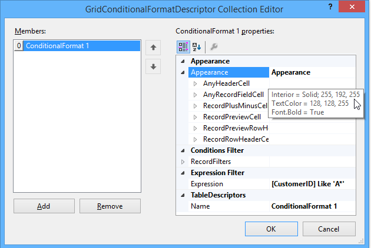

5.  Click the `OK` button and run the application. The conditional formatting will be applied to the records as of follows,

    

## Programmatic Conditional Formatting 
The conditional formatting can be programmatically added to the GridGroupingControl by defining the `GridConditionalFormatDescriptor` collection. It can be used to add the number of formatters to set the filter criteria and appearance. The filter criteria can be specified either by adding [RecordFilters](https://help.syncfusion.com/cr/windowsforms/Syncfusion.Windows.Forms.Grid.Grouping.GridConditionalFormatDescriptor.html#Syncfusion_Windows_Forms_Grid_Grouping_GridConditionalFormatDescriptor_RecordFilters) or by an [Expression](https://help.syncfusion.com/cr/windowsforms/Syncfusion.Windows.Forms.Grid.Grouping.GridConditionalFormatDescriptor.html#Syncfusion_Windows_Forms_Grid_Grouping_GridConditionalFormatDescriptor_Expression). 



//Define Conditional Format Descriptor and specify filter criteria and style to be applied.

//Applies the following style to the records whose CustomerID starts with 'A'.
GridConditionalFormatDescriptor format1 = new GridConditionalFormatDescriptor();
format1.Appearance.AnyRecordFieldCell.Interior = new BrushInfo(Color.FromArgb(255, 191, 52));
format1.Appearance.AnyRecordFieldCell.TextColor = Color.White;
format1.Expression = "[CustomerID]  LIKE \'A*\'";
format1.Name = "ConditionalFormat 1";

//Applies the following style to the records whose ContactTitle = 'Sales Representative'.
GridConditionalFormatDescriptor format2 = new GridConditionalFormatDescriptor();
format2.Appearance.AnyRecordFieldCell.Font.Bold = true;
format2.Appearance.AnyRecordFieldCell.Interior = new BrushInfo(Color.FromArgb(102, 110, 152));
format2.Appearance.AnyRecordFieldCell.TextColor = Color.White;
format2.Expression = "[ContactTitle] LIKE \'Sales Representative\'";
format2.Name = "ConditionalFormat 2";

// Add the descriptor to the TableDescriptor.ConditionalFormats property.
this.gridGroupingControl1.TableDescriptor.ConditionalFormats.Add(format1);
this.gridGroupingControl1.TableDescriptor.ConditionalFormats.Add(format2);



'Define Conditional Format Descriptor and specify filter criteria and style to be applied.

'Applies the following style to the records whose CustomerID starts with 'A'.
Dim format1 As New GridConditionalFormatDescriptor()
format1.Appearance.AnyRecordFieldCell.Interior = New BrushInfo(Color.FromArgb(255, 191, 52))
format1.Appearance.AnyRecordFieldCell.TextColor = Color.White
format1.Expression = "[CustomerID]  LIKE 'A*'"
format1.Name = "ConditionalFormat 1"

'Applies the following style to the records whose ContactTitle = 'Sales Representative'.
Dim format2 As New GridConditionalFormatDescriptor()
format2.Appearance.AnyRecordFieldCell.Font.Bold = True
format2.Appearance.AnyRecordFieldCell.Interior = New BrushInfo(Color.FromArgb(102, 110, 152))
format2.Appearance.AnyRecordFieldCell.TextColor = Color.White
format2.Expression = "[ContactTitle] LIKE 'Sales Representative'"
format2.Name = "ConditionalFormat 2"

'Add the descriptor to the TableDescriptor.ConditionalFormats property.
Me.gridGroupingControl1.TableDescriptor.ConditionalFormats.Add(format1)
Me.gridGroupingControl1.TableDescriptor.ConditionalFormats.Add(format2)



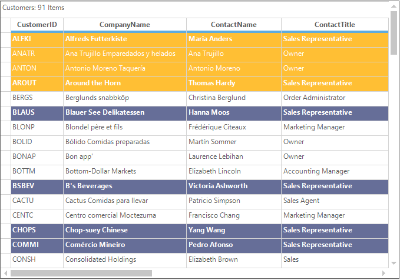

N> The conditional formatting is implemented in the following dashboard sample,
&lt;Install_Location&gt;\Syncfusion\EssentialStudio\[Version_Number]\Windows\Grid.Grouping.Windows\Samples\Styling and Formatting\Conditional Formatting Demo

## Formatting Preview Rows
The appearance of the record [preview ](http://help.syncfusion.com/windowsforms/gridgrouping/faq/layout-and-appearance/how-to-set-texts-in-the-preview-record)row can be customized by using the conditional formatting.



//Enable Record Preview Rows 
this.gridGroupingControl1.TableOptions.ShowRecordPreviewRow = true;

GridConditionalFormatDescriptor conditionalFormat1 = new GridConditionalFormatDescriptor();
conditionalFormat1.Appearance.RecordPreviewCell.Interior = new BrushInfo(Color.FromArgb(255, 191, 52));
conditionalFormat1.Expression = "[City]  Like \'L*\' ";

GridConditionalFormatDescriptor conditionalFormat2 = new GridConditionalFormatDescriptor();
conditionalFormat2.Appearance.RecordPreviewCell.Interior = new BrushInfo(Color.FromArgb(102, 110, 152));
conditionalFormat2.Expression = "[CompanyName]  Like \'A*\' ";

//Adding conditional format to the grid
this.gridGroupingControl1.TableDescriptor.ConditionalFormats.Add(conditionalFormat1);
this.gridGroupingControl1.TableDescriptor.ConditionalFormats.Add(conditionalFormat2);


'Enable Record Preview Rows 
Me.gridGroupingControl1.TableOptions.ShowRecordPreviewRow = True

Dim conditionalFormat1 As New GridConditionalFormatDescriptor()
conditionalFormat1.Appearance.RecordPreviewCell.Interior = New BrushInfo(Color.FromArgb(255, 191, 52))
conditionalFormat1.Expression = "[City]  Like 'L*' "

Dim conditionalFormat2 As New GridConditionalFormatDescriptor()
conditionalFormat2.Appearance.RecordPreviewCell.Interior = New BrushInfo(Color.FromArgb(102, 110, 152))
conditionalFormat2.Expression = "[CompanyName]  Like 'A*' "

'Adding conditional format to the grid
Me.gridGroupingControl1.TableDescriptor.ConditionalFormats.Add(conditionalFormat1)
Me.gridGroupingControl1.TableDescriptor.ConditionalFormats.Add(conditionalFormat2)



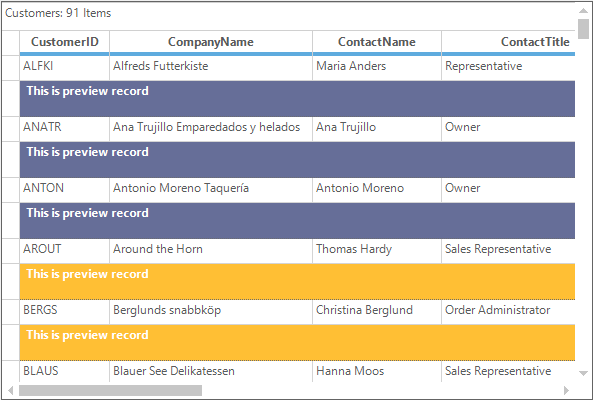

## Formatting Based on Checkbox Value
The back color of the record can be changed dynamically based on the checkbox value of the particular column. The following code snippet is demonstrates how to add the filter criteria for check box column,



//Setting the Checkbox column 
this.gridGroupingControl1.TableDescriptor.Columns["CompanyName"].Appearance.AnyRecordFieldCell.CellType = "CheckBox";

GridConditionalFormatDescriptor format1 = new GridConditionalFormatDescriptor();
format1.Appearance.AnyRecordFieldCell.Interior = new BrushInfo(Color.FromArgb(255, 191, 52));
format1.Appearance.AnyRecordFieldCell.TextColor = Color.White;
format1.Expression = "[CompanyName]  Like \'true\'";
format1.Name = "ConditionalFormat 1";

// Add the descriptor to the TableDescriptor.ConditionalFormats property.
this.gridGroupingControl1.TableDescriptor.ConditionalFormats.Add(format1);


'Setting the Checkbox column 
Me.gridGroupingControl1.TableDescriptor.Columns("CompanyName").Appearance.AnyRecordFieldCell.CellType = "CheckBox"

Dim format1 As New GridConditionalFormatDescriptor()
format1.Appearance.AnyRecordFieldCell.Interior = New BrushInfo(Color.FromArgb(255, 191, 52))
format1.Appearance.AnyRecordFieldCell.TextColor = Color.White
format1.Expression = "[CompanyName]  Like 'true'"
format1.Name = "ConditionalFormat 1"

' Add the descriptor to the TableDescriptor.ConditionalFormats property.
Me.gridGroupingControl1.TableDescriptor.ConditionalFormats.Add(format1)



After applying the conditional formatting the color will be changed for the records which are checked in the check box field.

## Dynamic Formatting
The cells can be formatted dynamically based on the given condition by using the [QueryCellStyleInfo](https://help.syncfusion.com/cr/windowsforms/Syncfusion.Windows.Forms.Grid.Grouping.GridEngine.html) event. The appearance of the cells can be changed dynamically by using this formatting.



this.gridGroupingControl1.QueryCellStyleInfo += new GridTableCellStyleInfoEventHandler(gridGroupingControl1_QueryCellStyleInfo);
void gridGroupingControl1_QueryCellStyleInfo(object sender, GridTableCellStyleInfoEventArgs e)
{

    if (e.Style.Text.StartsWith("A"))
    {
        e.Style.BackColor = Color.LightGreen;
    }
}


AddHandler gridGroupingControl1.QueryCellStyleInfo, AddressOf gridGroupingControl1_QueryCellStyleInfo

Private Sub gridGroupingControl1_QueryCellStyleInfo(ByVal sender As Object, ByVal e As GridTableCellStyleInfoEventArgs)

    If e.Style.Text.StartsWith("A") Then
        e.Style.BackColor = Color.LightGreen
    End If
End Sub



## Data Bar
Data bar is an Excel Inspired Data bar which is used to visualize the negative and positive values of the column in a different range of colors. The data bars will be drawn based on the criteria given in the expression of the [ConditionalFormats](https://help.syncfusion.com/cr/windowsforms/Syncfusion.Windows.Forms.Grid.Grouping.GridTableDescriptor.html#Syncfusion_Windows_Forms_Grid_Grouping_GridTableDescriptor_ConditionalFormats).

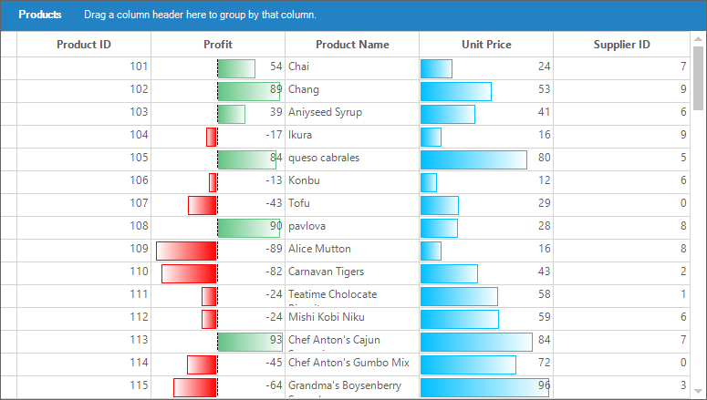

The following steps can be followed to add the data bar through the editor,
1.Navigate the Property window of GridGroupingControl to the **TableDescriptor** -> **ConditionalFormats** and click the browse button to open the [GridConditionalFormatDescriptor](http://help.syncfusion.com/cr/windowsforms/Syncfusion.Windows.Forms.Grid.Grouping.GridConditionalFormatDescriptor.html) collection editor.

2.In the `GridConditionalFormatDescriptor` Collection Editor, any expression can be added to the `Expression` field for drawing the data bars within that criteria. (Ex: [UnitPrice] < ‘80’) With this expression, no data bar will be drawn in the record if the cell value of the `UnitPrice` column will be greater than `80`.

Then, Navigate into the `GridConditionalFormatDescriptor` collection editor window and select the [Rules](https://help.syncfusion.com/cr/windowsforms/Syncfusion.Windows.Forms.Grid.Grouping.GridConditionalFormatDescriptor.html#Syncfusion_Windows_Forms_Grid_Grouping_GridConditionalFormatDescriptor_Rules) property to open the Rule Collection Editor window.  

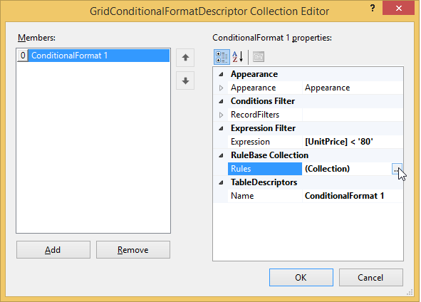

N> Data bar can also be drawn without expression.

3.Choose the rule type as `DataBar` and click `Add` button, it will add a new[ConditionalFormatDataBarRule](http://help.syncfusion.com/cr/windowsforms/Syncfusion.Windows.Forms.Grid.Grouping.ConditionalFormatDataBarRule.html) to the [ConditionalFormatRuleBaseCollection](http://help.syncfusion.com/cr/windowsforms/Syncfusion.Windows.Forms.Grid.Grouping.ConditionalFormatRuleBaseCollection.html). Set the column name and style for data bar rule.

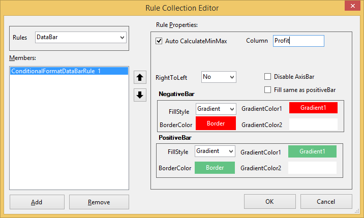

Click the `OK` button to add the `ConditionalFormatDataBarRule` to the conditional format collection. And, the data bar for the `Unit Price` column will be displayed as follows,

### Programmatically Adding Data bar
The data bar rule can be added programmatically by defining `ConditionalFormatDataBarRule` and assigning it to the `GridConditionalFormatDescriptor`. 



//Initialize the GridConditionalFormatDescriptor and ConditionalFormatDataBarRule.
GridConditionalFormatDescriptor conditionalDescriptor = new GridConditionalFormatDescriptor();

//object for data bar rule
ConditionalFormatDataBarRule conditionDataBarRule1 = new ConditionalFormatDataBarRule();

//Assigning column for data bar
conditionDataBarRule1.ColumnName = "Profit";

//Adding the rule to rules collection
conditionalDescriptor.Rules.Add(conditionDataBarRule1);

//Adding descriptor.
this.gridGroupingControl1.TableDescriptor.ConditionalFormats.Add(conditionalDescriptor);


'Initialize the GridConditionalFormatDescriptor and ConditionalFormatDataBarRule.
Dim conditionalDescriptor As New GridConditionalFormatDescriptor()

'object for data bar rule
Dim conditionDataBarRule1 As New ConditionalFormatDataBarRule()

'Assigning column for data bar
conditionDataBarRule1.ColumnName = "Profit"

'Adding the rule to rules collection
conditionalDescriptor.Rules.Add(conditionDataBarRule1)

'Adding descriptor.
Me.gridGroupingControl1.TableDescriptor.ConditionalFormats.Add(conditionalDescriptor)



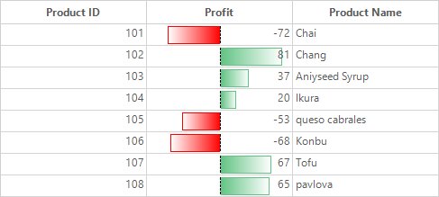

### Calculating Minimum and Maximum values
The length of the data bar will be drawn based on the minimum and maximum value of the column. These minimum and maximum values can be calculated automatically if the [ConditionalFormatDataBarRule.AutoCalculateMinMax](https://help.syncfusion.com/cr/windowsforms/Syncfusion.Windows.Forms.Grid.Grouping.ConditionalFormatDataBarRule.html#Syncfusion_Windows_Forms_Grid_Grouping_ConditionalFormatDataBarRule_AutoCalculateMinMax) is set to `true`. This is the default value.

Minimum and maximum values can also be defined through [ConditionalFormatDataBarRule.Maximum](https://help.syncfusion.com/cr/windowsforms/Syncfusion.Windows.Forms.Grid.Grouping.ConditionalFormatDataBarRule.html#Syncfusion_Windows_Forms_Grid_Grouping_ConditionalFormatDataBarRule_Maximum) and [ConditionalFormatDataBarRule.Minimum](https://help.syncfusion.com/cr/windowsforms/Syncfusion.Windows.Forms.Grid.Grouping.ConditionalFormatDataBarRule.html#Syncfusion_Windows_Forms_Grid_Grouping_ConditionalFormatDataBarRule_Minimum) by disabling the `ConditionalFormatDataBarRule.AutoCalculateMinMax` property

N> If `ConditionalFormatDataBarRule.AutoCalculateMinMax` is set as `false`, then it is mandatory to assign values for `ConditionalFormatDataBarRule.Maximum`, `ConditionalFormatDataBarRule.Minimum`.



ConditionalFormatDataBarRule dataBarRule = new ConditionalFormatDataBarRule();

//setting automatic calculation enable or disable.
dataBarRule.AutoCalculateMinMax = false;

//Setting Maximum and minimum values
dataBarRule.Maximum = 50;
dataBarRule.Minimum = -10;


Dim dataBarRule As New ConditionalFormatDataBarRule()

'setting automatic calculation enable or disable.
dataBarRule.AutoCalculateMinMax = False

'Setting Maximum and minimum values
dataBarRule.Maximum = 50
dataBarRule.Minimum = -10



### Default Colors of Positive and Negative bars
If no colors assigned for positive and negative bars, it will take the below default color values. 



ConditionalFormatDataBarRule dataBarRule = new ConditionalFormatDataBarRule();

//Setting appearance for Positive cells.
dataBarRule.PositiveBar.FillStyle = FillStyles.Gradient;
dataBarRule.PositiveBar.GradientFillColor1 = Color.FromArgb(255, 99, 195, 132);
dataBarRule.PositiveBar.GradientFillColor2 = Color.FromArgb(255, 255, 255);
dataBarRule.PositiveBar.BorderColor = conditionDataBarRule2.PositiveBar.GradientFillColor1;

//Setting appearance for Negative cells.
dataBarRule.NegativeBar.FillStyle = FillStyles.Gradient;
dataBarRule.NegativeBar.GradientFillColor1 = Color.Red;
dataBarRule.NegativeBar.GradientFillColor2 = Color.FromArgb(255, 255, 255);
dataBarRule.NegativeBar.BorderColor = Color.Red;


Dim dataBarRule As New ConditionalFormatDataBarRule()

'Setting appearance for Positive cells.
dataBarRule.PositiveBar.FillStyle = FillStyles.Gradient
dataBarRule.PositiveBar.GradientFillColor1 = Color.DeepSkyBlue
dataBarRule.PositiveBar.GradientFillColor2 = Color.FromArgb(255, 255, 255)
dataBarRule.PositiveBar.BorderColor = conditionDataBarRule2.PositiveBar.GradientFillColor1

'Setting appearance for Negative cells.
dataBarRule.NegativeBar.FillStyle = FillStyles.Gradient
dataBarRule.NegativeBar.GradientFillColor1 = Color.Red
dataBarRule.NegativeBar.GradientFillColor2 = Color.FromArgb(255, 255, 255)
dataBarRule.NegativeBar.BorderColor = Color.Red



### Setting Positive and Negative bar Colors
The border color, fill color and fill style can be changed for positive and negative bars. The fill style can be `Solid` or `Gradient`.

#### Applying Solid color
To apply solid fill color for data bars, it is necessary to choose [ConditionalFormatDataBarRule.FillStyle](https://help.syncfusion.com/cr/windowsforms/Syncfusion.Windows.Forms.Grid.Grouping.BarStyleInfo.html#Syncfusion_Windows_Forms_Grid_Grouping_BarStyleInfo_FillStyle) as `Solid` from [FillStyle](http://help.syncfusion.com/cr/windowsforms/Syncfusion.Windows.Forms.Grid.Grouping.FillStyle.html) option.



//Initialize the GridConditionalFormatDescriptor and ConditionalFormatDataBarRule.
GridConditionalFormatDescriptor ConditionalDescriptor1 = new GridConditionalFormatDescriptor();
ConditionalFormatDataBarRule dataBarRule = new ConditionalFormatDataBarRule();

//Setting appearance for Positive cells.
dataBarRule.PositiveBar.FillStyle = FillStyle.Solid;
dataBarRule.PositiveBar.SolidFillColor = Color.Purple;
dataBarRule.PositiveBar.BorderColor = Color. Purple;

//Setting appearance for Negative cells.
dataBarRule.NegativeBar.FillStyle = FillStyle.Solid;
dataBarRule.NegativeBar.SolidFillColor = Color.Orange;
dataBarRule.NegativeBar.BorderColor = Color.Orange;
	
//Adding DataBar Rule to the ConditionalFormatDescriptor.
ConditionalDescriptor1.Rules.Add(dataBarRule);

//Adding GridConditionalFormatDescriptor to GridGroupingControl.
this.gridGroupingControl1.TableDescriptor.ConditionalFormats.Add(ConditionalDescriptor1);


'Initialize the GridConditionalFormatDescriptor and ConditionalFormatDataBarRule.
Dim ConditionalDescriptor1 As New GridConditionalFormatDescriptor()
Dim dataBarRule As New ConditionalFormatDataBarRule()

'Setting appearance for Positive cells.
dataBarRule.PositiveBar.FillStyle = FillStyle.Solid
dataBarRule.PositiveBar.SolidFillColor = Color.Purple
dataBarRule.PositiveBar.BorderColor = Color.Purple

'Setting appearance for Negative cells.
dataBarRule.NegativeBar.FillStyle = FillStyle.Solid
dataBarRule.NegativeBar.SolidFillColor = Color.Orange
dataBarRule.NegativeBar.BorderColor = Color.Orange

'Adding DataBar Rule to the ConditionalFormatDescriptor.
ConditionalDescriptor1.Rules.Add(dataBarRule)

'Adding GridConditionalFormatDescriptor to GridGroupingControl.
Me.gridGroupingControl1.TableDescriptor.ConditionalFormats.Add(ConditionalDescriptor1)



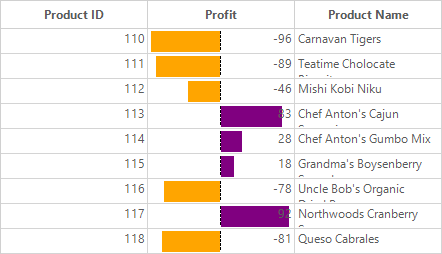

#### Applying Gradient Fill Colors
Choose `FillStyle` as `Gradient` to apply gradient colors for both positive and negative bars.



//Initialize the GridConditionalFormatDescriptor and ConditionalFormatDataBarRule.
GridConditionalFormatDescriptor ConditionalDescriptor1 = new GridConditionalFormatDescriptor();
ConditionalFormatDataBarRule dataBarRule = new ConditionalFormatDataBarRule();

//Setting appearance for Positive cells.
dataBarRule.PositiveBar.FillStyle = FillStyle.Gradient;
dataBarRule.PositiveBar.GradientFillColor1 = Color.Purple;
dataBarRule.PositiveBar.GradientFillColor2 = Color.FromArgb(255, 255, 255);
dataBarRule.PositiveBar.BorderColor = Color.Purple;

//Setting appearance for Negative cells.
dataBarRule.NegativeBar.FillStyle = FillStyle.Gradient;
dataBarRule.NegativeBar.GradientFillColor1 = Color.Orange;
dataBarRule.NegativeBar.GradientFillColor2 = Color.FromArgb(255, 255, 255);
dataBarRule.NegativeBar.BorderColor = Color.Orange;

//Adding DataBar Rule to the ConditionalFormatDescriptor.
ConditionalDescriptor1.Rules.Add(conditionDataBarRule1);

//Adding GridConditionalFormatDescriptor to GridGroupingControl.
this.gridGroupingControl1.TableDescriptor.ConditionalFormats.Add(ConditionalDescriptor1);


'Initialize the GridConditionalFormatDescriptor and ConditionalFormatDataBarRule.
Dim ConditionalDescriptor1 As New GridConditionalFormatDescriptor()
Dim dataBarRule As New ConditionalFormatDataBarRule()

'Setting appearance for Positive cells.
dataBarRule.PositiveBar.FillStyle = FillStyle.Gradient
dataBarRule.PositiveBar.GradientFillColor1 = Color.Purple
dataBarRule.PositiveBar.GradientFillColor2 = Color.FromArgb(255, 255, 255)
dataBarRule.PositiveBar.BorderColor = Color.Purple

'Setting appearance for Negative cells.
dataBarRule.NegativeBar.FillStyle = FillStyle.Gradient
dataBarRule.NegativeBar.GradientFillColor1 = Color.Orange
dataBarRule.NegativeBar.GradientFillColor2 = Color.FromArgb(255, 255, 255)
dataBarRule.NegativeBar.BorderColor = Color.Orange

'Adding DataBar Rule to the ConditionalFormatDescriptor.
ConditionalDescriptor1.Rules.Add(conditionDataBarRule1)

'Adding GridConditionalFormatDescriptor to GridGroupingControl.
Me.gridGroupingControl1.TableDescriptor.ConditionalFormats.Add(ConditionalDescriptor1)



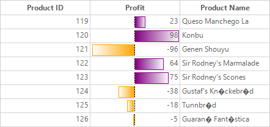

### Filling Negative bar Color as Same as Positive bar
When the [ConditionalFormatDataBarRule.FillNegativeColorAsPositive](https://help.syncfusion.com/cr/windowsforms/Syncfusion.Windows.Forms.Grid.Grouping.ConditionalFormatDataBarRule.html#Syncfusion_Windows_Forms_Grid_Grouping_ConditionalFormatDataBarRule_FillNegativeColorSameAsPositive) is enabled, then the positive bar `FillStyle`, `SolidFillColor`, `GradientColors`, `BorderColor` are copied to negative bar.



//Applying same color for negative Bar as like positive.
dataBarRule.FillNegativeColorSameAsPositive = true;


'Applying same color for negativeBar cell as like positive.
dataBarRule.FillNegativeColorSameAsPositive = True



### Disabling Axis
The axis between positive and negative bars can be disabled or enabled by using [ConditionalFormatDataBarRule.AxisPosition](https://help.syncfusion.com/cr/windowsforms/Syncfusion.Windows.Forms.Grid.Grouping.ConditionalFormatDataBarRule.html#Syncfusion_Windows_Forms_Grid_Grouping_ConditionalFormatDataBarRule_AxisPosition) property.

**Automatic** – Axis position will be assigned based on the highest minimum value. 
**None** - Draws both negative and positive in the same direction.



// calculates axis position based on particular column minimum and maximum values.
dataBarRule.AxisPosition = AxisPosition.None;


'Calculates axis bar position based on particular column minimum and maximum values.
dataBarRule.AxisPosition = AxisPosition.None;



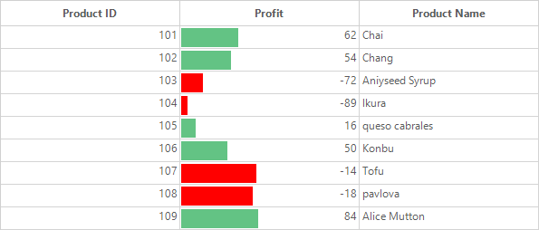

### Applying Axis Color
Axis color can be changed by using [ConditionalFormatDataBarRule.AxisColor](https://help.syncfusion.com/cr/windowsforms/Syncfusion.Windows.Forms.Grid.Grouping.ConditionalFormatDataBarRule.html#Syncfusion_Windows_Forms_Grid_Grouping_ConditionalFormatDataBarRule_AxisColor) property. Default color is `Black`.



//Apply color to the axis bar.
conditionDataBarRule1.AxisColor = Color.Red;


'Apply color to the axis bar.
conditionDataBarRule1.AxisColor = Color.Red



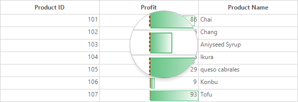

### Getting Rule through Column Name
The rule applied for the specific column can be retrieved by using the [GridConditionalFormatDescriptor.GetRule](https://help.syncfusion.com/cr/windowsforms/Syncfusion.Windows.Forms.Grid.Grouping.GridConditionalFormatDescriptor.html#Syncfusion_Windows_Forms_Grid_Grouping_GridConditionalFormatDescriptor_GetRule_System_String_) method.



//Getting conditional format descriptor.
GridConditionalFormatDescriptor conditionalDescriptor = this.gridGroupingControl1.TableDescriptor.ConditionalFormats[0]; 
 
 // Gets the rule applied to the Unit Price column.
ConditionalFormatDataBarRule  rule = conditionalDescriptor.GetRule("UnitPrice") as ConditionalFormatDataBarRule; 


'Getting conditional format descriptor.
Dim conditionalDescriptor As GridConditionalFormatDescriptor = Me.gridGroupingControl1.TableDescriptor.ConditionalFormats(0)

 ' Gets the rule applied to the Unit Price column.
Dim rule As ConditionalFormatDataBarRule = TryCast(conditionalDescriptor.GetRule("UnitPrice"), ConditionalFormatDataBarRule)



### Using Expressions
The data bar can be used in two ways, one is with [GridConditionalFormatDescriptor.Expression](https://help.syncfusion.com/cr/windowsforms/Syncfusion.Windows.Forms.Grid.Grouping.GridConditionalFormatDescriptor.html#Syncfusion_Windows_Forms_Grid_Grouping_GridConditionalFormatDescriptor_Expression) Filter condition; another one is without expression condition.

While having `GridConditionalFormatDescriptor.Expression` Filter condition for records, data bar will be drawn only on the filtered records. 

When there is no expression, data bar will be drawn for all the cell values in that particular column.



//Initialize the GridConditionalFormatDescriptor and ConditionalFormatDataBarRule.
GridConditionalFormatDescriptor ConditionalDescriptor1 = new Syncfusion.Windows.Forms.Grid.Grouping.GridConditionalFormatDescriptor();

//Define Expression for GridConditionalFormatDescriptor.
gridConditionalFormatDescriptor1.Expression = "[UnitPrice] > '0' AND [UnitPrice] < '70' ";

//Adding ConditionalFormatDescriptor with ConditionalFormats collection
this.gridGroupingControl1.TableDescriptor.ConditionalFormats.Add(ConditionalDescriptor1);


'Initialize the GridConditionalFormatDescriptor and ConditionalFormatDataBarRule.
Dim gridConditionalFormatDescriptor1 As New Syncfusion.Windows.Forms.Grid.Grouping.GridConditionalFormatDescriptor()

'Define Expression for GridConditionalFormatDescriptor.
gridConditionalFormatDescriptor1.Expression = "[UnitPrice] > '0' AND [UnitPrice] < '70' "

'Adding GridConditionalFormatDescriptor with TableDescriptor.ConditionalFormats collection
Me.gridGroupingControl1.TableDescriptor.ConditionalFormats.Add(gridConditionalFormatDescriptor1)


Data bar is drawn based on the expression `[UnitPrice] > '0' AND [UnitPrice] < '70'`

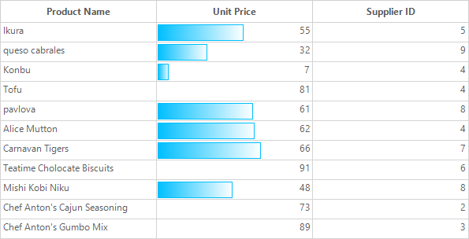

### Removing Data Bar
Data Bar can be cleared by removing `ConditionalFormatDataBarRule` objects from `ConditionalFormatRuleBaseCollection`.



//Getting conditional format descriptor.
GridConditionalFormatDescriptor conditionalDescriptor = this.gridGroupingControl1.TableDescriptor.ConditionalFormats[0]; 
 
 // Get the rule applied to the Unit Price column.
ConditionalFormatDataBarRule  rule = conditionalDescriptor.GetRule("UnitPrice") as ConditionalFormatDataBarRule; 

//Removing conditionalFormatDataBarRule 
conditionalDescriptor.Rules.Remove(rule);


Dim conditionalDescriptor As GridConditionalFormatDescriptor = Me.gridGroupingControl1.TableDescriptor.ConditionalFormats(0)

 ' Get the rule applied to the Unit Price column.
Dim rule As ConditionalFormatDataBarRule = TryCast(conditionalDescriptor.GetRule("UnitPrice"), ConditionalFormatDataBarRule)

'Removing conditionalFormatDataBarRule 
conditionalDescriptor.Rules.Remove(rule)

