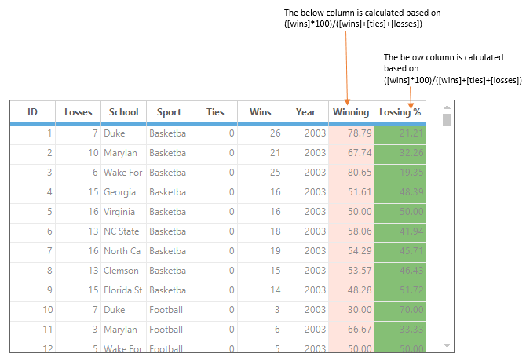
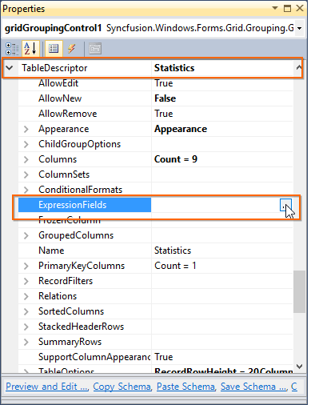
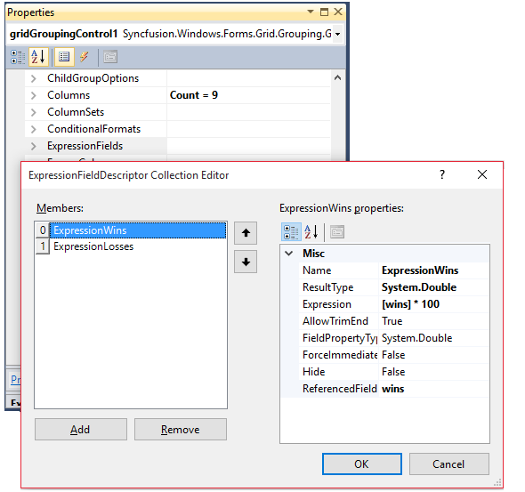
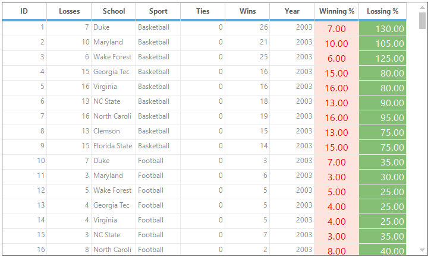
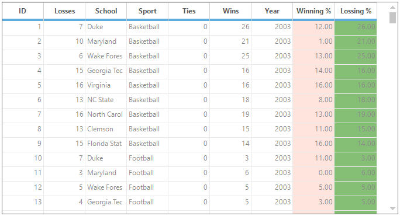

# Expression Fields in Windows Forms GridGrouping (GridGroupingControl)
The GridGroupingControl lets column to display the calculation results based on other fields in the same record. The calculation result can be displayed in a separate column i.e. unbound column. These expression columns can be visible or invisible, used in grouping and sorting, and may be employed as summary fields for summary rows.

The [ExpressionFields](https://help.syncfusion.com/cr/windowsforms/Syncfusion.Windows.Forms.Grid.Grouping.GridTableDescriptor.html) are maintained in the [ExpressionFieldsDescriptorCollection](http://help.syncfusion.com/cr/windowsforms/Syncfusion.Grouping.ExpressionFieldDescriptorCollection.html) in which each entry termed as [ExpressionFieldDescriptor](http://help.syncfusion.com/cr/windowsforms/Syncfusion.Grouping.ExpressionFieldDescriptor.html) defines one expression field. 

The below example shows the behavior of the ExpressionFields in the GridGroupingControl,

The ExpressionFields can be added to GridGroupingControl at design time by using the `ExpressionFields` property which is listed under the `TableDescriptor` category of the property window. The `ExpressionFieldDescriptor Collection Editor` is used to manage the `ExpressionFieldDescriptor`. 

The [ExpressionFieldDescriptor](http://help.syncfusion.com/cr/windowsforms/Syncfusion.Grouping.ExpressionFieldDescriptor.html) class has the following properties. 

* [Name](https://help.syncfusion.com/cr/windowsforms/Syncfusion.Grouping.FieldDescriptor.html#Syncfusion_Grouping_FieldDescriptor_Name) – Specifies the name of the Expression field.
* [Expression](https://help.syncfusion.com/cr/windowsforms/Syncfusion.Grouping.ExpressionFieldDescriptor.html#Syncfusion_Grouping_ExpressionFieldDescriptor_Expression) – Specifies the formula expression.
* [ResultType](https://help.syncfusion.com/cr/windowsforms/Syncfusion.Grouping.ExpressionFieldDescriptor.html#Syncfusion_Grouping_ExpressionFieldDescriptor_ResultType)  - Specifies the result type to which the expression should be converted.
* [ForceImmediateSaveValue](https://help.syncfusion.com/cr/windowsforms/Syncfusion.Grouping.FieldDescriptor.html#Syncfusion_Grouping_FieldDescriptor_ForceImmediateSaveValue) - Indicates whether the changes to the field in a record should trigger [SaveValue](https://help.syncfusion.com/cr/windowsforms/Syncfusion.Windows.Forms.Grid.Grouping.GridGroupingControl.html) event; Set it to False to avoid triggering [ListChanged](https://help.syncfusion.com/cr/windowsforms/Syncfusion.Windows.Forms.Grid.Grouping.GridTableDescriptor.html) events when the expression field is modified.
* [ReferencedFields](https://help.syncfusion.com/cr/windowsforms/Syncfusion.Grouping.FieldDescriptor.html#Syncfusion_Grouping_FieldDescriptor_ReferencedFields) - Saves a list of referenced field names used in the expression. Use semicolon as a delimiter to specify multiple fields. This list will be used by the engine to determine the cells to be updated when `ListChanged` event is triggered.

The following code will be generated after expression field is added at design time,



this.gridGroupingControl1.TableDescriptor.ExpressionFields.AddRange(new Syncfusion.Grouping.ExpressionFieldDescriptor[] {
new Syncfusion.Grouping.ExpressionFieldDescriptor("ExpressionWins", "[wins] * 100", "System.Double"),
new Syncfusion.Grouping.ExpressionFieldDescriptor("ExpressionLosses", "[losses] / 100", "System.Double")});


Me.gridGroupingControl1.TableDescriptor.ExpressionFields.AddRange(New Syncfusion.Grouping.ExpressionFieldDescriptor() { New Syncfusion.Grouping.ExpressionFieldDescriptor("ExpressionWins", "[wins] * 100", "System.Double"), New Syncfusion.Grouping.ExpressionFieldDescriptor("ExpressionLosses", "[losses] / 100", "System.Double")})



## Adding ExpressionFields Programmatically
The Expression fields can be added to grid programmatically by using `ExpressionFields` collection. The following set of codes are used to add the two expression fields in grid,



//Defines expression fields.
ExpressionFieldDescriptor exp1 = new ExpressionFieldDescriptor("Winning %", "([wins] *100)/([wins]+[ties]+[losses])", "System.Double");
ExpressionFieldDescriptor exp1 = new ExpressionFieldDescriptor("Loosing %", "([losses] *100)/([wins]+[ties]+[losses])", "System.Double");

//Adds expression fields to the grid table.
this.gridGroupingControl1.TableDescriptor.ExpressionFields.AddRange(new Syncfusion.Grouping.ExpressionFieldDescriptor[] { exp1, exp2 });


'Defines expression fields.
Dim exp1 As ExpressionFieldDescriptor = New ExpressionFieldDescriptor("Winning %", "([wins] *100)/([wins]+[ties]+[losses])", "System.Double")
Dim exp2 As ExpressionFieldDescriptor = New ExpressionFieldDescriptor("Loosing %", "([losses] *100)/([wins]+[ties]+[losses])", "System.Double")

'Adds the expression fields to the grid table.
this.gridGroupingControl1.TableDescriptor.ExpressionFields.AddRange(New Syncfusion.Grouping.ExpressionFieldDescriptor() {exp1, exp2})



## Expression column Appearance
The Appearance for the Expression column can be applied as like column styling by using the [Column.Appearance](https://help.syncfusion.com/cr/windowsforms/Syncfusion.Windows.Forms.Grid.Grouping.GridColumnDescriptor.html#Syncfusion_Windows_Forms_Grid_Grouping_GridColumnDescriptor_Appearance) property. The style attributes like BackColor, TextColor, Alignment etc., can be customized for Expression columns.




// Setting text color for "Winning %" column
this.gridGroupingControl1.TableDescriptor.Columns["Winning %"].Appearance.AnyRecordFieldCell.TextColor = Color.Red;
this.gridGroupingControl1.TableDescriptor.Columns["Winning %"].Appearance.AnyRecordFieldCell.Font.Facename = "Segoe UI";
this.gridGroupingControl1.TableDescriptor.Columns["Winning %"].Appearance.AnyRecordFieldCell.Font.Size = 12;
this.gridGroupingControl1.TableDescriptor.Columns["Winning %"].Appearance.AnyRecordFieldCell.HorizontalAlignment = GridHorizontalAlignment.Center;

// Setting text color for "Losing %" column
this.gridGroupingControl1.TableDescriptor.Columns["Losing %"].Appearance.AnyRecordFieldCell.TextColor = Color.White;
this.gridGroupingControl1.TableDescriptor.Columns["Losing %"].Appearance.AnyRecordFieldCell.Font.Facename = "Segoe UI";
this.gridGroupingControl1.TableDescriptor.Columns["Losing %"].Appearance.AnyRecordFieldCell.Font.Size = 12;
this.gridGroupingControl1.TableDescriptor.Columns["Winning %"].Appearance.AnyRecordFieldCell.HorizontalAlignment = GridHorizontalAlignment.Center;



' Setting text color for "Winning %" column
Me.gridGroupingControl1.TableDescriptor.Columns("Winning %").Appearance.AnyRecordFieldCell.TextColor = Color.Red
Me.gridGroupingControl1.TableDescriptor.Columns("Winning %").Appearance.AnyRecordFieldCell.Font.Facename = "Segoe UI"
Me.gridGroupingControl1.TableDescriptor.Columns("Winning %").Appearance.AnyRecordFieldCell.Font.Size = 12
Me.gridGroupingControl1.TableDescriptor.Columns("Winning %").Appearance.AnyRecordFieldCell.HorizontalAlignment = GridHorizontalAlignment.Center

' Setting text color for "Losing %" column
Me.gridGroupingControl1.TableDescriptor.Columns("Losing %").Appearance.AnyRecordFieldCell.TextColor = Color.White
Me.gridGroupingControl1.TableDescriptor.Columns("Losing %").Appearance.AnyRecordFieldCell.Font.Facename = "Segoe UI"
Me.gridGroupingControl1.TableDescriptor.Columns("Losing %").Appearance.AnyRecordFieldCell.Font.Size = 12
Me.gridGroupingControl1.TableDescriptor.Columns("Winning %").Appearance.AnyRecordFieldCell.HorizontalAlignment = GridHorizontalAlignment.Center




## List of Expressions
Expressions may be any well-formed algebraic combination of column mapping names enclosed with brackets `[]`, numerical constants and literals, and the algebraic and logical operators are listed below.

The computations are performed as listed with level one operations done first. Alpha constants used with match and like should be enclosed in apostrophes `'`.

* *, /: multiplication, division.
* +, -: addition, subtraction.
* &lt;, &gt;, =, &lt;=, &gt;=: less than, greater than, equal, less than or equal.
* match, like, in, between.
* or, and.

The following set of arithmetic and logical operators can be used to perform the calculation,

<table>
<tr>
<th>
EXPRESSION
</th>
<th>
SYNTAX
</th>
<th>
DESCRIPTION
</th>
<th>
EXAMPLE USAGE
</th>
</tr>
<tr>
<td>
Multiplication, Division
</td>
<td>
*,/
</td>
<td>
Multiplies/Divides first argument by second argument Multiplies/Divides first argument by second argument.
</td>
<td>
[Wins] * [Losses] / 100
</td>
</tr>
<tr>
<td>
Addition, Subtraction
</td>
<td>
+,-
</td>
<td>
Adds first argument with second argument/ Subtracts second argument from the first one.
</td>
<td>
[Wins]+[Losses]
</td>
</tr>
<tr>
<td>
Or
</td>
<td>
OR
</td>
<td>
Returns 1 if either the first argument or the second one returns true.
</td>
<td>
[Val]=50 OR [Val]=100
</td>
</tr>
<tr>
<td>
And
</td>
<td>
AND
</td>
<td>
Returns 1 if both parameters return true.
</td>
<td>
[Val]&lt; 50 AND [Val]&gt;100
</td>
</tr>
<tr>
<td>
Less than
</td>
<td>
<
</td>
<td>
Returns true if first parameter is less than the second one.
</td>
<td>
[OrderID] < 2000
</td>
</tr>
<tr>
<td>
Greater than
</td>
<td>
>
</td>
<td>
Returns true if first parameter is greater than the second one.
</td>
<td>
[OrderID] > 2500
</td>
</tr>
<tr>
<td>
Less than Or Equal to
</td>
<td>
<=
</td>
<td>
Returns true if first parameter is less than or equal to the second one.
</td>
<td>
[OrderID] <= 2050
</td>
</tr>
<tr>
<td>
Greater than Or Equal to
</td>
<td>
>=
</td>
<td>
Returns true if first parameter is greater than or equal to the second one.
</td>
<td>
[OrderID] >= 2056
</td>
</tr>
<tr>
<td>
Equal
</td>
<td>
=
</td>
<td>
Returns true if both arguments have the same value.
</td>
<td>
[CustomerID] = 90
</td>
</tr>
<tr>
<td>
Not Equal to
</td>
<td>
&lt;&gt;
</td>
<td>
Returns true if both arguments do not have same value.
</td>
<td>
[CustomerID] &lt;&gt; 95
</td>
</tr>
<tr>
<td>
Match
</td>
<td>
Match
</td>
<td>
Returns 1 if there is any occurrence of right-hand argument in the left-hand argument. For example, [CompanyName] match 'RTR' returns 0 for any record whose CompanyName field does not contain RTR anywhere in the string.
</td>
<td>
[Company] match 'Syncfusion'
</td>
</tr>
<tr>
<td>
Like
</td>
<td>
Like
</td>
<td>
Checks if the field starts exactly as specified in the right-hand argument. For example, [CompanyName] like 'RTR' returns 1 for any record whose CompanyName field is exactly RTR. You can use an asterisk as a wildcard. [CompanyName] like 'RTR*' returns 1 for any record whose CompanyName field starts with RTR. [CompanyName] like '*RTR' returns 1 for any record whose CompanyName field ends with RTR. 
</td>
<td>
[Sport] like 'Basket*'
</td>
</tr>
<tr>
<td>
In
</td>
<td>
In
</td>
<td>
Checks if the field value is any of the values listed in the right-hand operand. The collection of items used as the right-hand should be separated by commas and enclosed with brackets({}). For example, [code] in {1,10,21} returns 1 for any record whose code field contains 1, 10 or 21. [CompanyName] in {RTR,MAS} returns 1 for any record whose CompanyName field is RTR or MAS.
</td>
<td>
[Country] in {"USA", "UK"}
</td>
</tr>
<tr>
<td>
Between
</td>
<td>
between
</td>
<td>
Checks if a date field value between two values is listed in the right-hand operand. For example, [date] between {2/25/2004, 3/2/2004} returns 1 for any record whose date field is greater or equal 2/25/2004 and less than 3/2/2004. To represent the current date, use the token TODAY. To represent DateTime.MinValue, leave the first argument empty. To represent DateTime.MaxValue, leave the second argument empty. 
</td>
<td>
[OrderDate] between {2/25/2007, TODAY}
</td>
</tr>
<tr>
<td>
Between time 
</td>
<td>
between time
</td>
<td>
Checks if a time in the date field value between the two values is listed in the right-hand operand. For example, [time] between {04:00:00 PM, 05:00:00 PM} returns 1 for any record whose date field is greater than or equal to 04:00 and less than 05:00. The time will be calculated along with date for between time.
</td>
<td>
[OrderDate] between {“04/17/2008 9:00:00 PM”, “04/21/2008 07:00:00 AM”}
</td>
</tr>
</table>

## Nested Expression Fields
Expression fields can be nested, which means that the formula expression of an expression field can have reference to other fields. Given below are examples for nested expression fields.

* ExpressionField1.Expression = " [Col1] * 100 "
* ExpressionField2.Expression = " [ExpressionField1] + 0.5 "
* ExpressionField3.Expression = " [ExpressionField1] + [ExpressionField2] "



//Defines expression fields that are nested.
ExpressionFieldDescriptor expField1 = new ExpressionFieldDescriptor("Winning %", "[wins]+[ties]+[losses]", typeof(System.Double));
ExpressionFieldDescriptor expField2 = new ExpressionFieldDescriptor("Losing %", "[ Winning %
]*100", typeof(System.Double));

//Adds these expression fields to the grid table.
this.gridGroupingControl1.TableDescriptor.ExpressionFields.AddRange(new ExpressionFieldDescriptor[] { expField1, expField2 });

//Appearance Settings.
this.gridGroupingControl1.TableDescriptor.Columns["Winning %"].Appearance.AnyRecordFieldCell.BackColor = Color.Cornsilk;
this.gridGroupingControl1.TableDescriptor.Columns["Losing %"].Appearance.AnyRecordFieldCell.BackColor = Color.Cornsilk;


'Defines expression fields that are nested.
Dim expField1 As ExpressionFieldDescriptor = New ExpressionFieldDescriptor("Winning %
", "[wins]+[ties]+[losses]", GetType(System.Double)))
Dim expField1 As ExpressionFieldDescriptor = New ExpressionFieldDescriptor("Losing %
", "[ExpCol1]*100", GetType(System.Double))

'Adds these expression fields to the grid table.
Me.gridGroupingControl1.TableDescriptor.ExpressionFields.AddRange(New ExpressionFieldDescriptor() {expField1, expField2})

'Appearance Settings.
Me.gridGroupingControl1.TableDescriptor.Columns("Winning %
").Appearance.AnyRecordFieldCell.BackColor = Color.Cornsilk
Me.gridGroupingControl1.TableDescriptor.Columns("Losing %
").Appearance.AnyRecordFieldCell.BackColor = Color.Cornsilk



## Adding Custom Function
The custom functions which can be any mathematical formulas or calculation method can be used in the ExpressionFields. The can be done by using the [ExpressionFieldEvaluator](http://help.syncfusion.com/cr/windowsforms/Syncfusion.Grouping.ExpressionFieldDescriptor.html) class.

The following steps are used to add the custom function in ExpressionFields,

1.Create the custom function with return type string,


// Define ComputeAbsoluteValue that returns the absolute value of the 1st argument minus 2 * the 2nd argument.

/// 

/// Computes the absolute value for specified arguments.
/// 

/// <param name="args">The arguments to compute.</param>
/// <returns>The absolute value.</returns>

private string ComputeAbsoluteValue(string args)
{

   // Get the list delimiter (for en-us, it is a comma).
   char comma = Convert.ToChar(this.gridGroupingControl1.Culture.TextInfo.ListSeparator);
   string[] arguments = args.Split(comma);

   if (arguments.GetLength(0) != 2)
       throw new ArgumentException("Requires 2 arguments.");
   double arg1, arg2;

   if (double.TryParse(arguments[0], System.Globalization.NumberStyles.Any, null, out arg1)
&& double.TryParse(arguments[1], System.Globalization.NumberStyles.Any, null, out arg2))
       {
          return Math.Abs(arg1 - 2 * arg2).ToString();
       }
    return "";
}




' Define ComputeAbsoluteValue that returns the absolute value of the 1st argument minus 2 * the 2nd argument.

''' 

''' Computes the absolute value for specified arguments.
''' 

''' <param name="args">The arguments to compute.</param>
''' <returns>The absolute value.</returns>

Private Function ComputeAbsoluteValue(ByVal args As String) As String

   ' Get the list delimiter (for en-us, it is a comma).
   Dim comma As Char = Convert.ToChar(Me.gridGroupingControl1.Culture.TextInfo.ListSeparator)
   Dim arguments() As String = args.Split(comma)

   If arguments.GetLength(0) <> 2 Then
       Throw New ArgumentException("Requires 2 arguments.")
   End If
   Dim arg1, arg2 As Double

   If Double.TryParse(arguments(0), System.Globalization.NumberStyles.Any, Nothing, arg1) AndAlso Double.TryParse(arguments(1), System.Globalization.NumberStyles.Any, Nothing, arg2) Then
          Return Math.Abs(arg1 - 2 * arg2).ToString()
   End If
    Return ""
End Function




2.Add the custom function in the ` ExpressionFieldEvaluator ` using [AddFunction](https://help.syncfusion.com/cr/windowsforms/Syncfusion.Grouping.ExpressionFieldEvaluator.html#Syncfusion_Grouping_ExpressionFieldEvaluator_AddFunction_System_String_Syncfusion_Grouping_ExpressionFieldEvaluator_LibraryFunction_) method and use that custom function in the Expressions



// Add function named ComputeAbsoluteValue that uses a delegate named ABSOLUTEVALUE to define a custom calculation.
this.gridGroupingControl1.TableDescriptor.ExpressionFieldEvaluator.AddFunction("ABSOLUTEVALUE", new ExpressionFieldEvaluator.LibraryFunction(ComputeAbsoluteValue));


' Add function named ComputeAbsoluteValue that uses a delegate named ABSOLUTEVALUE to define a custom calculation.
Me.gridGroupingControl1.TableDescriptor.ExpressionFieldEvaluator.AddFunction("ABSOLUTEVALUE", New ExpressionFieldEvaluator.LibraryFunction(ComputeAbsoluteValue))



3.Use the custom function named `ABSOLUTEVALUE` in the Expression,



// Adding the Expressions using ComputeAbsoluteValue function.
ExpressionFieldDescriptor expField1 = new ExpressionFieldDescriptor("Winning %", "ABSOLUTEVALUE([wins],[losses])", typeof(System.Double));
ExpressionFieldDescriptor expField2 = new ExpressionFieldDescriptor("Losing %", "ABSOLUTEVALUE([wins],[ties])", typeof(System.Double));
this.gridGroupingControl1.TableDescriptor.ExpressionFields.AddRange(new ExpressionFieldDescriptor[] { expField1,expField2});


' Adding the Expressions using ComputeAbsoluteValue function.
Dim expField1 As New ExpressionFieldDescriptor("Winning %", "ABSOLUTEVALUE([wins],[losses])", GetType(System.Double))
Dim expField2 As New ExpressionFieldDescriptor("Losing %", "ABSOLUTEVALUE([wins],[ties])", GetType(System.Double))
Me.gridGroupingControl1.TableDescriptor.ExpressionFields.AddRange(New ExpressionFieldDescriptor() { expField1,expField2})



## Adding Calculate Engine Formulas
The [Essential Calculate formula](http://help.syncfusion.com/windowsforms/calculate/calculate-functions) functions can also be used as custom function for the calculation of Expression Fields. The **Syncfusion.Calculate.Base.dll**provides the accessible to use the calculate engine. 

Please refer the below dashboard sample to create the [CalcEngine](http://help.syncfusion.com/cr/windowsforms/Syncfusion.Calculate.CalcEngine.html) with the [ICalcData](http://help.syncfusion.com/cr/windowsforms/Syncfusion.Calculate.ICalcData.html),

**&lt;Installation Location&gt;\Syncfusion\EssentialStudio\&lt;Product Version&gt;\Windows\Calculate.Windows\Samples\Array ICalcData Demo**

The following steps are used to add the calculate function in the Expression Fields,

1.Initialize the `CalcEngine` with `ICalcData`,



// Initializing CalcEngine.
CalcEngine engine = new CalcEngine(data);


' Initializing CalcEngine.
Dim engine As CalcEngine = New CalcEngine(data)



2.Add the calculate function to the ` ExpressionFieldEvaluator using [AddFunction](https://help.syncfusion.com/cr/windowsforms/Syncfusion.Grouping.ExpressionFieldEvaluator.html#Syncfusion_Grouping_ExpressionFieldEvaluator_AddFunction_System_String_Syncfusion_Grouping_ExpressionFieldEvaluator_LibraryFunction_) method,



// Add CalcEngine function named ComputeIf that uses a delegate named IF to define a custom calculation.
this.gridGroupingControl1.TableDescriptor.ExpressionFieldEvaluator.AddFunction("IF", new ExpressionFieldEvaluator.LibraryFunction(engine.ComputeIf));


' Add CalcEngine function named ComputeIf that uses a delegate named IF to define a custom calculation.
Me.gridGroupingControl1.TableDescriptor.ExpressionFieldEvaluator.AddFunction("IF", New ExpressionFieldEvaluator.LibraryFunction(engine.ComputeIf))



3.Use that calculate function named `IF` in the Expression,



// Adding the Expressions using ComputeIfFunction.
ExpressionFieldDescriptor expField1 = new ExpressionFieldDescriptor("Winning %", "IF([wins]<100,[losses],0)", typeof(System.Double));
ExpressionFieldDescriptor expField2 = new ExpressionFieldDescriptor("Losing %", "IF([losses]<100,[wins],0)", typeof(System.Double));
this.gridGroupingControl1.TableDescriptor.ExpressionFields.AddRange(new ExpressionFieldDescriptor[] { expField1,expField2});


' Adding the Expressions using ComputeIfFunction.
Dim expField1 As New ExpressionFieldDescriptor("Winning %", "IF([wins]<100,[losses],0)", GetType(System.Double))
Dim expField2 As New ExpressionFieldDescriptor("Losing %", "IF([losses]<100,[wins],0)", GetType(System.Double))
Me.gridGroupingControl1.TableDescriptor.ExpressionFields.AddRange(New ExpressionFieldDescriptor() { expField1,expField2})



## Nested Functions
The Nested functions can also be used as expression for `ExpressionFields` so that any of the methods can be used inside another method for calculations. For example,

* Expression – IF(MAX([col1],[col2]),1,0)
* Expression – SQRT([col1]) * ABS([col2])
* Expression – SQRT([col1]) * 100

The [calculate functions](#adding-calculate-engine-formulas) can be added as nested expressions and [custom functions](#adding-custom-function) are also applicable for forming the nested expression. 

The following steps are used to add the nested functions,

1.Initialize the `CalcEngine` with `ICalcData`,



// Initializing CalcEngine.
CalcEngine engine = new CalcEngine(data);


' Initializing CalcEngine.
Dim engine As New CalcEngine(data)



2.Add the calculate function to the ` ExpressionFieldEvaluator ` using [AddFunction](https://help.syncfusion.com/cr/windowsforms/Syncfusion.Grouping.ExpressionFieldEvaluator.html#Syncfusion_Grouping_ExpressionFieldEvaluator_AddFunction_System_String_Syncfusion_Grouping_ExpressionFieldEvaluator_LibraryFunction_) method,



// Add CalcEngine function named ComputeIf and ComputeMax that uses a delegate named IF to define a custom calculation.
this.gridGroupingControl1.TableDescriptor.ExpressionFieldEvaluator.AddFunction("IF", new ExpressionFieldEvaluator.LibraryFunction(engine.ComputeIf));
evaluator.AddFunction("MAX", new ExpressionFieldEvaluator.LibraryFunction(engine.ComputeMax));


' Add CalcEngine function named ComputeIf that uses a delegate named IF to define a custom calculation.
Dim evaluator As ExpressionFieldEvaluator = Me.gridGroupingControl1.TableDescriptor.ExpressionFieldEvaluator
evaluator.AddFunction("IF", New ExpressionFieldEvaluator.LibraryFunction(engine.ComputeIf))
evaluator.AddFunction("MAX", New ExpressionFieldEvaluator.LibraryFunction(engine.ComputeMax))



3.Use that nested functions named `IF` and `MAX` in the Expressions,



// Adding the Nested Expressions.
ExpressionFieldDescriptor expField1 = new ExpressionFieldDescriptor("Winning %", "IF([wins]<100,[losses],0)", typeof(System.Double));
ExpressionFieldDescriptor expField2 = new ExpressionFieldDescriptor("Losing %", "IF([losses]<100,MAX([wins],[losses]),0) * 5", typeof(System.Double));
this.gridGroupingControl1.TableDescriptor.ExpressionFields.AddRange(new ExpressionFieldDescriptor[] { expField1,expField2});


' Adding the Nested Expressions.
Dim expField1 As New ExpressionFieldDescriptor("Winning %", "IF([wins]<100,[losses],0)", GetType(System.Double))
Dim expField2 As New ExpressionFieldDescriptor("Losing %", "IF([losses]<100,MAX([wins],[losses]),0) * 5", GetType(System.Double))
Me.gridGroupingControl1.TableDescriptor.ExpressionFields.AddRange(New ExpressionFieldDescriptor() { expField1



## Validating Expression
The expressions can be validated using the [IsExpressionValid](https://help.syncfusion.com/cr/windowsforms/Syncfusion.Grouping.ExpressionFieldEvaluator.html#Syncfusion_Grouping_ExpressionFieldEvaluator_IsExpressionValid_System_String_System_String_Syncfusion_Grouping_Record_System_String__) method. When an invalid expression is added to the ExpressionField, the error message will be displayed in `ExpressionFields` rows.

Passing only one record into `IsExpressionValid` method is enough for validating the expressions of the whole GridGroupingControl. It’s not mandatory to validate the expression for each and every records.  



// ABSOLUTEVALUE method is added to the library.
ExpressionFieldEvaluator evaluator = this.gridGroupingControl1.TableDescriptor.ExpressionFieldEvaluator;
evaluator.AddFunction("ABSOLUTEVALUE", new ExpressionFieldEvaluator.LibraryFunction(ComputeAbsoluteValue));

// Getting any of a record from collection.
Record record = this.gridGroupingControl1.Table.Records[1];
string errorString = string.Empty;

// Validating the expression

if (evaluator.IsExpressionValid("Winning %", "ABSOLUTEVALUE([wins],[losses])", record, out errorString))
    {
       ExpressionFieldDescriptor expField1 = new ExpressionFieldDescriptor("Winning %",    "ABSOLUTEVALUE([wins],[losses])", typeof(System.Double));
      ExpressionFieldDescriptor expField2 = new ExpressionFieldDescriptor("Losing %", "ABSOLUTEVALUE([wins],[ties])", typeof(System.Double));
      this.gridGroupingControl1.TableDescriptor.ExpressionFields.AddRange(new    ExpressionFieldDescriptor[] { expField1, expField2 });
}



' ABSOLUTEVALUE method is added to the library.
Dim evaluator As ExpressionFieldEvaluator = Me.gridGroupingControl1.TableDescriptor.ExpressionFieldEvaluator
evaluator.AddFunction("ABSOLUTEVALUE", New ExpressionFieldEvaluator.LibraryFunction(ComputeAbsoluteValue))

' Getting any of a record from collection.
Dim record As Record = Me.gridGroupingControl1.Table.Records(1)
Dim errorString As String = String.Empty

' Validating the expression

If evaluator.IsExpressionValid("Winning %", "ABSOLUTEVALUE([wins],[losses])", record, errorString) Then
       Dim expField1 As New ExpressionFieldDescriptor("Winning %", "ABSOLUTEVALUE([wins],[losses])", GetType(System.Double))
      Dim expField2 As New ExpressionFieldDescriptor("Losing %", "ABSOLUTEVALUE([wins],[ties])", GetType(System.Double))
      Me.gridGroupingControl1.TableDescriptor.ExpressionFields.AddRange(New ExpressionFieldDescriptor() { expField1, expField2 })
End If


