# Filtering in Windows Forms GridGrouping control
The GridGroupingControl has the filtering support and it is specially designed for filtering the records based on the conditions. The followings are the various kinds of filtering support that are provided for the GridGroupingControl.
 
* [Record filter](#record-filters) (programmatic filtering)
* [Dynamic filter](#dynamic-filter)
* [Excel-like filter](#excel-like-filter)

### Setting up a filter bar
By default, the filter bar row will not be loaded with GridGroupingControl. The filter bar row can be enabled using [ShowFilterBar](https://help.syncfusion.com/cr/windowsforms/Syncfusion.Windows.Forms.Grid.Grouping.GridGroupOptionsStyleInfo.html#Syncfusion_Windows_Forms_Grid_Grouping_GridGroupOptionsStyleInfo_ShowFilterBar) property. When filter bar is applied, a new row (Filter Row) will be added at the top of the table displaying filter options for the columns in a drop down.


// Enabling filter bar row for parent grid
this.gridGroupingControl1.TopLevelGroupOptions.ShowFilterBar = true;


' Enabling filter bar row for parent grid
Me.gridGroupingControl1.TopLevelGroupOptions.ShowFilterBar = true



### Enabling the filtering for a column
To enable the filtering support for GridGroupingControl, the [AllowFilter](https://help.syncfusion.com/cr/windowsforms/Syncfusion.Windows.Forms.Grid.Grouping.GridColumnDescriptor.html#Syncfusion_Windows_Forms_Grid_Grouping_GridColumnDescriptor_AllowFilter) property should be enabled for the columns that require filter options. This is applicable for all the types of filtering in GridGroupingControl.
This type of filter is known as `Normal Filter` in which the records can be filtered by selecting the dropdown items.


// Enable filtering support for all the columns.
foreach (GridColumnDescriptor column in this.gridGroupingControl1.TableDescriptor.Columns)
{
column.AllowFilter = true;
}


' Enable filtering support for all the columns.For Each column As GridColumnDescriptor In Me.gridGroupingControl1.TableDescriptor.Columns    column.AllowFilter = trueNext



The below screenshot shows the grid is enabled with the normal filter in filter bar row,

### Setting up a filter bar for nested table and groups
Filter bar row can also be added to the nested tables and groups. To turn on the filter bar for nested tables, set the property `ShowFilterBar` under [NestedTableGroupOptions](https://help.syncfusion.com/cr/windowsforms/Syncfusion.Windows.Forms.Grid.Grouping.GridEngine.html#Syncfusion_Windows_Forms_Grid_Grouping_GridEngine_NestedTableGroupOptions). For all groups, `ShowFilterBar` under [ChildGroupOptions](https://help.syncfusion.com/cr/windowsforms/Syncfusion.Windows.Forms.Grid.Grouping.GridEngine.html#Syncfusion_Windows_Forms_Grid_Grouping_GridEngine_ChildGroupOptions) need to be set to `true`.


//Shows Filter Bar for the child tables.
this.gridGroupingControl1.NestedTableGroupOptions.ShowFilterBar = true;

//Shows Filter Bar for the groups.
this.gridGroupingControl1.ChildGroupOptions.ShowFilterBar = true;


'Shows Filter Bar for the child tables.
Me.gridGroupingControl1.NestedTableGroupOptions.ShowFilterBar = True

'Shows Filter Bar for the groups.
Me.gridGroupingControl1.ChildGroupOptions.ShowFilterBar = True


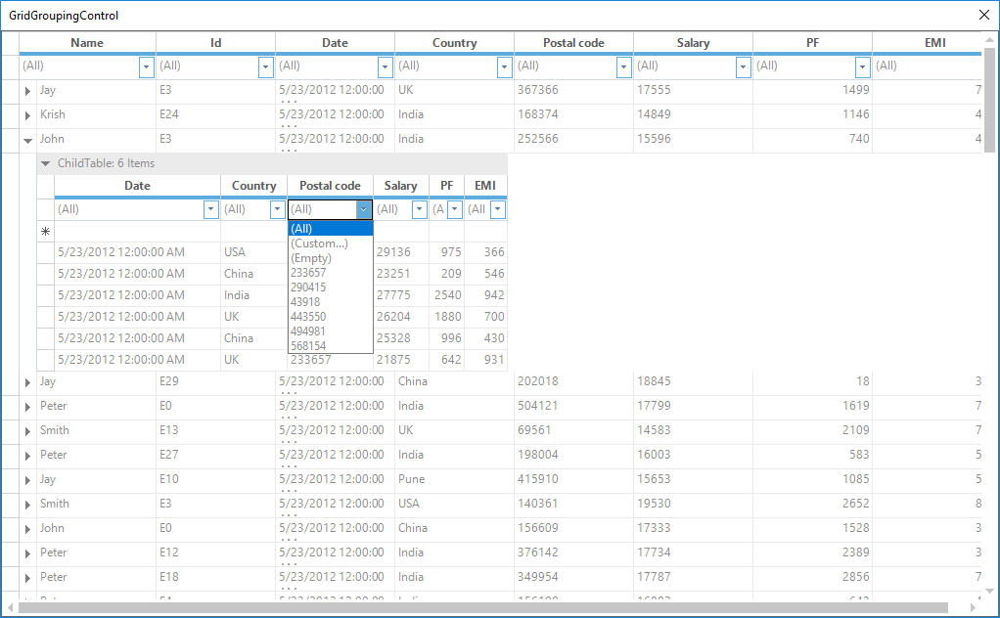

### Removing custom and empty options from the filter bar drop down
By default the `Custom` and `Empty` options will be displayed in the filter bar drop down. These options can be hidden by using the [FilterRowOptions.AllowCustomFilter](https://help.syncfusion.com/cr/windowsforms/Syncfusion.Windows.Forms.Grid.Grouping.FilterRowOptions.html#Syncfusion_Windows_Forms_Grid_Grouping_FilterRowOptions_AllowCustomFilter) and [FilterRowOptions.AllowEmptyFilter](https://help.syncfusion.com/cr/windowsforms/Syncfusion.Windows.Forms.Grid.Grouping.FilterRowOptions.html#Syncfusion_Windows_Forms_Grid_Grouping_FilterRowOptions_AllowEmptyFilter) properties to `false`.


// Removing the Custom and Empty options from the Filter drop down.
this.gridGroupingControl1.TableDescriptor.Columns[1].FilterRowOptions.AllowCustomFilter = false;
this.gridGroupingControl1.TableDescriptor.Columns[1].FilterRowOptions.AllowEmptyFilter = false;



' Removing the Custom and Empty options from the Filter drop down.
Me.gridGroupingControl1.TableDescriptor.Columns(1).FilterRowOptions.AllowCustomFilter = False
Me.gridGroupingControl1.TableDescriptor.Columns(1).FilterRowOptions.AllowEmptyFilter = False


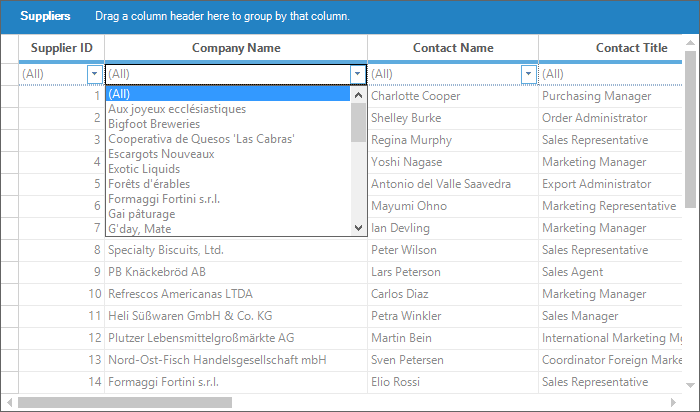

N> The removing of `Custom` and `Empty` text from the filter dropdown is also applicable for the [dynamic filter](#dynamic-filter).

## Record filters
The [RecordFilters](http://help.syncfusion.com/cr/windowsforms/Syncfusion.Grouping.RecordFilterDescriptorCollection.html#) otherwise known as `RowFilters` will allow users to restrict displayed records to those that satisfy logical condition that user specify with `FilterRowDescriptor`.

`RecordFilters` can be added to GridGroupingControl at design time. The[RecordFilterDescriptor](http://help.syncfusion.com/cr/windowsforms/Syncfusion.Grouping.RecordFilterDescriptor.html#) is available in the [TableDescriptor](http://help.syncfusion.com/cr/windowsforms/Syncfusion.Windows.Forms.Grid.Grouping.GridTableDescriptor.html#) section of the property window. The `RecordFilters` can be added by using the `RecordFilterDescriptor` collection editor. 

The record filter can be applied with the different compare operators by using the [FilterCompareOperator](http://help.syncfusion.com/cr/windowsforms/Syncfusion.Grouping.FilterCompareOperator.html#) enumeration in the `FilterCondition` and also it can be applied with multiple filter conditions, by specifying the [LogicalOperator](https://help.syncfusion.com/cr/windowsforms/Syncfusion.Grouping.RecordFilterDescriptor.html#Syncfusion_Grouping_RecordFilterDescriptor_LogicalOperator) value as `And/Or` from [FilterLogicalOperator](http://help.syncfusion.com/cr/windowsforms/Syncfusion.Grouping.FilterLogicalOperator.html#) enum.
The following table shows the list of compare operators,
<table>
<tr>
<td>
{{'**Filter Compare Operator**'| markdownify }}
</td>
<td>
{{'**Description**'| markdownify }}
</td>
</tr>
<tr>
<td>
{{'**Custom**'| markdownify }}
</td>
<td>
A custom filter. A implementation object of {{'[ICustomFilter](http://help.syncfusion.com/cr/windowsforms/Syncfusion.Grouping.ICustomFilter.html#"")'| markdownify }} should be applied to the {{'[FilterCondition.CustomFilter](https://help.syncfusion.com/cr/windowsforms/Syncfusion.Grouping.FilterCondition.html#Syncfusion_Grouping_FilterCondition_CustomFilter)'| markdownify }} property of the {{'[FilterCondition](http://help.syncfusion.com/cr/windowsforms/Syncfusion.Grouping.FilterCondition.html#"")'| markdownify }} object.
</td>
</tr>
<tr>
<td>
{{'**Equals**'| markdownify }}
</td>
<td>
The value is equal.
</td>
</tr>
<tr>
<td>
{{'**GreaterThan**'| markdownify }}
</td>
<td>
The left value is greater than the right value.
</td>
</tr>
<tr>
<td>
{{'**GreaterThanOrEqualTo**'| markdownify }}
</td>
<td>
The left value is greater than or equal to the right value.
</td>
</tr>
<tr>
<td>
{{'**LessThan**'| markdownify }}
</td>
<td>
The left value is less than the right value.
</td>
</tr>
<tr>
<td>
{{'**LessThanOrEqualTo**'| markdownify }}
</td>
<td>
The left value is less than or equal to the right value.
</td>
</tr>
<tr>
<td>
{{'**Like**'| markdownify }}
</td>
<td>
The left string matches the right pattern with wildcard characters, character lists, or character ranges.
</td>
</tr>
<tr>
<td>
{{'**Match**'| markdownify }}
</td>
<td>
The left string matches the right regular expression pattern. See ".NET Framework Regular Expressions" in MSDN Help for discussion and examples for regular expressions.
</td>
</tr>
<tr>
<td>
{{'**NotEquals**'| markdownify }}
</td>
<td>
The value is not equal.
</td>
</tr>
</table>

### Programmatic filtering
To add record filter, user must create `RecordFilterDescriptor` by specifying field name with which the filter should be compared and a filter condition that contains [CompareOperator](https://help.syncfusion.com/cr/windowsforms/Syncfusion.Grouping.FilterCondition.html#Syncfusion_Grouping_FilterCondition_CompareOperator) and [CompareValue](https://help.syncfusion.com/cr/windowsforms/Syncfusion.Grouping.FilterCondition.html#Syncfusion_Grouping_FilterCondition_CompareValue).
The created `RecordFilterDescriptor` have to be added to the `RecordFilterDescriptorCollection` using [RecordFilters.Add](https://help.syncfusion.com/cr/windowsforms/Syncfusion.Grouping.RecordFilterDescriptorCollection.html#Syncfusion_Grouping_RecordFilterDescriptorCollection_Add_Syncfusion_Grouping_RecordFilterDescriptor_) method.
The below example shows the GridGroupingControl is filtered with `Country = USA`,


//Setting the filter condition.
FilterCondition condition = new FilterCondition( FilterCompareOperator.Equals,"USA");

//Setting the RecordFilterDescriptor
RecordFilterDescriptor recordFilterDescriptor = new RecordFilterDescriptor("Country", condition);

//Adding the RecordFilterDescriptor to collection
this.gridGroupingControl1.TableDescriptor.RecordFilters.Add(recordFilterDescriptor);


'Setting the filter condition.
Dim condition As FilterCondition = New FilterCondition(FilterCompareOperator.Equals, "USA")

'Setting the RecordFilterDescriptor
Dim recordFilterDescriptor As RecordFilterDescriptor = New RecordFilterDescriptor("Country", condition)
'Adding the RecordFilterDescriptor to collection
Me.gridGroupingControl1.TableDescriptor.RecordFilters.Add(recordFilterDescriptor)



### Filter by expression
The GridGroupingControl can be filtered based on the expression that same format as in Expression Fields. List of expressions that can be used in the filter expression are provided in [this](http://help.syncfusion.com/windowsforms/gridgrouping/expression-fields#list-of-expressions) link.
The below example shows the grid is filtered with `SupplierID <= 10`,


//Setting the RecordFilterDescriptor
RecordFilterDescriptor recordFilterDescriptor = new RecordFilterDescriptor("SupplierID");

//Setting the Expression
recordFilterDescriptor.Expression = "[SupplierID] <= 10";

//Adding the RecordFilterDescriptor to collection
this.gridGroupingControl1.TableDescriptor.RecordFilters.Add(recordFilterDescriptor);


'Setting the RecordFilterDescriptor
Dim recordFilterDescriptor As RecordFilterDescriptor = New RecordFilterDescriptor("SupplierID")

'Setting the RecordFilterDescriptorrecordFilterDescriptor.Expression = "[SupplierID] <= 10"

'Adding the RecordFilterDescriptor to collectionMe.gridGroupingControl1.TableDescriptor.RecordFilters.Add(recordFilterDescriptor)



N> To know more about the various types of expressions available for filtering the column, refer the [expression](https://help.syncfusion.com/windowsforms/gridgrouping/expression-fields#list-of-expressions) fields section. 

### Applying filters in nested table
`RecordFilters` can also be set to nested tables by accessing `RecordFilters` collection of the[ChildTableDescriptor](https://help.syncfusion.com/cr/windowsforms/Syncfusion.Grouping.RelationDescriptor.html#Syncfusion_Grouping_RelationDescriptor_ChildTableDescriptor). The child table can be get by using [GetTableDescriptor](https://help.syncfusion.com/cr/windowsforms/Syncfusion.Windows.Forms.Grid.Grouping.GridEngine.html#Syncfusion_Windows_Forms_Grid_Grouping_GridEngine_GetTableDescriptor_System_String_) method.
The below example shows the nested table named `Products` is filtered with `UnitPrice > 10`,


//Setting the filter condition
FilterCondition condition = new FilterCondition(FilterCompareOperator.GreaterThan, 10);

//Setting the RecordFilterDescriptor and adding filter condition
RecordFilterDescriptor recordFilterDescriptor = new RecordFilterDescriptor("UnitPrice", condition);

//Getting child table descriptor of “Products” nested table  and adding the RecordFilterDescriptor to collection
this.groupingGrid1.GetTableDescriptor("Products").RecordFilters.Add(recordFilterDescriptor);


'Setting the filter condition
Dim condition As FilterCondition = New FilterCondition(FilterCompareOperator.GreaterThan, 10)

'Setting the RecordFilterDescriptor and adding filter condition
Dim recordFilterDescriptor As RecordFilterDescriptor = New RecordFilterDescriptor("UnitPrice", condition)

'Getting child table descriptor of “Products” nested table and adding the RecordFilterDescriptor to collection 
Me.groupingGrid1.GetTableDescriptor("Products").RecordFilters.Add(recordFilterDescriptor)



### Special characters in filter values
To match the special characters like left bracket `[`, question mark `?`, number sign `#` and asterisk `*`, enclose them in square brackets `like `#` for # and `*` for * etc.,`. The right bracket `]` cannot be used within a group to match itself, but it can be used outside a group as an individual character. 
The below example shows filter values are replaced with valid characters,



void Form1_Load(object sender, EventArgs e)
{
ArrayList rank = new ArrayList();
RankData rankData = new RankData("a");
rank.Add(rankData);
rankData = new RankData("b");
rank.Add(rankData);
gridGroupingControl1.DataSource = rank;
string filter = "";
RecordFilterDescriptor recordFilterDescriptor = null;
Record r = null;

foreach (RankData a in rank)
{
filter = "[WellName] like '" + ReplaceSpecialChar(a.WellName) + "'"; 
recordFilterDescriptor = new RecordFilterDescriptor(filter);
gridGroupingControl1.TableDescriptor.RecordFilters.Add(recordFilterDescriptor);
int cont = gridGroupingControl1.Table.FilteredRecords.Count;
r = new Record(gridGroupingControl1.Table);

//Exception will be thrown here if special characters are not enclosed in square brackets.
r = gridGroupingControl1.Table.FilteredRecords[0]; 
rankData = r.GetData() as RankData;
gridGroupingControl1.TableDescriptor.RecordFilters.Clear();
}
}

private string ReplaceSpecialChar(string pattern)
{

//Take caution while replacing the pattern and ensure that only the intended pattern is modified.
pattern = pattern.Replace("[", "[[]");
pattern = pattern.Replace("#", "[#]");
pattern = pattern.Replace("*", "[*]");
pattern = pattern.Replace("?", "[?]");
return pattern;
}


Private Sub Form1_Load(ByVal sender As Object, ByVal e As EventArgs)
Dim rank As New ArrayList()
Dim rankData As New RankData("a")
rank.Add(rankData)
rankData = New RankData("b")
rank.Add(rankData)
gridGroupingControl1.DataSource = rank
Dim filter As String = ""
Dim recordFilterDescriptor As RecordFilterDescriptor = Nothing
Dim r As Record = Nothing

For Each a As RankData In rank
filter = "[WellName] like '" & ReplaceSpecialChar(a.WellName) & "'"
recordFilterDescriptor = New RecordFilterDescriptor(filter)
gridGroupingControl1.TableDescriptor.RecordFilters.Add(recordFilterDescriptor)
Dim cont As Integer = gridGroupingControl1.Table.FilteredRecords.Count
r = New Record(gridGroupingControl1.Table)

              'Exception will be thrown here if special characters are not enclosed in square brackets.
r = gridGroupingControl1.Table.FilteredRecords(0)
rankData = TryCast(r.GetData(), RankData)
gridGroupingControl1.TableDescriptor.RecordFilters.Clear()
Next a
End Sub

Private Function ReplaceSpecialChar(ByVal pattern As String) As String

'Take caution while replacing the pattern and ensure that only the intended pattern is modified.
pattern = pattern.Replace("[", "[[]")
pattern = pattern.Replace("#", "[#]")
pattern = pattern.Replace("*", "[*]")
pattern = pattern.Replace("?", "[?]")
Return pattern
End Function



N> The 'Like' operator here is implemented similar to the ‘Like’ operator in VB.NET, where “#” character is considered as a character in patterns. Refer [https://docs.microsoft.com/en-us/dotnet/visual-basic/language-reference/operators/like-operator](https://docs.microsoft.com/en-us/dotnet/visual-basic/language-reference/operators/like-operator) for detailed information.

### Removing record filters
Record filter can be removed for a particular or range of columns by specifying the desired column name in the [RecordFilters.Remove](https://help.syncfusion.com/cr/windowsforms/Syncfusion.Grouping.RecordFilterDescriptorCollection.html#Syncfusion_Grouping_RecordFilterDescriptorCollection_Remove_Syncfusion_Grouping_RecordFilterDescriptor_) method or by specifying the particular column index in the [RecordFilters.RemoveAt](https://help.syncfusion.com/cr/windowsforms/Syncfusion.Grouping.RecordFilterDescriptorCollection.html#Syncfusion_Grouping_RecordFilterDescriptorCollection_RemoveAt_System_Int32_) method.


// Filtering will be removed for the ‘ProductName’ column. 
this.gridGroupingControl1.TableDescriptor.RecordFilters.Remove("ProductName");

// Filtering will be removed for the column with index 2.
this.gridGroupingControl1.TableDescriptor.RecordFilters.RemoveAt(2);


' Filtering will be removed for the ‘ProductName’ column. 
Me.gridGroupingControl1.TableDescriptor.RecordFilters.Remove("ProductName")

' Filtering will be removed for the column with index 2.
Me.gridGroupingControl1.TableDescriptor.RecordFilters.RemoveAt(2)



### Clearing filter
To clear the `RecordFilters` that are added to the GridGroupingControl, [Clear](https://help.syncfusion.com/cr/windowsforms/Syncfusion.Grouping.RecordFilterDescriptorCollection.html#Syncfusion_Grouping_RecordFilterDescriptorCollection_Clear) method of `RecordFiltersCollection` can be used. 


this.gridGroupingControl1.TableDescriptor.RecordFilters.Clear();


Me.gridGroupingControl1.TableDescriptor.RecordFilters.Clear()


N> The filters that are applied using [GridDynamicFilter](#dynamic-filter), [Normal Filter](#filtering) and  [Office2007Filter](#office2007-filter) When `RecordFilters` are cleared from GridGroupingControl.

### Events
The changes made in the `RecordFilters` collection can be notified by using the [RecordFilters.Changing](https://help.syncfusion.com/cr/windowsforms/Syncfusion.Grouping.RecordFilterDescriptorCollection.html) and [RecordFilters.Changed](https://help.syncfusion.com/cr/windowsforms/Syncfusion.Grouping.RecordFilterDescriptorCollection.html) events.


this.gridGroupingControl1.TableDescriptor.RecordFilters.Changing += new ListPropertyChangedEventHandler(RecordFilters_Changing);
this.gridGroupingControl1.TableDescriptor.RecordFilters.Changed += new ListPropertyChangedEventHandler(RecordFilters_Changed);

void RecordFilters_Changing(object sender, ListPropertyChangedEventArgs e)
{

    if(e.Action == Syncfusion.Collections.ListPropertyChangedType.Add)
    {
        Console.WriteLine("Adding Record Filter");
    }
}

void RecordFilters_Changed(object sender, ListPropertyChangedEventArgs e)
{

    if (e.Action == Syncfusion.Collections.ListPropertyChangedType.Add)
    {
        Console.WriteLine("Record filter is added");
    }
}


AddHandler gridGroupingControl1.TableDescriptor.RecordFilters.Changing, AddressOf RecordFilters_Changing
AddHandler gridGroupingControl1.TableDescriptor.RecordFilters.Changed, AddressOf RecordFilters_Changed

Private Sub RecordFilters_Changing(ByVal sender As Object, ByVal e As ListPropertyChangedEventArgs)

	If e.Action = Syncfusion.Collections.ListPropertyChangedType.Add Then
		Console.WriteLine("Adding Record Filter")
	End If
End Sub

Private Sub RecordFilters_Changed(ByVal sender As Object, ByVal e As ListPropertyChangedEventArgs)

	If e.Action = Syncfusion.Collections.ListPropertyChangedType.Add Then
		Console.WriteLine("Record filter is added")
	End If
End Sub



## Dynamic filter
The [GridDynamicFilter](http://help.syncfusion.com/cr/windowsforms/Syncfusion.GridHelperClasses.GridDynamicFilter.html#) provides the advanced filtering capabilities. The dynamic filter can be used with Nested Tables and Nested Groups too. To make it more interactive, it adds a Filter Button at the right-most corner of every Filter Bar Cell, on clicking, which drops down into a list showing the available comparative operators.
The key feature of the dynamic filtering mechanism is that it allows user to view the filter results as user type each and every character. It supports user-defined filter criteria as well.
The dynamic filter is defined in the `GridDynamicFilter` class which is available in the `Syncfusion.GridHelperClasses.Windows.dll` assembly. The Dynamic filter can be wired to GridGroupingControl by using[WireGrid](https://help.syncfusion.com/cr/windowsforms/Syncfusion.GridHelperClasses.GridDynamicFilter.html#Syncfusion_GridHelperClasses_GridDynamicFilter_WireGrid_Syncfusion_Windows_Forms_Grid_Grouping_GridGroupingControl_) method.


GridDynamicFilter dynamicFilter = new GridDynamicFilter();

//Wiring the Dynamic Filter to GridGroupingControl
dynamicFilter.WireGrid(this.gridGroupingControl1);


Dim dynamicFilter As GridDynamicFilter = New GridDynamicFilter'Wiring the Dynamic Filter to GridGroupingControldynamicFilter.WireGrid(Me.gridGroupingControl1)



The column will be filtered based on the typed character or word in the filter bar cell. The compare operator for filtering the values is available in the `CompareOperator` dropdown. The below example shows the behavior of the `CompareOperator` dropdown.

### Setting filtering delay
Filtering can be delayed for a specified amount of time (milliseconds) while typing the characters in the filter bar cell. The time to delay the filtering can be specified by the **FilterDelay** property. Default value of the **FilterDelay** property is `0`.
The below example illustrates how to apply filter delay for the dynamic filter,



GridDynamicFilter filter = new GridDynamicFilter();

// Delay the filtering for 300 milliseconds.
filter.FilterDelay = 300;
filter.WireGrid(this.gridGroupingControl1);


Dim filter As New GridDynamicFilter()

' Delay the filtering for 300 milliseconds.
filter.FilterDelay = 300
filter.WireGrid(Me.gridGroupingControl1)



### Apply filter only on lost focus
[ApplyFilterOnlyOnCellLostFocus](https://help.syncfusion.com/cr/windowsforms/Syncfusion.GridHelperClasses.GridDynamicFilter.html#Syncfusion_GridHelperClasses_GridDynamicFilter_ApplyFilterOnlyOnCellLostFocus) property enables the filtering on each key stroke in `GridDynamicFilter`. Set `ApplyFilterOnlyOnCellLostFocus` property to `true` to filter only when the filter cell lost focus. This disables filtering for each key stroke including Enter, arrow keys, and tab keys. Defaults value is `false` and allows filtering for each key stroke.
The following code illustrates how to add `ApplyFilterOnlyOnCellLostFocus` property.


GridDynamicFilter filter = new GridDynamicFilter();
filter.ApplyFilterOnlyOnCellLoseFocus = true;
filter.WireGrid(this.gridGroupingControl1);


Dim filter As New GridDynamicFilter()
filter.ApplyFilterOnlyOnCellLoseFocus = True
filter.WireGrid(Me.gridGroupingControl1)



### Filtering the column value based on the formatted text
To filter the column values based on the formatted text, set the [FilterRowOptions.FilterMode](https://help.syncfusion.com/cr/windowsforms/Syncfusion.Windows.Forms.Grid.Grouping.FilterRowOptions.html#Syncfusion_Windows_Forms_Grid_Grouping_FilterRowOptions_FilterMode) property value as `FilterMode.DisplayText`. It will filter the values based on the formatted text typed in the filter bar.  


// To filter the column based on the formatted text when wiring the dynamic filter.
this.gridGroupingControl1.TableDescriptor.Columns["Customers"].FilterRowOptions.FilterMode = FilterMode.DisplayText;


' To filter the column based on the formatted text when wiring the dynamic filter.
Me.gridGroupingControl1.TableDescriptor.Columns("Customers").FilterRowOptions.FilterMode = FilterMode.DisplayText


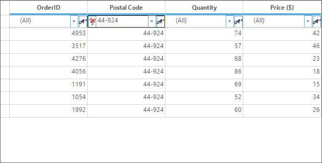

### Filtering the column values based on the display text
By default the dynamic filter will filter the combo box field based on the value member. This can be changed to filter the column value based on the display member of the combo box column by setting the [FilterRowOptions.FilterMode](https://help.syncfusion.com/cr/windowsforms/Syncfusion.Windows.Forms.Grid.Grouping.FilterRowOptions.html#Syncfusion_Windows_Forms_Grid_Grouping_FilterRowOptions_FilterMode) property to `FilterMode.DisplayText` property.  


// To filter the combo box column based on the Display Member
this.gridGroupingControl1.TableDescriptor.Columns["Customers"].FilterRowOptions.FilterMode = FilterMode.DisplayText;

// Add Dynamic Filter to GridGroupingControl
GridDynamicFilter filter = new GridDynamicFilter();
filter.WireGrid(this.gridGroupingControl1);


' To filter the combo box column based on the Display Member
Me.gridGroupingControl1.TableDescriptor.Columns("Customers").FilterRowOptions.FilterMode = FilterMode.DisplayText

' Add Dynamic Filter to GridGroupingControl
Dim filter As New GridDynamicFilter()
filter.WireGrid(Me.gridGroupingControl1)


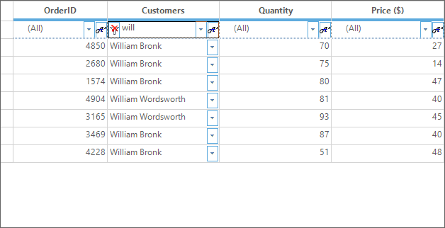

### Wiring dynamic filter to an Individual Column  
The individual columns can be wired with the dynamic filter by setting the [AllowIndividualColumnWiring](https://help.syncfusion.com/cr/windowsforms/Syncfusion.GridHelperClasses.GridDynamicFilter.html#Syncfusion_GridHelperClasses_GridDynamicFilter_AllowIndividualColumnWiring) to `true`. The filter can be set by setting the `DynamicFilterCell` cell type to the `Columns[“columnName“].Appearance.FilterBarCell `. 


GridDynamicFilter filter = new GridDynamicFilter();

// Apply filter for the column which has the cell type DynamicFilterCell
filter.AllowIndividualColumnWiring = true;
this.gridGroupingControl1.TableDescriptor.Columns[1].Appearance.FilterBarCell.CellType = "DynamicFilterCell";
filter.WireGrid(this.gridGroupingControl1);


Dim filter As New GridDynamicFilter()

' Apply filter for the column which has the cell type DynamicFilterCell
filter.AllowIndividualColumnWiring = True
Me.gridGroupingControl1.TableDescriptor.Columns(1).Appearance.FilterBarCell.CellType = "DynamicFilterCell"
filter.WireGrid(Me.gridGroupingControl1)



### Events
The custom dialog of the dynamic filter can be customized by using the [ShowingCustomFilterDialog](https://help.syncfusion.com/cr/windowsforms/Syncfusion.Windows.Forms.Grid.Grouping.GridTableFilterBarCellModel.html) event. This event will be raised before the custom dialog is displayed. 


//Triggering an event
dynamicFilter.ShowingCustomFilterDialog+=new ControlEventHandler(dynamicFilter_ShowingCustomFilterDialog);

void dynamicFilter_ShowingCustomFilterDialog(object sender, ControlEventArgs e)
{

     //To-Do
}


'Triggering an event
AddHandler dynamicFilter.ShowingCustomFilterDialog, AddressOf Me.dynamicFilter_ShowingCustomFilterDialog
    
Private Sub dynamicFilter_ShowingCustomFilterDialog(ByVal sender As Object, ByVal e As ControlEventArgs)        

    'To-Do
End Sub



N> For more information about all the events in the GridGroupingControl, refer the [Events](http://help.syncfusion.com/windowsforms/gridgrouping/events#) section.

## Excel-like filter
The GridGroupingControl has the support for filtering the records as like the Excel. It is another way of filtering the data with the help of dialog like standard Excel filtering functionality by an end user.
The GridGroupingControl has following kind of Excel-Like filtering functionality,

* Optimized Excel filter
* Office2007 filter

The Excel-like filters are available in the `Syncfusion.GridHelperClasses.Windows.Dll` assembly. This assembly should be added in user’s application.
The following example shows the appearance of the Excel-like filter dialog,
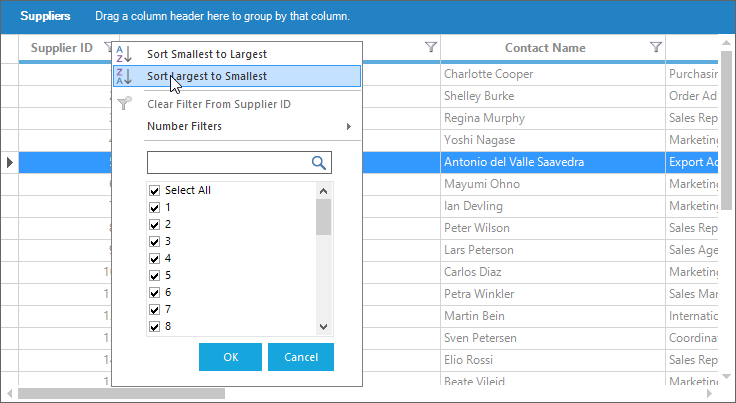

### Optimized excel filter
The optimized Excel filter is specially designed for filtering the large number of records with optimized manner. This filter has many filtering options like Filter by Color, Number filter, Text filter, Date filter and Filter by null values.
The **optimized Excel** filter can be added to GridGroupingControl by using the [GridExcelFilter](http://help.syncfusion.com/cr/windowsforms/Syncfusion.GridHelperClasses.GridExcelFilter.html#) class. 


GridExcelFilter gridExcelFilter = new GridExcelFilter();

//Wiring GridExcelFilter to GridGroupingControl
gridExcelFilter.WireGrid(this.gridGroupingControl1);


Dim gridExcelFilter As GridExcelFilter = New GridExcelFilter

'Wiring GridExcelFilter to GridGroupingControl
gridExcelFilter.WireGrid(Me.gridGroupingControl1)



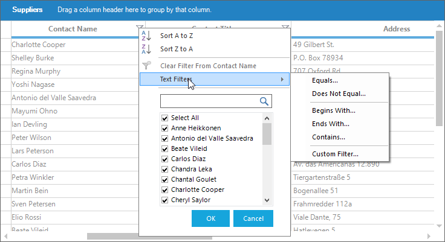

#### Filtering options

##### Number filter
The `GridExcelFilter` lets the user to filter the column values by number filtering as like Excel. The number filtering can be enabled in `GridExcelFilter` by using [EnableNumberFilter](https://help.syncfusion.com/cr/windowsforms/Syncfusion.GridHelperClasses.GridExcelFilter.html#Syncfusion_GridHelperClasses_GridExcelFilter_EnableNumberFilter) property,


GridExcelFilter gridExcelFilter = new GridExcelFilter();

//Enabling Number filter
gridExcelFilter.EnableNumberFilter = true;

//Wiring GridExcelFilter to GridGroupingControl
gridExcelFilter.WireGrid(this.gridGroupingControl1);


Dim gridExcelFilter As GridExcelFilter = New GridExcelFilter

'Enabling Number filter
gridExcelFilter.EnableNumberFilter = true

'Wiring GridExcelFilter to GridGroupingControl
gridExcelFilter.WireGrid(Me.gridGroupingControl1)



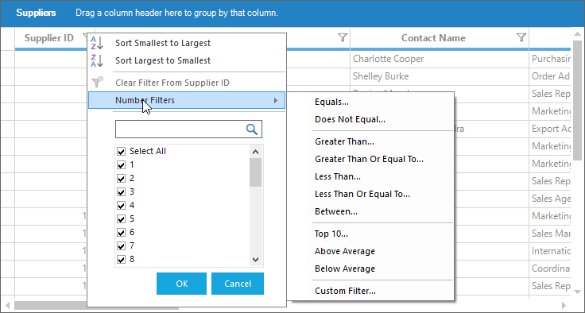

##### Date filter
The date column values can be filtered by using Date Filter as like Excel. The Date filtering can be enabled by using the [EnableDateFilter](https://help.syncfusion.com/cr/windowsforms/Syncfusion.GridHelperClasses.GridExcelFilter.html#Syncfusion_GridHelperClasses_GridExcelFilter_EnableDateFilter) property.


GridExcelFilter gridExcelFilter = new GridExcelFilter();

//Enabling Date filter
gridExcelFilter.EnableDateFilter = true;

//Wiring GridExcelFilter to GridGroupingControl
gridExcelFilter.WireGrid(this.gridGroupingControl1);


Dim gridExcelFilter As GridExcelFilter = New GridExcelFilter

'Enabling Date filter
gridExcelFilter.EnableDateFilter = true

'Wiring GridExcelFilter to GridGroupingControl
gridExcelFilter.WireGrid(Me.gridGroupingControl1)


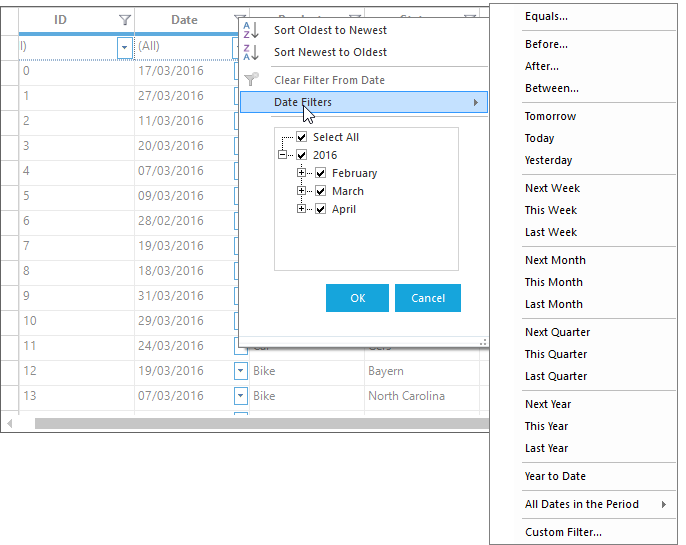

##### Filter by color
The `GridExcelFilter` lets the user to filter the records based on its cell `Backcolor` and `TextColor`. This filter option can be enabled by using [AllowFilterByColor](https://help.syncfusion.com/cr/windowsforms/Syncfusion.GridHelperClasses.GridExcelFilter.html#Syncfusion_GridHelperClasses_GridExcelFilter_AllowFilterByColor).


GridExcelFilter gridExcelFilter = new GridExcelFilter();

//Enabling filter by color option
gridExcelFilter.AllowFilterByColor = true;

//Wiring GridExcelFilter to GridGroupingControl
gridExcelFilter.WireGrid(this.gridGroupingControl1);


Dim gridExcelFilter As GridExcelFilter = New GridExcelFilter'Enabling filter by color optiongridExcelFilter.AllowFilterByColor = true'Wiring GridExcelFilter to GridGroupingControlgridExcelFilter.WireGrid(Me.gridGroupingControl1)


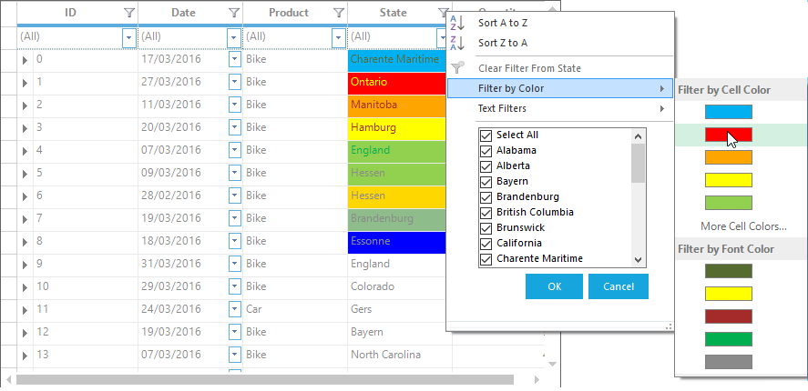

##### Filter by null values
By default, the `GridExcelFilter` provides support to filter the `null` values in the column. The null values can be filtered by selecting Blanks option in the filter dialog. 
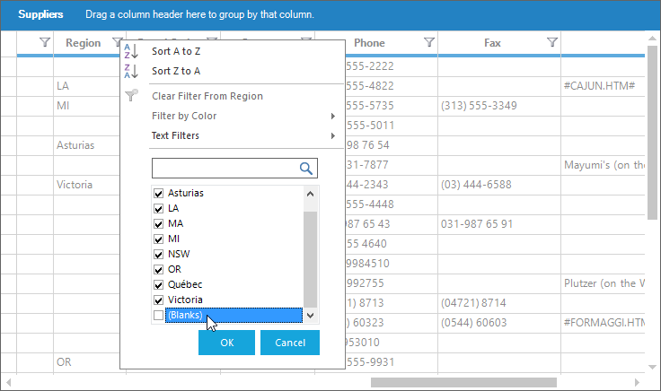

#### Filtering icon on mouse hover
By default, it shows the filter icon for the filter enabled column when enabling the optimized Excel filter. This icon can changed to display only on mouse hover on the column header by setting the [GridExcelFilter.EnableFilteredColumnIcon](https://help.syncfusion.com/cr/windowsforms/Syncfusion.GridHelperClasses.GridExcelFilter.html#Syncfusion_GridHelperClasses_GridExcelFilter_EnableFilteredColumnIcon) property to `true`.


GridExcelFilter filter = new GridExcelFilter();
filter.WireGrid(this.gridGroupingControl1);

//Show filter icon on mouse hover at the header cell
GridExcelFilter.EnableFilteredColumnIcon = true;


Dim filter As New GridExcelFilter()
filter.WireGrid(Me.gridGroupingControl1)

'Show filter icon on mouse hover at the header cell
GridExcelFilter.EnableFilteredColumnIcon = True



#### Removing search text box in filter dialog
The search text box of the excel filter dialog can be hidden by setting the [AllowSearch](https://help.syncfusion.com/cr/windowsforms/Syncfusion.GridHelperClasses.GridExcelFilter.html#Syncfusion_GridHelperClasses_GridExcelFilter_AllowSearch) property to `false`.


GridExcelFilter filter = new GridExcelFilter();
filter.WireGrid(this.gridGroupingControl1);

// Disable the search box in filter pop-up
filter.AllowSearch = false;


Dim filter As New GridExcelFilter()
filter.WireGrid(Me.gridGroupingControl1)

' Disable the search box in filter pop-up
filter.AllowSearch = False



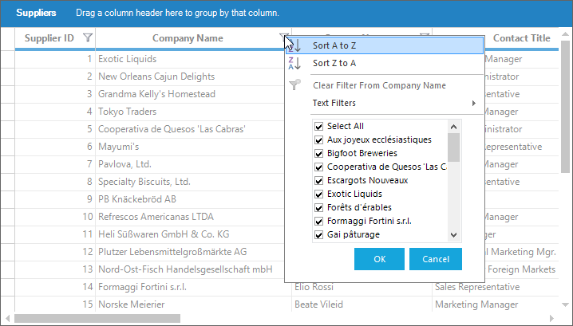

#### Enable resizing option for filter pop-up
The excel filter popup can be resized by setting the [AllowResize](https://help.syncfusion.com/cr/windowsforms/Syncfusion.GridHelperClasses.GridExcelFilter.html#Syncfusion_GridHelperClasses_GridExcelFilter_AllowResize) property to `true`. 


GridExcelFilter filter = new GridExcelFilter();
filter.WireGrid(this.gridGroupingControl1);

// Enable resizing the filter dialog
filter.AllowResize = true;


Dim filter As New GridExcelFilter()
filter.WireGrid(Me.gridGroupingControl1)

' Enable resizing the filter dialog
filter.AllowResize = True


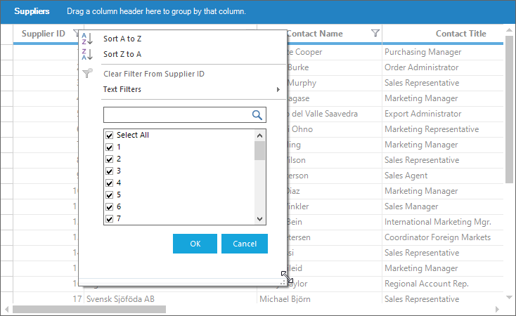

#### Wiring excel filter to an Individual Column  
The individual columns can be wired with the Excel filter by setting the [AllowIndividualColumnWiring](https://help.syncfusion.com/cr/windowsforms/Syncfusion.GridHelperClasses.GridExcelFilter.html#Syncfusion_GridHelperClasses_GridExcelFilter_AllowIndividualColumnWiring) to `true`. The filter can be set by setting the `GridExcelFilterCell` cell type to the `Columns[“columnName“].Appearance.ColumnHeaderCell `. 


GridExcelFilter filter = new GridExcelFilter();

// Apply filter for the column which has the cell type GridExcelFilterCell 
filter.AllowIndividualColumnWiring = true;
this.gridGroupingControl1.TableDescriptor.Columns[1].Appearance.ColumnHeaderCell.CellType = "GridExcelFilterCell";
filter.WireGrid(this.gridGroupingControl1);


Dim filter As New GridExcelFilter()

' Apply filter for the column which has the cell type GridExcelFilterCell 
filter.AllowIndividualColumnWiring = True
Me.gridGroupingControl1.TableDescriptor.Columns(1).Appearance.ColumnHeaderCell.CellType = "GridExcelFilterCell"
filter.WireGrid(Me.gridGroupingControl1)



### Filter Icon Customization
The default icons of `GridExcelFilter` can be customized for column headers and stacked headers. To set the filter icon, custom cell renderer and cell model needs to be created. 

### Customizing Filter Icon for Column Headers
To customize the filter icon for column headers, the cell model and cell renderer of [GridExcelFilterCellModel](https://help.syncfusion.com/cr/windowsforms/Syncfusion.GridHelperClasses.GridExcelFilterCellModel.html) and [GridExcelFilterCellRenderer](https://help.syncfusion.com/cr/windowsforms/Syncfusion.GridHelperClasses.GridExcelFilterCellRenderer.html) should be overridden. The icons for the column headers can be customized using the below properties,

 * [FilterIconSize](https://help.syncfusion.com/cr/windowsforms/Syncfusion.GridHelperClasses.GridExcelFilterCellRenderer.html#Syncfusion_GridHelperClasses_GridExcelFilterCellRenderer_FilterIconSize) - Sets the size of the `GridExcelFilter` filter icon.
 * [FilterIcon](https://help.syncfusion.com/cr/windowsforms/Syncfusion.GridHelperClasses.GridExcelFilterCellRenderer.html#Syncfusion_GridHelperClasses_GridExcelFilterCellRenderer_FilterIcon) - Sets the Bitmap of the Filter icon.
 * [FilteredIcon](https://help.syncfusion.com/cr/windowsforms/Syncfusion.GridHelperClasses.GridExcelFilterCellRenderer.html#Syncfusion_GridHelperClasses_GridExcelFilterCellRenderer_FilteredIcon) - Sets the Bitmap of the Filtered icon.

The following is the process of creating cell model and cell renderer for customizing the column headers filter icon,

* Creating cell model.




public class GridExcelFilterCellModelAdv : GridExcelFilterCellModel
{

    private GridExcelFilter excelFilter;

    public GridExcelFilterCellModelAdv(GridModel grid, GridExcelFilter excelFilter)
        : base(grid, excelFilter)
    {
        this.excelFilter = excelFilter;
    }

    public override GridCellRendererBase CreateRenderer(GridControlBase control)
    {
        return new GridExcelFilterCellRendererAdv(control, this, this.excelFilter);
    }
}


Public Class GridExcelFilterCellModelAdv
    Inherits GridExcelFilterCellModel

    Private excelFilter As GridExcelFilter

    Public Sub New(ByVal grid As GridModel, ByVal excelFilter As GridExcelFilter)
        MyBase.New(grid, excelFilter)
        Me.excelFilter = excelFilter
    End Sub

    Public Overrides Function CreateRenderer(ByVal control As GridControlBase) As GridCellRendererBase
        Return New GridExcelFilterCellRendererAdv(control, Me, Me.excelFilter)
    End Function
End Class



{{ codesnippet1 | OrderList_Indent_Level_1 }}

* Creating cell renderer.



class GridExcelFilterCellRendererAdv : GridExcelFilterCellRenderer
{

    public GridExcelFilterCellRendererAdv(GridControlBase grid, GridCellModelBase cellModel, GridExcelFilter excelFilter)
        : base(grid, cellModel, excelFilter)
    {
        base.FilterIconSize = new Size(30, 30);
        base.FilterIcon = new Bitmap("Filter.png");
        base.FilteredIcon = new Bitmap("ClearFilters.png");
    }
}


Friend Class GridExcelFilterCellRendererAdv
    Inherits GridExcelFilterCellRenderer

    Public Sub New(ByVal grid As GridControlBase, ByVal cellModel As GridCellModelBase, ByVal excelFilter As GridExcelFilter)
        MyBase.New(grid, cellModel, excelFilter)
        MyBase.FilterIconSize = New Size(30, 30)
        MyBase.FilterIcon = New Bitmap("Filter.png")
        MyBase.FilteredIcon = New Bitmap("ClearFilters.png")
    End Sub
End Class



{{ codesnippet2 | OrderList_Indent_Level_1 }}

* Replacing the cell renderer for default `ColumnHeaderCell`.



//To enable the custom ColumnHeaderCell cell type.
gridGroupingControl1.TableControl.CellRenderers["ColumnHeaderCell"] = new GridExcelFilterCellRendererAdv(gridGroupingControl1.TableControl, new GridExcelFilterCellModelAdv(gridGroupingControl1.TableModel, excelFilter), excelFilter);


'To enable the custom ColumnHeaderCell cell type.
gridGroupingControl1.TableControl.CellRenderers("ColumnHeaderCell") = New GridExcelFilterCellRendererAdv(gridGroupingControl1.TableControl, New GridExcelFilterCellModelAdv(gridGroupingControl1.TableModel, excelFilter), excelFilter)



{{ codesnippet3 | OrderList_Indent_Level_1 }}
 
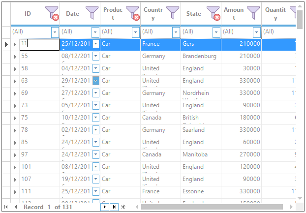
 
### Customizing Filter Icon for StackedHeaders
To customize the filter icon for stacked headers, the cell model and cell renderer of [StackedHeaderCellModel](https://help.syncfusion.com/cr/windowsforms/Syncfusion.GridHelperClasses.StackedHeaderCellModel.html) and [StackedHeaderCellRenderer](https://help.syncfusion.com/cr/windowsforms/Syncfusion.GridHelperClasses.StackedHeaderCellRenderer.html) should be overridden. The icons for the stacked headers can be customized using the below properties.

 *  [FilterIconSize](https://help.syncfusion.com/cr/windowsforms/Syncfusion.GridHelperClasses.StackedHeaderCellRenderer.html#Syncfusion_GridHelperClasses_StackedHeaderCellRenderer_FilterIconSize)- Sets the size of the `GridExcelFilter` filter icon.
 * [FilterIconImage](https://help.syncfusion.com/cr/windowsforms/Syncfusion.GridHelperClasses.StackedHeaderCellRenderer.html#Syncfusion_GridHelperClasses_StackedHeaderCellRenderer_FilterIconImage)- Sets the Bitmap of the Filter icon.
 * [FilteredIconImage](https://help.syncfusion.com/cr/windowsforms/Syncfusion.GridHelperClasses.StackedHeaderCellRenderer.html#Syncfusion_GridHelperClasses_StackedHeaderCellRenderer_FilteredIconImage)- Sets the Bitmap of the Filtered icon.
 
The following is the process of creating custom cell model and cell renderer for customizing the stacked headers filter icon,

* Creating cell model.



public class StackedHeaderCellModelAdv : StackedHeaderCellModel
{

    private GridExcelFilter excelFilter;

    public StackedHeaderCellModelAdv(GridModel grid, GridExcelFilter excelFilter)
        : base(grid, excelFilter)
    {
        this.excelFilter = excelFilter;
    }

    public override GridCellRendererBase CreateRenderer(GridControlBase control)
    {
        return new StackedHeaderCellRendererAdv(control, this, excelFilter);
    }
}


Public Class StackedHeaderCellModelAdv
    Inherits StackedHeaderCellModel

    Private excelFilter As GridExcelFilter

    Public Sub New(ByVal grid As GridModel, ByVal excelFilter As GridExcelFilter)
        MyBase.New(grid, excelFilter)
        Me.excelFilter = excelFilter
    End Sub

    Public Overrides Function CreateRenderer(ByVal control As GridControlBase) As GridCellRendererBase
        Return New StackedHeaderCellRendererAdv(control, Me, excelFilter)
    End Function
End Class



{{ codesnippet4 | OrderList_Indent_Level_1 }}

* Creating cell renderer.



public class StackedHeaderCellRendererAdv : StackedHeaderCellRenderer
{

    private GridExcelFilter excelFilter;

    public StackedHeaderCellRendererAdv(GridControlBase grid, GridHeaderCellModel cellModel, GridExcelFilter excelFilter)
        : base(grid, cellModel, excelFilter)
    {
        this.excelFilter = excelFilter;
        FilterIconSize = new Size(30, 30);
        FilterIconImage = new Bitmap("Filter.png");
        FilteredIconImage = new Bitmap("ClearFilters.png");
    }
}


Public Class StackedHeaderCellRendererAdv
    Inherits StackedHeaderCellRenderer

    Private excelFilter As GridExcelFilter

    Public Sub New(ByVal grid As GridControlBase, ByVal cellModel As GridHeaderCellModel, ByVal excelFilter As GridExcelFilter)
        MyBase.New(grid, cellModel, excelFilter)
        Me.excelFilter = excelFilter
        FilterIconSize = New Size(30, 30)
        FilterIconImage = New Bitmap("Filter.png")
        FilteredIconImage = New Bitmap("ClearFilters.png")
    End Sub
End Class



{{ codesnippet5 | OrderList_Indent_Level_1 }}

* Replacing the cell renderer for `CustomStackedHeaderCell`.



//To enable the custom StackedHeaderCell cell type.
gridGroupingControl1.TableControl.CellRenderers["CustomStackedHeaderCell"] = new StackedHeaderCellRendererAdv(this.gridGroupingControl1.TableControl, new StackedHeaderCellModelAdv(gridGroupingControl1.TableModel, excelFilter), excelFilter);


'To enable the custom StackedHeaderCell cell type.
gridGroupingControl1.TableControl.CellRenderers("CustomStackedHeaderCell") = New StackedHeaderCellRendererAdv(Me.gridGroupingControl1.TableControl, New StackedHeaderCellModelAdv(gridGroupingControl1.TableModel, excelFilter), excelFilter)



{{ codesnippet6 | OrderList_Indent_Level_1 }}

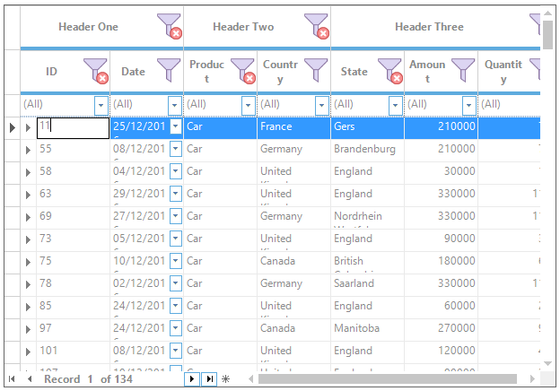

### GridExcelFilter Serialization
The process of serializing and deserializing the `GridExcelFilter` settings and its filter collection is explained in detail in this [link.](https://help.syncfusion.com/windowsforms/gridgrouping/serialization#gridexcelfilter-serialization)

### Office2007 filter
Office2007Filter is built-in filter similar to `Microsoft Excel 2007` filter. The **Office2007** filter can be added to GridGroupingControl by using the [GridOffice2007Filter](http://help.syncfusion.com/cr/windowsforms/Syncfusion.GridHelperClasses.GridOffice2007Filter.html#) class. 

N> Office2007Filter is the classic filtering support for GridGroupingControl and it has been marked as the `Obsolete`. Make use of [Optimized Excel Filter](#optimized-excel-filter) instead of using `Office2007Filter` to avail more features. 


GridOffice2007Filter officeFilter = new GridOffice2007Filter();

//Wiring the GridGroupingControl
officeFilter.WireGrid(this.gridGroupingControl1);


Dim officeFilter As GridOffice2007Filter = New GridOffice2007Filter
'Wiring the GridGroupingControlofficeFilter.WireGrid(Me.gridGroupingControl1)


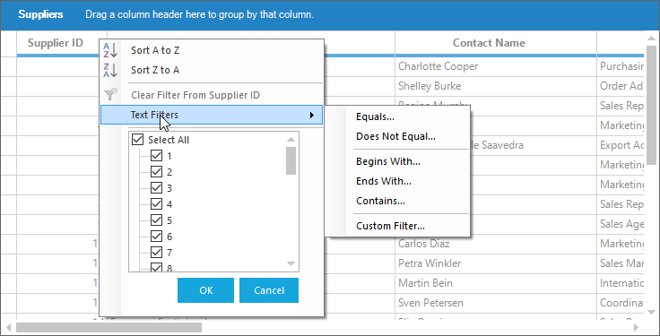

#### Filtering icon on mouse hover
By default, the filter icon in column headers will not be shown until mouse is hovered on the column header. The filter icon can be decided whether it can be shown always or on mouse hovering by using [ShowOffice2007FilterOnMouseHover](https://help.syncfusion.com/cr/windowsforms/Syncfusion.GridHelperClasses.GridOffice2007Filter.html#Syncfusion_GridHelperClasses_GridOffice2007Filter_ShowOffice2007FilterOnMouseHover) static property. 


GridOffice2007Filter.ShowOffice2007FilterOnMouseHover = true;
GridOffice2007Filter officeFilter = new GridOffice2007Filter();

//Wiring the GridGroupingControl
officeFilter.WireGrid(this.gridGroupingControl1);


GridOffice2007Filter.ShowOffice2007FilterOnMouseHover = true
Dim officeFilter As GridOffice2007Filter = New GridOffice2007Filter'Wiring the GridGroupingControlofficeFilter.WireGrid(Me.gridGroupingControl1)



#### Sticking filtered column icon
If the `ShowOffice2007FilterOnMouseHover` is enabled and any of a column is filtered, the icon filtered icon for filtered column will not be placed in that column. But the filtered icon can be shown in the filtered column by enabling [EnableFilteredColumnIcon](https://help.syncfusion.com/cr/windowsforms/Syncfusion.GridHelperClasses.GridOffice2007Filter.html#Syncfusion_GridHelperClasses_GridOffice2007Filter_EnableFilteredColumnIcon) static property. 


GridOffice2007Filter.ShowOffice2007FilterOnMouseHover = true;
GridOffice2007Filter.EnableFilteredColumnIcon = true;  
GridOffice2007Filter officeFilter = new GridOffice2007Filter();

//Wiring the GridGroupingControl
officeFilter.WireGrid(this.gridGroupingControl1);


GridOffice2007Filter.ShowOffice2007FilterOnMouseHover = true
GridOffice2007Filter.EnableFilteredColumnIcon = true
Dim officeFilter As GridOffice2007Filter = New GridOffice2007Filter

'Wiring the GridGroupingControlofficeFilter.WireGrid(Me.gridGroupingControl1)


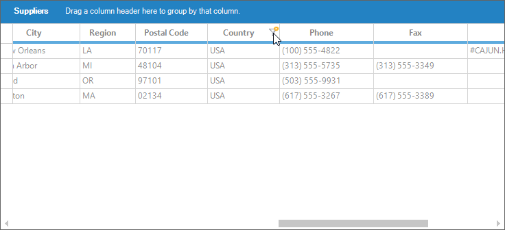

### Stacked header filtering
To filter the stacked header column, [EnableStackedColumnFilterIcon](https://help.syncfusion.com/cr/windowsforms/Syncfusion.GridHelperClasses.GridExcelFilter.html#Syncfusion_GridHelperClasses_GridExcelFilter_EnableStackedColumnFilterIcon) property can be used. To know about the Stacked Headers, refer [this](http://help.syncfusion.com/windowsforms/gridgrouping/grid-layout#stacked-headers) section.
The stacked header column will show the filter dialog box for specified column in the [GridStackedHeaderDescriptor](http://help.syncfusion.com/cr/windowsforms/Syncfusion.Windows.Forms.Grid.Grouping.GridStackedHeaderDescriptor.html#). 
The following example shows the filter is enabled for stacked header in which filter dialog box will be shown for `ID` column. 


GridStackedHeaderRowDescriptor gridStackedHeaderRowDescriptor = new GridStackedHeaderRowDescriptor();

// Initializes Stacked header to show filter dialog of `ID` column
GridStackedHeaderDescriptor gridStackedHeaderDescriptor = new GridStackedHeaderDescriptor("Stacked Header1", "Header One", "ID", new Syncfusion.Windows.Forms.Grid.Grouping.GridStackedHeaderVisibleColumnDescriptor[] {
new GridStackedHeaderVisibleColumnDescriptor("ID"),
new GridStackedHeaderVisibleColumnDescriptor("Date"),
new GridStackedHeaderVisibleColumnDescriptor("Product")});

gridStackedHeaderRowDescriptor.Headers.Add(gridStackedHeaderDescriptor);
this.gridGroupingControl1.TableDescriptor.StackedHeaderRows.Add(gridStackedHeaderRowDescriptor);
GridExcelFilter filter = new GridExcelFilter();
filter.EnableStackedColumnFilterIcon = true;
filter.WireGrid(gridGroupingControl1);


Dim gridStackedHeaderRowDescriptor As New GridStackedHeaderRowDescriptor()

' Initializes Stacked header to show filter dialog of `ID` column
Dim gridStackedHeaderDescriptor As New GridStackedHeaderDescriptor("Stacked Header1", "Header One", "ID", New Syncfusion.Windows.Forms.Grid.Grouping.GridStackedHeaderVisibleColumnDescriptor() { New GridStackedHeaderVisibleColumnDescriptor("ID"), New GridStackedHeaderVisibleColumnDescriptor("Date"), New GridStackedHeaderVisibleColumnDescriptor("Product")})

gridStackedHeaderRowDescriptor.Headers.Add(gridStackedHeaderDescriptor)
Me.gridGroupingControl1.TableDescriptor.StackedHeaderRows.Add(gridStackedHeaderRowDescriptor)
Dim filter As New GridExcelFilter()
filter.EnableStackedColumnFilterIcon = True
filter.WireGrid(gridGroupingControl1)



The below example shows the filter icon is shown in Stacked Header,
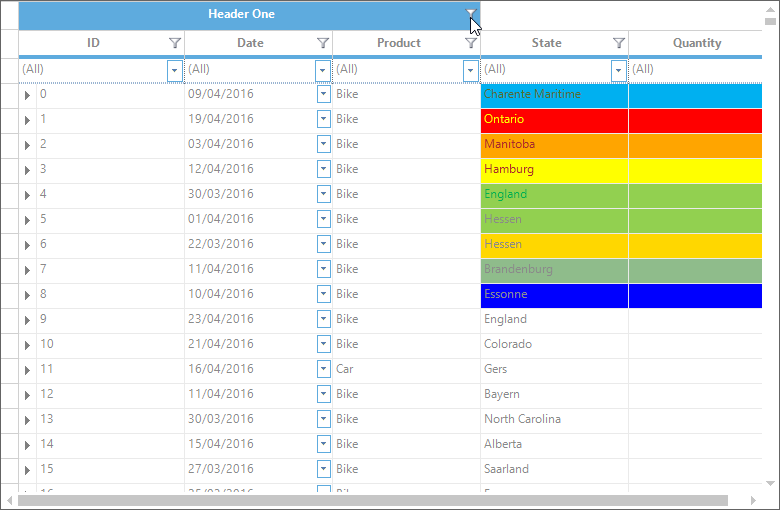

The below shows the filter dialog box is shown for `ID` column,
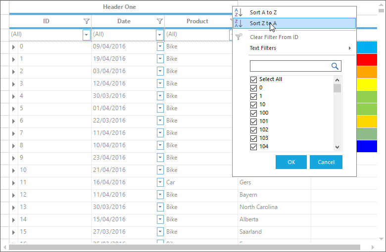

### Events
The `GridExcelFilter` has two events that are raised when a column is filtered.
 
* [RecordFiltersItemChanging](https://help.syncfusion.com/cr/windowsforms/Syncfusion.GridHelperClasses.GridExcelFilter.html) – This event will be raised before the filter is applied to the GridGroupingControl.
* [RecordFiltersItemChanged](https://help.syncfusion.com/cr/windowsforms/Syncfusion.GridHelperClasses.GridExcelFilter.html) – This event will be raised after the filter is applied to the GridGroupingControl.



// Triggering an event
gridExcelFilter.RecordFiltersItemChanging += new Syncfusion.Collections.ListPropertyChangedEventHandler(gridExcelFilter_RecordFiltersItemChanging);

void gridExcelFilter_RecordFiltersItemChanging(object sender, Syncfusion.Collections.ListPropertyChangedEventArgs e)
        {
            e.Cancel = true;
        }


' Triggering an eventAddHandler gridExcelFilter.RecordFiltersItemChanging, AddressOf Me.gridExcelFilter_RecordFiltersItemChanging    Private Sub gridExcelFilter_RecordFiltersItemChanging(ByVal sender As Object, ByVal e As Syncfusion.Collections.ListPropertyChangedEventArgs)        e.Cancel = true End Sub



N> For more information about all the events in the GridGroupingControl, refer the [Events](http://help.syncfusion.com/windowsforms/gridgrouping/events#) section.

## Filter by display member
GridGroupingControl filters data records by the value member of the columns by default. This behavior can be customized to get filters work with display member of the columns.
The `Filter By DisplayMember` can be enabled for individual column by using the [GroupingGridFilterBarExt](http://help.syncfusion.com/cr/windowsforms/Syncfusion.GridHelperClasses.GroupingGridFilterBarExt.html#) class.
To enable the `FilterByDisplayMember`	functionality for column, the `FilterBarCell` of the column should be set as `FilterByDisplayMemberCell` and [AllowIndividualColumnWiring](https://help.syncfusion.com/cr/windowsforms/Syncfusion.GridHelperClasses.GroupingGridFilterBarExt.html#Syncfusion_GridHelperClasses_GroupingGridFilterBarExt_AllowIndividualColumnWiring) property has to be enabled. This property is used to enable the “FilterBarByDisplayMember” cell for specific column.
The following example shows the second column is enabled with the `FilterByDisplayMemberCell`


//Enables filter.
GroupingGridFilterBarExt gGCFilter = new GroupingGridFilterBarExt();

gGCFilter.AllowIndividualColumnWiring = true;

//Apply FilterByDisplayMember to the 1st column           
this.gridGroupingControl1.TableDescriptor.Columns[1].Appearance.FilterBarCell.CellType = "FilterByDisplayMemberCell";
gGCFilter.WireGrid(gridGroupingControl1);

//Disables filter.
gGCFilter.UnwireGrid(gridGroupingControl1);


'Enables filter.
Dim gGCFilter As New GroupingGridFilterBarExt()

gGCFilter.AllowIndividualColumnWiring = True

'Apply FilterByDisplayMember to the 1st column
this.gridGroupingControl1.TableDescriptor.Columns[1].Appearance.FilterBarCell.CellType = "FilterByDisplayMemberCell";
gGCFilter.WireGrid(gridGroupingControl1)

'Disables filter.
gGCFilter.UnwireGrid(gridGroupingControl1)


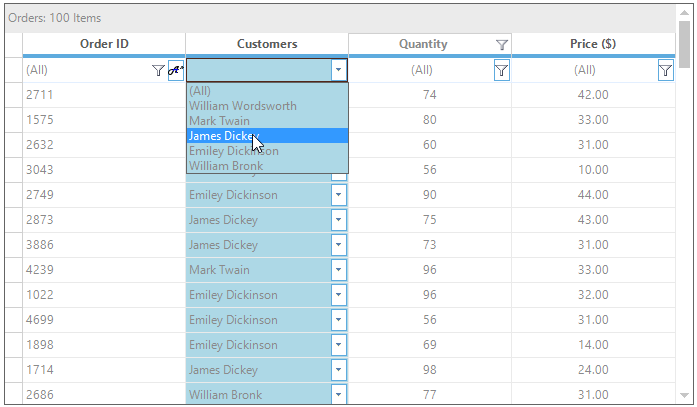

The following sample shows the filter by display member functionality,
&lt;Installation Location&gt;\Syncfusion\EssentialStudio\[Version_ Number]\ Windows\Grid.Grouping.Windows\Samples\Filters and Expressions\Filter By DisplayMember Demo

## Getting filtered records
The filtered records are maintained in the [FilteredRecordCollection](http://help.syncfusion.com/cr/windowsforms/Syncfusion.Grouping.FilteredRecordsInTableCollection.html#). This is a read-only collection that manages the subset of records that has been filtered against filter criteria. 
The filtered records can be accessed by using the [Table.FilteredRecords](https://help.syncfusion.com/cr/windowsforms/Syncfusion.Grouping.Table.html#Syncfusion_Grouping_Table_FilteredRecords) property.


GridTable table = this.gridGroupingControl1.Table;

foreach (Record record in table.FilteredRecords)
{
    Console.WriteLine("Record Info : " + record);
}


Dim table As GridTable = Me.gridGroupingControl1.Table

For Each record As Record In table.FilteredRecords
	Console.WriteLine("Record Info : " & record)
Next record



## Getting filtered string
To get access to the filtered string, `GetFilterBarText` method of respective `FilterBarCellRenderer` can be used. 
Following code example illustrates how to print the filter bar string for a given column,


private void GetFilterBarString()
{
    int row = 0, col=0;
    string colName = null; 
    GridTableCellStyleInfo style;

    //Ensures that the filter bar is visible and RecordFilters collection is not empty and gets the filter bar row index and index of the field by using the value with which the grid records are filtered.

    if(gridGroupingControl1.TableDescriptor.RecordFilters.Count > 0)
    colName = gridGroupingControl1.TableDescriptor.RecordFilters[0].MappingName;

    foreach (Element el in this.gridGroupingControl1.Table.DisplayElements)
    {

        if (el.IsFilterBar() && colName != null)
        {
            style = gridGroupingControl1.Table.GetTableCellStyle(el, colName);
            row = style.TableCellIdentity.RowIndex;
            col = style.TableCellIdentity.ColIndex;
        }
    }

    //Uses calculated row and column indices, gets the filter bar string of the record filter.
    GridTableFilterBarCellRenderer cellRenderer = this.gridGroupingControl1.TableControl.CellRenderers["FilterBarCell"] as                              GridTableFilterBarCellRenderer;
    if (cellRenderer != null && row != 0)
    {
         Console.WriteLine(cellRenderer.GetFilterBarText(this.gridGroupingControl1.TableModel[row, col]));
    }
}


Private Sub GetFilterBarString()
	Dim row As Integer = 0, col As Integer=0
	Dim colName As String = Nothing
	Dim style As GridTableCellStyleInfo
    
    'Ensures that the filter bar is visible and RecordFilters collection is not empty and gets the filter bar row index and index of the field by using the value with which the grid records are filtered.

	If gridGroupingControl1.TableDescriptor.RecordFilters.Count > 0 Then
	colName = gridGroupingControl1.TableDescriptor.RecordFilters(0).MappingName
	End If

	For Each el As Element In Me.gridGroupingControl1.Table.DisplayElements
		If el.IsFilterBar() AndAlso colName IsNot Nothing Then
			style = gridGroupingControl1.Table.GetTableCellStyle(el, colName)
			row = style.TableCellIdentity.RowIndex
			col = style.TableCellIdentity.ColIndex
		End If
	Next el

    'Uses calculated row and column indices, gets the filter bar string of the record filter.
	Dim cellRenderer As GridTableFilterBarCellRenderer = TryCast(Me.gridGroupingControl1.TableControl.CellRenderers("FilterBarCell"), GridTableFilterBarCellRenderer)

	If cellRenderer IsNot Nothing AndAlso row <> 0 Then
		 Console.WriteLine(cellRenderer.GetFilterBarText(Me.gridGroupingControl1.TableModel(row, col)))
	End If
End Sub


