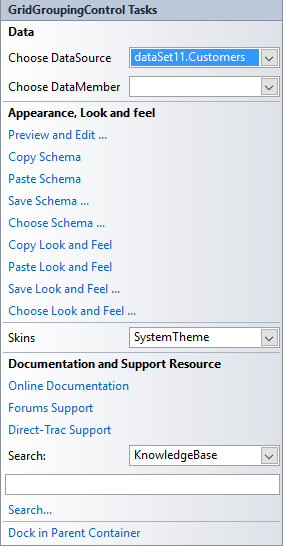
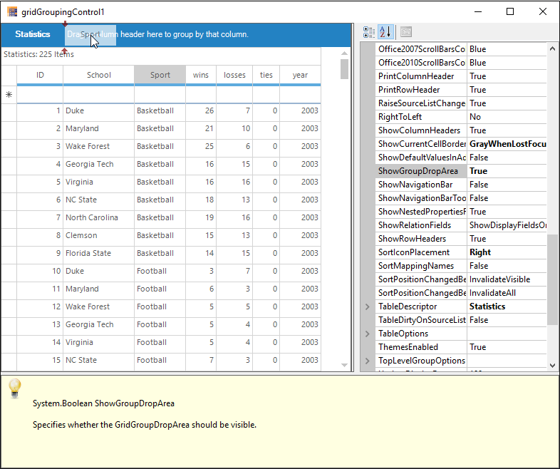
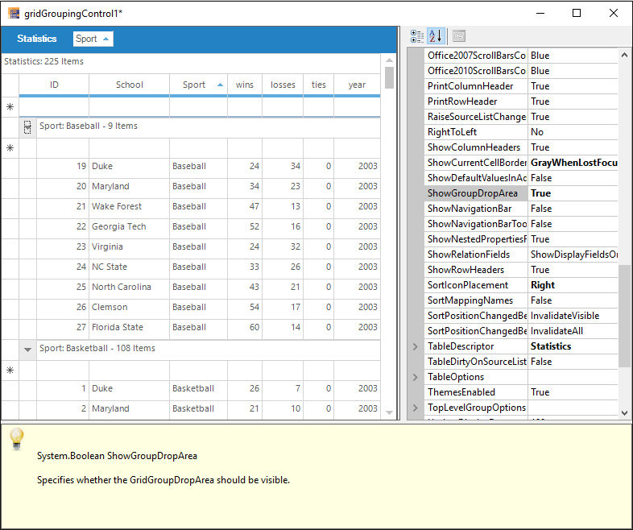
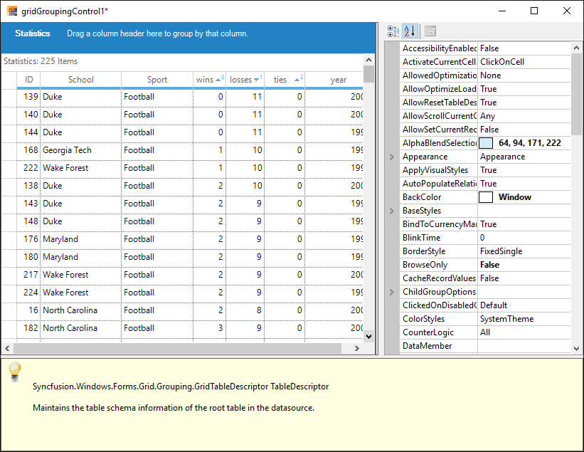
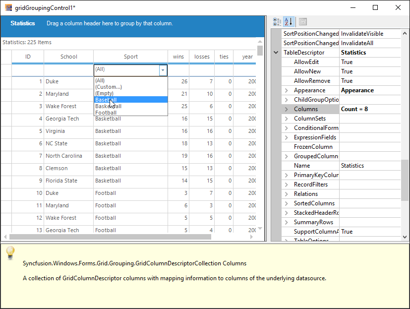
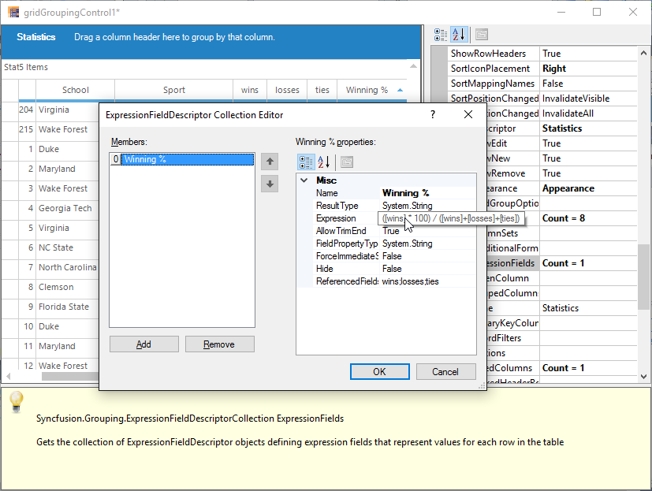
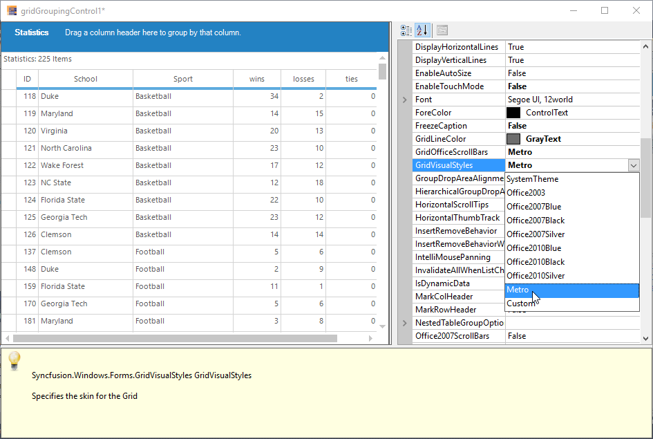
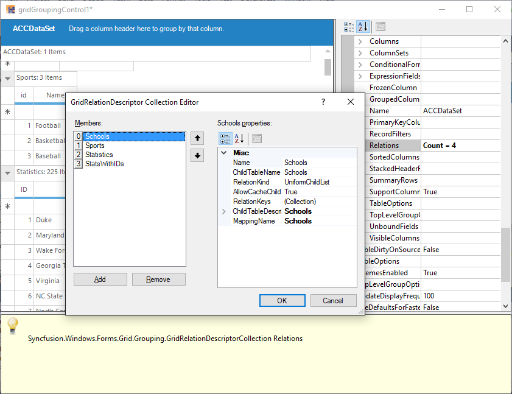

# Grid Designer
The GridGroupingControl has strong designer support. The user can control all aspects of grid's appearance through the designer. Additional commands (verbs) will let you save layouts and restore them. 

The user can also use preview feature that will allow you load data into your control and then further set the GridGroupingControl properties that can be persisted as design-time properties.

## Getting Started
The GridGroupingControl can be previewed and edited at design time by following steps,

1. Open the `Designer` of application form which has GridGroupingControl.
2. Click the `Smart tag` button which is available in the top right corner and following dialog box will be opened,

   

3. Select the Preview and Edit option and following dialog will be opened,

   

It also displays help description for the properties that are being selected. The user can use the property grid to change GridGroupingControl's properties and see the effect immediately on the populated control. When you close the preview, you will have the option of saving any changed properties to the property grid in the designer.

## Grouping
Designer provides full drag and drop capability so that the user can group the records by dragging a column header and dropping it into GroupDropArea, provided the GroupDropArea is enabled by setting [ShowGroupDropArea](https://help.syncfusion.com/cr/windowsforms/Syncfusion.Windows.Forms.Grid.Grouping.GridGroupingControl.html#Syncfusion_Windows_Forms_Grid_Grouping_GridGroupingControl_ShowGroupDropArea) to true. Likewise, user can group data against any number of columns across the tables when multiple nested tables are used.

The below example shows the `Sport` column is dragged for grouping,

The below example shows the `Sport` column is grouped in the Grid,

### Grouping Columns using Property window
The column can be grouped in the grid by using the [TableDescriptor.GroupedColumns](https://help.syncfusion.com/cr/windowsforms/Syncfusion.Windows.Forms.Grid.Grouping.GridTableDescriptor.html) property.

The detailed information about `Grouping` has been discussed in this [Grouping](/windowsforms/gridgrouping/) section.

## Sorting
Sorting can be done on the table data by simply clicking the desired column header by which the values need to be sorted. Once sorting is done, the grouping grid displays `Sort Icon` in the respective column header to indicate Sort Direction. 

### Column sorting using Property window
The user can also make use of the [TableDescriptor.SortedColumns](https://help.syncfusion.com/cr/windowsforms/Syncfusion.Windows.Forms.Grid.Grouping.GridTableDescriptor.html) property to sort table data wherein you need to provide the column to be sorted and sort order.

The detailed information about `Sorting` has been discussed in this [Sorting](/windowsforms/gridgrouping/) section.

## Summaries
Summaries can be added in the designer itself by accessing [TableDescriptor.SummaryRows](https://help.syncfusion.com/cr/windowsforms/Syncfusion.Windows.Forms.Grid.Grouping.GridTableDescriptor.html#Syncfusion_Windows_Forms_Grid_Grouping_GridTableDescriptor_SummaryRows) property. The user can add as many summary rows as you need, each with a desired number of summary columns specifying the type of summary, summary format, the column based on whose values the summary has to be calculated and the like for each of the summary columns.

The below example shows the summary is added to the Grid,

The detailed information about `Summaries` has been discussed in this [Summaries](/windowsforms/gridgrouping/) section.

## Record Filters
By using the [TableDescriptor.RecordFilters](https://help.syncfusion.com/cr/windowsforms/Syncfusion.Windows.Forms.Grid.Grouping.GridTableDescriptor.html) property, you can add row filters for your grid table. Once you have specified filter criteria and column name whose values have to be checked against the given criteria, the grouping grid will display only the subset of records that satisfies the given criteria.

The below example shows the `Sport` column is filtered based on the text `Baseball`,

### Filter bar
GridGroupingControl provides `AutoFilterRow`, which can be enabled by setting [ShowFilterBar](https://help.syncfusion.com/cr/windowsforms/Syncfusion.Windows.Forms.Grid.Grouping.GridGroupOptionsStyleInfo.html#Syncfusion_Windows_Forms_Grid_Grouping_GridGroupOptionsStyleInfo_ShowFilterBar) property to `true`. Once that is done, the user must enable [AllowFilter](https://help.syncfusion.com/cr/windowsforms/Syncfusion.Windows.Forms.Grid.Grouping.GridColumnDescriptor.html#Syncfusion_Windows_Forms_Grid_Grouping_GridColumnDescriptor_AllowFilter) property for the desired columns to enable filtering on those columns.

The following example shows the `ShowFilterBar` property is enabled,

The following example shows the `AllowFilter` property is enabled for `Sport` column,

The following example shows the filter bar drop down showing filtering options for the column `Sport`,

The detailed information about `Filtering` has been discussed in this [Filtering](/windowsforms/gridgrouping/) section.

## Expression Fields
When there is a need to display calculated values based on the values on other fields in the same record, ExpressionFields would be the right choice to use. ExpressionFields can be created by using [TableDescriptor.ExpressionFields](https://help.syncfusion.com/cr/windowsforms/Syncfusion.Windows.Forms.Grid.Grouping.GridTableDescriptor.html) property. This will open an editor wherein the user can add any number of expression fields each with its own expression used to calculate the results.

The following example shows the Expression field is added for `Winning %` column,

The following example shows the `Winning %` column shows the calculation result,

The detailed information about `ExpressionFields` has been discussed in this [ExpressionFields](/windowsforms/gridgrouping/) section.

## Relations
It is possible to specify the relation to be used across the tables in case multiple tables are used. It can be done by accessing [TableDescriptor.Relations](https://help.syncfusion.com/cr/windowsforms/Syncfusion.Windows.Forms.Grid.Grouping.GridTableDescriptor.html#Syncfusion_Windows_Forms_Grid_Grouping_GridTableDescriptor_Relations) property wherein the user can specify the relation type, name of the child table, relation keys consisting of the keys in parent and child tables and other information necessary to setup the relation.

The detailed information about `Relations` has been discussed in this [Relation and Hierarchy](/windowsforms/gridgrouping/) section.

## Appearance
The appearance of every grid element can be customized by accessing [Appearance](https://help.syncfusion.com/cr/windowsforms/Syncfusion.Windows.Forms.Grid.Grouping.GridGroupingControl.html#Syncfusion_Windows_Forms_Grid_Grouping_GridGroupingControl_Appearance) property. It allows you to set[GridStyleInfo](http://help.syncfusion.com/cr/windowsforms/Syncfusion.Windows.Forms.Grid.GridStyleInfo.html) properties like cell type, value, back color, font, etc. for grid cells. It holds a sub tree of different grid elements, each with its own set of formatting properties. The appearance of alternate record field cell can be changed by using [Appearance.AlternateRecordFieldCell](https://help.syncfusion.com/cr/windowsforms/Syncfusion.Windows.Forms.Grid.Grouping.GridTableCellAppearance.html#Syncfusion_Windows_Forms_Grid_Grouping_GridTableCellAppearance_AlternateRecordFieldCell) property.

To change the appearance of the summary cells, [Appearance.SummaryFieldCell](https://help.syncfusion.com/cr/windowsforms/Syncfusion.Windows.Forms.Grid.Grouping.GridTableCellAppearance.html#Syncfusion_Windows_Forms_Grid_Grouping_GridTableCellAppearance_SummaryFieldCell) or related property can be used.

The detailed information about `Appearance` has been discussed in this [Appearance](/windowsforms/gridgrouping/) section.

## Skins
The appearance and behavior of every grid element to provide grid with a rich look and feel can be changed by setting skins. 

The GridGroupingControl has the following skins,

* Office 2003
* Office 2007 (Blue, Silver and Black)
* Office 2010 (Blue, Silver and Black)
* Metro
* System Theme (Windows XP)

To set a skin, [GridVisualStyles](https://help.syncfusion.com/cr/windowsforms/Syncfusion.Windows.Forms.Grid.Grouping.GridGroupingControl.html#Syncfusion_Windows_Forms_Grid_Grouping_GridGroupingControl_GridVisualStyles) property can be used. It lists possible skin options in a drop down, which will make the entire grid redrawn with the chosen style.

The detailed information about `Skins` has been discussed in this [Visual Styles](/windowsforms/gridgrouping/) section.
