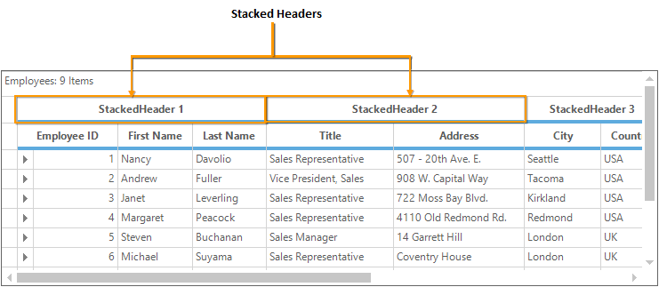
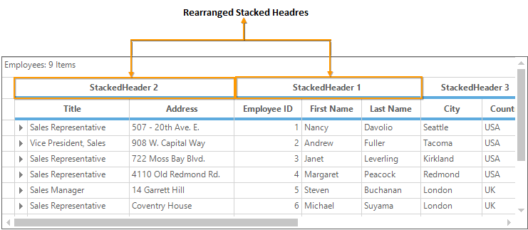
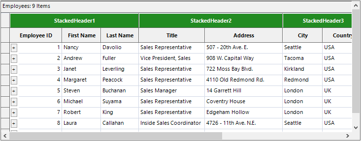
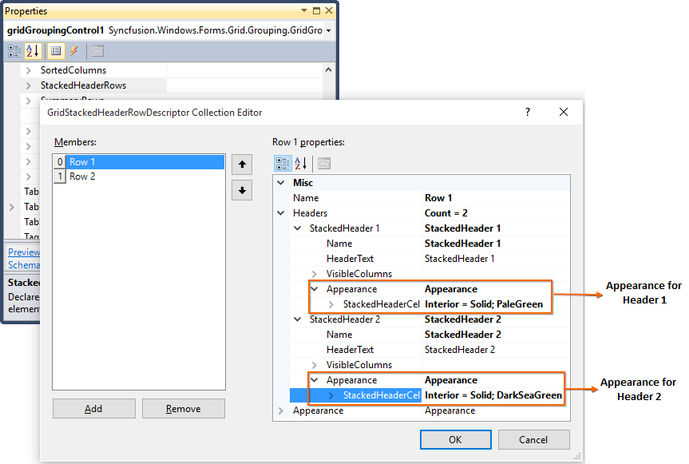
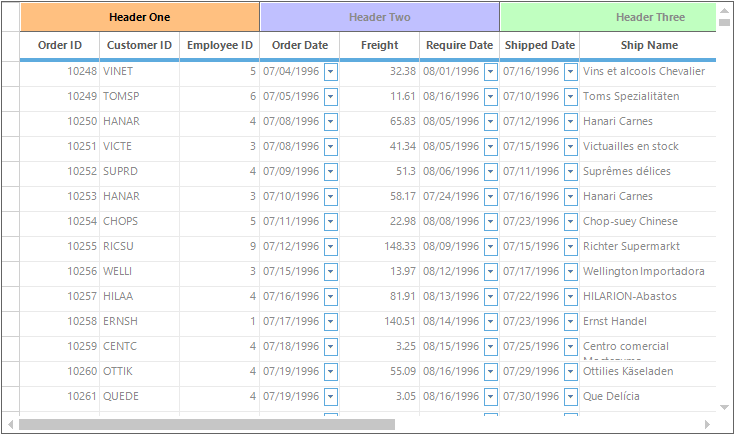
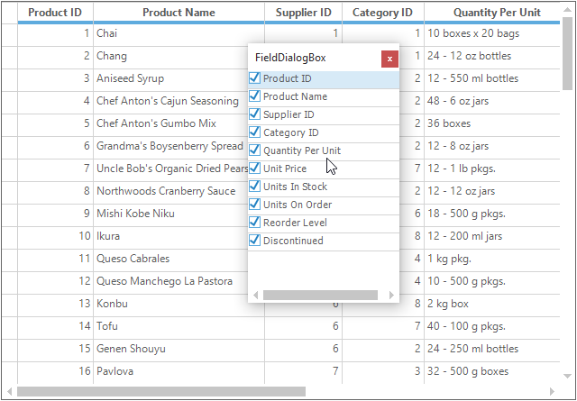
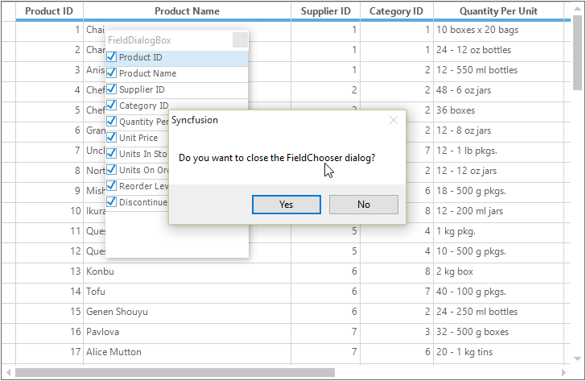
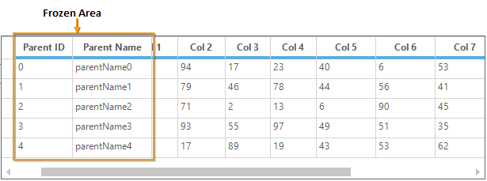
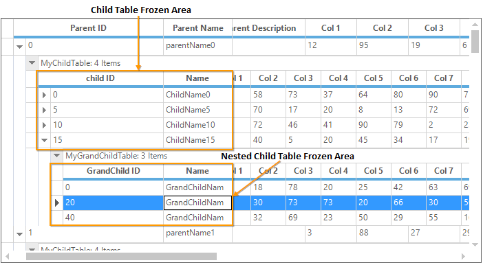
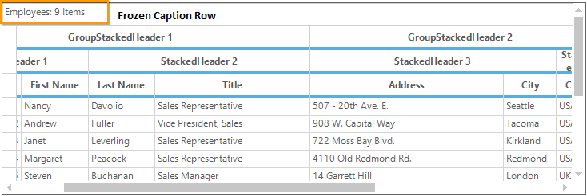

# Grid Layout
GridGroupingControl offers different layouts to organize the display of data. This section will discuss some of the features offered by GridGroupingControl for layout customization.

1. [Stacked Headers](#stacked-headers)
2. [Field Chooser](#field-chooser) 
3. [Multi-Row Record](#multi-row-record)
4. [Freezing Column](#freezing-columns)

## Stacked Headers
GridGroupingControl offers in-built support for Stacked Multi-Headers. This feature allows user to create additional unbound header rows called [StackedHeaderRows](https://help.syncfusion.com/cr/windowsforms/Syncfusion.Windows.Forms.Grid.Grouping.GridTableDescriptor.html#Syncfusion_Windows_Forms_Grid_Grouping_GridTableDescriptor_StackedHeaderRows) that span across visible grid columns. User can group some columns under each header row. It also supports Drag/Drop of these header rows. Grouped columns will also  be rearranged along with the header.

Stacked Header rows for a given grid are gathered under [TableDescriptor.StackedHeaderRows](https://help.syncfusion.com/cr/windowsforms/Syncfusion.Windows.Forms.Grid.Grouping.GridTableDescriptor.html#Syncfusion_Windows_Forms_Grid_Grouping_GridTableDescriptor_StackedHeaderRows) collection. This contains property definitions that control the behavior and appearance of stacked headers.

Every header in a Stacked Header Row is defined by [GridStackedHeaderDescriptor](http://help.syncfusion.com/cr/windowsforms/Syncfusion.Windows.Forms.Grid.Grouping.GridStackedHeaderDescriptor.html). All the headers for a given stacked header row is managed by `GridStackedHeaderRowDescriptor`. [GridStackedHeaderRowDescriptorCollection](http://help.syncfusion.com/cr/windowsforms/Syncfusion.Windows.Forms.Grid.Grouping.GridStackedHeaderRowDescriptorCollection.html), which is returned by `TableDescriptor.StackedHeaderRows` property manages the collection of `GridStackedHeaderRowDescriptor` for a given table.



// Step 1: Creating StackedHeaderDescriptor for adding stacked columns

// “header1” denotes the name of the GridStackedHeaderDescriptor

// “StackedHeader1” denotes the display text of the GridStackedHeaderDescriptor
GridStackedHeaderDescriptor stackedHeaderDescriptor = new GridStackedHeaderDescriptor("header1", "StackedHeader1");

// Step 2: Adding visible columns to the StackedHeaderDescriptor
stackedHeaderDescriptor.VisibleColumns.Add(new GridStackedHeaderVisibleColumnDescriptor("EmployeeID"));
stackedHeaderDescriptor.VisibleColumns.Add(new GridStackedHeaderVisibleColumnDescriptor("FirstName"));
stackedHeaderDescriptor.VisibleColumns.Add(new GridStackedHeaderVisibleColumnDescriptor("LastName"));

// Step 3: Adding StackedHeaderDescriptor to the GridStackedHeaderRowDescriptor collection
GridStackedHeaderRowDescriptor stackedHeaderRowDescriptor = new GridStackedHeaderRowDescriptor("Row1",
    new GridStackedHeaderDescriptor[] { stackedHeaderDescriptor });

// Step 4: Add the GridStackedRowHeaderDescriptor collection to the StackedHeaderRows
this.gridGroupingControl1.TableDescriptor.StackedHeaderRows.Add(stackedHeaderRowDescriptor);


' Step 1: Creating StackedHeaderDescriptor for adding stacked columns

' “header1” denotes the name of the GridStackedHeaderDescriptor

' “StackedHeader1” denotes the display text of the GridStackedHeaderDescriptor
Dim stackedHeaderDescriptor As New GridStackedHeaderDescriptor("header1", "StackedHeader1")

' Step 2: Adding visible columns to the StackedHeaderDescriptor
stackedHeaderDescriptor.VisibleColumns.Add(New GridStackedHeaderVisibleColumnDescriptor("EmployeeID"))
stackedHeaderDescriptor.VisibleColumns.Add(New GridStackedHeaderVisibleColumnDescriptor("FirstName"))
stackedHeaderDescriptor.VisibleColumns.Add(New GridStackedHeaderVisibleColumnDescriptor("LastName"))

' Step 3: Adding StackedHeaderDescriptor to the GridStackedHeaderRowDescriptor collection
Dim stackedHeaderRowDescriptor As New GridStackedHeaderRowDescriptor("Row1", New GridStackedHeaderDescriptor() { stackedHeaderDescriptor })

' Step 4: Add the GridStackedRowHeaderDescriptor collection to the StackedHeaderRows
Me.gridGroupingControl1.TableDescriptor.StackedHeaderRows.Add(stackedHeaderRowDescriptor)



### Adding Stacked Headers through Designer
To add the stacked headers in GridGroupingControl in designer mode, follow the below steps. 

1. Open **GridStackedHeaderRowDescriptor Collection Editor** by using the `StackedHeaderRows` property which is available under the `TableDescriptor` property. Using this collection editor, user can add header rows by specifying different attributes like HeaderText, VisibleColumns, Appearance and so on. 
   
   

2. Enable the [ShowStackedHeaders](https://help.syncfusion.com/cr/windowsforms/Syncfusion.Windows.Forms.Grid.Grouping.GridGroupOptionsStyleInfo.html#Syncfusion_Windows_Forms_Grid_Grouping_GridGroupOptionsStyleInfo_ShowStackedHeaders) property to display the stacked headers for the table and groups.
   
   

   The below screen shot shows the grid with stacked headers.
   
   

3. Visible columns gets affected automatically while rearranging stacked headers as of follows,
   
   

 N> The stacked headers will be generated if the added columns in the stacked headers are presented in the [Columns](https://help.syncfusion.com/cr/windowsforms/Syncfusion.Windows.Forms.Grid.Grouping.GridTableDescriptor.html#Syncfusion_Windows_Forms_Grid_Grouping_GridTableDescriptor_Columns) collection. So the stacked headers are depending upon the `Column` collection. Before adding stacked headers, make sure that those columns are available in `Columns` collection or underlying datasource of the grid.
 
### Adding Stacked Headers through Code
The stacked headers can be added through code by using the below method,

1. Need to create an object of[GridStackedHeaderDescriptor](http://help.syncfusion.com/cr/windowsforms/Syncfusion.Windows.Forms.Grid.Grouping.GridStackedHeaderDescriptor.html) for adding the stacked column header.
2. Add the visible columns that needs to be under the `GridStackedHeaderDescriptor` object.
3. Add the `GridStackedHeaderDescriptor` collection to the[GridStackedHeaderRowDescriptor](http://help.syncfusion.com/cr/windowsforms/Syncfusion.Windows.Forms.Grid.Grouping.GridStackedHeaderRowDescriptor.html) collection.
4. Add the `GridStackedHeaderRowDescriptor` collection to the `StackedHeaderRows` collection of the grid.
5. Finally, display the stacked headers in grid by using the[TopLevelGroupOptions.ShowStackedHeaders](https://help.syncfusion.com/cr/windowsforms/Syncfusion.Windows.Forms.Grid.Grouping.GridGroupOptionsStyleInfo.html#Syncfusion_Windows_Forms_Grid_Grouping_GridGroupOptionsStyleInfo_ShowStackedHeaders) property.



// Step 1: Creating StackedHeaderDescriptor for adding stacked columns

// “header1” denotes the name of the GridStackedHeaderDescriptor

// “StackedHeader1” denotes the display text of the GridStackedHeaderDescriptor
GridStackedHeaderDescriptor stackedHeaderDescriptor = new GridStackedHeaderDescriptor("header1", "StackedHeader1");
GridStackedHeaderDescriptor stackedHeaderDescriptor1 = new GridStackedHeaderDescriptor("header2", "StackedHeader2");

// Step 2: Adding visible columns to the StackedHeaderDescriptor
stackedHeaderDescriptor.VisibleColumns.Add(new GridStackedHeaderVisibleColumnDescriptor("EmployeeID"));
stackedHeaderDescriptor.VisibleColumns.Add(new GridStackedHeaderVisibleColumnDescriptor("FirstName"));
stackedHeaderDescriptor.VisibleColumns.Add(new GridStackedHeaderVisibleColumnDescriptor("LastName"));

stackedHeaderDescriptor1.VisibleColumns.Add(new GridStackedHeaderVisibleColumnDescriptor("Title"));
stackedHeaderDescriptor1.VisibleColumns.Add(new GridStackedHeaderVisibleColumnDescriptor("Address"));
stackedHeaderDescriptor1.VisibleColumns.Add(new GridStackedHeaderVisibleColumnDescriptor("City"));
stackedHeaderDescriptor1.VisibleColumns.Add(new GridStackedHeaderVisibleColumnDescriptor("Country"));

// Step 3: Adding StackedHeaderDescriptor to the GridStackedHeaderRowDescriptor collection
GridStackedHeaderRowDescriptor stackedHeaderRowDescriptor = new GridStackedHeaderRowDescriptor("Row1",
    new GridStackedHeaderDescriptor[] { stackedHeaderDescriptor, stackedHeaderDescriptor1 });

// Step 4: Add the GridStackedRowHeaderDescriptor collection to the StackedHeaderRows
this.gridGroupingControl1.TableDescriptor.StackedHeaderRows.Add(stackedHeaderRowDescriptor);

// Display Stacked Headers 
this.gridGroupingControl1.TopLevelGroupOptions.ShowStackedHeaders = true;


' Step 1: Creating StackedHeaderDescriptor for adding stacked columns

' “header1” denotes the name of the GridStackedHeaderDescriptor

' “StackedHeader1” denotes the display text of the GridStackedHeaderDescriptor

Dim stackedHeaderDescriptor As New GridStackedHeaderDescriptor("header1", "StackedHeader1")
Dim stackedHeaderDescriptor1 As New GridStackedHeaderDescriptor("header2", "StackedHeader2")

' Step 2: Adding visible columns to the StackedHeaderDescriptor
stackedHeaderDescriptor.VisibleColumns.Add(New GridStackedHeaderVisibleColumnDescriptor("EmployeeID"))
stackedHeaderDescriptor.VisibleColumns.Add(New GridStackedHeaderVisibleColumnDescriptor("FirstName"))
stackedHeaderDescriptor.VisibleColumns.Add(New GridStackedHeaderVisibleColumnDescriptor("LastName"))

stackedHeaderDescriptor1.VisibleColumns.Add(New GridStackedHeaderVisibleColumnDescriptor("Title"))
stackedHeaderDescriptor1.VisibleColumns.Add(New GridStackedHeaderVisibleColumnDescriptor("Address"))
stackedHeaderDescriptor1.VisibleColumns.Add(New GridStackedHeaderVisibleColumnDescriptor("City"))
stackedHeaderDescriptor1.VisibleColumns.Add(New GridStackedHeaderVisibleColumnDescriptor("Country"))

' Step 3: Adding StackedHeaderDescriptor to the GridStackedHeaderRowDescriptor collection
Dim stackedHeaderRowDescriptor As New GridStackedHeaderRowDescriptor("Row1", New GridStackedHeaderDescriptor() { stackedHeaderDescriptor, stackedHeaderDescriptor1 })

' Step 4: Add the GridStackedRowHeaderDescriptor collection to the StackedHeaderRows
Me.gridGroupingControl1.TableDescriptor.StackedHeaderRows.Add(stackedHeaderRowDescriptor)

' Display Stacked Headers 
Me.gridGroupingControl1.TopLevelGroupOptions.ShowStackedHeaders = True



### Stacked Headers in Nested Table
Users can also display the stacked headers for the child groups as well as the nested child groups. For enabling the stacked headers in child and nested child table, you have to use the [ChildGroupOptions.ShowStackedHeaders](https://help.syncfusion.com/cr/windowsforms/Syncfusion.Windows.Forms.Grid.Grouping.GridGroupOptionsStyleInfo.html#Syncfusion_Windows_Forms_Grid_Grouping_GridGroupOptionsStyleInfo_ShowStackedHeaders) and [NestedTableGroupOptions.ShowStackedHeaders](https://help.syncfusion.com/cr/windowsforms/Syncfusion.Windows.Forms.Grid.Grouping.GridGroupOptionsStyleInfo.html#Syncfusion_Windows_Forms_Grid_Grouping_GridGroupOptionsStyleInfo_ShowStackedHeaders) properties respectively. 



// Step 1: Creating StackedHeaderDescriptor for adding stacked columns

// “header1” denotes the name of the GridStackedHeaderDescriptor

// “StackedHeader1” denotes the display text of the GridStackedHeaderDescriptor
GridStackedHeaderDescriptor stackedHeaderDescriptor = new GridStackedHeaderDescriptor("header1", "StackedHeader1");
GridStackedHeaderDescriptor stackedHeaderDescriptor1 = new GridStackedHeaderDescriptor("header2", "StackedHeader2");

// Step 2: Adding visible columns to the StackedHeaderDescriptor
stackedHeaderDescriptor.VisibleColumns.Add(new GridStackedHeaderVisibleColumnDescriptor("CustomerID"));
stackedHeaderDescriptor.VisibleColumns.Add(new GridStackedHeaderVisibleColumnDescriptor("OrderDate"));
stackedHeaderDescriptor.VisibleColumns.Add(new GridStackedHeaderVisibleColumnDescriptor("OrderID"));

stackedHeaderDescriptor1.VisibleColumns.Add(new GridStackedHeaderVisibleColumnDescriptor("ShipAddress"));
stackedHeaderDescriptor1.VisibleColumns.Add(new GridStackedHeaderVisibleColumnDescriptor("ShipName"));
stackedHeaderDescriptor1.VisibleColumns.Add(new GridStackedHeaderVisibleColumnDescriptor("ShippedDate"));

// Step 3: Adding GridStackedHeaderDescriptor to the GridStackedHeaderRowDescriptor collection
GridStackedHeaderRowDescriptor stackedHeaderRowDescriptor = new GridStackedHeaderRowDescriptor("Row1",
    new GridStackedHeaderDescriptor[] { stackedHeaderDescriptor, stackedHeaderDescriptor1 });

// Step 4: Add the GridStackedHeaderRowDescriptor collection to the StackedHeaderRows of the Nested TableDescriptor.
this.gridGroupingControl1.GetTableDescriptor("Orders").StackedHeaderRows.Add(stackedHeaderRowDescriptor);

// Display Stacked Headers for the Child Group.
this.gridGroupingControl1.ChildGroupOptions.ShowStackedHeaders = true;


' Step 1: Creating GridStackedHeaderDescriptor for adding stacked columns

' “header1” denotes the name of the GridStackedHeaderDescriptor

' “StackedHeader1” denotes the display text of the GridStackedHeaderDescriptor

Dim stackedHeaderDescriptor As New GridStackedHeaderDescriptor("header1", "StackedHeader1")
Dim stackedHeaderDescriptor1 As New GridStackedHeaderDescriptor("header2", "StackedHeader2")

' Step 2: Adding visible columns to the StackedHeaderDescriptor
stackedHeaderDescriptor.VisibleColumns.Add(New GridStackedHeaderVisibleColumnDescriptor("CustomerID"))
stackedHeaderDescriptor.VisibleColumns.Add(New GridStackedHeaderVisibleColumnDescriptor("OrderDate"))
stackedHeaderDescriptor.VisibleColumns.Add(New GridStackedHeaderVisibleColumnDescriptor("OrderID"))

stackedHeaderDescriptor1.VisibleColumns.Add(New GridStackedHeaderVisibleColumnDescriptor("ShipAddress"))
stackedHeaderDescriptor1.VisibleColumns.Add(New GridStackedHeaderVisibleColumnDescriptor("ShipName"))
stackedHeaderDescriptor1.VisibleColumns.Add(New GridStackedHeaderVisibleColumnDescriptor("ShippedDate"))

' Step 3: Adding GridStackedHeaderDescriptor to the GridStackedHeaderRowDescriptor collection
Dim stackedHeaderRowDescriptor As New GridStackedHeaderRowDescriptor("Row1", New GridStackedHeaderDescriptor() { stackedHeaderDescriptor, stackedHeaderDescriptor1 })

' Step 4: Add the GridStackedRowHeaderDescriptor collection to the StackedHeaderRows of the Nested TableDescriptor.
Me.gridGroupingControl1.GetTableDescriptor("Orders").StackedHeaderRows.Add(stackedHeaderRowDescriptor)

' Display Stacked Headers for the Child Group.
Me.gridGroupingControl1.ChildGroupOptions.ShowStackedHeaders = True



### Appearance
The user can change the appearance of the `StackedHeader` in couple of ways. For changing the appearance of the whole stacked header, you can make use of the `Appearance.StackedHeaderCell` property. If you want to change the individual stacked headers in each StackedHeader row, then change the appearance settings through `GridStackedHeaderRow` Descriptor.

#### Making changes for all stacked headers
For changing all the stacked header style properties then make use of the `Appearance.StackedHeaderCell` property. This property acts as `GridTableCellStyleInfo` class hence it contains all the style properties. 



//Customizes appearance for all the stacked headers.
this.gridGroupingControl1.TableDescriptor.Appearance.StackedHeaderCell.TextColor = Color.White;
this.gridGroupingControl1.TableDescriptor.Appearance.StackedHeaderCell.BackColor = Color.ForestGreen;



'Customizes appearance for all the stacked headers.
Me.gridGroupingControl1.TableDescriptor.Appearance.StackedHeaderCell.TextColor = Color.White
Me.gridGroupingControl1.TableDescriptor.Appearance.StackedHeaderCell.BackColor = Color.ForestGreen



#### Making changes for individual stacked headers
For changing the individual stacked headers then make use of the `GridStackedHeaderRow` descriptor and change the color for individual stack header cells. This can be done in designer as well as in code behind.



// Create an object for GridStackedHeaderRowDescriptor 
GridStackedHeaderRowDescriptor gridStackedHeaderRowDescriptor1 = new GridStackedHeaderRowDescriptor();
gridStackedHeaderRowDescriptor1.Name = "Row 1";

// Create an object for GridStackedHeaderDescriptor
GridStackedHeaderDescriptor gridStackedHeaderDescriptor1 = new GridStackedHeaderDescriptor();

// Change the required appearance for that object
gridStackedHeaderDescriptor1.Appearance.StackedHeaderCell.TextColor = System.Drawing.Color.Black;
gridStackedHeaderDescriptor1.Appearance.StackedHeaderCell.BackColor = Color.ForestGreen;

// Set the name and header text for that object
gridStackedHeaderDescriptor1.HeaderText = "Header One";
gridStackedHeaderDescriptor1.Name = "StackedHeader 1";

// Add the required visible column range in this object
gridStackedHeaderDescriptor1.VisibleColumns.AddRange(new GridStackedHeaderVisibleColumnDescriptor[] {
new Syncfusion.Windows.Forms.Grid.Grouping.GridStackedHeaderVisibleColumnDescriptor("OrderDate"),
new Syncfusion.Windows.Forms.Grid.Grouping.GridStackedHeaderVisibleColumnDescriptor("Freight"),
new Syncfusion.Windows.Forms.Grid.Grouping.GridStackedHeaderVisibleColumnDescriptor("RequiredDate")});

// Add the appearance changed stacked header to the row stack header
gridStackedHeaderRowDescriptor1.Headers.Add(gridStackedHeaderDescriptor1);


' Create an object for GridStackedHeaderRowDescriptor 
Dim gridStackedHeaderRowDescriptor1 As New GridStackedHeaderRowDescriptor()
gridStackedHeaderRowDescriptor1.Name = "Row 1"

' Create an object for GridStackedHeaderDescriptor
Dim gridStackedHeaderDescriptor1 As New GridStackedHeaderDescriptor()

' Change the required appearance for that object
gridStackedHeaderDescriptor1.Appearance.StackedHeaderCell.TextColor = System.Drawing.Color.Black
gridStackedHeaderDescriptor1.Appearance.StackedHeaderCell.BackColor = Color.ForestGreen

' Set the name and header text for that object
gridStackedHeaderDescriptor1.HeaderText = "Header One"
gridStackedHeaderDescriptor1.Name = "StackedHeader 1"

' Add the required visible column range in this object
gridStackedHeaderDescriptor1.VisibleColumns.AddRange(New GridStackedHeaderVisibleColumnDescriptor() { New Syncfusion.Windows.Forms.Grid.Grouping.GridStackedHeaderVisibleColumnDescriptor("OrderDate"), New Syncfusion.Windows.Forms.Grid.Grouping.GridStackedHeaderVisibleColumnDescriptor("Freight"), New Syncfusion.Windows.Forms.Grid.Grouping.GridStackedHeaderVisibleColumnDescriptor("RequiredDate")})

' Add the appearance changed stacked header to the row stack header
gridStackedHeaderRowDescriptor1.Headers.Add(gridStackedHeaderDescriptor1)



### Multi-Stacked Headers
Multiple stacked headers can be achieved in GridGroupingControl by just adding the required number of rows using the `TableDescriptor.StackedHeaderRows` property. 



// Step 1: Creating StackedHeaderDescriptor for adding stacked columns
GridStackedHeaderDescriptor stackedHeaderDescriptor1 = new GridStackedHeaderDescriptor("groupheader1", "GroupStackedHeader1");
GridStackedHeaderDescriptor shd2 = new GridStackedHeaderDescriptor("header1", "StackedHeader1");

// Step 2: Adding visible columns to the StackedHeaderDescriptor
shd2.VisibleColumns.Add(new GridStackedHeaderVisibleColumnDescriptor("EmployeeID"));
shd2.VisibleColumns.Add(new GridStackedHeaderVisibleColumnDescriptor("FirstName"));
shd2.VisibleColumns.Add(new GridStackedHeaderVisibleColumnDescriptor("LastName"));
shd2.VisibleColumns.Add(new GridStackedHeaderVisibleColumnDescriptor("Title"));

stackedHeaderDescriptor1.VisibleColumns.Add(new GridStackedHeaderVisibleColumnDescriptor("EmployeeID"));
stackedHeaderDescriptor1.VisibleColumns.Add(new GridStackedHeaderVisibleColumnDescriptor("FirstName"));

// Step 3: Adding StackedHeaderDescriptor to the GridStackedHeaderRowDescriptor collection
GridStackedHeaderRowDescriptor stackedHeaderRowDescriptor1 = new GridStackedHeaderRowDescriptor("Row1",
    new GridStackedHeaderDescriptor[] { stackedHeaderDescriptor1 });
GridStackedHeaderRowDescriptor stackedHeaderRowDescriptor2 = new GridStackedHeaderRowDescriptor("Row2",
    new GridStackedHeaderDescriptor[] { shd2 });

// Step 4: Add the GridStackedRowHeaderDescriptor collection to the StackedHeaderRows
this.gridGroupingControl1.TableDescriptor.StackedHeaderRows.Add(stackedHeaderRowDescriptor1);
this.gridGroupingControl1.TableDescriptor.StackedHeaderRows.Add(stackedHeaderRowDescriptor2);


' Step 1: Creating StackedHeaderDescriptor for adding stacked columns
Dim stackedHeaderDescriptor1 As New GridStackedHeaderDescriptor("groupheader1", "GroupStackedHeader1")
Dim shd2 As New GridStackedHeaderDescriptor("header1", "StackedHeader1")

' Step 2: Adding visible columns to the StackedHeaderDescriptor
shd2.VisibleColumns.Add(New GridStackedHeaderVisibleColumnDescriptor("EmployeeID"))
shd2.VisibleColumns.Add(New GridStackedHeaderVisibleColumnDescriptor("FirstName"))
shd2.VisibleColumns.Add(New GridStackedHeaderVisibleColumnDescriptor("LastName"))
shd2.VisibleColumns.Add(New GridStackedHeaderVisibleColumnDescriptor("Title"))

stackedHeaderDescriptor1.VisibleColumns.Add(New GridStackedHeaderVisibleColumnDescriptor("EmployeeID"))
stackedHeaderDescriptor1.VisibleColumns.Add(New GridStackedHeaderVisibleColumnDescriptor("FirstName"))

' Step 3: Adding StackedHeaderDescriptor to the GridStackedHeaderRowDescriptor collection
Dim stackedHeaderRowDescriptor1 As New GridStackedHeaderRowDescriptor("Row1", New GridStackedHeaderDescriptor() { stackedHeaderDescriptor1 })
Dim stackedHeaderRowDescriptor2 As New GridStackedHeaderRowDescriptor("Row2", New GridStackedHeaderDescriptor() { shd2 })

' Step 4: Add the GridStackedRowHeaderDescriptor collection to the StackedHeaderRows
Me.gridGroupingControl1.TableDescriptor.StackedHeaderRows.Add(stackedHeaderRowDescriptor1)
Me.gridGroupingControl1.TableDescriptor.StackedHeaderRows.Add(stackedHeaderRowDescriptor2)



### FieldChooser for StackedHeaders
User can show or hide the columns of a stacked header in a grid by using the [FieldChooser](#field-chooser) functionality.



// Adding FieldChooser support to the GridGroupingControl
FieldChooser fieldChooser = new FieldChooser(this.gridGroupingControl1);


' Adding FieldChooser support to the GridGroupingControl
Dim fieldChooser As New FieldChooser(Me.gridGroupingControl1)



N> For more information, refer the dashboard sample which is located in this path &lt;Installed_Location&gt;\Syncfusion\EssentialStudio\&lt;Version_Number&gt;\Windows\Grid.Grouping.Windows\Samples\Layout Customization\Stacked Headers Demo\CS

#### Displaying only Stacked Header Columns 
By default, `FieldChooser Dialog` will be loaded with the inner columns along with the stacked headers. To display only the stacked headers make us of the [EnableColumnsInView](https://help.syncfusion.com/cr/windowsforms/Syncfusion.GridHelperClasses.FieldChooser.html#Syncfusion_GridHelperClasses_FieldChooser_EnableColumnsInView) property.



FieldChooser fieldChooser = new FieldChooser(this.gridGroupingControl1);
// Do not display the inner columns of stacked header in FieldChooser
fieldChooser.EnableColumnsInView = false;


Dim fieldChooser As New FieldChooser(Me.gridGroupingControl1)
' Do not display the inner columns of stacked header in FieldChooser
fieldChooser.EnableColumnsInView = False



### Hiding Stacked Headers
The display of stacked headers can be hidden by setting the [ShowStackedHeaders](https://help.syncfusion.com/cr/windowsforms/Syncfusion.Windows.Forms.Grid.Grouping.GridGroupOptionsStyleInfo.html#Syncfusion_Windows_Forms_Grid_Grouping_GridGroupOptionsStyleInfo_ShowStackedHeaders) property to `false`. This can be achieved for parent table, child table and nested child table by using the properties [TopLevelGroupOptions.ShowStackedHeaders](https://help.syncfusion.com/cr/windowsforms/Syncfusion.Windows.Forms.Grid.Grouping.GridGroupOptionsStyleInfo.html#Syncfusion_Windows_Forms_Grid_Grouping_GridGroupOptionsStyleInfo_ShowStackedHeaders), [ChildGroupOptions.ShowStackedHeaders](https://help.syncfusion.com/cr/windowsforms/Syncfusion.Windows.Forms.Grid.Grouping.GridGroupOptionsStyleInfo.html#Syncfusion_Windows_Forms_Grid_Grouping_GridGroupOptionsStyleInfo_ShowStackedHeaders) and [NestedTableGroupOptions.ShowStackedHeaders](https://help.syncfusion.com/cr/windowsforms/Syncfusion.Windows.Forms.Grid.Grouping.GridGroupOptionsStyleInfo.html#Syncfusion_Windows_Forms_Grid_Grouping_GridGroupOptionsStyleInfo_ShowStackedHeaders) respectively.



// Hides the visibility of stacked headers in Parent table
this.gridGroupingControl1.TopLevelGroupOptions.ShowStackedHeaders = false;

// Hides the visibility of stacked headers in Child table
this.gridGroupingControl1.ChildGroupOptions.ShowStackedHeaders = false;

// Hides the visibility of stacked headers in Nested Child table
this.gridGroupingControl1.NestedTableGroupOptions.ShowStackedHeaders = false;


' Hides the visibility of stacked headers in Parent table
Me.gridGroupingControl1.TopLevelGroupOptions.ShowStackedHeaders = False

' Hides the visibility of stacked headers in Child table
Me.gridGroupingControl1.ChildGroupOptions.ShowStackedHeaders = False

' Hides the visibility of stacked headers in Nested Child table
Me.gridGroupingControl1.NestedTableGroupOptions.ShowStackedHeaders = False



### Clearing Stacked Headers
All the stacked headers can be removed by using the [StackedHeaders.Clear](https://help.syncfusion.com/cr/windowsforms/Syncfusion.Windows.Forms.Grid.Grouping.GridStackedHeaderRowDescriptorCollection.html#Syncfusion_Windows_Forms_Grid_Grouping_GridStackedHeaderRowDescriptorCollection_Clear) method.



// Clears all the stacked headers in GridGroupingControl
this.gridGroupingControl1.TableDescriptor.StackedHeaderRows.Clear();


' Clears all the stacked headers in GridGroupingControl
Me.gridGroupingControl1.TableDescriptor.StackedHeaderRows.Clear()



### Removing Stacked Headers
In multiple stacked headers, there will be more than one stacked row headers. So for removing a particular stacked row header, make use of the [StackedHeaders.Remove](https://help.syncfusion.com/cr/windowsforms/Syncfusion.Windows.Forms.Grid.Grouping.GridStackedHeaderRowDescriptorCollection.html#Syncfusion_Windows_Forms_Grid_Grouping_GridStackedHeaderRowDescriptorCollection_Remove_Syncfusion_Windows_Forms_Grid_Grouping_GridStackedHeaderRowDescriptor_) and [StackedHeaders.RemoveAt](https://help.syncfusion.com/cr/windowsforms/Syncfusion.Windows.Forms.Grid.Grouping.GridStackedHeaderRowDescriptorCollection.html#Syncfusion_Windows_Forms_Grid_Grouping_GridStackedHeaderRowDescriptorCollection_RemoveAt_System_Int32_) methods. These methods will remove the mentioned stacked row header by its name or index.


// Removes the stacked header with name "Row1"
this.gridGroupingControl1.TableDescriptor.StackedHeaderRows.Remove("Row1");

// Removes the stacked header which is located in the zeroth index
this.gridGroupingControl1.TableDescriptor.StackedHeaderRows.RemoveAt(0);


' Removes the stacked header with name "Row1"
Me.gridGroupingControl1.TableDescriptor.StackedHeaderRows.Remove("Row1")

' Removes the stacked header which is located in the zeroth index
Me.gridGroupingControl1.TableDescriptor.StackedHeaderRows.RemoveAt(0)



## Multi-Row Record
GridGroupingControl offers built-in support for Multi-Row Records. Using this support user can modify the default alignment of visible columns. It allows the records to span across multiple rows and columns. This can be achieved by using [TableDescriptor.ColumnSets](https://help.syncfusion.com/cr/windowsforms/Syncfusion.Windows.Forms.Grid.Grouping.GridTableDescriptor.html#Syncfusion_Windows_Forms_Grid_Grouping_GridTableDescriptor_ColumnSets). 

`ColumnSets` act as superset of [TableDescriptor.Columns](https://help.syncfusion.com/cr/windowsforms/Syncfusion.Windows.Forms.Grid.Grouping.GridQueryAllowGroupByColumnEventArgs.html#Syncfusion_Windows_Forms_Grid_Grouping_GridQueryAllowGroupByColumnEventArgs_Column) collection. Once `ColumnSets` are defined, the grid will loop through the collection and organize data display accordingly.

### Adding Column Spans through Designer
To create `ColumnSets` that defines [ColumnSpans](https://help.syncfusion.com/cr/windowsforms/Syncfusion.Windows.Forms.Grid.Grouping.GridColumnSetDescriptor.html#Syncfusion_Windows_Forms_Grid_Grouping_GridColumnSetDescriptor_ColumnSpans) for a grid, select `TableDescriptor.ColumnSets` property in the property window. This will open [GridColumnSetDescriptor](http://help.syncfusion.com/cr/windowsforms/Syncfusion.Windows.Forms.Grid.Grouping.GridColumnSetDescriptor.html) collection editor that will let you specify the columns to span and the range for each of the columns.

### Adding Column Spans through Code
The below steps needs to be followed for spanning the records across multiple rows.

1.Define [GridColumnSpanDescriptor](http://help.syncfusion.com/cr/windowsforms/Syncfusion.Windows.Forms.Grid.Grouping.GridColumnSpanDescriptor.html) for each column to be spanned across grid rows or columns. Specify the range that the column spans. Rows and Columns are zero-based.



// Create objects for GridColumnSpanDescriptor
GridColumnSpanDescriptor columnSpanDescriptor0 = new GridColumnSpanDescriptor("ProductID");
GridColumnSpanDescriptor columnSpanDescriptor1 = new GridColumnSpanDescriptor("ProductName");   
GridColumnSpanDescriptor columnSpanDescriptor2 = new GridColumnSpanDescriptor("SupplierID");      
GridColumnSpanDescriptor columnSpanDescriptor3 = new GridColumnSpanDescriptor("CategoryID");

// Add the required ranges for the created object
columnSpanDescriptor0.Range = GridRangeInfo.Cells(0, 0, 1, 0);
columnSpanDescriptor1.Range = GridRangeInfo.Cells(0, 1, 0, 2);
columnSpanDescriptor2.Range = GridRangeInfo.Cells(1, 1, 1, 1);
columnSpanDescriptor3.Range = GridRangeInfo.Cells(1, 2, 1, 2);


' Create objects for GridColumnSpanDescriptor
Dim columnSpanDescriptor0 As New GridColumnSpanDescriptor("ProductID")
Dim columnSpanDescriptor1 As New GridColumnSpanDescriptor("ProductName")
Dim columnSpanDescriptor2 As New GridColumnSpanDescriptor("SupplierID")
Dim columnSpanDescriptor3 As New GridColumnSpanDescriptor("CategoryID")

' Add the required ranges for the created object
columnSpanDescriptor0.Range = GridRangeInfo.Cells(0, 0, 1, 0)
columnSpanDescriptor1.Range = GridRangeInfo.Cells(0, 1, 0, 2)
columnSpanDescriptor2.Range = GridRangeInfo.Cells(1, 1, 1, 1)
columnSpanDescriptor3.Range = GridRangeInfo.Cells(1, 2, 1, 2)



2.Create a [GridColumnSetDescriptor](http://help.syncfusion.com/cr/windowsforms/Syncfusion.Windows.Forms.Grid.Grouping.GridColumnSetDescriptor.html) whose [ColumnSpans](https://help.syncfusion.com/cr/windowsforms/Syncfusion.Windows.Forms.Grid.Grouping.GridColumnSetDescriptor.html#Syncfusion_Windows_Forms_Grid_Grouping_GridColumnSetDescriptor_ColumnSpans) property stores information about columns that needs to be spanned. Hence, it is necessary to initialize `ColumnSpans` property with columns that needs to be spread.



// Create object for GridColumnSetDescriptor
GridColumnSetDescriptor columnSetDescriptor = new GridColumnSetDescriptor();

// Add the column span descriptor to the created 

// columns set descriptor
columnSetDescriptor.ColumnSpans.Add(columnSpanDescriptor0);
columnSetDescriptor.ColumnSpans.Add(columnSpanDescriptor1);
columnSetDescriptor.ColumnSpans.Add(columnSpanDescriptor2);
columnSetDescriptor.ColumnSpans.Add(columnSpanDescriptor3);


' Create object for GridColumnSetDescriptor
Dim columnSetDescriptor As New GridColumnSetDescriptor()

' Add the column span descriptor to the created 

' columns set descriptor
columnSetDescriptor.ColumnSpans.Add(columnSpanDescriptor0)
columnSetDescriptor.ColumnSpans.Add(columnSpanDescriptor1)
columnSetDescriptor.ColumnSpans.Add(columnSpanDescriptor2)
columnSetDescriptor.ColumnSpans.Add(columnSpanDescriptor3) 



3.Finally bind this `ColumnSets` to the grid by adding the above created `GridColumnSetDescriptor` into the `TableDescriptor.ColumnSets` property.



// Add the column set descriptor to the ColumnSets property
this.gridGroupingControl1.TableDescriptor.ColumnSets.Add(columnSetDescriptor);


' Add the column set descriptor to the ColumnSets property 
Me.gridGroupingControl1.TableDescriptor.ColumnSets.Add(columnSetDescriptor)



N> For more information regarding the Multi-Row record, refer our dashboard sample which is located in this path &lt;Installed_Location&gt;\Syncfusion\EssentialStudio\&lt;Version_Number&gt;\Windows\Grid.Grouping.Windows\Samples\Layout Customization\Record Customization Demo\

### Clearing ColumnSpans
The column spans can be removed from the GridGroupingControl by using the [ColumnSets.Reset](https://help.syncfusion.com/cr/windowsforms/Syncfusion.Windows.Forms.Grid.Grouping.GridColumnSetDescriptorCollection.html#Syncfusion_Windows_Forms_Grid_Grouping_GridColumnSetDescriptorCollection_Reset) method. This method will clear all the collection of column sets available.



// Clears all the collection
this.gridGroupingControl1.TableDescriptor.ColumnSets.Reset();


' Clears all the collection
Me.gridGroupingControl1.TableDescriptor.ColumnSets.Reset()



### Removing ColumnSpans
Particular ColumnSpans can be removed from the GridGroupingControl by using the [ColumnSets.Remove](https://help.syncfusion.com/cr/windowsforms/Syncfusion.Windows.Forms.Grid.Grouping.GridColumnSetDescriptorCollection.html#Syncfusion_Windows_Forms_Grid_Grouping_GridColumnSetDescriptorCollection_Remove_Syncfusion_Windows_Forms_Grid_Grouping_GridColumnSetDescriptor_) and [ColumnSets.RemoveAt](https://help.syncfusion.com/cr/windowsforms/Syncfusion.Windows.Forms.Grid.Grouping.GridColumnSetDescriptorCollection.html#Syncfusion_Windows_Forms_Grid_Grouping_GridColumnSetDescriptorCollection_RemoveAt_System_Int32_) method. These methods will remove the mentioned column name or index of column sets.



// Remove the ColumnSets at index 1
this.gridGroupingControl1.TableDescriptor.ColumnSets.RemoveAt(1);


' Remove the ColumnSets at index 1
Me.gridGroupingControl1.TableDescriptor.ColumnSets.RemoveAt(1)



## Field Chooser
User can handle the visibility of columns through `FieldChooser dialog`. It can be done by initializing [FieldChooser](http://help.syncfusion.com/cr/windowsforms/Syncfusion.GridHelperClasses.FieldChooser.html) class where the constructor takes a parameter as a GridGroupingControl object. The [GridHelperClasses.Windows](http://help.syncfusion.com/cr/windowsforms/Syncfusion.GridHelperClasses.html) assembly provide this support.

On enabling the FieldChooser, a dialog box will be opened when right clicked on column headers. This dialog box will list all the column names with check boxes beside them. The required columns can be made visible in the grid by selecting the check box adjacent to the required column.



// Adding FieldChooser support to the GridGroupingControl
FieldChooser fieldChooser = new FieldChooser(this.gridGroupingControl1);


' Adding FieldChooser support to the GridGroupingControl
Dim fieldChooser As New FieldChooser(Me.gridGroupingControl1)



### Changing caption text for FieldChooser dialog
FieldChooser events are used to customize FieldChooser dialog box. For changing the caption text of the `FieldChooser dialog box`, make use of the [FieldChooserShowing](https://help.syncfusion.com/cr/windowsforms/Syncfusion.Windows.Forms.Grid.Grouping.GridGroupingControl.html) event. In this event, you can make use of the[e.Caption](https://help.syncfusion.com/cr/windowsforms/Syncfusion.Windows.Forms.Grid.FieldChooserShowingEventArgs.html#Syncfusion_Windows_Forms_Grid_FieldChooserShowingEventArgs_Caption) property to change the text.



FieldChooser fieldChooser = new FieldChooser(this.gridGroupingControl1);
fieldChooser.Grid.FieldChooserShowing += Grid_FieldChooserShowing;

void Grid_FieldChooserShowing(object sender, Syncfusion.Windows.Forms.Grid.FieldChooserShowingEventArgs e)
{

    //Setting the caption for FieldChooser dialog
    e.Caption = "Syncfusion";
}


Dim fieldChooser As New FieldChooser(Me.gridGroupingControl1)
fieldChooser.Grid.FieldChooserShowing += Grid_FieldChooserShowing

Private Sub Grid_FieldChooserShowing(ByVal sender As Object, ByVal e As Syncfusion.Windows.Forms.Grid.FieldChooserShowingEventArgs)

    'Setting the caption for FieldChooser dialog
    e.Caption = "Syncfusion"
End Sub



FieldChooser events are used to customize FieldChooser dialog box. It allows the user to modify control of the FieldChooser dialog and change its caption name. It has events to perform operations in FieldChooser dialog box such as [FieldChooserShowing](https://help.syncfusion.com/cr/windowsforms/Syncfusion.Windows.Forms.Grid.Grouping.GridGroupingControl.html), [FieldChooserShown](https://help.syncfusion.com/cr/windowsforms/Syncfusion.Windows.Forms.Grid.Grouping.GridGroupingControl.html), [FieldChooserClosing](https://help.syncfusion.com/cr/windowsforms/Syncfusion.Windows.Forms.Grid.Grouping.GridGroupingControl.html) and [FieldChooserClosed](https://help.syncfusion.com/cr/windowsforms/Syncfusion.Windows.Forms.Grid.Grouping.GridGroupingControl.html) events.

### Updating Layout on Closing
By default, the GridGroupingControl will update the changes in the visibility of the columns while check/ unchecking the checkbox in the **FieldChooser dialog box**. To update the visibility or invisibility of columns after closing the FieldChooser Dialog box, set the [DeferLayoutUpdate](https://help.syncfusion.com/cr/windowsforms/Syncfusion.GridHelperClasses.GridDataBoundFieldChooser.html#Syncfusion_GridHelperClasses_GridDataBoundFieldChooser_DeferLayoutUpdate) property to ‘True’.



// Adding FieldChooser support to the GridGroupingControl
FieldChooser fieldChooser = new FieldChooser(this.gridGroupingControl1);

// Update while closing the FieldChooser Dialog
fieldChooser.DeferLayoutUpdate = true;


' Adding FieldChooser support to the GridGroupingControl
Dim fieldChooser As New FieldChooser(Me.gridGroupingControl1)

' Update while closing the FieldChooser Dialog
fieldChooser.DeferLayoutUpdate = True



### Restricting the display of FieldChooser Dialog 
The user can restrict the FieldChooser dialog box before displaying it by using the FieldChooserShowing event. In this event, set the [e.Cancel](https://help.syncfusion.com/cr/windowsforms/Syncfusion.Windows.Forms.Grid.Grouping.GridGroupingControl.html) property as `true`.



this.gridGroupingControl1.FieldChooserShowing += new Syncfusion.Windows.Forms.Grid.FieldChooserShowingEventHandler(gridGroupingControl1_FieldChooserShowing);

void gridGroupingControl1_FieldChooserShowing(object sender, Syncfusion.Windows.Forms.Grid.FieldChooserShowingEventArgs e)
{

    // Stops the FieldChooser dialog box from showing.
    e.Cancel = true;
}



AddHandler gridGroupingControl1.FieldChooserShowing, AddressOf gridGroupingControl1_FieldChooserShowing

Private Sub gridGroupingControl1_FieldChooserShowing(ByVal sender As Object, ByVal e As Syncfusion.Windows.Forms.Grid.FieldChooserShowingEventArgs)

    ' Stops the FieldChooser dialog box from showing.
    e.Cancel = True
End Sub



### Restricting the closing of FieldChooser Dialog
Users can restrict the closing of FieldChooser dialog by using the FieldChooserClosing event. Check the required condition and set the [e.Cancel](https://help.syncfusion.com/cr/windowsforms/Syncfusion.Windows.Forms.Grid.Grouping.GridGroupingControl.html) property as `true` to restrict the closing of the FieldChooser dialog.



FieldChooser fieldChooser = new FieldChooser(this.gridGroupingControl1);
fieldChooser.Grid.FieldChooserClosing += Grid_FieldChooserClosing;

void Grid_FieldChooserClosing(object sender, Syncfusion.Windows.Forms.Grid.FieldChooserClosingEventArgs e)
{

//Add required condition
DialogResult result1 = MessageBox.Show("Do you want to close the FieldChooser dialog?", "Syncfusion", MessageBoxButtons.YesNo);

if (result1 == System.Windows.Forms.DialogResult.No)
    e.Cancel = true;// will restrict the closing of FieldChooser dialog box
}


Dim fieldChooser As New FieldChooser(Me.gridGroupingControl1)
fieldChooser.Grid.FieldChooserClosing += Grid_FieldChooserClosing

Private Sub Grid_FieldChooserClosing(ByVal sender As Object, ByVal e As Syncfusion.Windows.Forms.Grid.FieldChooserClosingEventArgs)

'Add required condition
Dim result1 As DialogResult = MessageBox.Show("Do you want to close the FieldChooser dialog?", "Syncfusion", MessageBoxButtons.YesNo)

If result1 = System.Windows.Forms.DialogResult.No Then
    e.Cancel = True ' will restrict the closing of FieldChooser dialog box
End If
End Sub



N> FieldChooser support can also be added in [StackedHeaders](#stacked-headers). 

### Remove Hidden Columns from FieldChooser Dialog
To remove the hidden columns from the FieldChooser dialog, it is necessary to bypass the original column collection in the FieldChooser with a cloned [GridColumnDescriptorCollection](http://help.syncfusion.com/cr/windowsforms/Syncfusion.Windows.Forms.Grid.Grouping.GridColumnDescriptorCollection.html). The following steps illustrates how to do this:

1. Get the collection of the visible columns that are removed from the column collection.
2. Create a cloned column collection `GridColumnDescriptorCollection` from the[TableDescriptor](https://help.syncfusion.com/cr/windowsforms/Syncfusion.Windows.Forms.Grid.Grouping.GridColumnDescriptor.html#Syncfusion_Windows_Forms_Grid_Grouping_GridColumnDescriptor_TableDescriptor).

Pass the cloned collection object as an argument to the FieldChooser to ensure that changes are made correctly. 



//Removes Visible Columns.
this.gridGroupingControl1.TableDescriptor.VisibleColumns.Remove("Name3");

//Creates GridColumnDescriptorCollection column collection.
GridColumnDescriptorCollection collection = 
this.gridGroupingControl1.TableDescriptor.Columns.Clone();

//Detaches visible column, which is likely to be removed from this cloned collection also.
collection.Remove("Name3");

//Passes the collection as an argument to the Field Chooser object.
FieldChooser fieldChooser = new FieldChooser(this.gridGroupingControl1, collection);


'Removes Visible Columns.
Me.gridGroupingControl1.TableDescriptor.VisibleColumns.Remove("Name3")

'Creates a GridColumnDescriptorCollection column collection.
Dim collection As GridColumnDescriptorCollection = 
Me.gridGroupingControl1.TableDescriptor.Columns.Clone()

'Detaches the visible column, which is likely to be removed from this cloned collection also.
collection.Remove("Name3")

'Passes the collection as an argument to the Field Chooser object.
Dim fieldChooser As New FieldChooser(Me.gridGroupingControl1, collection)



### UnWiring FieldChooser
To unwire FieldChooser from the GridGroupingControl, make use of the [UnWireGrid](https://help.syncfusion.com/cr/windowsforms/Syncfusion.GridHelperClasses.FieldChooser.html#Syncfusion_GridHelperClasses_FieldChooser_UnWireGrid) method. This method will disable the FieldChooser.



// Adding FieldChooser support to the GridGroupingControl
FieldChooser fieldChooser = new FieldChooser(this.gridGroupingControl1);

// Disables the FieldChooser support for the added GridGroupingControl
fieldChooser.UnWireGrid();


' Adding FieldChooser support to the GridGroupingControl
Dim fieldChooser As New FieldChooser(Me.gridGroupingControl1)

' Disables the FieldChooser support for the added GridGroupingControl
fieldChooser.UnWireGrid()



## Freezing Columns
It is possible to freeze columns like in Excel by using the [TableDescriptor.FrozenColumn](https://help.syncfusion.com/cr/windowsforms/Syncfusion.Windows.Forms.Grid.Grouping.GridTableDescriptor.html#Syncfusion_Windows_Forms_Grid_Grouping_GridTableDescriptor_FrozenColumn). This property will prevent the mentioned column from scrolling.



// Freezes the column named “ParentName” in the grid
gridGroupingControl1.TableDescriptor.FrozenColumn = "ParentName";


' Freezes the column named “ParentName” in the grid
gridGroupingControl1.TableDescriptor.FrozenColumn = "ParentName"



### Freezing Columns in Nested Table
It is also possible to freeze columns of nested table in a GridGroupingControl by using the [TableDescriptor.FrozenColumn](https://help.syncfusion.com/cr/windowsforms/Syncfusion.Windows.Forms.Grid.Grouping.GridTableDescriptor.html#Syncfusion_Windows_Forms_Grid_Grouping_GridTableDescriptor_FrozenColumn). First you have to get the `TableDescriptor` of the required child table and then have to access the `FrozenColumn` property.

N> In a nested grid with frozen columns, to make sure that columns in nested records are properly aligned, [TrackWidthOfParentColumn](https://help.syncfusion.com/cr/windowsforms/Syncfusion.Windows.Forms.Grid.Grouping.GridColumnDescriptor.html#Syncfusion_Windows_Forms_Grid_Grouping_GridColumnDescriptor_TrackWidthOfParentColumn) property can be used.



// Freezes the column in the ChildTable.
this.gridGroupingControl1.GetTableDescriptor("MyChildTable").FrozenColumn = "Name";

// Freezes the column in Nested ChildTable
this.gridGroupingControl1.GetTableDescriptor("MyGrandChildTable").FrozenColumn = "Name";


' Freezes the column in the ChildTable.
Me.gridGroupingControl1.GetTableDescriptor("MyChildTable").FrozenColumn = "Name"

' Freezes the column in Nested ChildTable
Me.gridGroupingControl1.GetTableDescriptor("MyGrandChildTable").FrozenColumn = "Name"



N> For more information on Freezing columns, refer the dashboard sample located in this path &lt;Installed_Location&gt;\Syncfusion\EssentialStudio\&lt;Version_Number&gt;\Windows\Grid.Grouping.Windows\Samples\Layout Customization\Frozen Column Demo\

### Freezing Specified Columns
It is possible to freeze specified columns in GridGroupingControl by using the [Cols.FreezeRange](https://help.syncfusion.com/cr/windowsforms/Syncfusion.Windows.Forms.Grid.GridModelRowColOperations.html#Syncfusion_Windows_Forms_Grid_GridModelRowColOperations_FreezeRange_System_Int32_System_Int32_) method. Set the column range in this method by mentioning the index values.


// Freezes the columns of range from one to three.
this.gridGroupingControl1.TableModel.Cols.FreezeRange(1, 3);


' Freezes the columns of range from one to three.
Me.gridGroupingControl1.TableModel.Cols.FreezeRange(1, 3)



### Freezing the Caption Row
GridGroupingControl provides support to freeze caption row to make sure it stays visible while scrolling content to the left or right. With [FreezeCaption](https://help.syncfusion.com/cr/windowsforms/Syncfusion.Windows.Forms.Grid.Grouping.GridGroupingControl.html#Syncfusion_Windows_Forms_Grid_Grouping_GridGroupingControl_FreezeCaption) property, you can freeze or unfreeze the caption row in the Grid Grouping control.



// Freezes the caption row
this.gridGroupingControl.FreezeCaption = true


'Freezes the caption row
Me.gridGroupingControl.FreezeCaption = True



N> To view a sample on Freezing the Caption Row, refer the dashboard sample which is located in this path &lt;Installed_Location&gt;\Syncfusion\EssentialStudio\&lt;Version_Number&gt;\Windows\Grid.Grouping.Windows\Samples\Grouping\Grouping Events Demo

### Enabling ScrollBar when the Freeze Columns exceeds the Client Area
In GridGroupingControl, if freeze columns exceed client area then the horizontal scroll bar will become invisible. To overcome this some of the customizations has to be done. You have to make use of the [ResizeEnd](https://msdn.microsoft.com/en-us/library/system.windows.forms.form.resizeend(v=vs.110).aspx) and [HScrollPixelPosChanging](https://help.syncfusion.com/cr/windowsforms/Syncfusion.Windows.Forms.Grid.GridControlBase.html) events and need to check certain conditions in it.



this.ResizeEnd += new EventHandler(Form1_ResizeEnd);
this.oGrid.TableControl.HScrollPixelPosChanging += new GridScrollPositionChangingEventHandler(TableControl_HScrollPixelPosChanging);

void Form1_ResizeEnd(object sender, EventArgs e)
{
    int fieldIndex = Convert.ToInt32(textBox1.Text);
    var col = oGrid.TableDescriptor.VisibleColumns[fieldIndex-1];
    var last = oGrid.TableControl.ViewLayout.LastVisibleCol;

    if (col != null)
    {

        if (last < fieldIndex + 2 && buttonClick)
        {                            
             oGrid.TableModel.ResetColHiddenEntries();
             oGrid.TableDescriptor.FrozenColumn = "";
             oGrid.TableControl.SetCurrentHScrollPixelPos(1);
             notFrozenView = true; 
             frozenView = false;
         }

         else if (buttonClick)
         {
               oGrid.TableDescriptor.FrozenColumn = col.Name;
               frozenView = true;
               notFrozenView = false;
         }
    }
}

void TableControl_HScrollPixelPosChanging(object sender, GridScrollPositionChangingEventArgs e)
{

    int fieldIndex = Convert.ToInt32(textBox1.Text);
    var col = oGrid.TableDescriptor.VisibleColumns[fieldIndex - 1];
    int columnPosition = 0;
    int pixelDelta;
    oGrid.TableControl.HScrollPixelPosToColIndex(e.ScrollPosition, out columnPosition, out pixelDelta);
    var LeftmostPixel=oGrid.TableControl.GetHScrollPixelMinimum();      
    var last = oGrid.TableControl.ViewLayout.LastVisibleCol;
    var vCount = oGrid.TableControl.ViewLayout.VisibleColumnsList.Count;

    if (columnPosition==0)
    {
        e.Cancel = true;
    }

    if (notFrozenView && buttonClick && last==fieldIndex+1)
    {

        for (int i = 1; i <= fieldIndex-(vCount-3); i++)
        {
            GridColHidden hid = new GridColHidden(i);
            oGrid.TableModel.ColHiddenEntries.Add(hid);
        }                
        oGrid.TableDescriptor.FrozenColumn = col.Name;
        unfreeze = true;
    }

    if (columnPosition == fieldIndex + 1 && LeftmostPixel == e.ScrollPosition && unfreeze && !frozenView && buttonClick)
    {
        oGrid.TableModel.ResetColHiddenEntries();
        oGrid.TableDescriptor.FrozenColumn = "";
        unfreeze = false;
    }
}


AddHandler ResizeEnd, AddressOf Form1_ResizeEnd

Private Me.oGrid.TableControl.HScrollPixelPosChanging += New GridScrollPositionChangingEventHandler(AddressOf TableControl_HScrollPixelPosChanging)

Private Sub Form1_ResizeEnd(ByVal sender As Object, ByVal e As EventArgs)
    Dim fieldIndex As Integer = Convert.ToInt32(textBox1.Text)
    Dim col = oGrid.TableDescriptor.VisibleColumns(fieldIndex-1)
    Dim last = oGrid.TableControl.ViewLayout.LastVisibleCol

    If col IsNot Nothing Then

        If last < fieldIndex + 2 AndAlso buttonClick Then
             oGrid.TableModel.ResetColHiddenEntries()
             oGrid.TableDescriptor.FrozenColumn = ""
             oGrid.TableControl.SetCurrentHScrollPixelPos(1)
             notFrozenView = True
             frozenView = False

         ElseIf buttonClick Then
               oGrid.TableDescriptor.FrozenColumn = col.Name
               frozenView = True
               notFrozenView = False
         End If
    End If
End Sub

Private Sub TableControl_HScrollPixelPosChanging(ByVal sender As Object, ByVal e As GridScrollPositionChangingEventArgs)

    Dim fieldIndex As Integer = Convert.ToInt32(textBox1.Text)
    Dim col = oGrid.TableDescriptor.VisibleColumns(fieldIndex - 1)
    Dim columnPosition As Integer = 0
    Dim pixelDelta As Integer
    oGrid.TableControl.HScrollPixelPosToColIndex(e.ScrollPosition, columnPosition, pixelDelta)
    Dim LeftmostPixel =oGrid.TableControl.GetHScrollPixelMinimum()
    Dim last = oGrid.TableControl.ViewLayout.LastVisibleCol
    Dim vCount = oGrid.TableControl.ViewLayout.VisibleColumnsList.Count

    If columnPosition=0 Then
        e.Cancel = True
    End If

    If notFrozenView AndAlso buttonClick AndAlso last Is fieldIndex+1 Then
        For i As Integer = 1 To fieldIndex-(vCount-3)
            Dim hid As New GridColHidden(i)
            oGrid.TableModel.ColHiddenEntries.Add(hid)
        Next i
        oGrid.TableDescriptor.FrozenColumn = col.Name
        unfreeze = True

    End If

    If columnPosition = fieldIndex + 1 AndAlso LeftmostPixel Is e.ScrollPosition AndAlso unfreeze AndAlso (Not frozenView) AndAlso buttonClick Then
        oGrid.TableModel.ResetColHiddenEntries()
        oGrid.TableDescriptor.FrozenColumn = ""
        unfreeze = False
    End If
End Sub



To know in detail with sample, refer the KB [article](https://www.syncfusion.com/kb/5941/how-to-set-the-scrollbar-when-the-freeze-columns-exceeds-the-client-area) which explains about this.
