# Managing Records and Columns 
This section will explain about working with records and columns in GridGroupingControl.

## Hiding Records and Columns
The columns can be hidden from GridGroupingControl by using the [VisibleColumns.Remove](http://help.syncfusion.com/cr/cref_files/windowsforms/grid/Syncfusion.Grid.Grouping.Windows~Syncfusion.Windows.Forms.Grid.Grouping.GridVisibleColumnDescriptorCollection~Remove.html) and [VisibleColumns.RemoveAt](http://help.syncfusion.com/cr/cref_files/windowsforms/grid/Syncfusion.Grid.Grouping.Windows~Syncfusion.Windows.Forms.Grid.Grouping.GridVisibleColumnDescriptorCollection~RemoveAt.html) methods.



//Hide the given column 
this.gridGroupingControl1.TableDescriptor.VisibleColumns.Remove("ProductName");
//Hide the column at the given index
this.gridGroupingControl1.TableDescriptor.VisibleColumns.RemoveAt(2);


'Hide the given column 
Me.gridGroupingControl1.TableDescriptor.VisibleColumns.Remove("ProductName")
'Hide the column at the given index
Me.gridGroupingControl1.TableDescriptor.VisibleColumns.RemoveAt(2)


The rows can be hidden by adding the [RowHiddenEntries](http://help.syncfusion.com/cr/cref_files/windowsforms/grid/Syncfusion.Grid.Windows~Syncfusion.Windows.Forms.Grid.GridModel~RowHiddenEntries.html).


int n = this.gridGroupingControl1.TableControl.TopRowIndex;
GridRowHidden[] hiddenrows = new GridRowHidden[1];
hiddenrows[0] = new GridRowHidden(n);            
//Hide the first row
this.gridGroupingControl1.TableControl.Model.RowHiddenEntries.AddRange(hiddenrows);      


Dim n As Integer = Me.gridGroupingControl1.TableControl.TopRowIndex
Dim hiddenrows(0) As GridRowHidden
hiddenrows(0) = New GridRowHidden(n)
'Hide the first row
Me.gridGroupingControl1.TableControl.Model.RowHiddenEntries.AddRange(hiddenrows)



## Hide Row and Column Header
The row and  column headers of the GridGroupingControl can be hide by setting the [ShowRowHeaders](http://help.syncfusion.com/cr/cref_files/windowsforms/grid/Syncfusion.Grid.Grouping.Windows~Syncfusion.Windows.Forms.Grid.Grouping.GridGroupingControl~ShowRowHeaders.html) and [ShowColumnHeaders](http://help.syncfusion.com/cr/cref_files/windowsforms/grid/Syncfusion.Grid.Grouping.Windows~Syncfusion.Windows.Forms.Grid.Grouping.GridGroupingControl~ShowColumnHeaders.html) property to `false`.



//Hide Row and Column Headers in GridGroupingControl
this.gridGroupingControl1.ShowRowHeaders = false;
this.gridGroupingControl1.ShowColumnHeaders = false;


'Hide Row and Column Headers in GridGroupingControl
Me.gridGroupingControl1.ShowRowHeaders = False
Me.gridGroupingControl1.ShowColumnHeaders = False



### Hiding Column Headers of the Groups 
The column headers of the groups can be hidden by using the [TopLevelGroupOptions.ShowColumnHeaders](http://help.syncfusion.com/cr/cref_files/windowsforms/grid/Syncfusion.Grid.Grouping.Windows~Syncfusion.Windows.Forms.Grid.Grouping.GridGroupOptionsStyleInfo~ShowColumnHeaders.html) property.



 //To hide the row and column headers for the parent table of the grid
this.gridGroupingControl1.TopLevelGroupOptions.ShowColumnHeaders = false;


'To hide the column headers for the parent table of the grid
Me.gridGroupingControl1.TopLevelGroupOptions.ShowColumnHeaders = False



### Hiding Column Headers of the Nested Tables
The column headers of the nested tables can be hidden by setting the `NestedTableGroupOptions.ShowColumnHeaders` property to `false`.



//To hide the row and column headers for the nested table
this.gridGroupingControl1.NestedTableGroupOptions.ShowColumnHeaders = false;


'To hide the row and column headers for the nested table
Me.gridGroupingControl1.NestedTableGroupOptions.ShowColumnHeaders = False



### Hiding Columns and Rows by Resizing
The columns of the GridGroupingControl can be hide by resizing it to the minimum size.  

The following image shows the column `CategoryID` is resized to the minimum size over the other column,

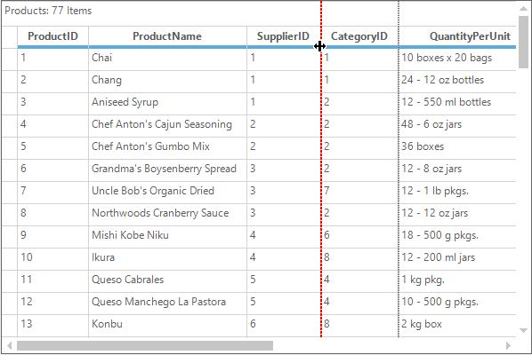

The below screenshot shows the grid displaying the columns after hiding the `CategoryID`,

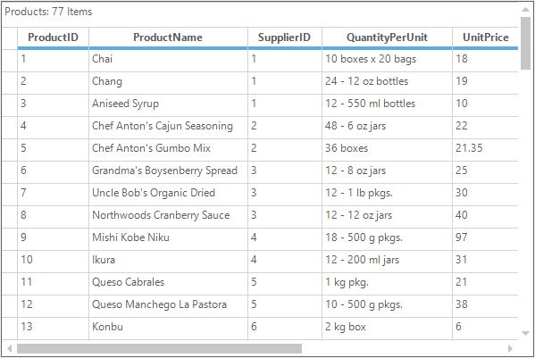

The rows cannot be hidden by resizing to the minimum positions as mentioned in the above procedure. In GridGroupingControl, it will resize all the records of the grid when resizing a single row. If the row is resized to the minimum size (`zero`), it will hide all the records of the grid.  This restriction can be removed by creating a `GridEngineFactory` before the `InitializeComponent` method of the GridGroupingControl.



//To enable resizing of single row in GridGroupingControl
GridEngineFactory.Factory = new Syncfusion.GridHelperClasses.AllowResizingIndividualRows();
InitializeComponent();


'To enable resizing of single row in GridGroupingControl
GridEngineFactory.Factory = New Syncfusion.GridHelperClasses.AllowResizingIndividualRows()
InitializeComponent()


The following screen shot shows the resizing of the row `6` to the minimum size,

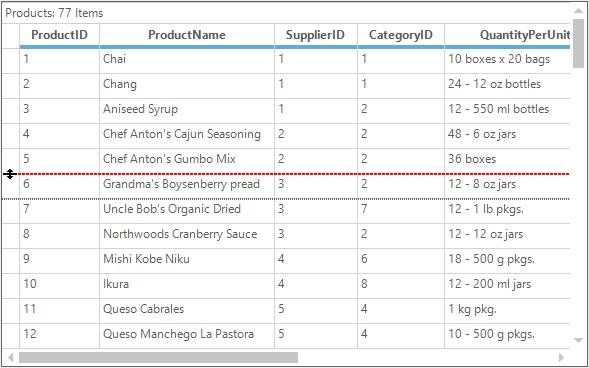

The hidden row by resizing is showing in the following screen shot

## Unhide Columns Using Double Click
The hidden columns by resizing can be unhide by performing the double click between the column headers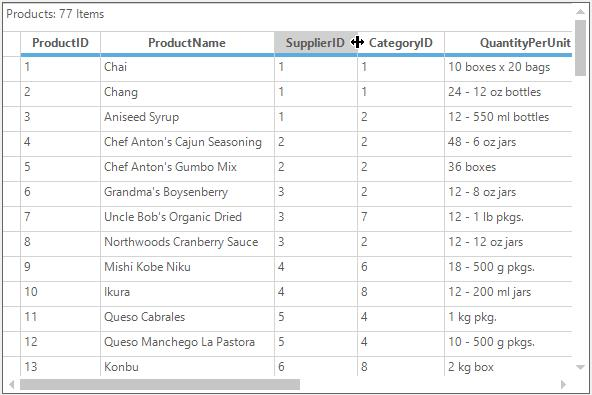

### Prevent Column from Hiding 
The columns can be prevent from hiding on resizing by canceling the [ColsHiding](http://help.syncfusion.com/cr/cref_files/windowsforms/grid/Syncfusion.Grid.Windows~Syncfusion.Windows.Forms.Grid.GridModel~ColsHiding_EV.html) event.



this.gridGroupingControl1.TableModel.ColsHiding += new GridRowColHidingEventHandler(TableModel_ColsHiding);
void TableModel_ColsHiding(object sender, GridRowColHidingEventArgs e)
{
    int colIndex = 3;
    if (e.From <= colIndex && e.To >= colIndex)
    {
        //Restrict the column from hiding. 
        e.Cancel = true;
    }
}


Private Me.gridGroupingControl1.TableModel.ColsHiding += New GridRowColHidingEventHandler(AddressOf TableModel_ColsHiding)
Private Sub TableModel_ColsHiding(ByVal sender As Object, ByVal e As GridRowColHidingEventArgs)
    Dim colIndex As Integer = 3
    If e.From <= colIndex AndAlso e.To >= colIndex Then
        'Restrict the column from hiding. 
        e.Cancel = True
    End If
End Sub



## Adding Column Headers for Child Groups 
By default the grid will not shows the column headers for the child groups. It be displayed for the child groups by setting the `ChildGroupOptions.ShowColumnHeaders` property to `true`.



//Display the column headers for the child groups
this.gridGroupingControl1.ChildGroupOptions.ShowColumnHeaders = true;



'Display the column headers for the child groups
Me.gridGroupingControl1.ChildGroupOptions.ShowColumnHeaders = True



## Frozen Columns
The frozen columns can be added to the GridGroupingControl by using the [FrozenColumn](http://help.syncfusion.com/cr/cref_files/windowsforms/grid/Syncfusion.Grid.Grouping.Windows~Syncfusion.Windows.Forms.Grid.Grouping.GridTableDescriptor~FrozenColumn.html) collection.



//Frozen the column first 3 columns of the grid
this.gridGroupingControl1.TableModel.Cols.FrozenCount = 3;


'Frozen the column first 3 columns of the grid
Me.gridGroupingControl1.TableModel.Cols.FrozenCount = 3



N> The GridGroupingControl does not have the support for the frozen rows option.

## Moving Columns
The columns can be moved from one position to other by using the drag and drop. The column `CategoryID` is moving by using the drag and drop is shown in the following screenshot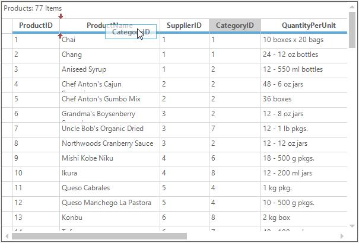

The grid after moving the column is shown below

### Programmatic Moving of Columns
The columns visible order can be programmatically changed by using the [VisibleColumns.Move](http://help.syncfusion.com/cr/cref_files/windowsforms/grid/Syncfusion.Grid.Grouping.Windows~Syncfusion.Windows.Forms.Grid.Grouping.GridVisibleColumnDescriptorCollection~Move.html) method.

The columns before moving the column is shown below
 
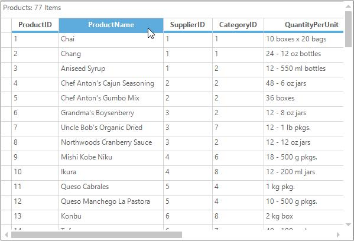

The grid after moving the column

## Unbound Columns
The GridGroupingControl is provide the support for adding the unbound columns which are not bounded to the grid’s data source. This can be achieved by creating the field descriptor and adding to the [UnboundFields](http://help.syncfusion.com/cr/cref_files/windowsforms/grid/Syncfusion.Grid.Grouping.Windows~Syncfusion.Windows.Forms.Grid.Grouping.GridTableDescriptor~UnboundFields.html) collection.



//Adding Unbound field to the GridGroupingControl
this.gridGroupingControl1.TableDescriptor.UnboundFields.Add("UnboundField");


'Adding Unbound field to the GridGroupingControl
Me.gridGroupingControl1.TableDescriptor.UnboundFields.Add("UnboundField")


Since the unbound fields are working independently, it has to be manually populated with the [TableDescriptor.QueryValue](http://help.syncfusion.com/cr/cref_files/windowsforms/grid/Syncfusion.Grid.Grouping.Windows~Syncfusion.Windows.Forms.Grid.Grouping.GridGroupingControl~QueryValue_EV.html) event and store the edited value by using the [TableDescriptor.SaveValue](http://help.syncfusion.com/cr/cref_files/windowsforms/grid/Syncfusion.Grid.Grouping.Windows~Syncfusion.Windows.Forms.Grid.Grouping.GridGroupingControl~SaveValue_EV.html) events.


this.gridGroupingControl1.TableDescriptor.QueryValue += new FieldValueEventHandler(TableDescriptor_QueryValue);
this.gridGroupingControl1.TableDescriptor.SaveValue += new FieldValueEventHandler(TableDescriptor_SaveValue);

//maintain the typed values in unbound column
Hashtable UnboundValues = new Hashtable();

void TableDescriptor_SaveValue(object sender, FieldValueEventArgs e)
{
    if (e.Field.Name == "UnboundField")
    {
        UnboundValues[e.Record.Id] = e.Value;
    }
}

void TableDescriptor_QueryValue(object sender, FieldValueEventArgs e)
{
    if (e.Field.Name == "UnboundField")
    {
        e.Value = UnboundValues[e.Record.Id];
    }
}


AddHandler gridGroupingControl1.TableDescriptor.QueryValue, AddressOf TableDescriptor_QueryValue
AddHandler gridGroupingControl1.TableDescriptor.SaveValue, AddressOf TableDescriptor_SaveValue

'maintain the typed values in unbound column
Private UnboundValues As New Hashtable()

Private Sub TableDescriptor_SaveValue(ByVal sender As Object, ByVal e As FieldValueEventArgs)
    If e.Field.Name = "UnboundField" Then
        UnboundValues(e.Record.Id) = e.Value
    End If
End Sub

Private Sub TableDescriptor_QueryValue(ByVal sender As Object, ByVal e As FieldValueEventArgs)
    If e.Field.Name = "UnboundField" Then
        e.Value = UnboundValues(e.Record.Id)
    End If
End Sub



The unbound field added to the GridGroupingControl is shown in the following screenshot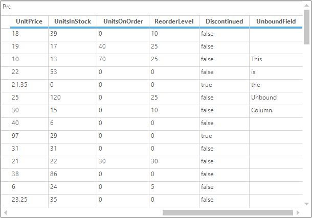

## Setting the Column Widths and Row Heights 
The column width and row height of the GridGroupingControl can be set dynamically by resizing using the mouse controller. 

### Setting Default Row Heights
Default row heights can be set by using the [DefaultRecordRowHeight](http://help.syncfusion.com/cr/cref_files/windowsforms/grid/Syncfusion.Grid.Grouping.Windows~Syncfusion.Windows.Forms.Grid.Grouping.GridTableBase~DefaultRecordRowHeight.html) property


//Setting Default row heights.
this.gridGroupingControl1.Table.DefaultRecordRowHeight = 150;


'Setting default row heights.
Me.gridGroupingControl1.Table.DefaultRecordRowHeight = 150



### Setting Default Header Row Heights
The row heights for the column headers can be changed by using the [DefaultColumnHeaderRowHeight](http://help.syncfusion.com/cr/cref_files/windowsforms/grid/Syncfusion.Grid.Grouping.Windows~Syncfusion.Windows.Forms.Grid.Grouping.GridTable~DefaultColumnHeaderRowHeight.html) property. Refer the below code.


//Setting default header row heights.
this.gridGroupingControl1.Table.DefaultColumnHeaderRowHeight = 50;


'Setting default header row heights.
Me.gridGroupingControl1.Table.DefaultColumnHeaderRowHeight = 50



### Setting Default Caption Row Heights
The row heights for the caption bar can be changed by using the [DefaultCaptionRowHeight](http://help.syncfusion.com/cr/cref_files/windowsforms/grid/Syncfusion.Grid.Grouping.Windows~Syncfusion.Windows.Forms.Grid.Grouping.GridTable~DefaultCaptionRowHeight.html) property. Refer the below code. By default, caption bar will not be visible in grid. To enable the caption bar, make use of the ShowCaption property


// Displaying the Caption bar in Grid
this.gridGroupingControl1.TopLevelGroupOptions.ShowCaption = true; 
//Setting caption row heights.
this.gridGroupingControl1.Table.DefaultCaptionRowHeight = 25;


'Displaying the caption bar in Grid.
Me.gridGroupingControl1.TopLevelGroupOptions.ShowCaption = True
'Setting caption row heights.
Me.gridGroupingControl1.Table.DefaultCaptionRowHeight = 25



### Setting Default FilterBar Row Height
The row height for the filter bar can be changed by using the [DefaultFilterBarRowHeight](http://help.syncfusion.com/cr/cref_files/windowsforms/grid/Syncfusion.Grid.Grouping.Windows~Syncfusion.Windows.Forms.Grid.Grouping.GridTable~DefaultFilterBarRowHeight.html) property. 


//Setting filter bar row heights.
this.gridGroupingControl1.Table.DefaultFilterBarRowHeight = 25;


'Setting filter bar row heights.
Me.gridGroupingControl1.Table.DefaultFilterBarRowHeight = 25



### Setting Default Row Height for Groups
Default row heights for group footer, header and preview sections can be changed by using the [DefaultGroupFooterSectionHeight](http://help.syncfusion.com/cr/cref_files/windowsforms/grid/Syncfusion.Grid.Grouping.Windows~Syncfusion.Windows.Forms.Grid.Grouping.GridTable~DefaultGroupFooterSectionHeight.html), [DefaultGroupHeaderSectionHeight](http://help.syncfusion.com/cr/cref_files/windowsforms/grid/Syncfusion.Grid.Grouping.Windows~Syncfusion.Windows.Forms.Grid.Grouping.GridTable~DefaultGroupHeaderSectionHeight.html) and [DefaultGroupPreviewSectionHeight](http://help.syncfusion.com/cr/cref_files/windowsforms/grid/Syncfusion.Grid.Grouping.Windows~Syncfusion.Windows.Forms.Grid.Grouping.GridTable~DefaultGroupPreviewSectionHeight.html) properties respectively.


//Sets default height for group header sections.
this.gridGroupingControl1.Table.DefaultGroupHeaderSectionHeight = 25;
//Sets default height for group footer sections.
this.gridGroupingControl1.Table.DefaultGroupFooterSectionHeight = 25;
//Sets default height for Group preview rows.
this.gridGroupingControl1.Table.DefaultGroupPreviewSectionHeight = 25; 


'Sets default height for group header sections.
Me.gridGroupingControl1.Table.DefaultGroupHeaderSectionHeight = 25
'Sets default height for group footer sections.
Me.gridGroupingControl1.Table.DefaultGroupFooterSectionHeight = 25
'Sets default height for Group preview rows.
Me.gridGroupingControl1.Table.DefaultGroupPreviewSectionHeight = 25



### Setting Width for a particular Column
To set the default width for the particular column, use the following code snippet,



//Setting the column width for the given column index
this.gridGroupingControl1.TableDescriptor.Columns[1].Width = 150;


'Setting the column width for the given column index
Me.gridGroupingControl1.TableDescriptor.Columns(1).Width = 150



### Setting Default Column Width for columns
The default column width can be assigned for GridGroupingControl columns by setting the [DefaultColumnWidth](https://help.syncfusion.com/cr/cref_files/windowsforms/grid/Syncfusion.Grid.Grouping.Windows~Syncfusion.Windows.Forms.Grid.Grouping.GridTableOptionsStyleInfo~DefaultColumnWidth.html) property. Please refer the below code,


this.gridGroupingControl1.TableDescriptor.AllowCalculateMaxColumnWidth = false;
this.gridGroupingControl1.TableOptions.DefaultColumnWidth = 100;


Me.gridGroupingControl1.TableDescriptor.AllowCalculateMaxColumnWidth = False
Me.gridGroupingControl1.TableOptions.DefaultColumnWidth = 100


N> The `DefaultColumnWidth` can be affected to columns only when set the [AllowCalculateMaxColumnWidth](https://help.syncfusion.com/cr/cref_files/windowsforms/grid/Syncfusion.Grid.Grouping.Windows~Syncfusion.Windows.Forms.Grid.Grouping.GridTableDescriptor~AllowCalculateMaxColumnWidth.html) property to false.

The column width can be calculated based on [ColumnsMaxLengthStragegy](https://help.syncfusion.com/cr/cref_files/windowsforms/grid/Syncfusion.Grid.Grouping.Windows~Syncfusion.Windows.Forms.Grid.Grouping.GridTableOptionsStyleInfo~ColumnsMaxLengthStrategy.html) property. Below is the list of predefined column sizing options available in[GridColumnMaxLengthStrategy](https://help.syncfusion.com/cr/cref_files/windowsforms/grid/Syncfusion.Grid.Grouping.Windows~Syncfusion.Windows.Forms.Grid.Grouping.GridColumnsMaxLengthStrategy.html) enumeration.
`GridColumnsMaxLengthStrategy.None`:The Default column width or defined width set to column. 
`GridColumnsMaxLengthStrategy.MaxLengthSummary`:Calculates the width of column based on header and cell contents. So that header and cell contents are not truncated.
`GridColumnsMaxLengthStrategy. FirstNRecords`:Calculates the width of the column based on the number of rows is defined by [ColumnsMaxLengthFirstNRecords](https://help.syncfusion.com/cr/cref_files/windowsforms/grid/Syncfusion.Grid.Grouping.Windows~Syncfusion.Windows.Forms.Grid.Grouping.GridTableOptionsStyleInfo~ColumnsMaxLengthFirstNRecords.html) property. Please refer the below code,


this.gridGroupingControl1.TableOptions.ColumnsMaxLengthFirstNRecords = 10;
this.gridGroupingControl1.TableOptions.ColumnsMaxLengthStrategy = Syncfusion.Windows.Forms.Grid.Grouping.GridColumnsMaxLengthStrategy.FirstNRecords;


Me.gridGroupingControl1.TableOptions.ColumnsMaxLengthFirstNRecords = 10
Me.gridGroupingControl1.TableOptions.ColumnsMaxLengthStrategy = Syncfusion.Windows.Forms.Grid.Grouping.GridColumnsMaxLengthStrategy.FirstNRecords



### Setting Column Styles 
The styles can be applied for the particular column by using the [Appearance](http://help.syncfusion.com/cr/cref_files/windowsforms/grid/Syncfusion.Grid.Grouping.Windows~Syncfusion.Windows.Forms.Grid.Grouping.GridTableDescriptor~Appearance.html) properties of the [TableDescriptor](http://help.syncfusion.com/cr/cref_files/windowsforms/grid/Syncfusion.Grid.Grouping.Windows~Syncfusion.Windows.Forms.Grid.Grouping.GridTableDescriptor_members.html).



this.gridGroupingControl1.TableDescriptor.Columns[1].Appearance.AnyRecordFieldCell.BackColor = Color.Orange;
this.gridGroupingControl1.TableDescriptor.Columns[1].Appearance.AnyRecordFieldCell.TextColor = Color.White;
this.gridGroupingControl1.TableDescriptor.Columns[1].Appearance.AnyRecordFieldCell.Font.Bold = true;


Me.gridGroupingControl1.TableDescriptor.Columns(1).Appearance.AnyRecordFieldCell.BackColor = Color.Orange
Me.gridGroupingControl1.TableDescriptor.Columns(1).Appearance.AnyRecordFieldCell.TextColor = Color.White
Me.gridGroupingControl1.TableDescriptor.Columns(1).Appearance.AnyRecordFieldCell.Font.Bold = True


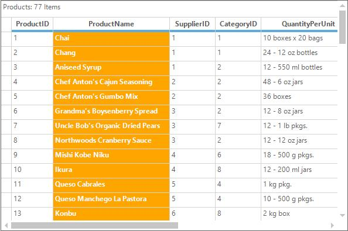

## Proportional Column Sizing 
All the columns of the grid can be have the same width that of the equal partition of the total width by setting the [AllowProportionalColumnSizing](http://help.syncfusion.com/cr/cref_files/windowsforms/grid/Syncfusion.Grid.Grouping.Windows~Syncfusion.Windows.Forms.Grid.Grouping.GridGroupingControl~AllowProportionalColumnSizing.html) to `true`.



//Enable proportional column sizing
this.gridGroupingControl1.AllowProportionalColumnSizing = true;


'Enable proportional column sizing
Me.gridGroupingControl1.AllowProportionalColumnSizing = True


## Getting the Record ID of the Current Record
The record id of the current record can be get by using the [Table.CurrentRecord.Id](http://help.syncfusion.com/cr/cref_files/windowsforms/grid/Syncfusion.Grid.Grouping.Windows~Syncfusion.Windows.Forms.Grid.Grouping.GridTable~CurrentRecord.html) property.



//Get the current record of the grid
Record record = this.gridGroupingControl1.Table.CurrentRecord;
//Display the record id of the current record
MessageBox.Show("The Current Record ID is :" + record.Id.ToString());


'Get the current record of the grid
Dim record As Record = Me.gridGroupingControl1.Table.CurrentRecord
'Display the record id of the current record
MessageBox.Show("The Current Record ID is :" & record.Id.ToString())



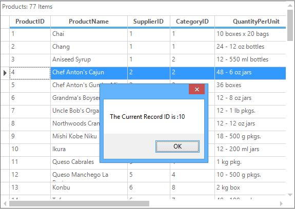

## Getting the Value of the Particular Field from the Record
To get the value of the particular field from the record, use the [Record.GetValue](http://help.syncfusion.com/cr/cref_files/windowsforms/grid/Syncfusion.Grid.Grouping.Windows~Syncfusion.Windows.Forms.Grid.Grouping.GridRecord~GetValue.html) method. It will return the value of the given filed.



int index = 5;
string data = this.gridGroupingControl1.Table.Records[index].GetValue("ProductName").ToString();
MessageBox.Show("Product Name is :" + data);


Dim index As Integer = 5
Dim data As String = Me.gridGroupingControl1.Table.Records(index).GetValue("ProductName").ToString()
MessageBox.Show("Product Name is :" & data)



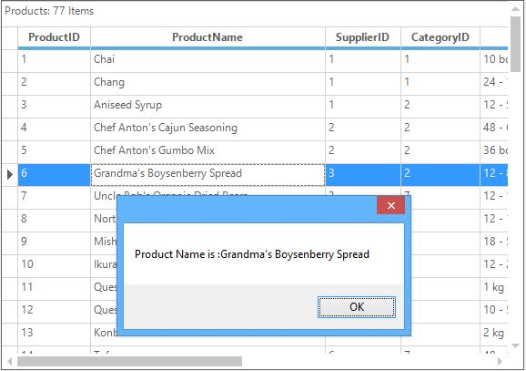

## Set the value for the particular Field 
The value for the particular field can be set by using the [SetValue](http://help.syncfusion.com/cr/cref_files/windowsforms/grid/Syncfusion.Grid.Grouping.Windows~Syncfusion.Windows.Forms.Grid.Grouping.GridRecord~SetValue.html) method.



//Set the value for the particular record
this.gridGroupingControl1.Table.Records[5].SetValue("ProductName", "Hello");


'Set the value for the particular record
Me.gridGroupingControl1.Table.Records(5).SetValue("ProductName", "Hello")



## Setting the Current Cell Activation Behavior 
The activation behavior of the current cell can be set by using the [ActivateCurrentCellBehavior](http://help.syncfusion.com/cr/cref_files/windowsforms/grid/Syncfusion.Grid.Grouping.Windows~Syncfusion.Windows.Forms.Grid.Grouping.GridGroupingControl~ActivateCurrentCellBehavior.html) property.



//Activate the current cell on double click 
this.gridGroupingControl1.ActivateCurrentCellBehavior = GridCellActivateAction.DblClickOnCell


'Activate the current cell on double click 
Me.gridGroupingControl1.ActivateCurrentCellBehavior = GridCellActivateAction.DblClickOnCell



## Getting the Row Index from a Record
The row index of the record can be get by using the [GetRowIndex](http://help.syncfusion.com/cr/cref_files/windowsforms/grid/Syncfusion.Grid.Grouping.Windows~Syncfusion.Windows.Forms.Grid.Grouping.GridRecord~GetRowIndex.html) method.



//Get the current record of the grid
int index = this.gridGroupingControl1.Table.CurrentRecord.GetRowIndex();
//Display the row index of the current record
MessageBox.Show("The Current Record row index is :" + index.ToString());


'Get the current record of the grid
Dim index As Integer = Me.gridGroupingControl1.Table.CurrentRecord.GetRowIndex()
'Display the row index of the current record
MessageBox.Show("The Current Record row index is :" & index.ToString())



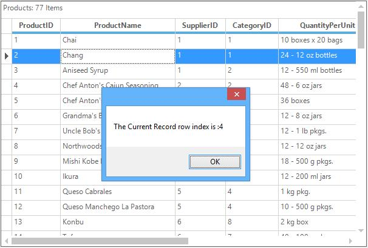

