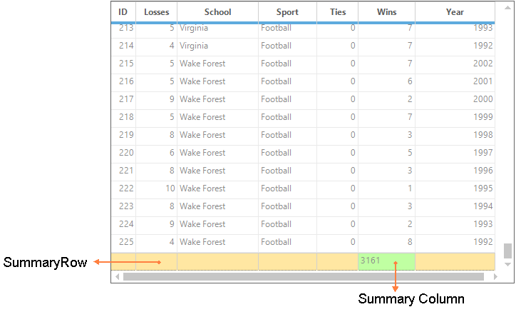
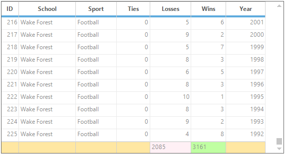
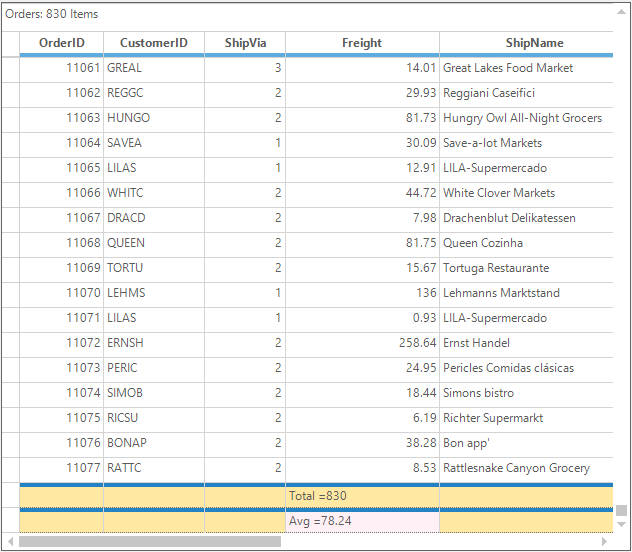
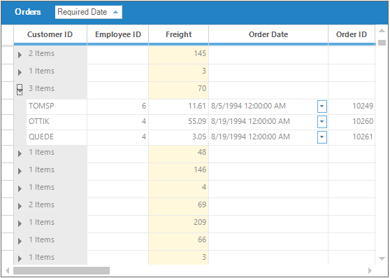
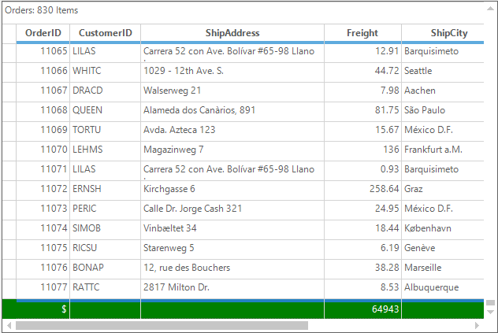
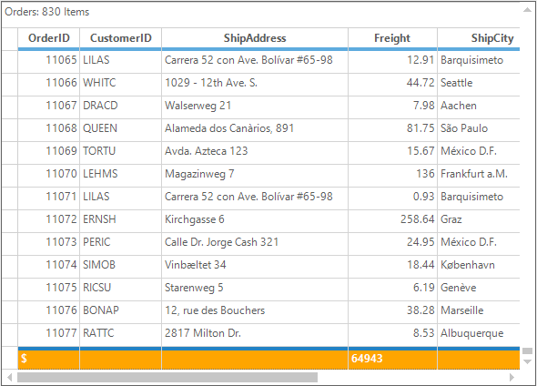
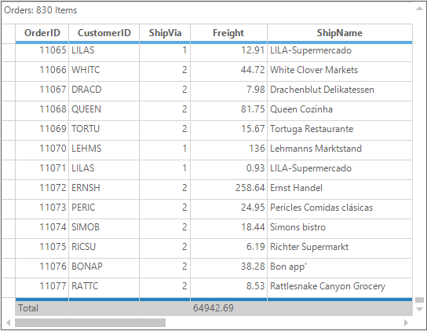

# Summaries 
Summaries are used to derive additional information from the data like average, maximums, summations, count, and so on. The GridGroupingControl provides default support for adding the summaries. It has the built-in support for following summary types,

* Int32Aggregate, DoubleAggregate (Count, Min, Max, Sum)
* StringAggregate (MaxLength, Count)
* Count
* DistinctCount (Count, Values array)
* Vector (Values)
* DoubleVector (statistical methods: Median, Min, Max, 25% Quartile, 75% Quartile)
* Custom (Custom Summaries)

Summaries can be set at design time itself through the property window of the GridGroupingControl. In the property window, access the [SummaryRows](https://help.syncfusion.com/cr/windowsforms/Syncfusion.Windows.Forms.Grid.Grouping.GridTableDescriptor.html#Syncfusion_Windows_Forms_Grid_Grouping_GridTableDescriptor_SummaryRows) property under [TableDescriptor](http://help.syncfusion.com/cr/windowsforms/Syncfusion.Grouping.TableDescriptor.html) node. It will open the[GridSummaryRowDescriptor](http://help.syncfusion.com/cr/windowsforms/Syncfusion.Windows.Forms.Grid.Grouping.GridSummaryRowDescriptorCollection.html) collection editor. This editor contains a list of properties such as Title, SummaryColumn, Appearance, etc. which are used to define summaries for the desired columns and to control the appearance of these summaries.

## Adding Summaries Programmatically 
The summaries can be added to the GridGroupingControl by defining the [GridSummaryColumnDescriptor](http://help.syncfusion.com/cr/windowsforms/Syncfusion.Windows.Forms.Grid.Grouping.GridSummaryColumnDescriptor.html) and [GridSummaryRowsDescriptor](http://help.syncfusion.com/cr/windowsforms/Syncfusion.Windows.Forms.Grid.Grouping.GridSummaryRowDescriptor.html). In the `GridSummaryColumnDescriptor`, set the summary type, format and appearance of the summaries for the particular field and add it to the `GridSummaryRowDescriptor`. This descriptor is need to be added to the `TableDescriptor.SummaryRows` collection. It will create the summary row at the bottom of the GridGroupingControl to display the summary value.

The summary can be added to a particular column using the steps given below,

1.Setup a summary column by instantiating `GridSummaryColumnDescriptor` and specify the [SummaryType](https://help.syncfusion.com/cr/windowsforms/Syncfusion.Windows.Forms.Grid.Grouping.GridSummaryColumnDescriptor.html#Syncfusion_Windows_Forms_Grid_Grouping_GridSummaryColumnDescriptor__ctor_System_String_Syncfusion_Grouping_SummaryType_System_String_System_String_) and format.



GridSummaryColumnDescriptor summaryColumnDescriptor = new GridSummaryColumnDescriptor(); 
summaryColumnDescriptor.Appearance.AnySummaryCell.Interior = new BrushInfo(Color.FromArgb(192, 255, 162)); 
summaryColumnDescriptor.DataMember = "wins"; 
summaryColumnDescriptor.Format = "{Sum}"; 
summaryColumnDescriptor.Name = "TotalWins"; 
summaryColumnDescriptor.SummaryType = SummaryType.Int32Aggregate;


Dim summaryColumnDescriptor As New GridSummaryColumnDescriptor()
summaryColumnDescriptor.Appearance.AnySummaryCell.Interior = New BrushInfo(Color.FromArgb(192, 255, 162))
summaryColumnDescriptor.DataMember = "wins"
summaryColumnDescriptor.Format = "{Sum}"
summaryColumnDescriptor.Name = "TotalWins"
summaryColumnDescriptor.SummaryType = SummaryType.Int32Aggregate



2.Define a summary row and add the summary column into it.


GridSummaryRowDescriptor summaryRowDescriptor = new GridSummaryRowDescriptor(); 
summaryRowDescriptor.SummaryColumns.Add(summaryColumnDescriptor); 
summaryRowDescriptor.Appearance.AnySummaryCell.Interior = new BrushInfo(Color.FromArgb(255, 231, 162));


Dim summaryRowDescriptor As New GridSummaryRowDescriptor()
summaryRowDescriptor.SummaryColumns.Add(summaryColumnDescriptor)
summaryRowDescriptor.Appearance.AnySummaryCell.Interior = New BrushInfo(Color.FromArgb(255, 231, 162))



3.Finally add summary row to the grid.


this.gridGroupingControl1.TableDescriptor.SummaryRows.Add(summaryRowDescriptor);


Me.gridGroupingControl1.TableDescriptor.SummaryRows.Add(summaryRowDescriptor)



4.Run the sample. The grid will shows the summaries at the end of the records as follows,

## Multicolumn Summaries
A summary row can have any number of summary columns. To display summaries for more than one field, first create summary columns for the desired fields. Then add those summary columns into a summary row. 



//Create summary column descriptor 1
GridSummaryColumnDescriptor scd1 = new GridSummaryColumnDescriptor("Wins", SummaryType.Int32Aggregate, "wins", "{Sum}");
scd1.Appearance.AnySummaryCell.Interior = new BrushInfo(Color.FromArgb(192, 255, 162));

//Create summary column descriptor 2
GridSummaryColumnDescriptor scd2 = new GridSummaryColumnDescriptor("Losses", SummaryType.Int32Aggregate, "losses", "{Sum}");
scd2.Appearance.AnySummaryCell.Interior = new BrushInfo(Color.LavenderBlush);

GridSummaryRowDescriptor summaryRowDescriptor = new GridSummaryRowDescriptor();
//Adding the summary columns into the summary row descriptor
summaryRowDescriptor.SummaryColumns.AddRange(new GridSummaryColumnDescriptor[] { scd1, scd2 });
summaryRowDescriptor.Appearance.AnySummaryCell.Interior = new BrushInfo(Color.FromArgb(255, 231, 162));
this.gridGroupingControl1.TableDescriptor.SummaryRows.Add(summaryRowDescriptor);


'Create summary column descriptor 1
Dim scd1 As New GridSummaryColumnDescriptor("Wins", SummaryType.Int32Aggregate, "wins", "{Sum}")
scd1.Appearance.AnySummaryCell.Interior = New BrushInfo(Color.FromArgb(192, 255, 162))

'Create summary column descriptor 2
Dim scd2 As New GridSummaryColumnDescriptor("Losses", SummaryType.Int32Aggregate, "losses", "{Sum}")
scd2.Appearance.AnySummaryCell.Interior = New BrushInfo(Color.LavenderBlush)

Dim summaryRowDescriptor As New GridSummaryRowDescriptor()
'Adding the summary columns into the summary row descriptor
summaryRowDescriptor.SummaryColumns.AddRange(New GridSummaryColumnDescriptor() { scd1, scd2 })
summaryRowDescriptor.Appearance.AnySummaryCell.Interior = New BrushInfo(Color.FromArgb(255, 231, 162))
Me.gridGroupingControl1.TableDescriptor.SummaryRows.Add(summaryRowDescriptor)



## Multi-Row Summaries
GridGroupingControl can have more than one summary row. It can be achieved by defining the required number of `GridSummaryRowDescriptors` and add it to the grid. Each of the summary rows can have its own format for calculating summaries. Here is an example that shows how to add two different summary rows for a grid table.



//Create summary column descriptor 1
GridSummaryColumnDescriptor scd1 = new GridSummaryColumnDescriptor("Freight", SummaryType.Int32Aggregate, "Freight", "Total ={Count}");

//Create summary column descriptor 2
GridSummaryColumnDescriptor scd2 = new GridSummaryColumnDescriptor("Freight", SummaryType.Int32Aggregate, "Freight", "Avg ={Average:#.00}");

GridSummaryRowDescriptor srd1 = new GridSummaryRowDescriptor();
//Adding the summary columns into the summary row descriptor
srd1.SummaryColumns.Add(scd1);

GridSummaryRowDescriptor srd2 = new GridSummaryRowDescriptor();
//Adding the summary columns into the summary row descriptor
srd2.SummaryColumns.Add(scd2);
srd1.Appearance.AnySummaryCell.Interior = new BrushInfo(Color.FromArgb(255, 232, 162));
srd2.Appearance.AnySummaryCell.Interior = new BrushInfo(Color.FromArgb(255, 232, 162));

this.gridGroupingControl1.TableDescriptor.SummaryRows.Add(srd1);
this.gridGroupingControl1.TableDescriptor.SummaryRows.Add(srd2);


'Create summary column descriptor 1
Dim scd1 As New GridSummaryColumnDescriptor("Freight", SummaryType.Int32Aggregate, "Freight", "Total ={Count}")

'Create summary column descriptor 2
Dim scd2 As New GridSummaryColumnDescriptor("Freight", SummaryType.Int32Aggregate, "Freight", "Avg ={Average:#.00}")
scd2.Appearance.AnySummaryCell.Interior = New BrushInfo(Color.LavenderBlush)

Dim srd1 As New GridSummaryRowDescriptor()
'Adding the summary columns into the summary row descriptor
srd1.SummaryColumns.Add(scd1)

Dim srd2 As New GridSummaryRowDescriptor()
'Adding the summary columns into the summary row descriptor
srd2.SummaryColumns.Add(scd2)
srd1.Appearance.AnySummaryCell.Interior = New BrushInfo(Color.FromArgb(255, 232, 162))
srd2.Appearance.AnySummaryCell.Interior = New BrushInfo(Color.FromArgb(255, 232, 162))
Me.gridGroupingControl1.TableDescriptor.SummaryRows.Add(srd1)
Me.gridGroupingControl1.TableDescriptor.SummaryRows.Add(srd2)



## Nested Tables and Group Summaries 
The GridGroupingControl allows to display the summaries for the child groups of the nested tables. It can be achieved by creating summaries through [ChildTableDescriptor](https://help.syncfusion.com/cr/windowsforms/Syncfusion.Windows.Forms.Grid.Grouping.GridRelationDescriptor.html#Syncfusion_Windows_Forms_Grid_Grouping_GridRelationDescriptor_ChildTableDescriptor). 



//Adds Summaries for the Parent Table(Orders).
GridSummaryColumnDescriptor summaryColumnDescriptor = new GridSummaryColumnDescriptor("Sum", SummaryType.DoubleAggregate, "Freight", "{Sum:#}");
GridSummaryRowDescriptor summaryRowDescriptor = new GridSummaryRowDescriptor("Sum", "$", summaryColumnDescriptor);
summaryRowDescriptor.Appearance.AnyCell.HorizontalAlignment = GridHorizontalAlignment.Right;
summaryRowDescriptor.Appearance.AnyCell.BackColor = Color.FromArgb(255, 231, 162);
this.gridGroupingControl1.TableDescriptor.SummaryRows.Add(summaryRowDescriptor);


'Adds Summaries for the Parent Table(Orders).
Dim summaryColumnDescriptor As New GridSummaryColumnDescriptor("Sum", SummaryType.DoubleAggregate, "Freight", "{Sum:#}")
Dim summaryRowDescriptor As New GridSummaryRowDescriptor("Sum", "$", summaryColumnDescriptor)
summaryRowDescriptor.Appearance.AnyCell.HorizontalAlignment = GridHorizontalAlignment.Right
summaryRowDescriptor.Appearance.AnyCell.BackColor = Color.FromArgb(255, 231, 162)
Me.gridGroupingControl1.TableDescriptor.SummaryRows.Add(summaryRowDescriptor)



**Sample Location:**
&lt;Installed_Location&gt;\Syncfusion\EssentialStudio[Version_Number]\Windows\Grid.Grouping.Windows\Samples\Summaries\ Nested Table and Group SummaryDemo

## Summary in Caption
GridGroupingControl provides built-in options to display group summaries for the columns in group captions instead of creating distinct rows for summaries. The following steps are used to create summaries in group caption,

1.First, define a summary for the grid table. Then group the table against a data column.



//Adds Summaries.
GridSummaryColumnDescriptor summaryColumnDescriptor = new GridSummaryColumnDescriptor("Sum", SummaryType.DoubleAggregate, "wins", "{Sum:#}");
GridSummaryRowDescriptor summaryRowDescriptor = new GridSummaryRowDescriptor("Sum", "$", summaryColumnDescriptor);
summaryRowDescriptor.Appearance.AnyCell.HorizontalAlignment = GridHorizontalAlignment.Right;
summaryRowDescriptor.Appearance.AnyCell.BackColor = Color.Cornsilk;
this.gridGroupingControl1.TableDescriptor.SummaryRows.Add(summaryRowDescriptor);
this.gridGroupingControl1.ShowGroupDropArea = true;
this.gridGroupingControl1.TableDescriptor.GroupedColumns.Add("Sport");


'Adds Summaries.
Dim summaryColumnDescriptor As New GridSummaryColumnDescriptor("Sum", SummaryType.DoubleAggregate, "wins", "{Sum:#}")
Dim summaryRowDescriptor As New GridSummaryRowDescriptor("Sum", "$", summaryColumnDescriptor)
summaryRowDescriptor.Appearance.AnyCell.HorizontalAlignment = GridHorizontalAlignment.Right
summaryRowDescriptor.Appearance.AnyCell.BackColor = Color.Cornsilk
Me.gridGroupingControl1.TableDescriptor.SummaryRows.Add(summaryRowDescriptor)
Me.gridGroupingControl1.ShowGroupDropArea = True
Me.gridGroupingControl1.TableDescriptor.GroupedColumns.Add("Sport")



2.Enable Caption Summaries by setting[ShowCaptionSummaryCells](https://help.syncfusion.com/cr/windowsforms/Syncfusion.Windows.Forms.Grid.Grouping.GridGroupOptionsStyleInfo.html#Syncfusion_Windows_Forms_Grid_Grouping_GridGroupOptionsStyleInfo_ShowCaptionSummaryCells) to true and by turning off [ShowSummaries](https://help.syncfusion.com/cr/windowsforms/Syncfusion.Windows.Forms.Grid.Grouping.GridGroupOptionsStyleInfo.html#Syncfusion_Windows_Forms_Grid_Grouping_GridGroupOptionsStyleInfo_ShowSummaries) property that will disable creation of additional summary rows.


//Creates summaries in caption.
this.gridGroupingControl1.ChildGroupOptions.ShowCaptionSummaryCells = true;
this.gridGroupingControl1.ChildGroupOptions.ShowSummaries = false;


'Creates summaries in caption.
Me.gridGroupingControl1.ChildGroupOptions.ShowCaptionSummaryCells = True
Me.gridGroupingControl1.ChildGroupOptions.ShowSummaries = False



3.Once caption summaries are enabled, the next step is to specify a summary to be displayed in the Caption Rows. This is done by assigning summary name to[CaptionSummaryRow](https://help.syncfusion.com/cr/windowsforms/Syncfusion.Windows.Forms.Grid.Grouping.GridGroupOptionsStyleInfo.html#Syncfusion_Windows_Forms_Grid_Grouping_GridGroupOptionsStyleInfo_CaptionSummaryRow) property. Optionally the caption text can customized as per need.


this.gridGroupingControl1.ChildGroupOptions.CaptionSummaryRow = "Sum";
this.gridGroupingControl1.ChildGroupOptions.CaptionText = "{RecordCount} Items";


Me.gridGroupingControl1.ChildGroupOptions.CaptionSummaryRow = "Sum"
Me.gridGroupingControl1.ChildGroupOptions.CaptionText = "{RecordCount} Items"



4.Finally, format the caption rows to improve the look and feel.


//Provides a good look and enables Caption Summary Cells as Record Field Cells.
this.gridGroupingControl1.Appearance.GroupCaptionCell.BackColor = this.gridGroupingControl1.Appearance.RecordFieldCell.BackColor;
this.gridGroupingControl1.Appearance.GroupCaptionCell.Borders.Top = new GridBorder(GridBorderStyle.Standard);
this.gridGroupingControl1.Appearance.GroupCaptionCell.CellType = "Static";


'Provides a good look and enables Caption Summary Cells as Record Field Cells.
Me.gridGroupingControl1.Appearance.GroupCaptionCell.BackColor = Me.gridGroupingControl1.Appearance.RecordFieldCell.BackColor
Me.gridGroupingControl1.Appearance.GroupCaptionCell.Borders.Top = New GridBorder(GridBorderStyle.Standard)
Me.gridGroupingControl1.Appearance.GroupCaptionCell.CellType = "Static"



The following screenshot shows the grid with caption summaries,

**Sample Location:**
&lt;Install_Location&gt;\Syncfusion\EssentialStudio[Version_Number]\Windows\Grid.Grouping.Windows\Samples\Summaries\ Caption Summary Demo

## Sort by Summary in Caption
By default, when grouping is applied, the grid will sorts the records based on the values of grouped column. This can be changed to sort the records based on the values of the group summaries by creating the own custom comparer to define the sort order or to make use of built-in method that is specially designed to use in this scenario, named [SetGroupSummaryOrder](https://help.syncfusion.com/cr/windowsforms/Syncfusion.Grouping.SortColumnDescriptor.html#Syncfusion_Grouping_SortColumnDescriptor_SetGroupSummarySortOrder_System_String_System_String_). This method will set up a custom comparer for sorting groups to enable groups to be sorted in a different order. The following steps are used to sort groups by summary values,

1.Define `GridSummaryColumnDescriptor` for column Freight and add it to `SummaryRow` of Orders table.



GridSummaryColumnDescriptor summaryColumn1 = new GridSummaryColumnDescriptor("FreightAverage", SummaryType.DoubleAggregate, "Freight", "{Average:###.00}");
GridSummaryRowDescriptor summaryRow1 = new GridSummaryRowDescriptor();
summaryRow1.Name = "Caption";
summaryRow1.SummaryColumns.Add(summaryColumn1);
this.gridGroupingControl1.TableDescriptor.SummaryRows.Add(summaryRow1);


Dim summaryColumn1 As New GridSummaryColumnDescriptor("FreightAverage", SummaryType.DoubleAggregate, "Freight", "{Average:###.00}")
Dim summaryRow1 As New GridSummaryRowDescriptor()
summaryRow1.Name = "Caption"
summaryRow1.SummaryColumns.Add(summaryColumn1)
Me.gridGroupingControl1.TableDescriptor.SummaryRows.Add(summaryRow1)



2.Trigger caption summaries by setting appropriate properties.



this.gridGroupingControl1.TableDescriptor.ChildGroupOptions.ShowCaptionSummaryCells = true;
this.gridGroupingControl1.TableDescriptor.ChildGroupOptions.CaptionSummaryRow = "Caption";
this.gridGroupingControl1.TableDescriptor.ChildGroupOptions.ShowSummaries = false;


Me.gridGroupingControl1.TableDescriptor.ChildGroupOptions.ShowCaptionSummaryCells = True
Me.gridGroupingControl1.TableDescriptor.ChildGroupOptions.CaptionSummaryRow = "Caption"
Me.gridGroupingControl1.TableDescriptor.ChildGroupOptions.ShowSummaries = False




3.Create[SortColumnDescriptor](http://help.syncfusion.com/cr/windowsforms/Syncfusion.Grouping.SortColumnDescriptor.html) for the field `ShipCountry`. Change default group order by using [SetGroupSummarySortOrder](https://help.syncfusion.com/cr/windowsforms/Syncfusion.Grouping.SortColumnDescriptor.html#Syncfusion_Grouping_SortColumnDescriptor_SetGroupSummarySortOrder_System_String_System_String_) method with its parameters conveying summary name and property in the summary. Then group the grid against this column.



//Specifies group sort order behavior when adding SortColumnDescriptor to GroupedColumns.
this.gridGroupingControl1.TableDescriptor.GroupedColumns.Clear();
SortColumnDescriptor sortColumnDescriptor = new SortColumnDescriptor("ShipCountry");

//Specifies a summary name and the property (values will be determined using reflection).
sortColumnDescriptor.SetGroupSummarySortOrder(summaryColumn1.GetSummaryDescriptorName(), "Average");
this.gridGroupingControl1.TableDescriptor.GroupedColumns.Add(sortColumnDescriptor);


'Specifies group sort order behavior when adding SortColumnDescriptor to GroupedColumns.
Me.gridGroupingControl1.TableDescriptor.GroupedColumns.Clear()
Dim sortColumnDescriptor As New SortColumnDescriptor("ShipCountry")

'Specifies a summary name and the property (values will be determined using reflection).
sortColumnDescriptor.SetGroupSummarySortOrder(summaryColumn1.GetSummaryDescriptorName(), "Average")
Me.gridGroupingControl1.TableDescriptor.GroupedColumns.Add(sortColumnDescriptor)



4.While running the sample, the groups are sorted against summary values of Freight. Here is a sample screen shot.

### Update Summaries Immediately on Changing the Field
The summary values will be refreshed only on leaving the record. Therefore the summary values will not update, once edited the value of the summary column and navigate the current cell with in the same record. This behavior can be changed to update the summaries on leaving cell by using the [ForceImmediateSaveValue](https://help.syncfusion.com/cr/windowsforms/Syncfusion.Grouping.FieldDescriptor.html#Syncfusion_Grouping_FieldDescriptor_ForceImmediateSaveValue) property.



//Update the Summary value on leaving the summary column
this.gridGroupingControl1.TableDescriptor.Fields["ColName"].ForceImmediateSaveValue = true;


'Update the Summary value on leaving the summary column
Me.gridGroupingControl1.TableDescriptor.Fields("ColName").ForceImmediateSaveValue = True


The same can also be achieved by handling the [CurrentRecordContextChange](https://help.syncfusion.com/cr/windowsforms/Syncfusion.Windows.Forms.Grid.Grouping.GridGroupingControl.html) event and invalidate the summaries. 


this.gridGroupingControl1.CurrentRecordContextChange += new CurrentRecordContextChangeEventHandler(gridGroupingControl1_CurrentRecordContextChange);

void gridGroupingControl1_CurrentRecordContextChange(object sender, CurrentRecordContextChangeEventArgs e)
{

    if (e.Action == CurrentRecordAction.CurrentFieldChanged)
    {

        //End the editing of the current cell and invalidate the summary
        this.gridGroupingControl1.CurrencyManager.EndCurrentEdit();
        this.gridGroupingControl1.Table.InvalidateSummary();
    }
}


AddHandler gridGroupingControl1.CurrentRecordContextChange, AddressOf gridGroupingControl1_CurrentRecordContextChange

Private Sub gridGroupingControl1_CurrentRecordContextChange(ByVal sender As Object, ByVal e As CurrentRecordContextChangeEventArgs)

    If e.Action = CurrentRecordAction.CurrentFieldChanged Then

        'End the editing of the current cell and invalidate the summary
        Me.gridGroupingControl1.CurrencyManager.EndCurrentEdit()
        Me.gridGroupingControl1.Table.InvalidateSummary()
    End If
End Sub



## Aligning Summary Cells
The alignment of the summary value can be changed by using the alignment property of the `GridSummaryColumn` descriptor.



//Create summary column descriptor 
GridSummaryColumnDescriptor summaryColumnDescriptor = new GridSummaryColumnDescriptor("Freight", SummaryType.Int32Aggregate, "Freight", "Total ={Count}");

//Set the alignment for the summary column descriptor cell.
summaryColumnDescriptor.Appearance.AnySummaryCell.HorizontalAlignment = GridHorizontalAlignment.Right;


'Create summary column descriptor 
Dim summaryColumnDescriptor As New GridSummaryColumnDescriptor("Freight", SummaryType.Int32Aggregate, "Freight", "Total ={Count}")

'Set the alignment for the summary column descriptor cell.
summaryColumnDescriptor.Appearance.AnySummaryCell.HorizontalAlignment = GridHorizontalAlignment.Right


The alignment of the summary cells can also be changed by using the [Appearance](https://help.syncfusion.com/cr/windowsforms/Syncfusion.Windows.Forms.Grid.Grouping.GridGroupingControl.html#Syncfusion_Windows_Forms_Grid_Grouping_GridGroupingControl_Appearance) property of the GridGroupingControl.


//Setting the alignment for the summary cells
this.gridGroupingControl1.Appearance.AnySummaryCell.HorizontalAlignment = GridHorizontalAlignment.Right;


'Setting the alignment for the summary cells
Me.gridGroupingControl1.Appearance.AnySummaryCell.HorizontalAlignment = GridHorizontalAlignment.Right



## Summary Appearance
The summary cells can be customized by using the Appearance properties of the `SummaryRowDescriptor` as well as the `TableDescriptor`.



//Changing the Appearance of the Summary Cells through the TableDescriptor
this.gridGroupingControl1.TableDescriptor.Appearance.AnySummaryCell.BackColor = Color.Green;
this.gridGroupingControl1.TableDescriptor.Appearance.AnySummaryCell.TextColor = Color.White;
this.gridGroupingControl1.TableDescriptor.Appearance.AnySummaryCell.Font.Bold = true;

//Setting the Appearance of the Summary Cells through the SummaryRowDescriptor

//Adds Summaries for the Parent Table(Orders).
GridSummaryColumnDescriptor summaryColumnDescriptor = new GridSummaryColumnDescriptor("Sum", SummaryType.DoubleAggregate, "Freight", "{Sum:#}");
GridSummaryRowDescriptor summaryRowDescriptor = new GridSummaryRowDescriptor("Sum", "$", summaryColumnDescriptor);

//Setting the appearance for the summary cells
summaryRowDescriptor.Appearance.AnyCell.BackColor = Color.Green;
summaryRowDescriptor.Appearance.AnyCell.TextColor = Color.White;
summaryRowDescriptor.Appearance.AnyCell.CellType = GridCellTypeName.Static;
this.gridGroupingControl1.TableDescriptor.SummaryRows.Add(summaryRowDescriptor);


'Changing the Appearance of the Summary Cells through the TableDescriptor
Me.gridGroupingControl1.TableDescriptor.Appearance.AnySummaryCell.BackColor = Color.Green
Me.gridGroupingControl1.TableDescriptor.Appearance.AnySummaryCell.TextColor = Color.White
Me.gridGroupingControl1.TableDescriptor.Appearance.AnySummaryCell.Font.Bold = True

'Setting the Appearance of the Summary Cells through the SummaryRowDescriptor

'Adds Summaries for the Parent Table(Orders).
Dim summaryColumnDescriptor As New GridSummaryColumnDescriptor("Sum", SummaryType.DoubleAggregate, "Freight", "{Sum:#}")
Dim summaryRowDescriptor As New GridSummaryRowDescriptor("Sum", "$", summaryColumnDescriptor)

'Setting the appearance for the summary cells
summaryRowDescriptor.Appearance.AnyCell.BackColor = Color.Green
summaryRowDescriptor.Appearance.AnyCell.TextColor = Color.White
summaryRowDescriptor.Appearance.AnyCell.CellType = GridCellTypeName.Static

Me.gridGroupingControl1.TableDescriptor.SummaryRows.Add(summaryRowDescriptor)



### Summary Appearance using event
The appearance of the summary cells can also be changed by using the [QueryCellStyleInfo](https://help.syncfusion.com/cr/windowsforms/Syncfusion.Windows.Forms.Grid.Grouping.GridGroupingControl.html) event.



this.gridGroupingControl1.QueryCellStyleInfo += new GridTableCellStyleInfoEventHandler(gridGroupingControl1_QueryCellStyleInfo);

void gridGroupingControl1_QueryCellStyleInfo(object sender, GridTableCellStyleInfoEventArgs e)
{

    //Change the appearance for summary cells

    if(e.Style.TableCellIdentity.TableCellType == GridTableCellType.SummaryFieldCell 
        || e.Style.TableCellIdentity.TableCellType == GridTableCellType.SummaryEmptyCell
        || e.Style.TableCellIdentity.TableCellType == GridTableCellType.SummaryTitleCell)
    {
        e.Style.BackColor = Color.Orange;
        e.Style.TextColor = Color.White;
        e.Style.Font.Bold = true;
    }
}


AddHandler gridGroupingControl1.QueryCellStyleInfo, AddressOf gridGroupingControl1_QueryCellStyleInfo

Private Sub gridGroupingControl1_QueryCellStyleInfo(ByVal sender As Object, ByVal e As GridTableCellStyleInfoEventArgs)

    'Change the appearance for summary cells

    If e.Style.TableCellIdentity.TableCellType = GridTableCellType.SummaryFieldCell OrElse e.Style.TableCellIdentity.TableCellType = GridTableCellType.SummaryEmptyCell OrElse e.Style.TableCellIdentity.TableCellType = GridTableCellType.SummaryTitleCell Then
        e.Style.BackColor = Color.Orange
        e.Style.TextColor = Color.White
        e.Style.Font.Bold = True
    End If
End Sub



## Custom Summaries 
The Custom summaries can be easily added to the GridGroupingControl. This can be achieved by deriving the class from the [SummaryBase](http://help.syncfusion.com/cr/windowsforms/Syncfusion.Grouping.SummaryBase.html) and override the methods of it. After overriding need to set the custom `CreateSummaryMethod` to the [QueryCustomSummary](https://help.syncfusion.com/cr/windowsforms/Syncfusion.Windows.Forms.Grid.Grouping.GridGroupingControl.html) event of the GridGroupingControl.



//Deriving a Class from the SummaryBase

public class TotalSummary : SummaryBase
{
    private double _total;
    public static readonly TotalSummary Empty = new TotalSummary(0);

    public static ITreeTableSummary CreateSummaryMethod(SummaryDescriptor summaryDescriptor, Record record)
    {
        object obj = summaryDescriptor.GetValue(record);
        bool isNull = (obj == null || obj is DBNull);

        if (isNull)
            return Empty;

        else
        {
            double val = Convert.ToDouble(obj);
            return new TotalSummary(val);
        }
    }

    public double Total
    {
        get
        {
            return _total;
        }
    }

    public TotalSummary(double total)
    {
        _total = total;
    }

    public TotalSummary Combine(TotalSummary other)
    {

        // Summary objects are immutable. That means properties cannot be modified for an 

        // existing object. Instead every time a change is made a new object must be created (just like 

        // System.String). 

        //

        // This allows following optimization: return existing summary object if either one of the values is 0. -->

        if (other.Total == 0)
            return this;

        else if (Total == 0)
            return other;

        // <-- end of optimization

        else
            return new TotalSummary(this.Total + other.Total);
    }
    
    // To return the custom calculated value for the summary field
 
    public override SummaryBase Combine(SummaryBase other)
    {
        return Combine((TotalSummary)other);
    }
}


'Deriving a Class from the SummaryBase
Public Class TotalSummary
    Inherits SummaryBase
    Private _total As Double

    Public Shared ReadOnly Empty As New TotalSummary(0)

    Public Shared Function CreateSummaryMethod(ByVal summaryDescriptor As SummaryDescriptor, ByVal record As Record) As ITreeTableSummary
        Dim obj As Object = summaryDescriptor.GetValue(record)
        Dim isNull As Boolean = (obj Is Nothing OrElse TypeOf obj Is DBNull)
 
        If isNull Then
            Return Empty
 
        Else
            Dim val As Double = Convert.ToDouble(obj)
            Return New TotalSummary(val)
        End If
    End Function

    Public ReadOnly Property Total() As Double
        Get
            Return _total
        End Get
    End Property

    Public Sub New(ByVal total As Double)
        _total = total
    End Sub

    Public Function Combine(ByVal other As TotalSummary) As TotalSummary

        ' Summary objects are immutable. That means properties cannot be modified for an 

        ' existing object. Instead every time a change is made a new object must be created (just like 

        ' System.String). 

        '

        ' This allows following optimization: return existing summary object if either one of the values is 0. -->

        If other.Total = 0 Then
            Return Me

        ElseIf Total = 0 Then
            Return other

        ' <-- end of optimization

        Else
            Return New TotalSummary(Me.Total + other.Total)
        End If
    End Function

    ' To return the custom calculated value for the summary field

    Public Overrides Function Combine(ByVal other As SummaryBase) As SummaryBase
        Return Combine(CType(other, TotalSummary))
    End Function
End Class



Add the custom summary to the grid by specifying the `SummaryType` as `Custom` for the summary column descriptor.  



GridSummaryColumnDescriptor summaryDescriptor1 = new GridSummaryColumnDescriptor();
summaryDescriptor1.Name = "QuantityTotal";
summaryDescriptor1.DataMember = "Freight";
summaryDescriptor1.DisplayColumn = "Freight";
summaryDescriptor1.Format = "{Total}";
summaryDescriptor1.SummaryType = SummaryType.Custom;
this.gridGroupingControl1.TableDescriptor.SummaryRows.Add(new GridSummaryRowDescriptor("Row 1", "Total", summaryDescriptor1));


Dim summaryDescriptor1 As New GridSummaryColumnDescriptor()
summaryDescriptor1.Name = "QuantityTotal"
summaryDescriptor1.DataMember = "Freight"
summaryDescriptor1.DisplayColumn = "Freight"
summaryDescriptor1.Format = "{Total}"
summaryDescriptor1.SummaryType = SummaryType.Custom
Me.gridGroupingControl1.TableDescriptor.SummaryRows.Add(New GridSummaryRowDescriptor("Row 1", "Total", summaryDescriptor1))


Set the custom summary value to the GridGroupingControl using the `QueryCustomSummary` event of the [GridSummaryRowDescriptor](http://help.syncfusion.com/cr/windowsforms/Syncfusion.Windows.Forms.Grid.Grouping.GridSummaryRowDescriptor.html).


this.gridGroupingControl1.QueryCustomSummary += new GridQueryCustomSummaryEventHandler(gridGroupingControl1_QueryCustomSummary);

void gridGroupingControl1_QueryCustomSummary(object sender, GridQueryCustomSummaryEventArgs e)
{

    if (e.SummaryColumn.Name == "QuantityTotal")
    {
        e.SummaryDescriptor.CreateSummaryMethod = new CreateSummaryDelegate(TotalSummary.CreateSummaryMethod);
    }
}


AddHandler gridGroupingControl1.QueryCustomSummary, AddressOf gridGroupingControl1_QueryCustomSummary

Private Sub gridGroupingControl1_QueryCustomSummary(ByVal sender As Object, ByVal e As GridQueryCustomSummaryEventArgs)

    If e.SummaryColumn.Name = "QuantityTotal" Then
        e.SummaryDescriptor.CreateSummaryMethod = New CreateSummaryDelegate(TotalSummary.CreateSummaryMethod)
    End If
End Sub



