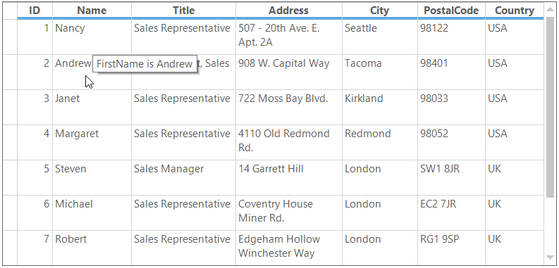
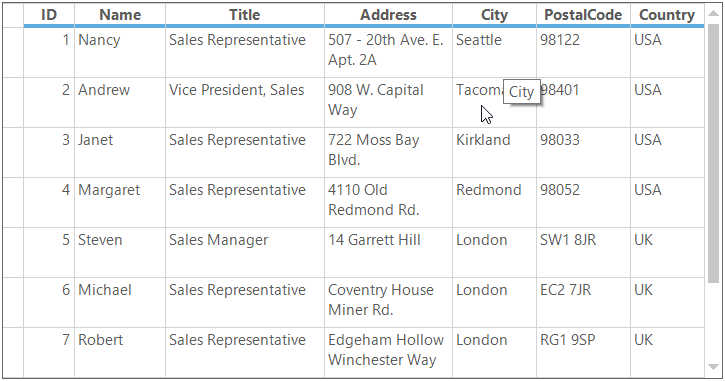
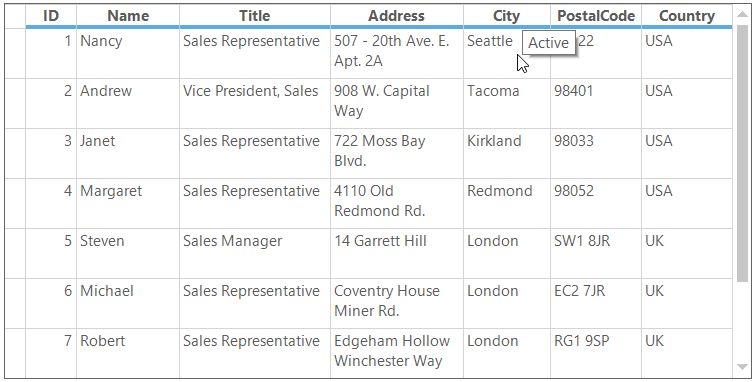
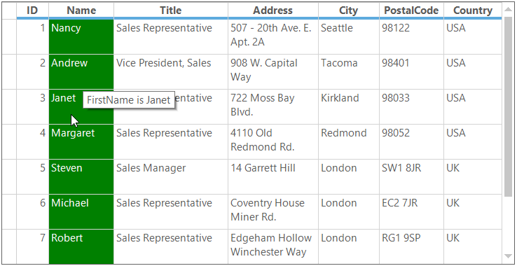

# ToolTip

The ToolTip can be added to the individual cells. This allows a user to show more information about the particular cell on mouse hover.

## Adding ToolTip

The ToolTip can be added to the particular cell by setting [CellTipText](http://help.syncfusion.com/cr/cref_files/windowsforms/grid/Syncfusion.Grid.Windows~Syncfusion.Windows.Forms.Grid.GridStyleInfo~CellTipText.html) property in the [QueryCellStyleInfo](http://help.syncfusion.com/cr/cref_files/windowsforms/grid/Syncfusion.Grid.Grouping.Windows~Syncfusion.Windows.Forms.Grid.Grouping.GridGroupingControl~QueryCellStyleInfo_EV.html) event. 



this.gridGroupingControl1.QueryCellStyleInfo += gridGroupingControl1_QueryCellStyleInfo;

void gridGroupingControl1_QueryCellStyleInfo(object sender, Syncfusion.Windows.Forms.Grid.Grouping.GridTableCellStyleInfoEventArgs e)
{
    if (e.Style.TableCellIdentity.Column != null && e.Style.TableCellIdentity.Column.Name == "FirstName"
        && e.TableCellIdentity.DisplayElement != null && e.TableCellIdentity.DisplayElement.Kind == Syncfusion.Grouping.DisplayElementKind.Record)
    {
        //Setting the ToolTip text.
        e.Style.CellTipText = e.TableCellIdentity.Column.Name + " is " + e.Style.Text;
    }
}


AddHandler gridGroupingControl1.QueryCellStyleInfo, AddressOf gridGroupingControl1_QueryCellStyleInfo

Private Sub gridGroupingControl1_QueryCellStyleInfo(ByVal sender As Object, ByVal e As Syncfusion.Windows.Forms.Grid.Grouping.GridTableCellStyleInfoEventArgs)
    If e.Style.TableCellIdentity.Column IsNot Nothing AndAlso e.Style.TableCellIdentity.Column.Name = "FirstName" AndAlso e.TableCellIdentity.DisplayElement IsNot Nothing AndAlso e.TableCellIdentity.DisplayElement.Kind Is Syncfusion.Grouping.DisplayElementKind.Record Then
        'Setting the ToolTip text.
        e.Style.CellTipText = e.TableCellIdentity.Column.Name & " is " & e.Style.Text
    End If
End Sub



### Adding ToolTip for Column

The ToolTip can be added to specific column by setting the `Appearance.AnyRecordFieldCell.CellTipText` property of the particular column descriptor. It will enable the ToolTip for all the cells in the column with same tip text.



//Setting ToolTip for particular column.
this.gridGroupingControl1.TableDescriptor.Columns["City"].Appearance.AnyRecordFieldCell.CellTipText = "City";


'Setting ToolTip for particular column.
Me.gridGroupingControl1.TableDescriptor.Columns("City").Appearance.AnyRecordFieldCell.CellTipText = "City"



### Adding ToolTip to Nested table

The ToolTip can be added for the nested tables by getting the child table descriptor using the  [GetTableDescriptor](http://help.syncfusion.com/cr/cref_files/windowsforms/grid/Syncfusion.Grid.Grouping.Windows~Syncfusion.Windows.Forms.Grid.Grouping.GridGroupingControl~GetTableDescriptor.html) method and setting the `CellTipText` to the column which you want.



// Adding ToolTip for nested table cells
this.gridGroupingControl1.GetTableDescriptor("Orders").Columns["Freight"].Appearance.AnyRecordFieldCell.CellTipText = "Hello";


' Adding ToolTip for nested table cells
Me.gridGroupingControl1.GetTableDescriptor("Orders").Columns("Freight").Appearance.AnyRecordFieldCell.CellTipText = "Hello"



## Removing ToolTip

The ToolTip for the cell can be removed by using the [ResetCellTipText](http://help.syncfusion.com/cr/cref_files/windowsforms/grid/Syncfusion.Grid.Windows~Syncfusion.Windows.Forms.Grid.GridStyleInfo~ResetCellTipText.html) method. It will reset the `CellTipText` property to the default values.



//Remove the ToolTip for particular column.
this.gridGroupingControl1.TableDescriptor.Columns["ColumnName"].Appearance.AnyRecordFieldCell.ResetCellTipText();


'Remove the ToolTip for particular column.
Me.gridGroupingControl1.TableDescriptor.Columns("ColumnName ").Appearance.AnyRecordFieldCell.ResetCellTipText()



## Disabling ToolTip window for Control

The displaying of ToolTip window on mouse hover for control can be restricted by setting the `Active` property of `CellToolTip` to `false`.



//Disable the ToolTip for GridGroupingcontrol.
this.gridGroupingControl1.TableControl.CellToolTip.Active = false;


'Disable the ToolTip for GridGroupingcontrol.
Me.gridGroupingControl1.TableControl.CellToolTip.Active = False



## Setting ToolTip delay time

The below properties are used to set the ToolTip delay time.

* [AutoPopDelay](https://msdn.microsoft.com/en-us/library/system.windows.forms.tooltip.autopopdelay(v=vs.110).aspx)
* [InitialDelay](https://msdn.microsoft.com/en-us/library/system.windows.forms.tooltip.initialdelay(v=vs.110).aspx)
* [ReshowDelay](https://msdn.microsoft.com/en-us/library/system.windows.forms.tooltip.reshowdelay(v=vs.110).aspx)
* [AutomaticDelay](https://msdn.microsoft.com/en-us/library/system.windows.forms.tooltip.automaticdelay(v=vs.110).aspx)

### AutoPopDelay

In order to increase or decrease tooltip visible state time, `CellToolTip.AutoPopDelay` property can be used.



//Set the ToolTip display time.
this.gridGroupingControl1.TableControl.CellToolTip.AutoPopDelay = 5000;


'Set the ToolTip display time.
Me.gridGroupingControl1.TableControl.CellToolTip.AutoPopDelay = 5000



### InitialDelay

In order to increase or decrease the time that the ToolTip waits before displaying a ToolTip window, `CellToolTip.InitialDelay` property can be used.



//Set the ToolTip Initial delay time.
this.gridGroupingControl1.TableControl.CellToolTip.InitialDelay = 1000;


'Set the ToolTip Initial delay time.
Me.gridGroupingControl1.TableControl.CellToolTip.InitialDelay = 1000



### ReshowDelay

In order to increase or decrease the time that the ToolTip waits before displaying the next ToolTip, `CellToolTip.ReshowDelay` property can be used.



//Set the ToolTip reshow delay time.
this.gridGroupingControl1.TableControl.CellToolTip.ReshowDelay = 500;


'Set the ToolTip reshow delay time.
Me.gridGroupingControl1.TableControl.CellToolTip.ReshowDelay = 500



### AutomaticDelay

The `AutomaticDelay` property enables you to set a single delay value, which is then used to set the values of the *AutoPopDelay* , *InitialDelay*, and *ReshowDelay* properties. Each time the `CellToolTip.AutomaticDelay` property is set, the following values are set by default.

<table>
<tr>
<td>
<b>Property</b>  </td><td>
<b>Default Values</b>  </td></tr>
<tr>
<td>
AutoPopDelay  </td><td>
10 times the AutomaticDelay value.  </td></tr>
<tr>
<td>
InitialDelay  </td><td>
Equal to the AutomaticDelay value.  </td></tr>
<tr>
<td>
ReshowDelay  </td><td>
1/5 of the AutomaticDelay value.  </td></tr>
</table>


//Set the delay time for ToolTip
this.gridGroupingControl1.TableControl.CellToolTip.AutomaticDelay = 1000;


'Set the delay time for ToolTip
Me.gridGroupingControl1.TableControl.CellToolTip.AutomaticDelay = 1000



N> The [CellToolTip  ](http://help.syncfusion.com/cr/cref_files/windowsforms/grid/Syncfusion.Grid.Grouping.Windows~Syncfusion.Windows.Forms.Grid.Grouping.GridTableControl~CellToolTip.html#) property can be accessed through [TableControl](http://help.syncfusion.com/cr/cref_files/windowsforms/grid/Syncfusion.Grid.Grouping.Windows~Syncfusion.Windows.Forms.Grid.Grouping.GridTableControl.html#) . The ToolTip delay time can be assigned to Nested tables by using the [GetTableControl](http://help.syncfusion.com/cr/cref_files/windowsforms/grid/Syncfusion.Grid.Grouping.Windows~Syncfusion.Windows.Forms.Grid.Grouping.GridGroupingControl~GetTableControl.html) method.

## Event

### ActivateToolTip event

[ActivateToolTip](http://help.syncfusion.com/cr/cref_files/windowsforms/grid/Syncfusion.Grid.Grouping.Windows~Syncfusion.Windows.Forms.Grid.Grouping.GridTableControl~ActivateToolTip_EV.html) event will be occurred whenever mouse has moved to a new cell and ToolTip is initialized for that cell.



this.gridGroupingControl1.TableControl.ActivateToolTip += TableControl_ActivateToolTip;

private void TableControl_ActivateToolTip(object sender, GridActivateToolTipEventArgs e)
{
    e.Style.CellTipText = "Active";
}


AddHandler gridGroupingControl1.TableControl.ActivateToolTip, AddressOf TableControl_ActivateToolTip

Private Sub TableControl_ActivateToolTip(ByVal sender As Object, ByVal e As GridActivateToolTipEventArgs)
    e.Style.CellTipText = "Active"
End Sub



## Disabling the ToolTip Window for particular cell

The displaying of ToolTip window on mouse hover for particular cells can be restricted by cancelling the `ActivateToolTip` event instead of setting the empty string to `CellTipText` property.



this.gridGroupingControl1.TableControl.ActivateToolTip += TableControl_ActivateToolTip;

private void TableControl_ActivateToolTip(object sender, GridActivateToolTipEventArgs e)
{
    GridTableCellStyleInfo cellstyle = e.Style as GridTableCellStyleInfo;

    //Diable the ToolTip for "FirstName" Column.
    if (cellstyle != null && cellstyle.TableCellIdentity.Column.Name == "FirstName")
    {
        e.Cancel = true;
    }
}


AddHandler gridGroupingControl1.TableControl.ActivateToolTip, AddressOf TableControl_ActivateToolTip

Private Sub TableControl_ActivateToolTip(ByVal sender As Object, ByVal e As GridActivateToolTipEventArgs)
    Dim cellstyle As GridTableCellStyleInfo = TryCast(e.Style, GridTableCellStyleInfo)

    'Diable the ToolTip for "FirstName" Column.
    If cellstyle IsNot Nothing AndAlso cellstyle.TableCellIdentity.Column.Name = "FirstName" Then
        e.Cancel = True
    End If
End Sub



## Highlighting the ToolTip cell

To highlight or customize the cells if that cell has ToolTip, [HasCellTipText](http://help.syncfusion.com/cr/cref_files/windowsforms/grid/Syncfusion.Grid.Windows~Syncfusion.Windows.Forms.Grid.GridStyleInfo~HasCellTipText.html) property can be used in the `QueryCellStyleInfo` event.



this.gridGroupingControl1.QueryCellStyleInfo += gridGroupingControl1_QueryCellStyleInfo;

void gridGroupingControl1_QueryCellStyleInfo(object sender, Syncfusion.Windows.Forms.Grid.Grouping.GridTableCellStyleInfoEventArgs e)
{
    //Checking whether the cell has ToolTip or not.
    if (e.Style.HasCellTipText)
    {
        e.Style.BackColor = Color.Green;   
        e.Style.TextColor = Color.White;
    }
}


AddHandler gridGroupingControl1.QueryCellStyleInfo, AddressOf gridGroupingControl1_QueryCellStyleInfo

Private Sub gridGroupingControl1_QueryCellStyleInfo(ByVal sender As Object, ByVal e As Syncfusion.Windows.Forms.Grid.Grouping.GridTableCellStyleInfoEventArgs)
    'Checking whether the cell has ToolTip or not.
    If e.Style.HasCellTipText Then
        e.Style.BackColor = Color.Green
        e.Style.TextColor = Color.White
    End If
End Sub 


