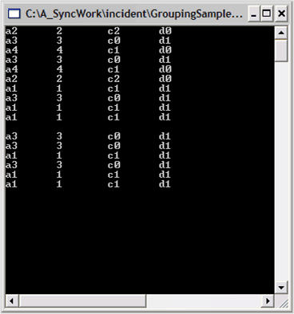
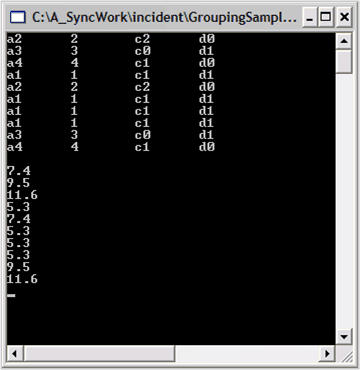
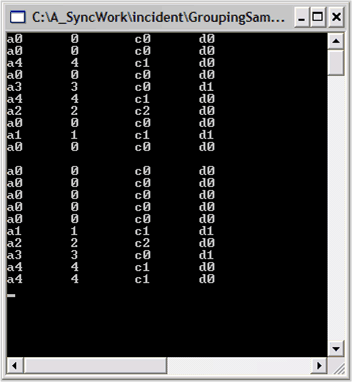
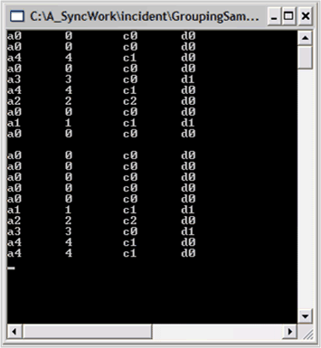

# Data Manipulation

In addition to grouping data, you may want to filter it for some special criteria. For example, you may want to see the total monthly sales due to orders under some value. Essential Grouping gives you the flexibility to add calculated values to the data, and then use these values to produce other information like total monthly sales due for respective order etc. 

The following data manipulation techniques are available in Essential Grouping:

## Filters

Another collection that is part of the schema information in the Engine.TableDescriptor is the RecordFilters collection. This collection lets you filter the data to see only the items that are in your data list and that satisfy the criteria that is specified. You can express the criteria as a logical expression using the property names, algebraic, and logical operators. You can also use LIKE, MATCH, and IN operators.

1. In the Console Application used in lessons 1 and 2, comment out all the code that is in the Main method and add the following code to create a data object and set it into the Grouping Engine.



static void Main(string[] args)
{

// Create an array list of random MyObjects.
ArrayList list = new ArrayList();
Random r = new Random();

for(int i = 0; i < 10; i++)
{
	list.Add(new MyObject(r.Next(5)));
}

// Create a Grouping.Engine object.
Engine groupingEngine = new Engine();

// Set its datasource.
groupingEngine.SetSourceList(list);
}

 
   {:.prettyprint }

Sub Main()

' Create an array list of random MyObjects.
Dim list As New ArrayList()
Dim r As New Random()
Dim i As Integer

For i = 0 To 10
list.Add(New MyObject(r.Next(5)))
Next

' Create a Grouping.Engine object.
Dim groupingEngine As New Engine()

' Set its data source.
groupingEngine.SetSourceList(list)
End Sub 


   {:.prettyprint }

2. You are now ready to apply a filter to the data. Say for example you want to see only those items whose property D has the value d1. You must observe that D is a string that has non-numeric values. So, in this case you will need to use one of the string comparison operators (LIKE or MATCH) in your filter condition.
3. To add a filter condition, you will need to add a RecordFilterDescriptor to the Engine.TableDescriptor.RecordFilters collection. 

Do the following steps:

1. List the data before the filter. 
2. Apply the filter by creating a RecordFilterDescriptor. 
3. Add it to the RecordFilters collection. 
4. List the filtered data. 

   N> To list the data, instead of accessing the Table.Records collections, you were using the Table.FilteredRecords collections. The FilteredRecords collection only includes the records that satisfy all filters in the RecordFilters collection. Add this code at the end of the Main method.

5. Note that the constructor on theRecordFilterDescription takes an expression, "[D] LIKE 'd1'". This expression will be _True_ only for those items in the list where property D has the value d1.



// Display the data before filtering.

foreach(Record rec in groupingEngine.Table.FilteredRecords)
{
	MyObject obj = rec.GetData() as MyObject;

   if(obj != null)
   {
	  Console.WriteLine(obj);
   }
}

// Pause
Console.ReadLine(); 

// Filter on [D] = d1
RecordFilterDescriptor recordFilterDescriptor = new RecordFilterDescriptor("[D] LIKE 'd1'");
groupingEngine.TableDescriptor.RecordFilters.Add(recordFilterDescriptor);

// Display the data after filtering.

foreach(Record rec in groupingEngine.Table.FilteredRecords)
{
	MyObject obj = rec.GetData() as MyObject;

	if(obj != null)
	{
        Console.WriteLine(obj);
	}

}

// Pause
Console.ReadLine(); 

 
   {:.prettyprint }

' Display the data before filtering.
Dim rec As Record

For Each rec In groupingEngine.Table.FilteredRecords
Dim obj As MyObject = CType(rec.GetData(), MyObject)

If Not (obj Is Nothing) Then
Console.WriteLine(obj)
End If
Next rec

' Pause
Console.ReadLine() 

' Filter on [D] = d1
Dim recordFilterDescriptor As New RecordFilterDescriptor("[D] LIKE 'd1'")
groupingEngine.TableDescriptor.RecordFilters.Add(recordFilterDescriptor)

' Display the data after filtering.

For Each rec In groupingEngine.Table.FilteredRecords
Dim obj As MyObject = CType(rec.GetData(), MyObject)

If Not (obj Is Nothing) Then
Console.WriteLine(obj)
End If
Next rec

' Pause
Console.ReadLine() 


 
   {:.prettyprint }

   
6. You can apply more complex filters. Here is the code that will remove any existing filters and filter the property D being d1 or property b equal 2. Note here that since you expect property B to display only numeric data you must use the = operator in the comparison.


 
groupingEngine.TableDescriptor.RecordFilters.Clear();
recordFilterDescriptor = new RecordFilterDescriptor("[D] LIKE 'd1' OR [B] = 2");
groupingEngine.TableDescriptor.RecordFilters.Add(recordFilterDescriptor);

// Access the data directly from the Engine.

foreach(Record rec in groupingEngine.Table.FilteredRecords)
{
    MyObject obj = rec.GetData() as MyObject;

	if(obj != null)
	{
		  Console.WriteLine(obj);
	}
}

// Pause
Console.ReadLine(); 

 
   {:.prettyprint }

groupingEngine.TableDescriptor.RecordFilters.Clear()
recordFilterDescriptor = New RecordFilterDescriptor("[D] LIKE 'd1' OR [B] = 2")
groupingEngine.TableDescriptor.RecordFilters.Add(recordFilterDescriptor)

' Access the data directly from the Engine.

For Each rec In groupingEngine.Table.FilteredRecords
Dim obj As MyObject = CType(rec.GetData(), MyObject)

If Not (obj Is Nothing) Then
Console.WriteLine(obj)
End If
Next rec

' Pause
Console.ReadLine() 


   {:.prettyprint }

   

Filtering is applied to the data displayed in the console.

## Expressions

You can add new properties to your data object that are algebraic expressions involving other properties of the object. 

To add an expression, you need to create an ExpressionFieldDescriptor and add it to the Engine.TableDescriptor.Expression.Fields collection. Here we illustrate this process by adding an expression that computes 2.1 times the value of property B plus 3.2.

1. In the Console Application, comment out all the code that is in the Main method and add this code to create a data object and set it into the GroupingEngine.



// Create an array list of random MyObjects.
ArrayList list = new ArrayList();
Random r = new Random();

for(int i = 0; i < 10; i++)
{
    list.Add(new MyObject(r.Next(5)));
}

// Create a Grouping.Engine object.
Engine groupingEngine = new Engine();

// Set its datasource.
groupingEngine.SetSourceList(list);

   {:.prettyprint }

' Create an array list of random MyObjects.
Dim list As New ArrayList()
Dim r As New Random()
Dim i As Integer

For i = 0 To 10
list.Add(New MyObject(r.Next(5)))
Next

' Create a Grouping.Engine object.
Dim groupingEngine As New Engine()

' Set its datasource.
groupingEngine.SetSourceList(list)


   {:.prettyprint }

2. Now you must add code to list the data, add an expression property and then display the value of the expression. To retrieve the value, you must use the Record.GetValue method by passing it as the name of the expression that you had assigned when it was created.



// Display the data before filtering.

foreach(Record rec in groupingEngine.Table.FilteredRecords)
{
	MyObject obj = rec.GetData() as MyObject;

	if(obj != null)
	{
		Console.WriteLine(obj);
	}
}

// Pause
Console.ReadLine(); 

// Add an expression property.
ExpressionFieldDescriptor expressionFieldDescriptor = new ExpressionFieldDescriptor("MultipleOfB", "2.1 * [B] + 3.2");
groupingEngine.TableDescriptor.ExpressionFields.Add(expressionFieldDescriptor);

// Display the data after adding the field.

foreach(Record rec in groupingEngine.Table.FilteredRecords)
{
	Console.WriteLine(rec.GetValue("MultipleOfB"));
}

// Pause
Console.ReadLine(); 
  

   {:.prettyprint }

' Display the data before filtering.
Dim rec As Record

For Each rec In groupingEngine.Table.FilteredRecords
Dim obj As MyObject = CType(rec.GetData(), MyObject)

If Not (obj Is Nothing) Then
Console.WriteLine(obj)
End If
Next rec

' Pause
Console.ReadLine() 

' Add an expression property.
Dim expressionFieldDescriptor As New ExpressionFieldDescriptor("MultipleOfB", "2.1 * [B] + 3.2")
groupingEngine.TableDescriptor.ExpressionFields.Add(expressionFieldDescriptor)

' Display the data after adding the field.

For Each rec In groupingEngine.Table.FilteredRecords
Console.WriteLine(rec.GetValue("MultipleOfB"))
Next rec


   {:.prettyprint }

   

## Sorting

To sort your data, you must add the name of the property that you want to sort to the Engine.TableDescriptor.SortedColumns collection.  

In the Console Application, comment out all the code that is in the Main method and add this code to create a data object, set it into the GroupingEngine, display the data, sort it by property A and re-display the sorted data.



// Create an array list of random MyObjects.
ArrayList list = new ArrayList();
Random r = new Random();

for(int i = 0; i < 10; i++)
{
    list.Add(new MyObject(r.Next(5)));
}

// Create a Grouping.Engine object.
Engine groupingEngine = new Engine();

// Set its datasource.
groupingEngine.SetSourceList(list);

// Display the data before sorting.

foreach(Record rec in groupingEngine.Table.Records)
{
    MyObject obj = rec.GetData() as MyObject;

    if(obj != null)
    {
       Console.WriteLine(obj);
    }
}

// Pause
Console.ReadLine(); 

// Sort column A.
groupingEngine.TableDescriptor.SortedColumns.Add("A");        

// Display the data after sorting.

foreach(Record rec in groupingEngine.Table.FilteredRecords)
{
    MyObject obj = rec.GetData() as MyObject;

    if(obj != null)
    {
       Console.WriteLine(obj);
    }
}

// Pause
Console.ReadLine(); 


' Create an array list of random MyObjects.
Dim list As New ArrayList()
Dim r As New Random()
Dim i As Integer

For i = 0 To 9
list.Add(New MyObject(r.Next(5)))
Next i

' Create a Grouping.Engine object.
Dim groupingEngine As New Engine()

' Set its datasource.
groupingEngine.SetSourceList(list)

' Display the data before sorting.
Dim rec As Record

For Each rec In groupingEngine.Table.Records
Dim obj As MyObject = CType(rec.GetData(), MyObject)

If Not (obj Is Nothing) Then
Console.WriteLine(obj)
End If
Next rec

' Pause
Console.ReadLine() 

' Sort column A.
groupingEngine.TableDescriptor.SortedColumns.Add("A")

' Display the data after sorting.

For Each rec In groupingEngine.Table.FilteredRecords
Dim obj As MyObject = CType(rec.GetData(), MyObject)

If Not (obj Is Nothing) Then
Console.WriteLine(obj)
End If
Next rec

'Pause
Console.ReadLine() 



## Custom Sorting

We used a simplest overload in the previous section for sorting the data. The TableDescriptor.SortedColumns.Add method has three overloads as shown below:

* Add(string propertyName) 
* Add(string propertyName, ListSortDirection Dir) 
* Add(SortColumnDescriptor sortColumnDescriptor)

The following code snippets illustrate the syntax for these overloads:



public int Add(string propertyName);
public int Add(string propertyName, ListSortDirection direction);
public int Add(SortColumnDescriptor sdc); 


Overloads Public Function Add(propertyName As String) As Integer
Overloads Public Function Add(propertyName As String, direction As ListSortDirection) As Integer
Overloads Public Function Add(sdc As SortColumnDescriptor) As Integer



The second overload can be used to specify the sort direction. The SortColumnDescriptor.Comparer is an IComparer property that allows you to specify a custom comparer object. 

N> We are going to use the third function in this section to perform custom sorting.

The following steps illustrate how to do custom sorting using the IComparer property:

1. Here, you must create a class that implements IComparer which can accept value such as ax, where x is a digit which is used to do the comparison. This leads to numerical sorting, ignoring the leading character.
2. Add this code immediately following the end of the Class1 code.



public class AComparer : IComparer
{

// Implementing IComparer to define the object comparisons.

public int Compare(object x, object y)
{

   if(x == null && y == null)
	  return 0;

   else if(x == null)
	  return -1;

   else if(y == null)
      return 1;

    else
   {
        int value1 = 0;
        int value2 = 0;
        try
        {
            // Ignoring the leading character to have numerical sorting.
			 value1 = int.Parse(x.ToString().Substring(1));
			 value2 = int.Parse(y.ToString().Substring(1));
			 return value2 - value1;
		 }
		 catch 
		 {
			throw new ArgumentException("A must be in the form");
		 }
		 }
 }
}


   {:.prettyprint }

Public Class AComparer
Implements IComparer

' Implementing IComparer to define the object comparisons.

Public Function Compare(ByVal x As Object, ByVal y As Object) As Integer _ 
Implements IComparer.Compare

If x Is Nothing And y Is Nothing Then
Return 0

Else

If x Is Nothing Then
Return -1

Else

If y Is Nothing Then
Return 1

Else
Dim value1 As Integer = 0
Dim value2 As Integer = 0

Try

' Ignoring the leading character to have numerical sorting.
value1 = Integer.Parse(x.ToString().Substring(1))
value2 = Integer.Parse(y.ToString().Substring(1))
Return value2 - value1

Catch
End Try
End If
End If
End If
End Function
End Class


   {:.prettyprint }

3. Add this code to the Main method to use this custom comparer to sort column A.



// Create an array list of random MyObjects.
ArrayList list = new ArrayList();
Random r = new Random();

for(int i = 0; i < 10; i++)
{
    list.Add(new MyObject(r.Next(20)));
}

// Create a Grouping.Engine object.
Engine groupingEngine = new Engine();

// Set its datasource.
groupingEngine.SetSourceList(list);

// Display the data before sorting.

foreach(Record rec in groupingEngine.Table.Records)
{
    MyObject obj = rec.GetData() as MyObject;

	if(obj != null)
	{
		Console.WriteLine(obj);
	}
}

// Pause
Console.ReadLine(); 

// Custom sort column A.

// Get an IComparer object to handle the custom sorting.
AComparer comparer = new AComparer();
groupingEngine.TableDescriptor.SortedColumns.Add("A");
groupingEngine.TableDescriptor.SortedColumns["A"].Comparer = comparer;

// Display the data before sorting.

foreach(Record rec in groupingEngine.Table.FilteredRecords)
{
	MyObject obj = rec.GetData() as MyObject;

	if(obj != null)
   {
	   Console.WriteLine(obj);
   }
}

// Pause
Console.ReadLine(); 

   ~~~
   {:.prettyprint }

' Create an array list of random MyObjects.
Dim list As New ArrayList()
Dim r As New Random()
Dim i As Integer

For i = 0 To 9
list.Add(New MyObject(r.Next(20)))
Next i

' Create a Grouping.Engine object.
Dim groupingEngine As New Engine()

' Set its datasource.
groupingEngine.SetSourceList(list)

' Display the data before sorting.
Dim rec As Record

For Each rec In groupingEngine.Table.Records
Dim obj As MyObject = rec.GetData() '
Dim obj As MyObject = CType(rec.GetData(), MyObject)

If Not (obj Is Nothing) Then
Console.WriteLine(obj)
End If
Next rec

' Pause
Console.ReadLine() 

' Custom sort column A.

' Get an IComparer object to handle the custom sorting.
Dim comparer As New AComparer()
groupingEngine.TableDescriptor.SortedColumns.Add("A")
groupingEngine.TableDescriptor.SortedColumns("A").Comparer = comparer 

' Display the data before sorting.
Dim rec As Record

For Each rec In groupingEngine.Table.FilteredRecords
Dim obj As MyObject = CType(rec.GetData(), MyObject)

If Not (obj Is Nothing) Then
Console.WriteLine(obj)
End If
Next rec

' Pause
Console.ReadLine() 
   

   {:.prettyprint }

   

