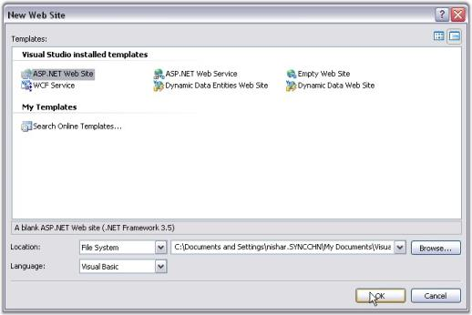

# Getting Started with Windows Forms Grouping

This section will show you how easy it is to get started using Essential Grouping. It will give you a basic introduction to the concepts you need to know before getting started with the product and some tips and ideas on how to implement Grouping into your projects to improve customization and increase efficiency. It shows how to create an IList data source and use it with Grouping. The datasource is an ArrayList of custom objects. As part of this lesson, you will see how to iterate through the data in the GroupingEngine.

## Creating Platform Application

This section illustrates the step-by-step procedure to create the following platform applications.

### Creating a Windows Application

1. Open Microsoft Visual Studio. Go to File menu and click New Project. In the New Project dialog, select Windows Forms Application template, name the project and click OK. 

   

   A windows application is created.

2. Now you need to deploy Essential Grouping into this Windows application. Refer Windows / WPF topic for detailed info.

### Creating an ASP.NET Application

To know how to deploy a web application, refer the _ASP.NET Behind the scenes_ section in the Getting Started guide of our Essential Studio documentation. 

1. Open Microsoft Visual Studio. Go to File menu and click New Website. In the New Website dialog, select ASP.NET Web Site template, name the website and click OK. 

   

   A web application is created.

2. Now you need to deploy Essential Grouping into this ASP.NET application. Refer ASP.NET topic for detailed info.

### Creating a WPF Application

1. Open Microsoft Visual Studio. Go to File menu and click New Project. In the New Project dialog, select WPF Application template, name the project and click OK. 

   

2. A WPF application is created.
3. Now you need to deploy Essential Grouping into this WPF application. Refer Windows / WPF topic for detailed info.

For More Information Refer:

[Deploying Essential Grouping](#deploying-essential-grouping)

## Deploying Essential Grouping

We have now created a platform application in the previous topic [Creating Platform Application](#creating-platform-application). This section will guide you to deploy Essential Grouping in those applications under the following topics:

* Windows / WPF-Step-by-step procedure to deploy Grouping in Windows / WPF applications
* ASP.NET-Step-by-step procedure to deploy Grouping in web application

### Windows / WPF

Now, you have created a Windows / WPF application refer [Creating Platform Application](#creating-platform-application). This section will guide you to deploy Essential Grouping in a Windows/WPF applications.

### Deploying Essential Grouping in a Windows / WPF Application

The following steps will guide you to deploy Essential Grouping:

1. In order to deploy an application that uses the Syncfusion assemblies, the referenced Syncfusion assemblies should reside in the application folder where the EXE exists, in the target machine.
2. In order to do that, go to the References folder in the Solution Explorer. Select all the Syncfusion assemblies, right-click and go to Properties. Change the Copy Local property of the Syncfusion assemblies to true and compile the project.
3. Check whether the licenses.licx file listed in the project has its Build Action property to be Embedded Resource.
4. Now you may see that the Syncfusion assemblies referenced in the project are copied to the output directory along with the application executable (bin/debug/).
5. Deploy the EXE along with the Syncfusion assemblies in that location to the target machine. Be sure that these Syncfusion assemblies reside in the same location as the application EXE in the target machine.
 
N> For Windows Forms applications, placing these referenced Syncfusion assemblies in the GAC alone, in the target machine, will also work.

Dll's needed for deployment

* Syncfusion.Core.dll
* Syncfusion.Grouping.Base.dll
* Syncfusion.Grouping.Windows.dll
* Syncfusion.Shared.Base.dll
* Syncfusion.Shared.Windows.dll

Essential Grouping is now deployed in your Windows / WPF applications.

### ASP.NET

Now, you have created a ASP.NET application (refer Creating Platform Application). This section will guide you to deploy Essential Grouping in an ASP.NET Application.

The following steps will guide you to deploy Essential Grouping in an ASP.NET application:

1. Marking the Application directory-The appropriate directory, usually where the aspx files are stored, must be marked as Application in IIS.
2. Syncfusion Assemblies-The Syncfusion assemblies need to be in the bin folder that is beside the aspx files.
 
N> They can also be in the GAC, in which case, they should be referenced in Web.config file.



<configuration>
<system.web>
<compilation>
<assemblies>
<add assembly="Syncfusion.Grid.Grouping.Web, Version=x.x.x.x, Culture=neutral, PublicKeyToken=3D67ED1F87D44C89"/></assemblies>
</compilation>
</system.web>
</configuration>



N> The version numbers in the above references will vary depending on the version you are linking to.

Data Files-If you have .xml, .MDB, or other data files, ensure that they have sufficient security permission. Authenticated Users should have full control over the files and the directories in order to give ASP.NET code, enough permissions to open the file during runtime.

Refer to the document in the following path, for step by step process of Syncfusion assemblies’ deployment in ASP.NET.

[http://www.syncfusion.com/support/user/uploads/webdeployment_c883f681.pdf](http://www.syncfusion.com/support/user/uploads/webdeployment_c883f681.pdf)

N> Application with Essential Grouping needs the following dependent assemblies for deployment.

* Syncfusion.Shared.Base.dll
* Syncfusion.Shared.Web.dll
* Syncfusion.Grid.Base.dll
* Syncfusion.Grid.Windows.dll
* Syncfusion.Grouping.Base.dll
* Syncfusion.Grouping.Web.dll
* Syncfusion.Grid.Grouping.Base.dll

Essential Grouping is now deployed in your ASP.NET application.

