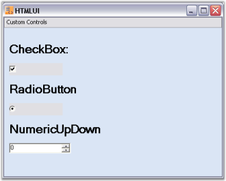

#  Custom controls

The Custom Controls are not standard HTML elements but user-defined controls that are created for improving the application's richness and productivity.

The Custom tag is used to include the custom controls in an HTML document. The custom tag comes with two attributes: assembly and class.

The assembly attribute refers to the namespace where the control is located. The class attribute represents the control.

An HTML document containing custom controls is shown below.





<html>

<body>

CheckBoxAdv:<CUSTOM class="Syncfusion.Windows.Forms.Tools.CheckBoxAdv" assembly="Syncfusion.tools.windows">

</CUSTOM>

 

NumericUpDown:<CUSTOM class="NumericUpDown" assembly="System.Windows.Forms"></CUSTOM>

 

</body> 

</html>





The custom controls defined in the HTML document are interfaced with their equivalent Windows Forms control with the help of the PreRenderDocument event. The PreRenderDocument event occurs at a time when the HTML document is being loaded into the HTMLUI control, but the elements are not yet positioned.

The HTML elements are loaded into an hash table with an equivalent id as their key. An equivalent Base class object, here BaseElement class, is defined to link the HTML elements stored in the hash table with the help of the key associated with the element. The BaseElement is the Base class for all HTML elements. All HTML tag elements inherit this class.

The CustomControlBase implements the base functionality of the Windows Forms control on the HTML tag element.





private void htmluiControl1_PreRenderDocument(object sender, Syncfusion.Windows.Forms.HTMLUI.PreRenderDocumentArgs e) 

{ 

Hashtable tab = new Hashtable(); 

tab = e.Document.ElementsByUserID; 

// Here the base functionality of the 'this.checkBoxAdv1' is implemented to the 'checkBoxAdvElement1'. 

BaseElement CheckBoxAdvElement1 = tab["CheckBoxAdv"] as BaseElement;

// Create a new Wrapper object.

new CustomControlBase( CheckBoxAdvElement1, this.CheckBoxAdv1 ); 

BaseElement NumericUpDownElement = tab["NumericUpDown"] as BaseElement; 

new CustomControlBase( NumericUpDownElement, this.NumericUpDown1 ); 

}





Private Sub htmluiControl1_PreRenderDocument(ByVal sender As Object, ByVal e As Syncfusion.Windows.Forms.HTMLUI.PreRenderDocumentArgs)

Dim tab As Hashtable = New Hashtable()

tab = e.Document.ElementsByUserID

' Here the base functionality of the 'this.checkBoxAdv1' is implemented to the 'checkBoxAdvElement1'. 

Dim CheckBoxAdvElement1 As BaseElement = CType(IIf(TypeOf tab("CheckBoxAdv") Is BaseElement, tab("CheckBoxAdv"), Nothing), BaseElement)

' Create a new Wrapper object.

Dim oTemp1 As CustomControlBase = New CustomControlBase(CheckBoxAdvElement1, Me.CheckBoxAdv1)

Dim NumericUpDownElement As BaseElement = CType(IIf(TypeOf tab("NumericUpDown") Is BaseElement, tab("NumericUpDown"), Nothing), BaseElement)

Dim oTemp2 As CustomControlBase = New CustomControlBase(NumericUpDownElement, Me.NumericUpDown1)

End Sub





The following image illustrates three custom controls created using HTMLUI.

## Custom controls sample

This sample demonstrates the implementation of Custom Controls by using HTMLUI.

By default, this sample can be found under the following location:

...\_My Documents\Syncfusion\EssentialStudio\Version Number\Windows\HTMLUI.Windows\Samples\Advanced Editor Functions\ActionGroupingDemo_

