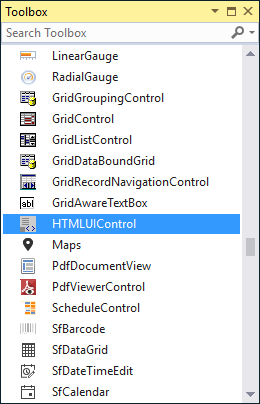
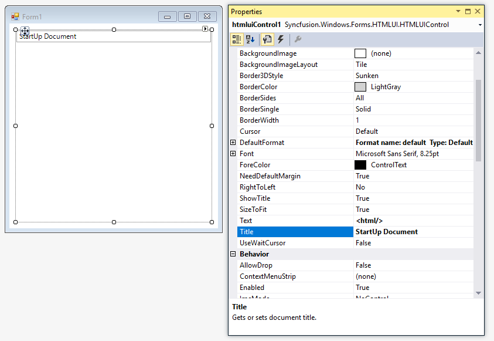
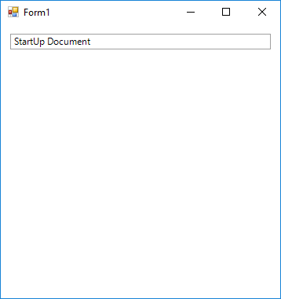
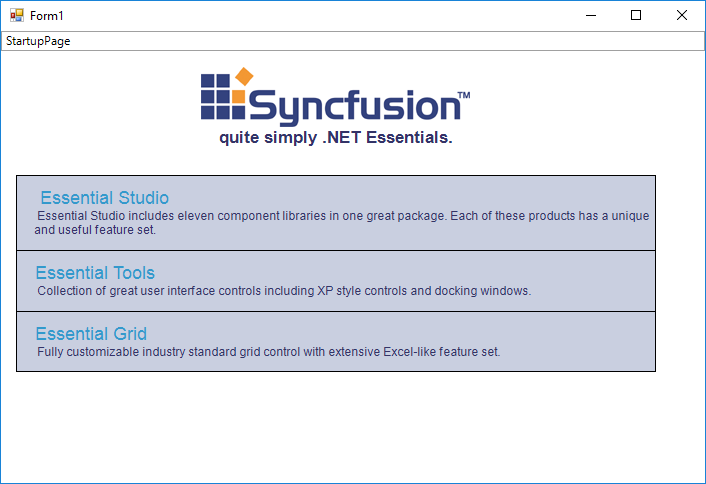

# Getting Started with Windows Forms Html Viewer (HTMLUI)

This section describes how to configure a `HTMLUIControl` in a Windows Forms application and overview of its basic functionalities.

## Assembly deployment

Refer [control dependencies](https://help.syncfusion.com/windowsforms/control-dependencies#htmluicontrol) section to get the list of assemblies or NuGet package needs to be added as reference to use the control in any application. 

Get more details regarding how to install the nuget packages in windows form application in the [How to install nuget packages](https://help.syncfusion.com/windowsforms/installation/install-nuget-packages) link.

## Creating simple application with HTMLUIControl

You can create Windows Forms application with HTMLUIControl as follows:

1. [Creating the project](#creating-the-project)
2. [Adding control via designer](#adding-control-via-designer)
3. [Adding control manually using code](#adding-control-manually-using-code)
4. [Loading a file into document](#Loading-a-file-into-document)

### Creating the project

Create a new Windows Forms project in Visual Studio to display the HTMLUIControl.

## Adding control via designer

The HTMLUIControl can be added to the application by dragging it from the toolbox and dropping it in the designer view. The following required assembly references will be added automatically:

   * Syncfusion.HTMLUI.Base.dll
   * Syncfusion.HTMLUI.Windows.dll
   * Syncfusion.Scripting.Base.dll
   * Syncfusion.Shared.Base

**Configure Title**

Title text can be set using `Title` property. The visibility of the title can be customized using `ShowTitle` property.

## Adding control manually using code

To add the control manually in C#, follow the steps:

**Step 1** : Add the following required assembly references to the project:

      * Syncfusion.HTMLUI.Base.dll
      * Syncfusion.HTMLUI.Windows.dll
      * Syncfusion.Scripting.Base.dll
      * Syncfusion.Shared.Base

**Step 2** : Include the namespaces **Syncfusion.Windows.Forms.HTMLUI**.





using Syncfusion.Windows.Forms.HTMLUI;





Imports Syncfusion.Windows.Forms.HTMLUI





**Step 3** : Create the HTMLUIControl instance and add it to the form.





HTMLUIControl htmluiControl1 = new HTMLUIControl();

this.htmluiControl1.Dock = System.Windows.Forms.DockStyle.Fill;

this.htmluiControl1.Text = "htmluiControl1";

this.Controls.Add(this.htmluiControl1);





Dim htmluiControl1 As New HTMLUIControl()

Me.htmluiControl1.Dock = System.Windows.Forms.DockStyle.Fill

Me.htmluiControl1.Text = "htmluiControl1"

Me.Controls.Add(Me.htmluiControl1)





**Configure Title**

Title text can be set using [Title](https://help.syncfusion.com/cr/windowsforms/Syncfusion.Windows.Forms.HTMLUI.HTMLUIControl.html#Syncfusion_Windows_Forms_HTMLUI_HTMLUIControl_Title) property. The visibility of the title can be customized using [ShowTitle](https://help.syncfusion.com/cr/windowsforms/Syncfusion.Windows.Forms.HTMLUI.HTMLUIControl.html#Syncfusion_Windows_Forms_HTMLUI_HTMLUIControl_ShowTitle) property.





this.htmluiControl1.ShowTitle = true;
this.htmluiControl1.Title = "StartUp Document";





Me.htmluiControl1.ShowTitle = True
Me.htmluiControl1.Title = "StartUp Document"





## Loading a file into document

File can be added to HTMLUIControl using [LoadHTML](https://help.syncfusion.com/cr/windowsforms/Syncfusion.Windows.Forms.HTMLUI.HTMLUIControl.html#Syncfusion_Windows_Forms_HTMLUI_HTMLUIControl_LoadHTML_System_IO_Stream_) method where the file path given as parameter.





this.htmluiControl1.LoadHTML(Path.GetDirectoryName(Application.ExecutablePath) + @"\..\..\FileName.htm");





Me.htmluiControl1.LoadHTML(Path.GetDirectoryName(Application.ExecutablePath) + @"\..\..\FileName.htm")





