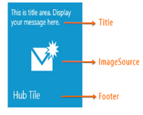

# DefaultTile in Windows Forms Hub Tile

This type provides notification through various transition effects.

## Key properties

* [Title](https://help.syncfusion.com/cr/windowsforms/Syncfusion.Windows.Forms.Tools.HubTile.html#Syncfusion_Windows_Forms_Tools_HubTile_Title) - The title can be displayed at the top of the hub tile.
* [Footer](https://help.syncfusion.com/cr/windowsforms/Syncfusion.Windows.Forms.Tools.HubTile.html#Syncfusion_Windows_Forms_Tools_HubTile_Footer) - The footer can be displayed at the bottom of the hub tile.
* [ImageSource](https://help.syncfusion.com/cr/windowsforms/Syncfusion.Windows.Forms.Tools.HubTile.html#Syncfusion_Windows_Forms_Tools_HubTile_ImageSource) - An image can be displayed in the background of the hub tile.

The following code example shows the usage of the [Title](https://help.syncfusion.com/cr/windowsforms/Syncfusion.Windows.Forms.Tools.HubTile.html#Syncfusion_Windows_Forms_Tools_HubTile_Title), [Footer](https://help.syncfusion.com/cr/windowsforms/Syncfusion.Windows.Forms.Tools.HubTile.html#Syncfusion_Windows_Forms_Tools_HubTile_Footer), and [ImageSource](https://help.syncfusion.com/cr/windowsforms/Syncfusion.Windows.Forms.Tools.HubTile.html#Syncfusion_Windows_Forms_Tools_HubTile_ImageSource) properties.



  

this.HubTile1.Title.Text  = "This is the title area. Display your image here”;

this.HubTile1.Title.TextColor  = Color.White;

this.HubTile1.Footer.Text = "HubTile";

this.HubTile1.Footer.TextColor  = Color.White;

this.HubTile1.ImageSource  = this.ImageListAdv1.Images[0];



 

Me.HubTile1.Title.Text = "This is the title area. Display your image here”

Me.HubTile1.Title.TextColor  = Color.White

Me.HubTile1.Footer.Text = "HubTile"

Me.HubTile1.Footer.TextColor  = Color.White

Me.HubTile1.ImageSource  = Me.ImageListAdv1.Images(0)





  
 
 Default Tile
 {:.caption}
 
## Transition effects

In HubTile, image transition can be performed at specified intervals and in different directions just like the Windows 8 live tiles. They include the following transition effects.

* Bottom-to-Top
* Top-to-Bottom
* Left-to-Right
* Right-to-Left

HubTile image transition direction can be modified using the [SlideTransition](https://help.syncfusion.com/cr/windowsforms/Syncfusion.Windows.Forms.Tools.HubTile.html#Syncfusion_Windows_Forms_Tools_HubTile_SlideTransition) property.



 

this.HubTile1.TileType = HubTileType.DefaultTile;

this.HubTile1.TurnLiveTileOn = true;

this.HubTile1.SlideTransition = TransitionDirection.BottomToTop;

 

 
 

Me.HubTile1.TileType = HubTileType.DefaultTile

Me.HubTile1.TurnLiveTileOn = True

Me.HubTile1.SlideTransition = TransitionDirection.LeftToRight





 
 

## Transition speed

In HubTile, image transition speed can be increased or decreased by using [ImageTransitionSpeed](https://help.syncfusion.com/cr/windowsforms/Syncfusion.Windows.Forms.Tools.HubTile.html#Syncfusion_Windows_Forms_Tools_HubTile_ImageTransitionSpeed) property.



 

this.HubTile1.ImageTransitionSpeed = 3;

 

 

Me.HubTile1.ImageTransitionSpeed = 3




