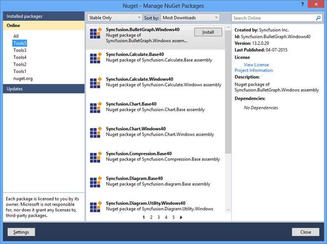

# Installation and Deployment

## Installation

### Manual Installation

The following procedure illustrates how to install Essential Studio.

1. Double-click the Syncfusion Essential Studio WF Setup file. The Self-Extractor Wizard opens and extracts the package automatically.
2. Enter User Name, Organization and Unlock Key in the corresponding text boxes provided.
3. Click Next.
4. After reading the terms, click the “I accept the terms and conditions” check box.
5. Click Next. The Select the Installation and Samples Folder window opens.
6. To install it in the displayed default location, click Install.
7. Select the Run Dashboard check box to launch the Dashboard after installing.
8. Click Finish. Essential Studio is installed in your system and the Syncfusion Essential Studio [Dashboard](http://help.syncfusion.com/ug/common/documents/dashboard.htm# "") is launched automatically.

### Nuget Installation

Refer to the Syncfusion NuGet Packages from the Visual Studio applications. The following steps help you add the reference of the Syncfusion assemblies in the Project References.

1. Right-click on Project and choose the Manage NuGet Packages.
2. Select Online. Refer to the following screenshot for more information. 

3. Install the required corresponding framework control to use in Visual Studio projects. You can install the dependent assemblies when needed. The framework number at the end of package name like, 35, 40, and 45, 451 is added.
4. Find the installed Syncfusion Packages in the Directory location, of the solution file, of the created project, Syncfusion Packages.
5. You can [configure](http://help.syncfusion.com/ug/extension/index.html#!Documents/nugetinstallandconfiguration.htm "") Nuget for the required purpose.

### Command Line installation

Follow the given steps to install through Command Line in Silent mode.

1. Double-click the Syncfusion Essential Studio Setup file. The Self-Extractor Wizard opens and extracts the package automatically.
2. The SyncfusionEssentialStudio_(version).exe file is extracted into the Temp folder.
3. Run %temp%. The Temp folder opens. The SyncfusionEssentialStudio_(version).exe file is available in one of the folders.
4. Copy the SyncfusionEssentialStudio_(version).exe file in local drive. Example: D:\temp
5. Cancel the wizard.
6. Open Command Prompt in administrator mode and pass the following arguments for corresponding version.

**Essential** **Studio** **version** **13.1** **and** **earlier:**

“Setup file path\SyncfusionEssentialStudio_(version).exe” Install /PIDKEY:“(product unlock key)” [/log “{Log file path}”] [/InstallPath:{Location to install}]

