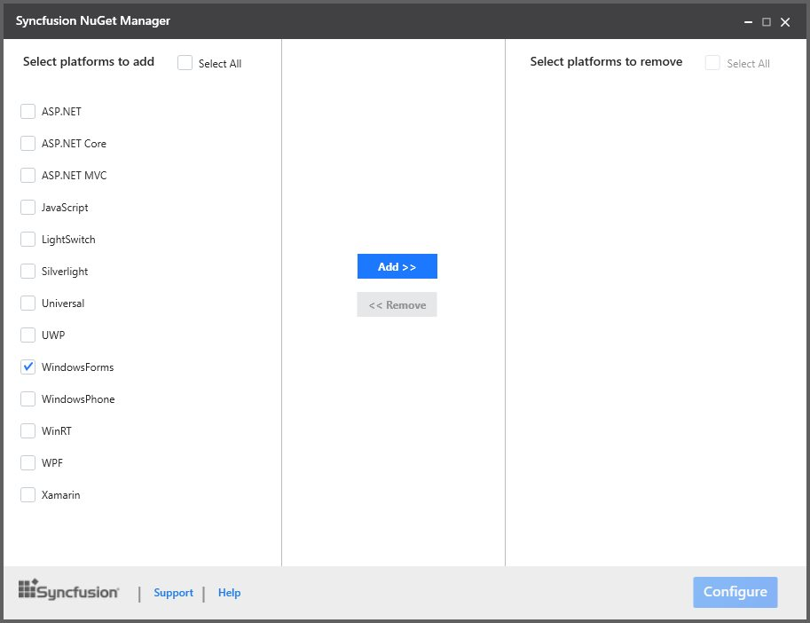
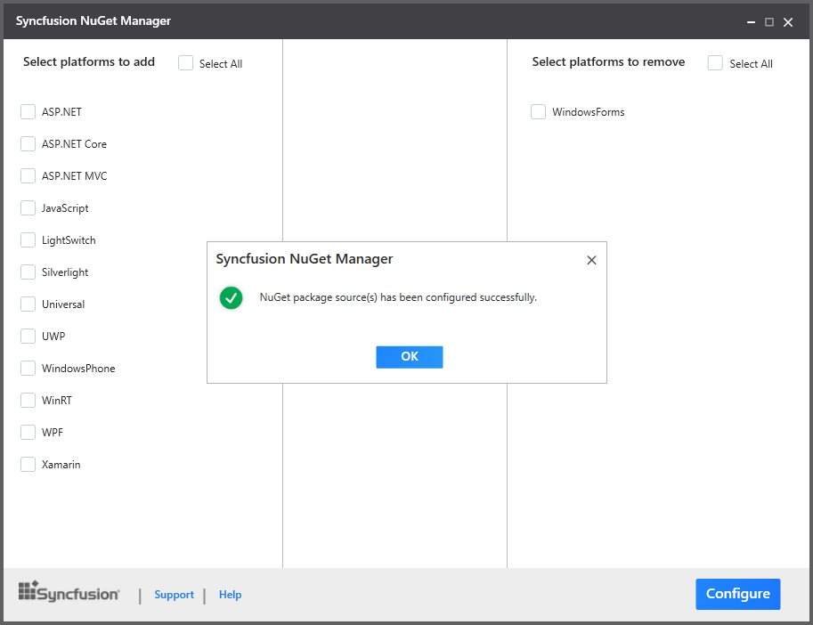
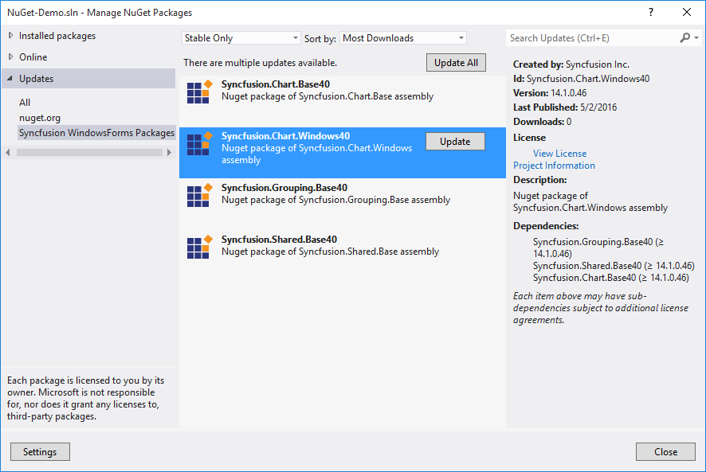

# Installation

## Manual Installation

The following procedure illustrates how to manually install Essential Studio for Windows Forms.

1. Double-click the Syncfusion Essential Studio Windows Forms Setup file. The Self-Extractor wizard opens and extracts the package automatically.
2. Enter “User Name”, “Organization” and “Unlock Key” in the corresponding text boxes provided.
3. Click “Next”.
4. After reading the terms, click “I accept the terms and conditions” check box.
5. Click Next. Then, Select the Installation and Samples Folder window opens.
6. To install it in the displayed default location, click “Install”.
7. Select the “Run Dashboard” check box to launch the Dashboard after installing.
8. Click "Finish". Essential Studio is installed in system and the Syncfusion Essential Studio [Dashboard](http://help.syncfusion.com/ug/common/documents/dashboard.htm#) is launched automatically.

## Configuring Syncfusion NuGet Packages in Visual Studio 

Syncfusion Windows Forms NuGet packages are available [here](http://nuget.syncfusion.com/package/windows-forms).

N> If you wish to use the Windows Forms NuGet packages then Essential Studio or Windows Forms platform installation not required to implement with Syncfusion Windows Forms controls. 

### NuGet Configuration  

Syncfusion NuGet Package feed links are configured in Visual Studio in the following ways,

1. Syncfusion NuGet Package Manager
2. NuGet Package Manager settings

#### Syncfusion NuGet Package Manager

The steps to configure the Syncfusion Windows Forms NuGet Packages in Visual Studio are as follows,

1. **Syncfusion NuGet Manager** is allows you to **add** the Syncfusion NuGet sources (for available platforms) to NuGet Package Manager. Download the [Syncfusion NuGet Manager](http://www.syncfusion.com/downloads/support/directtrac/general/ze/SyncfusionNugetManager-1610952973.zip) utility.
2. Extract zip file and run the SyncfusionNuGetManager.exe
3. Syncfusion NuGet Manager Window will be opened.
4. Select the platform **WindowsForms** from **“Select platforms to add”** (Left side of the window) column and click **Add>>** button. Then click **Configure** button.

   

5. Once Syncfusion NuGet Manager added the Syncfusion NuGet sources, the changes will be reflected in package sources of your Visual Studio. 

   

**Note:** Get the more details about Syncfusion NuGet Manager utility from [here](https://help.syncfusion.com/extension/syncfusion-nuget-packages/syncfusion-nuget-manager).

#### NuGet Package Manager settings

The steps to configure the Syncfusion Windows Forms NuGet Packages in Visual Studio are as follows,

1. In Visual Studio, navigate to `Tools | NuGet Package Manager | Package Manager Settings`, the options dialog will appear on the screen as shows below,

   

2. Select `NuGet Package Manager | Package Sources` and click `Add` button to add the `Package Name` and `Package Source` of Syncfusion NuGet Packages.    

   **Name**: Name of the package that listed in Available package sources  
   **Source**: Syncfusion Windows Forms NuGet Package feed URL 
   [http://nuget.syncfusion.com/windows-forms](http://nuget.syncfusion.com/windows-forms)
    
   

   N> The `Source` text box in the above image denotes the location of the NuGet packages and the `Name` section, allows you to provide a unique name for NuGet Packages Source.
    
I> Syncfusion other platforms NuGet packages feed links are available [here](http://nuget.syncfusion.com/)

### NuGet Installation

Syncfusion Windows Forms NuGet can install once configured the package source. The NuGet installation steps as below,

1. Once configured the Package source with Syncfusion NuGet Packages, right click on project and choose `Manage NuGet Packages | Online | <Package Source Name>`.

   

2. The NuGet Packages are listed which are available in package source location. Install the required packages to your application by clicking `Install` button.

   N> NuGet packages can be install directly through the **command line** (Package Manager Console). Further details click [here](http://help.syncfusion.com/extension/syncfusion-nuget-packages/nuget-install-and-configuration#install-from-package-manager-console).

### Updating a NuGet Package

Using the `Manage NuGet Packages` in Visual Studio, NuGet packages can be update.
 
1. Right click on Project and Navigate to the `Manage NuGet Packages` and click on the `Updates` tab to check for updates.

2. Select the `Updates -> <Syncfusion Package Source>`. Refer to the following screenshot for more information.

   

3. If there is a new version of NuGet you will see it in the list of available updates.

4. Select NuGet Package in the list and click `Update`. When the update is complete, close and re-open all open instances of Visual Studio.

   N> By clicking `Update All` button, all NuGet packages are getting update. When the update is complete, close and re-open all open instances of Visual Studio.

## Command Line installation

Follow the given steps to install through Command Line in Silent mode.

1. Double-click the “Syncfusion Essential Studio” Setup file. The Self-Extractor wizard opens and extracts the package automatically.
2. The SyncfusionEssentialStudio_({{ site.releaseversion }}).exe file is extracted into the Temp folder.
3. Run %temp%. The Temp folder opens. The SyncfusionEssentialStudio_({{ site.releaseversion }}).exe file is available in one of the folders.
4. Copy the SyncfusionEssentialStudio_({{ site.releaseversion }}).exe file in local drive. Example: D:\temp
5. Cancel the wizard.
6. Open Command Prompt in administrator mode and pass the following arguments for corresponding version.





“Setup file path\SyncfusionEssentialStudio_({{ site.releaseversion }}).exe” Install /PIDKEY:“(product unlock key)” [/log “{Log file path}”] [/InstallPath:{Location to install}]





N> In above section, Latest Essential Studio version details has been provided. User can refer installed Essential Studio version instead of mentioned version.

