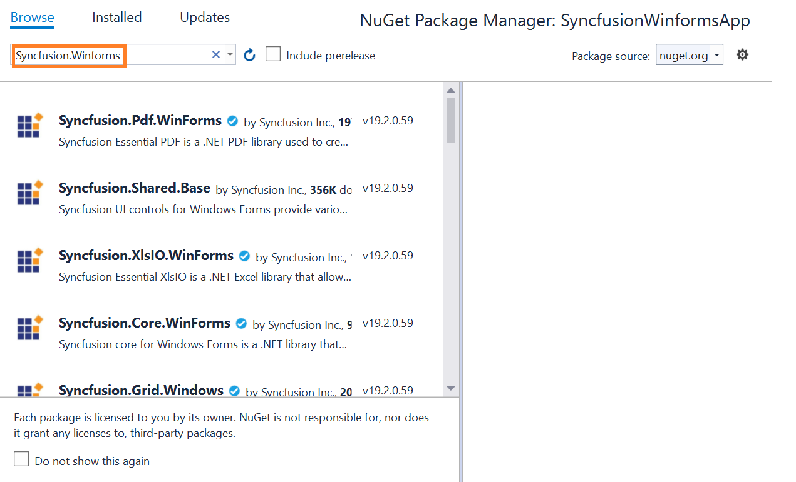

# Install Syncfusion Winforms NuGet packages

## Overview

**NuGet** is a Package management system for Visual Studio. It makes it easy to add, update and remove external libraries in our application. Syncfusion publishing all Winforms  NuGet packages in [nuget.org](https://www.nuget.org/packages?q=Tags%3A%22AspNet.Core%20EJ2%22+syncfusion). The Syncfusion Winforms NuGet packages can be used without installing the Syncfusion installation. You can simply exploit the Syncfusion Winforms NuGet packages in Winfows Forms application to develop with the Syncfusion Winforms components.

> From v16.2.0.46 (2018 Volume 2 Service Pack 1) onwards, all the Syncfusion Winforms components are available as NuGet packages at nuget.org.

## Installation using Package Manager UI

The NuGet **Package Manager UI** allows you to search, install, uninstall, and update Syncfusion Winforms NuGet packages in your applications and solutions. You can find and install the Syncfusion Winforms NuGet packages in your Visual Studio Winforms web application and this process is easy with the steps below:

1. Right-click on the Winforms web application or solution in the Solution Explorer, and choose **Manage NuGet Packages...**

    

    As an alternative, after opening the Winforms web application in Visual Studio, go to the **Tools** menu and after hovering **NuGet Package Manager**, select **Manage NuGet Packages for Solution...**

2. The Manage NuGet Packages window will open. Navigate to the **Browse** tab, then search for the Syncfusion Winforms NuGet packages using a term like **"Syncfusion.Winforms"** and select the appropriate Syncfusion Winforms NuGet package for your development.

    > The [nuget.org](https://api.nuget.org/v3/index.json) package source is selected by default in the Package source drop-down. If your Visual Studio does not have nuget.org configured, follow the instructions in the [Microsoft documents](https://docs.microsoft.com/en-us/nuget/tools/package-manager-ui#package-sources) to set up the nuget.org feed URL.

    

3. When you select a package, the right side panel will provide more information about it.

4. By default, the package selected with latest version. You can choose the required version and click the **Install** button and accept the license terms. The package will be added to your Winforms application.

    

5. At this point, your application has all the required Syncfusion assemblies, and you will be ready to start building high-performance, responsive app with [Syncfusion Winforms components](https://www.syncfusion.com/winforms-ui-controls). Also, you can refer to the [Syncfusion Winforms help document](https://help.syncfusion.com/windowsforms/overview) for development.

## Installation using Dotnet (.NET) CLI

The [dotnet Command Line Interface (CLI)](https://docs.microsoft.com/en-us/nuget/consume-packages/install-use-packages-dotnet-cli), allows you to add, restore, pack, publish, and manage packages without making any changes to your application files. [Dotnet add package](https://docs.microsoft.com/en-us/dotnet/core/tools/dotnet-add-package?tabs=netcore2x) adds a package reference to the application file, then runs [dotnet restore](https://docs.microsoft.com/en-us/dotnet/core/tools/dotnet-restore?tabs=netcore2x) to install the package.

Follow the below instructions to use the dotnet CLI command to install the Syncfusion Winforms NuGet packages.

1. Open a command prompt and navigate to the directory where your Syncfusion Winforms project file is located.
2. To install a NuGet package, run the following command.

    ```dotnet add package <Package name>```

    **For Example:**
    dotnet add package Syncfusion.Grid.Windows

    > If you don’t provide a version flag, this command will be upgrading to the latest version by default. To specify a version, add the -v parameter: dotnet add package Syncfusion.Grid.Windows -v 19.2.0.57.

3. Examine the Syncfusion Winforms project file after the command has completed to ensure that the Syncfusion Winforms package was installed. To see the added reference, open the .csproj file.

    

4. Then run  [dotnet restore](https://docs.microsoft.com/en-us/dotnet/core/tools/dotnet-restore?tabs=netcore2x) command to restores all the packages listed in the application file.

    > Restoring is done automatically with **dotnet build** and **dotnet run** in .NET Core 2.0 and later.

5. At this point, your application has all the required Syncfusion assemblies, and you will be ready to start building high-performance, responsive app with [Syncfusion Winforms components](https://www.syncfusion.com/winforms-ui-controls). Also, you can refer to the [Syncfusion Winforms help document](https://help.syncfusion.com/windowsforms/overview) for development.

## Installation using Package Manager Console

The **Package Manager Console** saves NuGet packages installation time since you don't have to search for the Syncfusion Winforms NuGet package which you want to install, and you can just type the installation command to install the appropriate Syncfusion Winforms NuGet package. Follow the instructions below to use the Package Manager Console to reference the Syncfusion Winforms component as NuGet packages in your Winforms web application.

1. To show the Package Manager Console, open your Winforms web application in Visual Studio and navigate to **Tools -> NuGet Package Manager -> Package Manager Console**.

    

2. The **Package Manager Console** will be shown at the bottom of the screen. You can install the Syncfusion Winforms NuGet packages by enter the following NuGet installation commands.

    ***Install specified Syncfusion Winforms NuGet package.***

    The below command will install the Syncfusion Winforms NuGet package in the default ASP.NET Core application.

    ```Install-Package <Package Name>```

    **For example:** Install-Package Syncfusion.Grid.Windows

    > You can find the list of Syncfusion Winforms NuGet packages which are published in nuget.org from [here](https://www.nuget.org/packages?q=Tags%3A%22winforms%22+syncfusion)

    ***Install specified Syncfusion Winforms NuGet package in specified Winforms application***

    The below command will install the Syncfusion Winforms NuGet package in the given ASP.NET Core application.

    ```Install-Package <Package Name> - ProjectName <Project Name>```

    **For example:** Install-Package Syncfusion.Grid.Windows -ProjectName SyncfusionWinformsApp

3. By default, the package will be installed with latest version. You can give the required version with the -Version term like below to install the Syncfusion Winforms NuGet packages in the appropriate version.

    ```Install-Package Syncfusion.Grid.Windows -Version 19.2.0.59```

    

4. The NuGet package manager console will install the Syncfusion Winforms NuGet package as well as the dependencies it has. When the installation is complete, the console will show that your Syncfusion Winforms package has been successfully added to the application.

5. At this point, your application has all the required Syncfusion assemblies, and you will be ready to start building high-performance, responsive app with [Syncfusion Winforms components](https://www.syncfusion.com/winforms-ui-controls). Also, you can refer to the [Syncfusion Winforms help document](https://help.syncfusion.com/windowsforms/overview) for development.