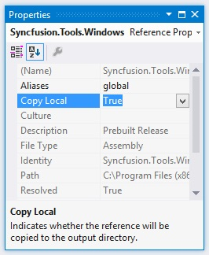

# Installation

## Manual Installation

The following procedure illustrates how to install Essential Studio.

1. Double-click the Syncfusion Essential Studio Windows Forms Setup file. The Self-Extractor wizard opens and extracts the package automatically.
2. Enter User Name, Organization and Unlock Key in the corresponding text boxes provided.
3. Click Next.
4. After reading the terms, click “I accept the terms and conditions” check box.
5. Click Next. Then, Select the Installation and Samples Folder window opens.
6. To install it in the displayed default location, click Install.
7. Select the Run Dashboard check box to launch the Dashboard after installing.
8. Click Finish. Essential Studio is installed in your system and the Syncfusion Essential Studio [Dashboard](http://help.syncfusion.com/ug/common/documents/dashboard.htm#) is launched automatically.

## Nuget Installation

Refer to the Syncfusion Nuget Packages from the Visual Studio applications. The following steps help you add the reference of the Syncfusion assemblies in the Project References.

1) Right-click the Project and choose the Manage NuGet Packages.  
2) Select Online. Refer to the following screenshot for more information. 

3) Install the required corresponding framework control to use in Visual Studio projects. You can install the dependent assemblies when required. The framework numbers at the end of package name like, 35, 40, and 45, 451 are added.  
4) Find the installed Syncfusion Packages in the Directory location of the solution file of the created project, Syncfusion Packages.  
5) You can [configure](http://help.syncfusion.com/extension/syncfusion-nuget-packages/overview) Nuget for the required purpose.  

## Command Line installation

Follow the given steps to install through Command Line in Silent mode.

1. Double-click the Syncfusion Essential Studio Setup file. The Self-Extractor wizard opens and extracts the package automatically.
2. The SyncfusionEssentialStudio_({{ site.releaseversion }}).exe file is extracted into the Temp folder.
3. Run %temp%. The Temp folder opens. The SyncfusionEssentialStudio_({{ site.releaseversion }}).exe file is available in one of the folders.
4. Copy the SyncfusionEssentialStudio_({{ site.releaseversion }}).exe file in local drive. Example: D:\temp
5. Cancel the wizard.
6. Open Command Prompt in administrator mode and pass the following arguments for corresponding version.

“Setup file path\SyncfusionEssentialStudio_({{ site.releaseversion }}).exe” Install /PIDKEY:“(product unlock key)” [/log “{Log file path}”] [/InstallPath:{Location to install}]

N> In above section, Latest Essential Studio version details has been provided. User can refer installed Essential Studio version instead of mentioned version.

# Deployment

## Copy Local

X-copy is supported by the Syncfusion assembly reference in the Solutions Explorer. It can be achieved by setting its Copy Local property of the reference to "True". So, that the Syncfusion assemblies are copied to the Release/Bin, Debug/Bin folders. This deployment consists of copying the exe, dlls and xmls files to the client machines similar to that of manual copy.

## GAC

Through Syncfusion installer, Syncfusion assemblies are installed in the GAC of the developer machines. Also Syncfusion's [AssemblyManager](http://help.syncfusion.com/common/essential-studio/utilities#assembly-manager) helps you add or remove the Syncfusion assemblies to or from GAC.

## Installed Location

The following table represents Assemblies/ Samples and its installed location

<table>
<tr>
<th>
Assemblies/ Samples  </th><th>
Installed location  </th></tr>
<tr>
<td>
GAC  </td><td>
C:\Windows\Microsoft.NET\assembly\GAC_MSIL  </td></tr>
<tr>
<td>
Assemblies  </td><td>
C:\Program Files (x86)\Syncfusion\Essential Studio\{{ site.releaseversion }}\Assemblies  </td></tr>
<tr>
<td>
Precompiled Assemblies  </td><td>
C:\Program Files (x86)\Syncfusion\Essential Studio\{{ site.releaseversion }}\precompiledassemblies  </td></tr>
<tr>
<td>
Samples  </td><td>
[Installed Drive]:\Users[user name]\AppData\Local\Syncfusion\EssentialStudio\{{ site.releaseversion }}\samples\Windows  </td></tr>
</table>

N> In above section, Latest Essential Studio version details has been provided. User can refer installed Essential Studio version instead of mentioned version.