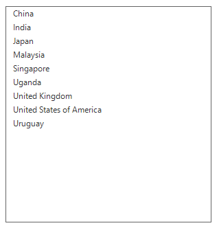
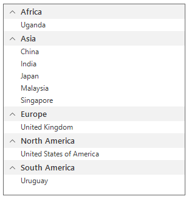

# Filtering
This section explains how to filter the data and its related operations in the SfListView.

## Programmatic Filtering
The SfListView supports to filter the data by setting the [SfListView.View.Filter](https://help.syncfusion.com/cr/windowsforms/Syncfusion.DataSource.DataSource.html#Syncfusion_DataSource_DataSource_Filter) property. You have to call the [SfListView.View.RefreshFilter()](//help.syncfusion.com/cr/windowsforms/Syncfusion.DataSource.WinForms~Syncfusion.DataSource.DataSource~RefreshFilter.html) method after assigning the Filter Property for refreshing the view.

The [FilterChanged](https://help.syncfusion.com/cr/windowsforms/Syncfusion.DataSource.DataSource.html) event is raised once filtering is applied to the [SfListView](https://help.syncfusion.com/cr/windowsforms/Syncfusion.WinForms.ListView.SfListView.html).                                   



listView.View.Filter = CustomFilter;
listView.View.RefreshFilter();
public bool CustomFilter(object obj)
{
   if ((obj as CountryInfo).Continent == "Asia" || (obj as CountryInfo).Continent == "North America" || (obj as CountryInfo).Continent == "Oceania")
       return true;
   return false;
}


listView.View.Filter = AddressOf CustomFilter
listView.View.RefreshFilter()
public Boolean CustomFilter(Object obj)
   If (TryCast(obj, CountryInfo)).Continent = "Asia" OrElse (TryCast(obj, CountryInfo)).Continent = "North America" OrElse (TryCast(obj, CountryInfo)).Continent = "Oceania" Then
	   Return True
   End If
   Return False



## Filter based on multiple criteria
The SfListView allows filtering the items based on multiple criteria.



sfListView1.View.Filter = FilterOnMultipleCriteria;
sfListView1.View.RefreshFilter();
public bool FilterOnMultipleCriteria (object obj)
{
   if ((obj as CountryInfo).Continent == "Asia" || (obj as CountryInfo).CountryName[0].ToString().Equals("U"))
        return true;
   return false;
}


sfListView1.View.Filter = AddressOf FilterOnMultipleCriteria
sfListView1.View.RefreshFilter()
public Boolean FilterOnMultipleCriteria (Object obj)
   If (TryCast(obj, CountryInfo)).Continent = "Asia" OrElse (TryCast(obj, CountryInfo)).CountryName(0).ToString().Equals("U") Then
		Return True
   End If
   Return False



## Getting the filtered data                                                                                         
You can get the filtered items from the view and modify it in the [SfListView.View.FilterChanged](https://help.syncfusion.com/cr/windowsforms/Syncfusion.DataSource.DataSource.html) event. When filter is applied, the filtered items are available in the [SfListView.View.DisplayItems](https://help.syncfusion.com/cr/windowsforms/Syncfusion.DataSource.DataSource.html#Syncfusion_DataSource_DataSource_DisplayItems).



sfListView1.View.FilterChanged += new NotifyCollectionChangedEventHandler(View_FilterChanged);
private void View_FilterChanged(object sender, NotifyCollectionChangedEventArgs e)
{
   ObservableCollection<object> country = new ObservableCollection<object>();
   var items = (sender as DataSource).DisplayItems;
   foreach (var item in items)
     country.Add(item);
}



AddHandler sfListView1.View.FilterChanged, AddressOf View_FilterChanged
Private Sub View_FilterChanged(ByVal sender As Object, ByVal e As NotifyCollectionChangedEventArgs)
   Dim country As New ObservableCollection(Of Object)()
   Dim items = (TryCast(sender, DataSource)).DisplayItems
   For Each item In items
	 country.Add(item)
   Next item
End Sub


            
## Clear filtering
The SfListView allows clearing the filters by setting the [View.Filter](//help.syncfusion.com/cr/windowsforms/Syncfusion.DataSource.WinForms~Syncfusion.DataSource.DataSource~Filter.html) to null and call the [View.RefreshFilter](https://help.syncfusion.com/cr/windowsforms/Syncfusion.DataSource.DataSource.html#Syncfusion_DataSource_DataSource_RefreshFilter) method.



sfListView1.View.Filter = null;
sfListView1.View.RefreshFilter();


sfListView1.View.Filter = null
sfListView1.View.RefreshFilter()



## Sort the filtered items                  
Order of the filtered items can be rearranged in the [FilterChanged](https://help.syncfusion.com/cr/windowsforms/Syncfusion.DataSource.DataSource.html) event by adding [SortDescriptor](https://help.syncfusion.com/cr/windowsforms/Syncfusion.DataSource.SortDescriptor.html).



sfListView1.View.FilterChanged += new NotifyCollectionChangedEventHandler(View_FilterChanged);
private void View_FilterChanged(object sender, NotifyCollectionChangedEventArgs e)
{
    sfListView1.View.GroupDescriptors.Add(new GroupDescriptor()
    {
        PropertyName = "Continent",
    });
    sfListView1.View.SortDescriptors.Add(new SortDescriptor()
    {
        PropertyName = "Continent",
        Direction = Syncfusion.DataSource.ListSortDirection.Ascending,
    });
}


AddHandler sfListView1.View.FilterChanged, AddressOf View_FilterChanged
Private Sub View_FilterChanged(ByVal sender As Object, ByVal e As NotifyCollectionChangedEventArgs)
   Private Function Syncfusion.DataSource.GroupDescriptor() As sfListView1.View.GroupDescriptors.Add(Shadows
        .PropertyName = "Continent"
   End Function
   )
    Private Function Syncfusion.DataSource.SortDescriptors() As sfListView1.View.SortDescriptors.Add(Shadows
        .PropertyName = "Continent",
        .Direction = Syncfusion.DataSource.ListSortDirection.Ascending,
   End Function
   )
End Sub



