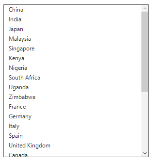
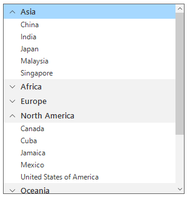
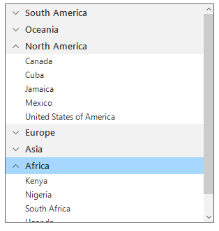
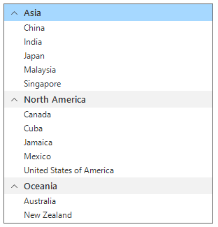

# Getting Started with Windows Forms ListView (SfListView)
This section provides a quick overview for getting started with SfListView for WinForms. Walk through the entire process of creating the real world SfListView. 

## Assembly Deployment
Refer [control dependencies](https://help.syncfusion.com/windowsforms/control-dependencies#sflistview) section to get the list of assemblies or NuGet package needs to be added as reference to use the control in any application. 

## Creating Application with SfListView control
In this walk through, user will create WinForms application that contains SfListView control.

### Creating the Project
Create a new Windows Forms project in Visual Studio to display the SfListView with data objects.

### Adding Control via Designer
The SfListView control can be added to the application by dragging it from the toolbox and dropping it in designer. The required assembly references will be added automatically.

### Adding Control in Code
To add control manually, follow the steps:

1. Add the following required assembly references to the project:

    * 	Syncfusion.Core.WinForms

    *	Syncfusion.DataSource.WinForms

    * 	Syncfusion.GridCommon.WinForms

    *   Syncfusion.SfListView.WinForms

2.  Create the SfListView control instance and add it to the form.   




using Syncfusion.WinForms.ListView;

namespace WindowsFormsApplication1
{
    public partial class Form1 : Form
    {
        public Form1()
        {
            InitializeComponent();
            SfListView sfListView1 = new SfListView ();
            sfListView1.Location = new Point(100, 100);
            sfListView1.Size = new Size(300,320);
            this.Controls.Add(sfListView1);
        }
    }
}


Imports Syncfusion.WinForms.ListView

Namespace WindowsFormsApplication1
	Partial Public Class Form1
		Inherits Form
		Public Sub New()
			InitializeComponent()
			Dim listView As New SfListView()
            listView.Location = New Point(100,100)
            listView.Size = New Size(300,320)
            Me.Controls.Add(listView)   
		End Sub
	End Class
End Namespace



{{ codesnippet1 | OrderList_Indent_Level_1 }}

### Creating data for sample application

To create the data for sample application, follow the steps:

1. Create a data object class, name it as “CountryInfo” and declare the properties.





public class CountryInfo
{
   public string CountryName { get; set; }
   public string Continent { get; set; }
 }



Public Class CountryInfo
   Public Property CountryName() As String
   Public Property Continent() As String
 End Class
 
 
 
 {{ codesnippet2 | OrderList_Indent_Level_1 }}
 
2. Create a List<CountryInfo> collection initialized in GetDataSource method to add several data objects.

     



public List<CountryInfo> GetDataSource()
{
    List<CountryInfo> countryInfoCollection = new List<CountryInfo>();
    countryInfoCollection.Add(new CountryInfo() { CountryName = "China", Continent = "Asia" });
    countryInfoCollection.Add(new CountryInfo() { CountryName = "India", Continent = "Asia" });
    countryInfoCollection.Add(new CountryInfo() { CountryName = "Japan", Continent = "Asia" });
    countryInfoCollection.Add(new CountryInfo() { CountryName = "Malaysia", Continent = "Asia" });
    countryInfoCollection.Add(new CountryInfo() { CountryName = "Singapore", Continent = "Asia" });
    countryInfoCollection.Add(new CountryInfo() { CountryName = "Kenya", Continent = "Africa" });
    countryInfoCollection.Add(new CountryInfo() { CountryName = "Nigeria", Continent = "Africa" });
    countryInfoCollection.Add(new CountryInfo() { CountryName = "South Africa", Continent = "Africa" });
    countryInfoCollection.Add(new CountryInfo() { CountryName = "Uganda", Continent = "Africa" });
    countryInfoCollection.Add(new CountryInfo() { CountryName = "Zimbabwe", Continent = "Africa" });
    countryInfoCollection.Add(new CountryInfo() { CountryName = "France", Continent = "Europe" });
    countryInfoCollection.Add(new CountryInfo() { CountryName = "Germany", Continent = "Europe" });
    countryInfoCollection.Add(new CountryInfo() { CountryName = "Italy", Continent = "Europe" });
    countryInfoCollection.Add(new CountryInfo() { CountryName = "Spain", Continent = "Europe" });
    countryInfoCollection.Add(new CountryInfo() { CountryName = "United Kingdom", Continent = "Europe" });
    countryInfoCollection.Add(new CountryInfo() { CountryName = "Canada", Continent = "North America" });
    countryInfoCollection.Add(new CountryInfo() { CountryName = "Cuba", Continent = "North America" });
    countryInfoCollection.Add(new CountryInfo() { CountryName = "Jamaica", Continent = "North America" });
    countryInfoCollection.Add(new CountryInfo() { CountryName = "Mexico", Continent = "North America" });
    countryInfoCollection.Add(new CountryInfo() { CountryName = "United States of America", Continent = "North America" });
    countryInfoCollection.Add(new CountryInfo() { CountryName = "Australia", Continent = "Oceania" });
    countryInfoCollection.Add(new CountryInfo() { CountryName = "New Zealand", Continent = "Oceania" });
    countryInfoCollection.Add(new CountryInfo() { CountryName = "Argentina", Continent = "South America" });
    countryInfoCollection.Add(new CountryInfo() { CountryName = "Brazil", Continent = "South America" });
    countryInfoCollection.Add(new CountryInfo() { CountryName = "Chile", Continent = "South America" });
    countryInfoCollection.Add(new CountryInfo() { CountryName = "Colombia", Continent = "South America" });
    countryInfoCollection.Add(new CountryInfo() { CountryName = "Uruguay", Continent = "South America" });
    return countryInfoCollection;
  }



Public Function GetDataSource() As List(Of CountryInfo)
	Dim countryInfoCollection As New List(Of CountryInfo)()
	countryInfoCollection.Add(New CountryInfo() With {.CountryName = "China", .Continent = "Asia"})
	countryInfoCollection.Add(New CountryInfo() With {.CountryName = "India", .Continent = "Asia"})
	countryInfoCollection.Add(New CountryInfo() With {.CountryName = "Japan", .Continent = "Asia"})
	countryInfoCollection.Add(New CountryInfo() With {.CountryName = "Malaysia", .Continent = "Asia"})
	countryInfoCollection.Add(New CountryInfo() With {.CountryName = "Singapore", .Continent = "Asia"})
	countryInfoCollection.Add(New CountryInfo() With {.CountryName = "Kenya", .Continent = "Africa"})
	countryInfoCollection.Add(New CountryInfo() With {.CountryName = "Nigeria", .Continent = "Africa"})
	countryInfoCollection.Add(New CountryInfo() With {.CountryName = "South Africa", .Continent = "Africa"})
	countryInfoCollection.Add(New CountryInfo() With {.CountryName = "Uganda", .Continent = "Africa"})
	countryInfoCollection.Add(New CountryInfo() With {.CountryName = "Zimbabwe", .Continent = "Africa"})
	countryInfoCollection.Add(New CountryInfo() With {.CountryName = "France", .Continent = "Europe"})
	countryInfoCollection.Add(New CountryInfo() With {.CountryName = "Germany", .Continent = "Europe"})
	countryInfoCollection.Add(New CountryInfo() With {.CountryName = "Italy", .Continent = "Europe"})
	countryInfoCollection.Add(New CountryInfo() With {.CountryName = "Spain", .Continent = "Europe"})
	countryInfoCollection.Add(New CountryInfo() With {.CountryName = "United Kingdom", .Continent = "Europe"})
	countryInfoCollection.Add(New CountryInfo() With {.CountryName = "Canada", .Continent = "North America"})
	countryInfoCollection.Add(New CountryInfo() With {.CountryName = "Cuba", .Continent = "North America"})
	countryInfoCollection.Add(New CountryInfo() With {.CountryName = "Jamaica", .Continent = "North America"})
	countryInfoCollection.Add(New CountryInfo() With {.CountryName = "Mexico", .Continent = "North America"})
	countryInfoCollection.Add(New CountryInfo() With {.CountryName = "United States of America", .Continent = "North America"})
	countryInfoCollection.Add(New CountryInfo() With {.CountryName = "Australia", .Continent = "Oceania"})
	countryInfoCollection.Add(New CountryInfo() With {.CountryName = "New Zealand", .Continent = "Oceania"})
	countryInfoCollection.Add(New CountryInfo() With {.CountryName = "Argentina", .Continent = "South America"})
	countryInfoCollection.Add(New CountryInfo() With {.CountryName = "Brazil", .Continent = "South America"})
	countryInfoCollection.Add(New CountryInfo() With {.CountryName = "Chile", .Continent = "South America"})
	countryInfoCollection.Add(New CountryInfo() With {.CountryName = "Colombia", .Continent = "South America"})
	countryInfoCollection.Add(New CountryInfo() With {.CountryName = "Uruguay", .Continent = "South America"})
	Return countryInfoCollection
End Function



{{ codesnippet3 | OrderList_Indent_Level_1 }}
 
### Binding to data

To bind the SfListView to data, set the [SfListView.DataSource](https://help.syncfusion.com/cr/windowsforms/Syncfusion.WinForms.ListView.SfListView.html#Syncfusion_WinForms_ListView_SfListView_DataSource) property to an `IEnumerable` implementation.
You can bind a property of the underlying data source to display the SfListView by using the [DisplayMember](https://help.syncfusion.com/cr/windowsforms/Syncfusion.WinForms.ListView.SfListView.html#Syncfusion_WinForms_ListView_SfListView_DisplayMember) property. 
 



sfListView1.DataSource = GetDataSource();
sfListView1.DisplayMember = "CountryName";  



sfListView1.DataSource = GetDataSource()
sfListView1.DisplayMember = "CountryName"  




## Grouping
The Windows Forms ListView (SfListView) allows displaying the items in a group by using the [SfListView.View.GroupDescriptors](https://help.syncfusion.com/cr/windowsforms/Syncfusion.DataSource.DataSource.html#Syncfusion_DataSource_DataSource_GroupDescriptors) property. Create a [GroupDescriptor](https://help.syncfusion.com/cr/windowsforms/Syncfusion.DataSource.GroupDescriptor.html) for the property to be grouped and add it in the View.GroupDescriptors collection.

GroupDescriptor object holds the following properties:

    •	`PropertyName`: Describes name of the property to be grouped.

    •	`KeySelector`: Describes selector to return the group key.

    •	`Comparer`: Describes comparer to be applied when sorting takes place.

 


listView.View.GroupDescriptors.Add(new GroupDescriptor()
{
   PropertyName = "Continent",                     
});



listView.View.GroupDescriptors.Add(New GroupDescriptor() With {.PropertyName = “  Continent ”})



{{ codesnippet4 | OrderList_Indent_Level_1 }}

## Sorting
The SfListView allows sorting on its data by using the [SfListView.View.SortDescriptors](https://help.syncfusion.com/cr/windowsforms/Syncfusion.DataSource.DataSource.html#Syncfusion_DataSource_DataSource_SortDescriptors) property. Create a [SortDescriptor](https://help.syncfusion.com/cr/windowsforms/Syncfusion.DataSource.SortDescriptor.html) for the property to be sorted and add it into the View.SortDescriptors collection.

SortDescriptor object holds the following three properties:

    •	`PropertyName`: Describes name of the sorted property.

    •	`Direction`: Describes an object of type `ListSortDirection` defines the sorting direction.

    •	`Comparer`: Describes a comparer to be applied when sorting takes place.



listView.View.SortDescriptors.Add(new SortDescriptor()
{
   PropertyName = "Continent",
   Direction = ListSortDirection.Descending,
});


listView.View.SortDescriptors.Add(New SortDescriptor() With {.PropertyName = “Continent”, .Direction = ListSortDirection.Descending})



## Filtering
The SfListView support to filter the records in view by setting predicate to the [SfListView.View.Filter](https://help.syncfusion.com/cr/windowsforms/Syncfusion.DataSource.DataSource.html#Syncfusion_DataSource_DataSource_Filter) property. Call the [View.RefreshFilter](https://help.syncfusion.com/cr/windowsforms/Syncfusion.DataSource.DataSource.html#Syncfusion_DataSource_DataSource_RefreshFilter) method after assigning the Filter property for refreshing the view.
To filter the items based on the Continent property of the underlying data, follow the code example.



listView.View.Filter = CustomFilter;
listView.View.RefreshFilter();
public bool CustomFilter(object obj)
{
    if ((obj as Country).Continent == "Asia" || (obj as Country).Continent == "North America" || (obj as Country).Continent == "Oceania")
        return true;
    return false;
}


listView.View.Filter = AddressOf CustomFilter
listView.View.RefreshFilter()
public Boolean CustomFilter(Object obj)
  If (TryCast(obj, Country)).Continent = "Asia" OrElse (TryCast(obj, Country)).Continent = "North America" OrElse (TryCast(obj, Country)).Continent = "Oceania" Then
	Return True
  End If
  Return False



## Selection
SfListView selects an item by setting the [SfListView.SelectionMode](https://help.syncfusion.com/cr/windowsforms/Syncfusion.WinForms.ListView.SfListView.html#Syncfusion_WinForms_ListView_SfListView_SelectionMode) property to One, MultiSimple, MultiExtended, and None based on the requirements. Selected item information can be tracked by using the [SfListView.SelectedItem](https://help.syncfusion.com/cr/windowsforms/Syncfusion.WinForms.ListView.SfListView.html#Syncfusion_WinForms_ListView_SfListView_SelectedItem), [SfListView.SelectedIndex](https://help.syncfusion.com/cr/windowsforms/Syncfusion.WinForms.ListView.SfListView.html#Syncfusion_WinForms_ListView_SfListView_SelectedIndex), and [SfListView.SelectedItems](https://help.syncfusion.com/cr/windowsforms/Syncfusion.WinForms.ListView.SfListView.html#Syncfusion_WinForms_ListView_SfListView_SelectedItems) properties. 

The selection operations can be handled with the help of [SelectionChanging](https://help.syncfusion.com/cr/windowsforms/Syncfusion.WinForms.ListView.SfListView.html#Syncfusion_WinForms_ListView_SfListView_SelectionChanging) and [SelectionChanged](https://help.syncfusion.com/cr/windowsforms/Syncfusion.WinForms.ListView.SfListView.html#Syncfusion_WinForms_ListView_SfListView_SelectionChanged) events of the SfListView.



    listView.SelectionMode = SelectionMode.One;


    listView.SelectionMode = SelectionMode.One



