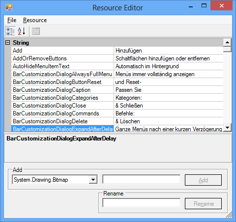
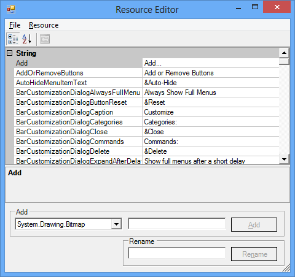
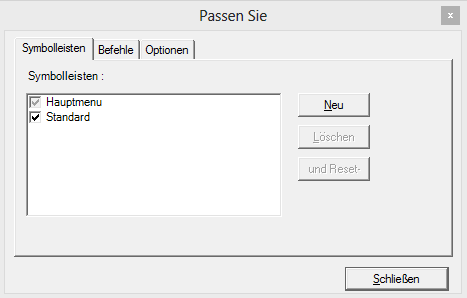
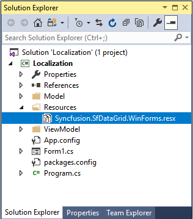
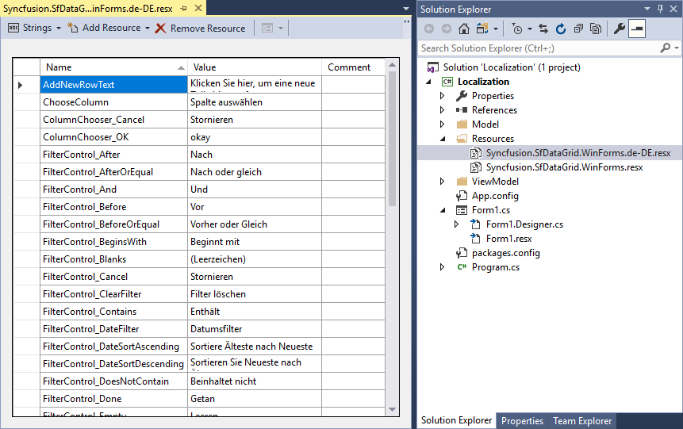
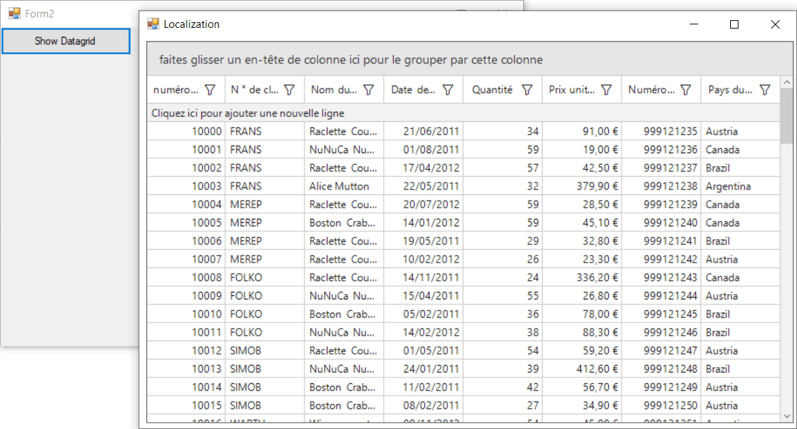

# Localization of Syncfusion WF Controls

Localization is the process of making application multilingual by formatting the content according to the cultures. This involves configuring the application for a specific language. Culture is the combination of language and location. For example, `en-US` is the culture for English spoken in United States; `en-GB` is the culture for English spoken in Great Britain.

Syncfusion components support localization and have their own neutral resources. These resources can be localized as per the customer requirement and they can be localized in three ways are, 

* Using `ILocalizationProvider`
* Using Satellite Assemblies
* Using .resx file
 
## Using ILocalizationProvider

The following procedure helps to localize the `FindDialogBox` in the Edit Control:

1)   Include the required namespaces at the beginning of the source file.





using Syncfusion.Windows.Forms;
using Syncfusion.Windows.Forms.Edit;





Imports Syncfusion.Windows.Forms
Imports Syncfusion.Windows.Forms.Edit





2)   Create a class that implements the `ILocalizationProvider` interface defined in the Syncfusion.Windows.Forms namespace in the Syncfusion.Shared.Base.dll.

3)   Return the localized versions of the strings corresponding to the string identifiers.

4)   String identifiers are defined in the `ResourceIdentifiers` and the `EditResourceIdentifiers` classes in Syncfusion.Shared.Base and Syncfusion.Edit.Windows assemblies respectively.





using Syncfusion.Windows.Forms.Localization.Localizer.EditResourceIdentifiers;
using Syncfusion.Windows.Forms.ResourceIdentifiers;





Imports Syncfusion.Windows.Forms.Localization.Localizer.EditResourceIdentifiers
Imports Syncfusion.Windows.Forms.ResourceIdentifiers





5)   Leave an empty string for the rest of the identifiers that are not involved in the localization. These identifiers are loaded with a default value.

6)   Assign this instance to the `Provider` property of the `LocalizationProvider` class before the InitializeComponent call in the constructor of the application.





LocalizationProvider.Provider = new Localizer();





LocalizationProvider.Provider = New Localizer()



  

7)   The following code example is a reference to assign Localization string





public string GetLocalizedString(System.Globalization.CultureInfo culture, string name,object obj)
{
    switch (name)
    {
        case Localizer.EditResourceIdentifiers.FDbtnClose:
             return "schließen";
        case Localizer.EditResourceIdentifiers.FDbtnFind:
             return "finden";
        case Localizer.EditResourceIdentifiers.FDbtnMarkAll:
             return "markieren Sie alle";
        case Localizer.EditResourceIdentifiers.FDchkCase:
             return "übereinstimmen Fall";
        case Localizer.EditResourceIdentifiers.FDchkHidden:
             return "Suche hidden";
        case Localizer.EditResourceIdentifiers.FDchkRegular:
             return "Suche regelmäßige";
        case Localizer.EditResourceIdentifiers.FDchkUp:
             return "Suche Up";
        case Localizer.EditResourceIdentifiers.FDchkWholeWord:
             return "Ganzes Wort";
        case Localizer.EditResourceIdentifiers.FDchkWrap:
             return "Zeilenumbruch";
        case Localizer.EditResourceIdentifiers.FDGroupTitle:
             return "Suchen";
        case Localizer.EditResourceIdentifiers.FDMain:
             return "Startseite";
        case Localizer.EditResourceIdentifiers.FDrdbDocument:
             return "Document";
        case Localizer.EditResourceIdentifiers.FDrdbSelection:
             return "Auswahl";
        case Localizer.EditResourceIdentifiers.FDTitle:
             return "Kommentar";
        default:
             return string.Empty;
    }
}





Public Function GetLocalizedString(ByVal culture As System.Globalization.CultureInfo, ByVal name As String, ByVal obj As Object) As String
	Select Case name
		Case Localizer.EditResourceIdentifiers.FDbtnClose
		     Return "schließen"
		Case Localizer.EditResourceIdentifiers.FDbtnFind
		     Return "finden"
		Case Localizer.EditResourceIdentifiers.FDbtnMarkAll
		     Return "markieren Sie alle"
		Case Localizer.EditResourceIdentifiers.FDchkCase
		     Return "übereinstimmen Fall"
		Case Localizer.EditResourceIdentifiers.FDchkHidden
		     Return "Suche hidden"
		Case Localizer.EditResourceIdentifiers.FDchkRegular
		     Return "Suche regelmäßige"
		Case Localizer.EditResourceIdentifiers.FDchkUp
		     Return "Suche Up"
		Case Localizer.EditResourceIdentifiers.FDchkWholeWord
		     Return "Ganzes Wort"
		Case Localizer.EditResourceIdentifiers.FDchkWrap
		     Return "Zeilenumbruch"
		Case Localizer.EditResourceIdentifiers.FDGroupTitle
		     Return "Suchen"
		Case Localizer.EditResourceIdentifiers.FDMain
		     Return "Startseite"
		Case Localizer.EditResourceIdentifiers.FDrdbDocument
		     Return "Document"
		Case Localizer.EditResourceIdentifiers.FDrdbSelection
		     Return "Auswahl"
		Case Localizer.EditResourceIdentifiers.FDTitle
		     Return "Kommentar"
		Case Else
		     Return String.Empty
	End Select
End Function





## Using Satellite Assemblies

Localization is a key feature for providing solutions to global customers. This is true for desktop applications as well as Syncfusion components. Resources are important for localizing an application as they contain the necessary settings for different languages and cultures. Here Internationalization and localization are different but related concepts.

• **Internationalization**: Ensuring an application can handle resources (For example, strings) in a language-specific fashion. Internationalization is also known as i18n.

• **Localization**: Also known as l10n. Localization is the process of customizing an application for specific cultures or regions. It is the adaptation of language, content, and design to reflect the local cultural sensitivities.

### Types of cultures

• **Invariant**: An invariant culture is always culture-insensitive primarily used as a “default” culture and helps to specify the invariant culture with name by using an empty string (“”). It is associated with the English language but not with any particular country or region.

• **Neutral**: A neutral culture is a culture that is associated with a language but not with a country or region.

• **Specific**: A specific culture is a culture that is associated with a language and a country or region like, `fr-CA` and `fr-FR`. For example, fr is a neutral culture and `fr-FR` is a specific culture. Note that `zh-CHS` (simplified Chinese) and `zh-CHT` (traditional Chinese) are neutral cultures.

### Steps to Localize Syncfusion Components

Syncfusion components have their own neutral resources, and these resources can be localized as per the needs of the customer. The steps for localizing the Syncfusion Menu Package are as follows.

1)   The neutral resources of every Syncfusion component are present in the Localization folder of each component’s source code. For the Tools package, the resources are present in the following path assuming that “C:\Program Files\” is the installation path for the Syncfusion components.

• For Tools.Windows: C:\Program Files\Syncfusion\Essential Studio\{{ site.releaseversion }}\Windows\Tools.Windows\Localization\

• For Shared.Base: C:\Program Files\Syncfusion\Essential Studio\{{ site.releaseversion }}\Base\Shared.Base\Localization

N> In above section, Latest Essential Studio version details has been provided. User can refer installed Essential Studio version instead of mentioned version.

2)   Inside the NeutralResources folder, there are four resource files corresponding to the Tools package. These resources contain the string representations for the English culture, both default and neutral.

3)   Microsoft Visual Studio.NET ships with a tool called Resource Editor (ResEditor) that can be used to localize the string resources. It provides a graphical interface that allows to construct resource files containing bitmaps, icons, and strings.

4)   Compile the source code by using the build.bat command in the Microsoft Visual Studio 2008 Command prompt. The following figure shows how the Resource Editor looks when it first opens.

5)   By using the Resource Editor, open the resource file, Syncfusion.Windows.Forms.Tools.SR.resources present in the NeutralResources folder. The previous figure shows all string resources displayed in the tool.

6)   Now, the actual process for localization begins. After opening the resource file in the Resource Editor, start entering the equivalent strings for the required culture. In this example, the German language is used. In the following figure, all the English strings are replaced by their German equivalent. For instance, the German equivalent of Close is “Ended”.

7)   Open the Visual Studio.NET command prompt and enter WinRes to open the Windows Resource Localization Editor. WinRes is used to work with Windows Forms resources. The Resource Editor tool cannot be used to edit Windows Forms resources. It can only be used to work with images and string-based resources.

8)   Open the other resources by using the WinRes utility and replace the English strings with the German equivalent. The following figure shows the file Syncfusion.Windows.Forms.Tools.XPMenus.CustomizationPanel.resources open in the WinRes tool and with German text. The German text has been added to the form by using the Properties window.

9)   Click File -> Save As and select the culture to be localized. In this case, German-Germany. Now, a new resource file with the name `Syncfusion.Windows.Forms.Tools.XPMenus.CustomizationPanel.de-DE.resources` is added to the source path.

10)   Repeat the process for other resources and save it. Now, in the Visual Studio.NET Command Prompt, enter the following command and press Enter. Make sure that sf.public snk file is available from the Localization folder.

For **Tools.Windows**





al /t:lib /culture:de-DE /out:Syncfusion.Tools.Windows.resources.dll /v:19.1.0.54 /delay+ /keyf:sf.publicsnk /embed:Syncfusion.Windows.Forms.Tools.XPMenus.CustomizationPanel.de-DE.resources /embed:Syncfusion.Windows.Forms.MdiWindowDialog.de-DE.resources /embed:Syncfusion.Windows.Forms.Tools.SR.de-DE.resources /embed:Syncfusion.Windows.Forms.Tools.XPMenus.BarCustomizationDialog.de-DE.resources





For **Shared.Base**





al /t:lib /culture:de-DE /out:Syncfusion.Shared.Base.resources.dll /v:19.1.0.54 /delay+ /keyf:sf.publicsnk /embed: Syncfusion.Windows.Forms.Localization.SR.de-DE





11)  On successful execution, an assembly file, Syncfusion.Tools.Windows.resources.dll is created.

12)  Finally, mark this satellite assembly for verification skipping since, it is not signed with the same strong-name as the product assembly as follows:





sn –Vr Syncfusion.Tools.Windows.resources.dll





13)  Drop this assembly into an appropriate sub-directory under .EXE’s directory (bin\Debug), based on the naming conventions enforced in .NET. and it can placed in the `de-DE` sub-directory when this assembly contains resources from the German (Germany) culture.

14)  Finally, application can refer German resources during runtime by using the following code example. To change the UI culture of the current thread, add this code in the Forms constructor before the `InitializeComponent()`.





Thread.CurrentThread.CurrentUICulture = new System.Globalization.CultureInfo("de-DE");





Thread.CurrentThread.CurrentUICulture = New System.Globalization.CultureInfo("de-DE")



 

15)  Now, Run the application that contains the Syncfusion Toolbar and Menu controls and open the Customization dialog. The dialog appears in German as shown in the following figure:

## Localize Syncfusion Windows Forms control using .resx file

You can localize the syncfusion Windows Forms Controls by adding resource file for each language.

### Changing application culture

 When you are changing the application culture, then you can localize the application based on application culture by creating .resx file.





public partial class Form1 : Form
{
    public Form1()
    {
        Thread.CurrentThread.CurrentCulture = new System.Globalization.CultureInfo("de-DE");
        Thread.CurrentThread.CurrentUICulture = new System.Globalization.CultureInfo("de-DE");
        InitializeComponent();
    }
}





Partial Public Class Form1
	Inherits Form
	Public Sub New()
		Thread.CurrentThread.CurrentCulture = New System.Globalization.CultureInfo("de-DE")
		Thread.CurrentThread.CurrentUICulture = New System.Globalization.CultureInfo("de-DE")
		InitializeComponent()
	End Sub
End Class





### Creating .resx files

You can create .resx files for any languages by following steps,

N> You can get the default resource files of all Syncfusion Windows Forms libraries from [GitHub](https://github.com/syncfusion/winforms-controls-localization-resx-files)

1) Right click your project and click `New Folder` and set name as `Resources`.

2) Add [default resource files](https://github.com/syncfusion/winforms-controls-localization-resx-files) of libraries you are using into `Resources` folder.

N> Consider you are using `SfDataGrid` control in your application. Then you need to copy and include `Syncfusion.SfDataGrid.WinForms.resx` (SfDataGrid present in `Syncfusion.SfDataGrid.WinForms` library) file in your application under `Resources` folder. So, now you can know the key names and values of default strings used in `Syncfusion.SfDataGrid.WinForms.dll` library.

3) Now, right click on `Resources` folder and select `Add` and then `New Item`. In the `Add New Item` wizard, select `Resources File` option and name the file name as `Syncfusion.SfDataGrid.WinForms.<culture name>.resx` for `German` culture. For example, you have to give name as `Syncfusion.SfDataGrid.WinForms.de-DE.resx` for `German` culture. In the same way, add new resource files for other libraries used in your application.

4) Now, select `Add` and add resource file for German culture in `Resources` folder.

5) Now, you can copy the key names from default resource files and change its corresponding value based on the culture.

N> Download demo from [GitHub](https://github.com/SyncfusionExamples/winforms-datagrid-localization).

### Localize when resource file is present in different namespaces or assemblies

The below table represents that how the resource file need to set if we using our syncfusion controls from different assembly or namespace,

<table>
<tr>
<th>
Control Assembly
</th>
<th>
Code Snippet
</th>
</tr>
<tr>
<td>
Syncfusion.Diagram.Windows
</td>
<td>
DiagramLocalizationResourceAccessor.Instance.SetResources(assembly, "namespace");
</td>
</tr>
<tr>
<td>
Syncfusion.Edit.Windows
</td>
<td>
EditLocalizationResourceAccessor.Instance.SetResources(assembly, "namespace");
</td>
</tr>
<tr>
<td>
Syncfusion.Grid.Windows
</td>
<td>
GridLocalizationResourceAccessor.Instance.SetResources(assembly, "namespace");
</td>
</tr>
<tr>
<td>
Syncfusion.Grid.Grouping.Windows
</td>
<td>
GridGroupingLocalizationResourceAccessor.Instance.SetResources(assembly, "namespace");
</td>
</tr>
<tr>
<td>
Syncfusion.HTMLUI.Windows
</td>
<td>
HtmlUILocalizationResourceAccessor.Instance.SetResources(assembly, "namespace");
</td>
</tr>
<tr>
<td>
Syncfusion.PdfViewer.Windows
</td>
<td>
PdfViewerLocalizationResourceAccessor.Instance.SetResources(assembly, "namespace");
</td>
</tr>
<tr>
<td>
Syncfusion.PivotAnalysis.Windows.
</td>
<td>
PivotAnalysisLocalizationResourceAccessor.Instance.SetResources(assembly, "namespace");
</td>
</tr>
<tr>
<td>
Syncfusion.PivotChart.Windows
</td>
<td>
PivotChartLocalizationResourceAccessor.Instance.SetResources(assembly, "namespace");
</td>
</tr>
<tr>
<td>
Syncfusion.SfDataGrid.WinForms
</td>
<td>
DataGridLocalizationResourceAccessor.Instance.SetResources(assembly, "namespace");
</td>
</tr>
<tr>
<td>
Syncfusion.SfListView.WinForms
</td>
<td>
ListViewLocalizationResourceAccessor.Instance.SetResources(assembly, "namespace");
</td>
</tr>
<tr>
<td>
Syncfusion.SfSmithChart.WinForms
</td>
<td>
SmithChartLocalizationResourceAccessor.Instance.SetResources(assembly, "namespace");
</td>
</tr>
<tr>
<td>
Syncfusion.Spreadsheet.Windows
</td>
<td>
SpreadsheetLocalizationResourceAccessor.Instance.SetResources(assembly, "namespace");
</td>
</tr>
<tr>
<td>
Syncfusion.Shared.Base
</td>
<td>
SharedLocalizationResourceAccessor.Instance.SetResources(assembly, "namespace");
</td>
</tr>
<tr>
<td>
Syncfusion.Tools.Windows
</td>
<td>
ToolsLocalizationResourceAccessor.Instance.SetResources(assembly, "namespace");
</td>
</tr>
</table>

And below steps helps you to show how localization can be done at different assemblies or namespaces,

1) Create a [.resx files](https://help.syncfusion.com/windowsforms/localization#creating-resx-files).

2) And add the below code in windows form constructor.





public partial class Form1 : Form
{
    public Form1()
    {
        Thread.CurrentThread.CurrentCulture = new System.Globalization.CultureInfo("de-DE");
        Thread.CurrentThread.CurrentUICulture = new System.Globalization.CultureInfo("de-DE");
        DataGridLocalizationResourceAccessor.Instance.SetResources(GetType().Assembly, "Localization");
        InitializeComponent();
    }
}





Partial Public Class Form1
	Inherits Form
	Public Sub New()
		Thread.CurrentThread.CurrentCulture = New System.Globalization.CultureInfo("de-DE")
		Thread.CurrentThread.CurrentUICulture = New System.Globalization.CultureInfo("de-DE")
        DataGridLocalizationResourceAccessor.Instance.SetResources([GetType]().Assembly, "Localization")
		InitializeComponent()
	End Sub
End Class





3) Then right click the project and create another windows form project named as **WindowsFormsApp1**.

4) In that project add the button and show the Localization Form in button click event as given below,





using Localization;
using System;
using System.Windows.Forms;

namespace WindowsFormsApp1
{
    public partial class Form2 : Form
    {
         public Form2()
         {
            Button button = new Button();
            button.Click += button1_Click;
            this.Controls.Add(button);
            InitializeComponent();
         }

         private void button1_Click(object sender, EventArgs e)
         {
            Form1 form1 = new Form1();
            form1.Show();
         }
    }
}





Imports Localization
Imports System
Imports System.Windows.Forms

Namespace WindowsFormsApp1
    Public Partial Class Form2
        Inherits Form

        Public Sub New()
            Dim button As Button = New Button()
            button.Click += AddressOf button1_Click
            Me.Controls.Add(button)
            InitializeComponent()
        End Sub

        Private Sub button1_Click(ByVal sender As Object, ByVal e As EventArgs)
            Dim form1 As Form1 = New Form1()
            form1.Show()
        End Sub
    End Class
End Namespace





5) Now, set startup project as **WindowsFormsApp1** and run the project.

6) Then click the button Appeared in Form. Now, you can see that the text in SfDatagrid gets localized.

### Editing default culture settings

You can change the default string of any control by adding the default .resx files ([from GitHub](https://github.com/syncfusion/winforms-controls-localization-resx-files)) to `Resources` folder of your application. Syncfusion Windows Forms controls reads the default string from the .resx files of application if its added.
