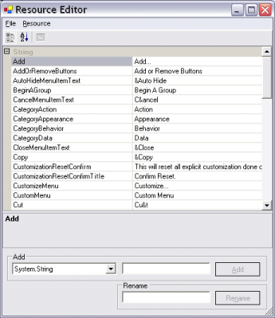
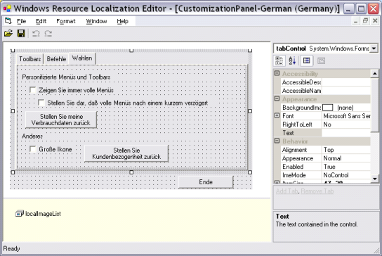

# Steps to Localize Syncfusion Components

Syncfusion components have their own neutral resources, and these resources can be localized as per the needs of the customer. Now, we will examine the steps for localizing the Syncfusion Menu Package.

1. The neutral resources of every Syncfusion component are present in the Localization folder of each component’s source code. For the Tools package, the resources are present in the following path, assuming that “C:\Program Files\” is the installation path for the Syncfusion components:

   Tools.Windows:

   C:\Program Files\Syncfusion\Essential Studio\<version>\Windows\Tools.Windows\Localization\

   Shared.Base:

   C:\Program Files\Syncfusion\Essential Studio\<version>\Base\Shared.Base\Localization

1. Inside the NeutralResources folder, there are four resource files corresponding to the Tools package. These resources contain the string representations for the English (default and neutral) culture.
2. Microsoft Visual Studio.NET ships with a tool called Resource Editor (ResEditor) that can be used to localize the string resources. It provides a graphical interface that allows you to construct resource files containing bitmaps, icons, and strings.
3. Compile the source code using the build.bat command in the Microsoft Visual Studio 2008 Command prompt. The following figure shows how the Resource Editor looks when it first opens.

    

   

4. Using the Resource Editor, open the resource file named Syncfusion.Windows.Forms.Tools.SR.resources present in the NeutralResources folder. The previous figure shows all string resources displayed in the tool.
5. Now the actual process for localization begins. After opening the resource file in the Resource Editor, start entering the equivalent strings for the required culture. In this example, the German language will be used. In the following figure, all the English strings are replaced by their German equivalent. For instance, the German equivalent of Close is “Ende”.

   

6. Open the Visual Studio.NET command prompt and enter WinRes to open the Windows Resource Localization Editor. WinRes is used to work with Windows Forms resources. The Resource Editor tool can’t be used to edit Windows Forms resources. It can only be used to work with images and string-based resources.
7. Open the other resources using the WinRes utility and replace the English strings with the German equivalent. The following figure shows the file Syncfusion.Windows.Forms.Tools.XPMenus.CustomizationPanel.resources open in the WinRes tool and with German text. The German text has been added to the form using the Properties window.

    

8. Click File > Save As and select the culture to be localized (in this case, German-Germany). Now a new resource file with the name Syncfusion.Windows.Forms.Tools.XPMenus.CustomizationPanel.de-DE.resources will be added to the source path.
9. Repeat the process for other resources and save it. Now in the Visual Studio.NET Command Prompt, enter the following command and press Enter. Make sure that you have the sf.publicsnk file from the Localization folder.

   Tools.Windows

   al /t:lib /culture:de-DE /out:Syncfusion.Tools.Windows.resources.dll /v:2.0.0.0 /delay+ /keyf:sf.publicsnk /embed:Syncfusion.Windows.Forms.Tools.XPMenus.CustomizationPanel.de-DE.resources /embed:Syncfusion.Windows.Forms.MdiWindowDialog.de-DE.resources /embed:Syncfusion.Windows.Forms.Tools.SR.de-DE.resources /embed:Syncfusion.Windows.Forms.Tools.XPMenus.BarCustomizationDialog.de-DE.resources

   Shared.Base

   al /t:lib /culture:de-DE /out:Syncfusion.Shared.Base.resources.dll /v:1.1.0.0 /delay+ /keyf:sf.publicsnk /embed: Syncfusion.Windows.Forms.Localization.SR.de-DE

10. The version you specify for these DLLs in the _al_ command should be based on the SatelliteContractVersionAttribute setting in the product AssemblyInfo. This also means that when a new version of the product is released (with a newer assembly version), you will have to recreate (adding new resources, if any and if necessary) and recompile your resource DLLs with a new version (if the SatelliteContractVersionAttribute has changed). 
11. On successful execution, an assembly file named Syncfusion.Tools.Windows.resources.dll will be created.
12. Finally, mark this satellite DLL for verification skipping (since it’s not signed with the same strong-name as the product assembly), as follows:

    sn –Vr Syncfusion.Tools.Windows.resources.dll

13. Drop this DLL into an appropriate sub-directory under your .EXE’s directory (bin\Debug\), based on the naming conventions enforced in .NET. You should put it in the de-DE sub-directory if this DLL contains resources from the German (Germany) culture.
14. Finally, you should make your application fetch the German resources during run time. The following sample code does that. To change the UI culture of the current thread, add this code in the Forms constructor before the InitializeComponent().

    Thread.CurrentThread.CurrentUICulture = new System.Globalization.CultureInfo("de-DE");

15. Now run your application containing the Syncfusion Toolbar and Menu controls and open the Customization dialog. The dialog will appear in German, as shown in the following figure:

     

