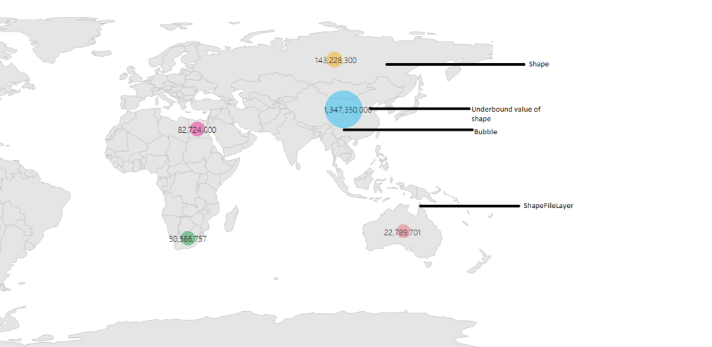
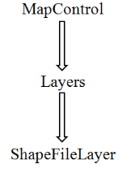
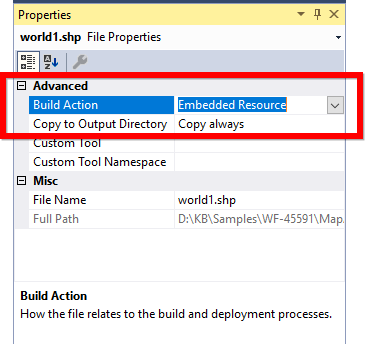

# Getting Started with Windows Forms Map (Maps)

## Assembly deployment

Refer [control dependencies](https://help.syncfusion.com/windowsforms/control-dependencies#maps) section to get the list of assemblies or NuGet package needs to be added as reference to use the control in any application.

Please find more details regarding how to install the nuget packages in windows form application in the below link:

[How to install nuget packages](https://help.syncfusion.com/windowsforms/installation/install-nuget-packages)

## Key concepts

Maps are visualized through layers. A map can accommodate one or more layers. ShapeFileLayer is one of the layers that can be used to generate map shapes and bind business objects with them.

[WinForms Map](https://www.syncfusion.com/winforms-ui-controls/map) contains a set of elements, which includes shapes, bubbles, annotations, and data items. Bubbles and MapItems enhance the data visualization capabilities of the map with data binding. Annotation and tooltip shows additional information on the map.

Options such as zooming, panning, and map selection enable the effective interaction on map elements.

## Maps structure

Map control has the following structures:

## Map control

The MapControl class is a base class, which consists of several layers, namely ShapeFileLayer, Sub ShapeFileLayer and latitude/longitude viewer. The ShapeFileLayer is used to load the shape files. The latitude/longitude viewer displays the corresponding coordinates, receives user inputs, and translates them into actions and commands on other layers.

## Shape file layer

The ShapeFileLayer is the most important component of the maps control. It provides a mechanism to upload the shape files that essentially forms the contents of a map. The shape file is in a digital vector storage format for storing geometric location and associated attribute information. Shape files spatially describe geometries such as points, polylines, and polygons.

## Shape file description

The maps control supports reading and loading shape files. A shape file is a set of files, which are stored in a non-topological geometry and the attribute information for the spatial features and records in a data set. Spatial features and records are stored as shapes that consist of set vector coordinates. A computer program can read the content of the shape files and parse them as vector elements. The maps control also reads and parses the spatial information of a shape file into the graphical elements.

As mentioned earlier, a shape file can be a set of files or a single file. Generally, the shape file contains the following files:

•Main file (.shp)

•Index file (.shx)

•dBASE file (.dbf)

All files must adhere to the 8.3 naming conventions. The Main file, Index file, and dBase file must have the same prefix, so they must have the same file name. This naming convention allows users or developers to identify specific geographical information.

The main file (.shp) contains a fixed-length file header followed by the variable-length records. Each variable-length record is made up of a fixed-length record header followed by the variable-length record contents. 

The index file (.shx) contains a 100-byte header followed by 8-byte, fixed-length records.

The dBase file (.dbf) contains any desired feature attributes or attributes keys to which other tables can be joined. Its format is a standard .dbf file used by many table-based applications in Windows™ and DOS. Any set of fields can be presented in the table.

For more information about the 8.3 naming convention, shape files, and their descriptions, refer to the following link:

[http://www.esri.com/library/whitepapers/pdfs/shapefile.pdf](http://www.esri.com/library/whitepapers/pdfs/shapefile.pdf)

Maps read the main file and create the map shapes. Then, the associated .dbf file contents are incorporated with the shapes created from the main files.

## Adding shape file

To read the shape file using maps, the shape file’s main file .shp and .dbf files needs to be added as embedded resources in the application project. Then, the main file’s path has to be given in the Uri property of the shape file layer.

### Uri property

Uri is the string type property, which retrieves the location of the shape file that is added as an embedded resource.

Example :  ShapeFilename.shp

Shape file added should set the properties as specified in the below image.

The following code snippet explains adding shape files in maps control.

#### Code sample:





partial class Form1
{
    private void InitializeComponent()
    {

        this.mapsControl1 = new Syncfusion.Windows.Forms.Maps.Maps();

        this.mapsControl1.Name = "mapsControl1";

        this.mapsControl1.Size = new System.Drawing.Size(880, 585);

        this.Controls.Add(this.mapsControl1);

        this.ClientSize = new System.Drawing.Size(880, 585);

        this.Load += new System.EventHandler(this.Form1_Load);

    }

    private Syncfusion.Windows.Forms.Maps.Maps mapsControl1;
}









public partial class Form1 : Form
{
    public Form1()
    {
        InitializeComponent();
    }

    private void Form1_Load(object sender, EventArgs e)
    {
        ShapeFileLayer shapeLayer = new ShapeFileLayer();

        shapeLayer.Uri = "world1.shp";

        this.mapsControl1.Layers.Add(shapeLayer);

    }
}      




	 
In the above snippet “world1” is a shapefile name.

Screenshot:

N> You can also explore our [WinForms Map example](https://github.com/syncfusion/winforms-demos/tree/master/map) that shows you how to render and configure the Map.