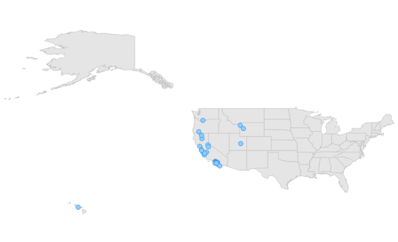

# Map Points

[`Points`](https://help.syncfusion.com/cr/windowsforms/Syncfusion.UI.Xaml.Maps.ShapeFileRecord.html#Syncfusion_UI_Xaml_Maps_ShapeFileRecord_Points) are one of the record types in the shape file layer. Points are used to specify the specific point in the map. For example, they are used to specify the capital of countries. Points in the shape file are given as latitude and longitude coordinates. Those points should be converted as map points. 

### Code sample





partial class Form1
{

  private void InitializeComponent()
  {
            this.mapsControl1 = new Syncfusion.Windows.Forms.Maps.Maps();

            this.mapsControl1.Name = "mapsControl1";

            this.mapsControl1.Size = new System.Drawing.Size(880, 585); 

            this.Controls.Add(this.mapsControl1);  

            this.ClientSize = new System.Drawing.Size(880, 585);          

            this.Load += new System.EventHandler(this.Form1_Load);            

  }

            private Syncfusion.Windows.Forms.Maps.Maps mapsControl1;

}  









public partial class Form1 : Form
{
        private void Form1_Load(object sender, EventArgs e)
        { 
            MapViewModel model = new MapViewModel();

            ShapeFileLayer shapeLayer = new ShapeFileLayer();

            shapeLayer.ShapeSetting.FillSetting.AutoFillColors = false;

            shapeLayer.Uri = "states.shp";

            shapeLayer.ShapeSetting.ShapeFill = "#E5E5E5";

            shapeLayer.ShapeSetting.ShapeStrokeThickness = 0.5;

            shapeLayer.ShapeSetting.ShapeStroke = "#C1C1C1";

            shapeLayer.ShowToolTip = true;

            SubShapeFileLayer layer1 = new SubShapeFileLayer();

            layer1.Uri = "landslide.shp";

            layer1.ShapeSetting.ShapeFill = "#8DCEFF";

            layer1.ShapeSetting.ShapeStrokeThickness = 0.5;

            layer1.ShapeSetting.ShapeStroke = "#2F8CEA";

            shapeLayer.SubShapeFileLayers.Add(layer1);

            this.mapsControl1.Layers.Add(shapeLayer);

         }

}      





Screenshot:

Map points
{:.caption}
