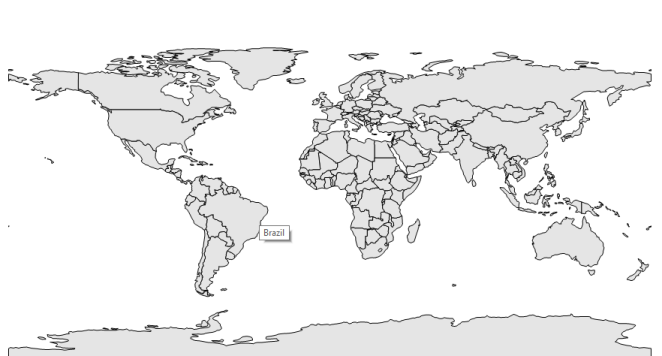
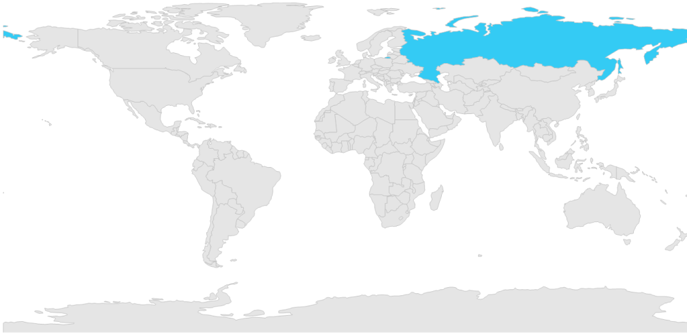
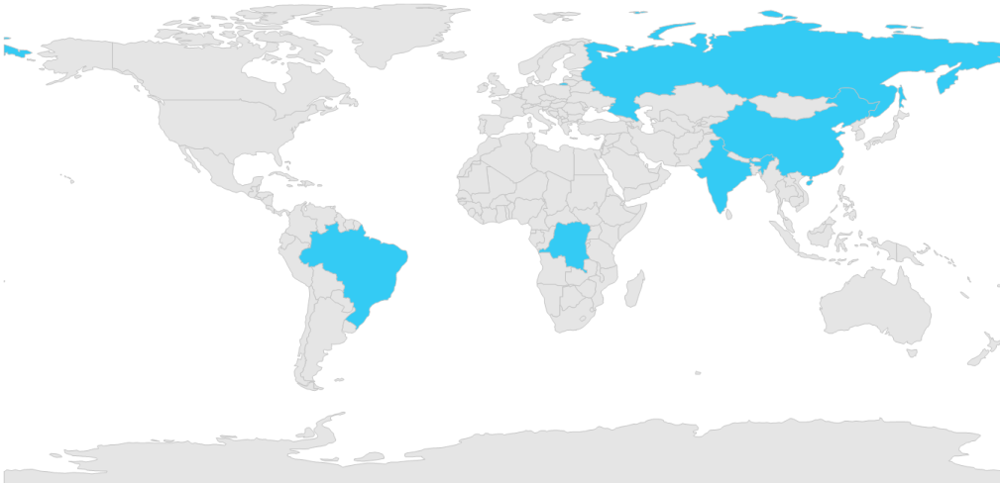
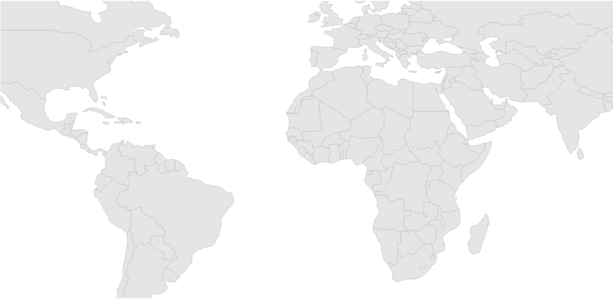
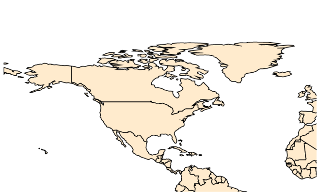
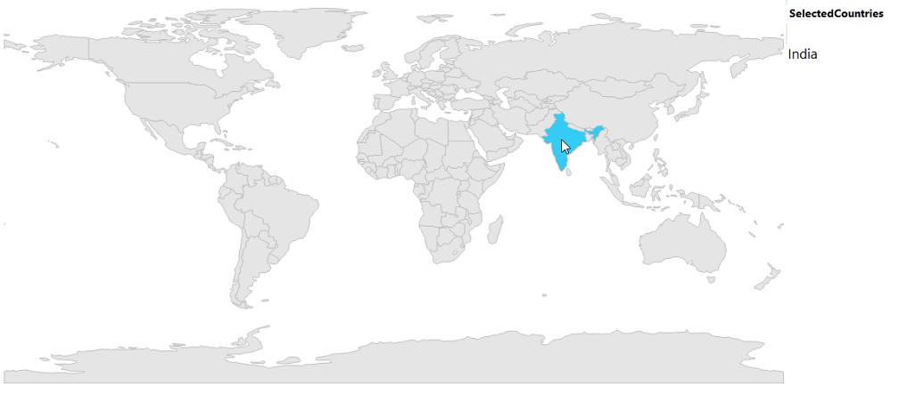

# User interaction

Options such as zooming, selection, and tooltip enable effective interaction on map elements.

## Tooltip support

Tooltip is a hanging window, Which will be shown when the shape is tapped. This is used to show additional information from the object bound with the shape. By default, it takes the property of the bound object, which is referred in the ShapeValuePath and displays its content when the corresponding shape is tapped.

Tooltip is shown only when the [`ShowToolTip`](https://help.syncfusion.com/cr/cref_files/windowsforms/Syncfusion.Maps.Windows~Syncfusion.Windows.Forms.Maps.ShapeFileLayer~ShowToolTip.html) is set to true in the shape file layer.

### Code sample





partial class Form1
{

         private void InitializeComponent()
         {

            this.mapsControl1 = new Syncfusion.Windows.Forms.Maps.Maps();

            this.mapsControl1.Name = "mapsControl1";

            this.mapsControl1.Size = new System.Drawing.Size(880, 585); 

            this.Controls.Add(this.mapsControl1);  

            this.ClientSize = new System.Drawing.Size(880, 585);          

            this.Load += new System.EventHandler(this.Form1_Load);

         }

            private Syncfusion.Windows.Forms.Maps.Maps mapsControl1;

}  









public partial class Form1 : Form
{

        private void Form1_Load(object sender, EventArgs e)
        {

            this.mapsControl1.Dock = DockStyle.Fill;

            this.mapsControl1.Margin = new Padding(0, 0, 4, 0);

            this.mapsControl1.MapBackgroundBrush = new SolidBrush(Color.White);

            this.mapsControl1.MapItemsShape = Syncfusion.Windows.Forms.Maps.MapItemShapes.None;

            MapViewModel model = new MapViewModel();

            ShapeFileLayer shapeLayer = new ShapeFileLayer();

            shapeLayer.Uri = "world1.shp";

            shapeLayer.ItemSource = model.Countries;

            shapeLayer.ShapeIDPath = "NAME";

            shapeLayer.ShapeIDTableField = "NAME";

            shapeLayer.ShapeSetting.ShapeValuePath = "Population";

            shapeLayer.ShapeSetting.ShapeColorValuePath = "Population";

            shapeLayer.ShapeSetting.ShapeDisplayValuePath = "NAME";

            shapeLayer.ShapeSetting.TextForeground = "Black";

            shapeLayer.ShowMapItem = false;

            shapeLayer.ShowToolTip = true;

            shapeLayer.ShapeSetting.ShapeFill = "#E5E5E5";

            shapeLayer.ShapeSetting.ShapeStrokeThickness = 1.5;

            shapeLayer.ShapeSetting.ShapeStroke = "Black";

            shapeLayer.ShapeSetting.FillSetting.AutoFillColors = false;

             this.mapsControl1 .Layers.Add(shapeLayer);

         }

}       





Screenshot:

## Map selection

Each shape in a map can be either selected or unselected when interacted with shapes. There are two ways to select the map shapes:

1. Single selection
2. Multiple selection

The selected map shapes are differentiated by their fill. The [`SelectedShapeColor`](https://help.syncfusion.com/cr/cref_files/windowsforms/Syncfusion.Maps.Windows~Syncfusion.UI.Xaml.Maps.ShapeSetting~SelectedShapeColor.html) of ShapeSetting is used to fill the selected shape.

All selected shapes are available in the [`SelectedMapShapes`](https://help.syncfusion.com/cr/cref_files/windowsforms/Syncfusion.Maps.Windows~Syncfusion.Windows.Forms.Maps.Maps~SelectedMapShapes.html) of ShapeFileLayer.

### Single selection

Single selection allows only one map shape to be selected at a time. The user can select the shape by tapping the shape. Single selection is enabled by setting the [`EnableSelection`](https://help.syncfusion.com/cr/cref_files/windowsforms/Syncfusion.Maps.Windows~Syncfusion.Windows.Forms.Maps.ShapeFileLayer~EnableSelection.html) property of ShapeFileLayer. If the EnableSelection property is set to true, the shapes can be selected. If it is set to false, the shapes cannot be selected. When any other shape or the map area is selected, the shape that has been already selected will be unselected.

### Multi selection

Multiple shapes in the map can be selected when the [`SelectionMode`](https://help.syncfusion.com/cr/cref_files/windowsforms/Syncfusion.Maps.Windows~Syncfusion.Windows.Forms.Maps.ShapeFileLayer~SelectionMode.html) of ShapeFileLayer is set to multiple. Multiple selection can be done when selecting the shapes parallel by pressing Ctrl key. If the Ctrl key is released, single selection will be performed.





partial class Form1
{

         private void InitializeComponent()
         {

            this.mapsControl1 = new Syncfusion.Windows.Forms.Maps.Maps();

            this.mapsControl1.Name = "mapsControl1";

            this.mapsControl1.Size = new System.Drawing.Size(880, 585); 

            this.Controls.Add(this.mapsControl1);  

            this.ClientSize = new System.Drawing.Size(880, 585);          

            this.Load += new System.EventHandler(this.Form1_Load);

         }

            private Syncfusion.Windows.Forms.Maps.Maps mapsControl1;

}  









public partial class Form1 : Form
{

        private void Form1_Load(object sender, EventArgs e)
        {

            this.mapsControl1.Dock = DockStyle.Fill;

            this.mapsControl1.Margin = new Padding(0, 0, 4, 0);

            this.mapsControl1.MapBackgroundBrush = new SolidBrush(Color.White);

            this.mapsControl1.MapItemsShape = Syncfusion.Windows.Forms.Maps.MapItemShapes.None;

            ShapeFileLayer shapeLayer = new ShapeFileLayer();

            shapeLayer.ShapeSetting.FillSetting.AutoFillColors = false;

            shapeLayer.Uri = "world1.shp";

            shapeLayer.ShapeIDPath = "Country";

            shapeLayer.EnableSelection = true;

            shapeLayer.SelectionMode = SelectionModes.Multiple;

            shapeLayer.ShapeIDTableField = "NAME";

            shapeLayer.ShowMapItem = false;

            this.mapsControl1.Layers.Add(shapeLayer);

        }   

  }       





Screenshot:

Multiple selection can be performed by selecting the map shape and holding the ctrl key over the map.

Screenshot:

## Zooming

Zooming can be done in maps in the following two ways: 

* ZoomFactor
* ZoomLevel

### Zoom using ZoomFactor 

By changing the [`ZoomFactor`](https://help.syncfusion.com/cr/cref_files/windowsforms/Syncfusion.Maps.Windows~Syncfusion.Windows.Forms.Maps.MapsActionList~ZoomFactor.html) value, maps can be zoomed. If the ZoomFactor value is increased, map will be ZoomIn based on the ZoomFactor value.





partial class Form1
{

         private void InitializeComponent()
         {

            this.mapsControl1 = new Syncfusion.Windows.Forms.Maps.Maps();

            this.mapsControl1.Name = "mapsControl1";

            this.mapsControl1.Size = new System.Drawing.Size(880, 585); 

            this.Controls.Add(this.mapsControl1);  

            this.ClientSize = new System.Drawing.Size(880, 585);          

            this.Load += new System.EventHandler(this.Form1_Load);

         }

            private Syncfusion.Windows.Forms.Maps.Maps mapsControl1;

}  









public partial class Form1 : Form
{

        public Form1()
        {
            InitializeComponent();
        }

        private void Form1_Load(object sender, EventArgs e)
        {

            this.mapsControl1.MapBackgroundBrush = new SolidBrush(Color.White);

            this.mapsControl1.MapItemsShape = Syncfusion.Windows.Forms.Maps.MapItemShapes.None;

            this.mapsControl1.ZoomFactor = 0.75f;

            ShapeFileLayer shapeLayer = new ShapeFileLayer();

            shapeLayer.Uri = "world1.shp";

            shapeLayer.ItemSource = model.Countries;

            shapeLayer.ShapeIDPath = "NAME";

            shapeLayer.ShapeIDTableField = "NAME"; 

            this.mapsControl1.Layers.Add(shapeLayer);

        }

}       
	 




Screenshot:

### Zoom using ZoomLevel 

When changing the [`ZoomLevel`](https://help.syncfusion.com/cr/cref_files/windowsforms/Syncfusion.Maps.Windows~Syncfusion.Windows.Forms.Maps.Maps~ZoomLevel.html), the [`ZoomFactor`](https://help.syncfusion.com/cr/cref_files/windowsforms/Syncfusion.Maps.Windows~Syncfusion.Windows.Forms.Maps.Maps~ZoomFactor.html) value will also be changed. So, map will be zoomed based on the ZoomFactor value. The ZoomFactor value is determined when the ZoomLevel is changed. Initial ZoomFactor value is multiplied by the ZoomLevel value, then new value will be set to ZoomFactor.





partial class Form1
{

         private void InitializeComponent()
         {

            this.mapsControl1 = new Syncfusion.Windows.Forms.Maps.Maps();

            this.mapsControl1.Name = "mapsControl1";

            this.mapsControl1.Size = new System.Drawing.Size(880, 585); 

            this.Controls.Add(this.mapsControl1);  

            this.ClientSize = new System.Drawing.Size(880, 585);          

            this.Load += new System.EventHandler(this.Form1_Load);

         }

            private Syncfusion.Windows.Forms.Maps.Maps mapsControl1;

}  









public partial class Form1 : Form
{

     public Form1()
        {
            InitializeComponent();
        }

        private void Form1_Load(object sender, EventArgs e)
        {

            this.mapsControl1.MapBackgroundBrush = new SolidBrush(Color.White);

            this.mapsControl1.MapItemsShape = Syncfusion.Windows.Forms.Maps.MapItemShapes.None;

            this.mapsControl1.ZoomFactor = 0.75f;

            this.mapsControl1.ZoomLevel = 4;

            ShapeFileLayer shapeLayer = new ShapeFileLayer();

            shapeLayer.Uri = "world1.shp";

            this.mapsControl1.Layers.Add(shapeLayer);
        }      

}       





Screenshot:

## Events

The ShapeSelected event will be triggered when the map shapes are selected. A corresponding model data is passed as an argument. 
Below code snippet displays the selected country name which is specified in the model data.





public partial class Form1 : Form
{

    this.mapsControl1.ShapeSelected+=mapsControl1_ShapeSelected;

    private void mapsControl1_ShapeSelected(object sender, ShapeSelectedEventArgs e)
    {
        countryListBox.Items.Clear();

        if (e.Data != null)
        {
            foreach (Countries shape in e.Data)
            {
                countryListBox.Items.Add(shape.Country);
            }
        }
    }
}       





