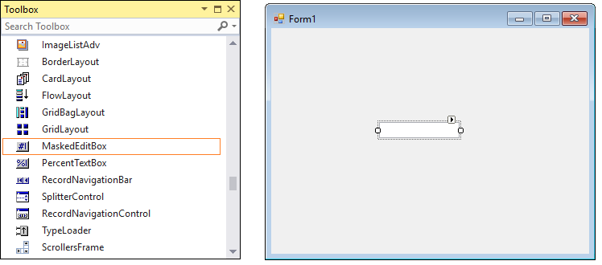
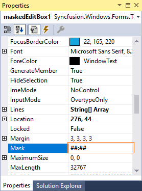
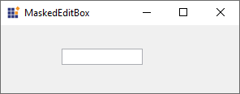
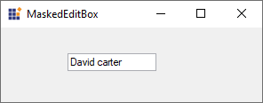

# Getting Started with Windows Forms MaskedEditBox control

This section briefly describes how to create a new Windows Forms project in Visual Studio and how to add the [WinForms MaskedTextBox](https://www.syncfusion.com/winforms-ui-controls/maskedtextbox) control with its basic functionalities.

## Assembly deployment

Refer to the [Control Dependencies](https://help.syncfusion.com/windowsforms/control-dependencies#maskededitbox) section to get the list of assemblies or details of NuGet package that needs to be added as a reference to use the control in any application.

Refer to this [documentation](https://help.syncfusion.com/windowsforms/installation/install-nuget-packages) to find more details about installing NuGet packages in a Windows Forms application.

## Adding the MaskedEditBox control via designer

The following steps describe how to create the **MaskedEditBox** control via designer:

1. Create a new Windows Forms application in Visual Studio.

2. Add the [MaskedEditBox](https://help.syncfusion.com/cr/windowsforms/Syncfusion.Windows.Forms.Tools.MaskedEditBox.html) control to an application by dragging it from the toolbox to design view. The following dependent assembly will be added automatically:

    * Syncfusion.Shared.Base

3. Set the symbols in the [Mask](https://help.syncfusion.com/cr/windowsforms/Syncfusion.Windows.Forms.Tools.MaskedEditBox.html#Syncfusion_Windows_Forms_Tools_MaskedEditBox_Mask) property for the control. This property controls the behavior of control at run time.

If no mask is specified, the control will behave the same as a standard Windows Forms TextBox control.

## Adding the MaskedEditBox control via code

The following steps describe how to create the **MaskedEditBox** control programmatically:

1. Create a C# or VB application via Visual Studio.

2. Add the following assembly reference to the project:

    * Syncfusion.Shared.Base

3. Include the required namespace.






using Syncfusion.Windows.Forms.Tools;





Imports Syncfusion.Windows.Forms.Tools





{{ codesnippet1 | OrderList_Indent_Level_1 }}

4. Create an instance of the [MaskedEditBox](https://help.syncfusion.com/cr/windowsforms/Syncfusion.Windows.Forms.Tools.MaskedEditBox.html) control, and then add it to the form.




  
private Syncfusion.Windows.Forms.Tools.MaskedEditBox maskedEditBox1;
this.maskedEditBox1=new MaskedEditBox();
this.Controls.Add(this.maskedEditBox1);





Private maskedEditBox1 As Syncfusion.Windows.Forms.Tools.MaskedEditBox
Me.maskedEditBox1 = New MaskedEditBox()
Me.Controls.Add(Me.maskedEditBox1)





{{ codesnippet2 | OrderList_Indent_Level_1 }}

## Mask settings

You can set some common symbols for the [Mask](https://help.syncfusion.com/cr/windowsforms/Syncfusion.Windows.Forms.Tools.MaskedEditBox.html#Syncfusion_Windows_Forms_Tools_MaskedEditBox_Mask) property. For example, the symbols are set as "##:##".

N> The **#** symbol allows numeric entry only in that position.

Examples of some common masks are,

<table>
<tr>
<th>
Mask</th><th>
Usage</th></tr>
<tr>
<td>
###-##-####</td><td>
US Social security number mask( the '-' symbol is literal). Example 222-22-2222.</td></tr>
<tr>
<td>
(###) ### ####</td><td>
US Telephone number mask. Example (919) 481 1974.</td></tr>
<tr>
<td>
##/##/####</td><td>
Short date mask. Example 04/14/2005.</td></tr>
<tr>
<td>
##:##</td><td>
Short time mask. Example 12:24.</td></tr>
<tr>
<td>
>?<????????????</td><td>
First name or last name. The first letter is uppercase, and the other all letters are lowercase. Example: Syncfusion.</td></tr>
</table>





// The mask string.
this.maskedEditBox1.Mask = ">?<???? ??????";
this.maskedEditBox1.Location = new System.Drawing.Point(70, 29);





' The mask string.
Me.maskedEditBox1.Mask = ">?<???? ??????"
Me.maskedEditBox1.Location = New System.Drawing.Point(70, 29);





