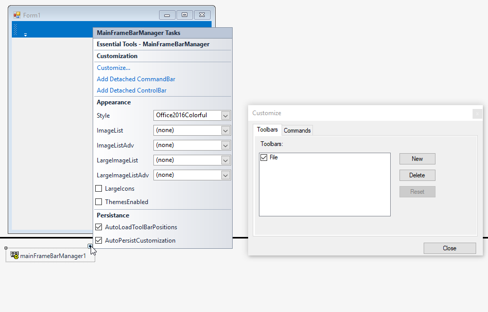
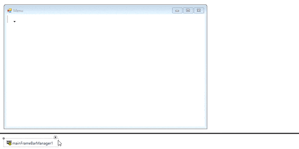
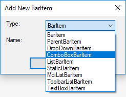
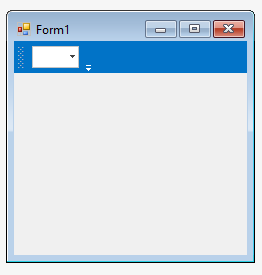
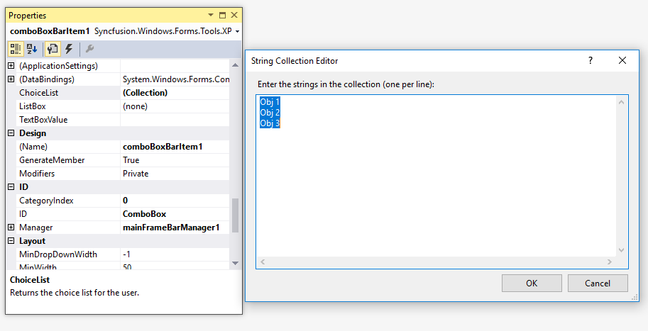
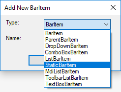
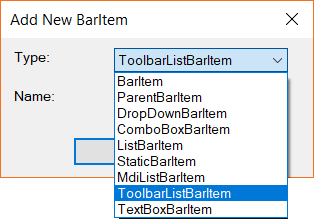

# Adding menu items via designer in Windows Forms Menu (Menus)

This section provides a quick overview to add the menu items to a [Menu](https://help.syncfusion.com/cr/cref_files/windowsforms/Syncfusion.Tools.Windows~Syncfusion.Windows.Forms.Tools.XPMenus.MainFrameBarManager.html) control through the designer.

The MainFrameBarManager can be added to the application by drag and dropping from the tool box to the design form. The following required assembly references will be added automatically.

* Syncfusion.Grid.Base.dll
* Syncfusion.Grid.Windows.dll
* Syncfusion.Shared.Base.dll
* Syncfusion.Shared.Windows.dll
* Syncfusion.Tools.Base.dll
* Syncfusion.Tools.Windows.dll
* Syncfusion.Licensing.dll
* Syncfusion.SpellChecker.Base.dll

## Adding main bar

The [Bar](https://help.syncfusion.com/cr/cref_files/windowsforms/Syncfusion.Tools.Windows~Syncfusion.Windows.Forms.Tools.XPMenus.Bar.html) component acts as a place holder for the menu items. It can be added to the menu via the **Customize** dialog. To do so, select the `Customize...` option from the smart tags menu. Under the `Toolbars` tab of the dialog, the bar can be added.

## Adding parent item

The [ParentBarItem](https://help.syncfusion.com/cr/cref_files/windowsforms/Syncfusion.Tools.Windows~Syncfusion.Windows.Forms.Tools.XPMenus.ParentBarItem.html) is a type of [bar item](https://help.syncfusion.com/cr/cref_files/windowsforms/Syncfusion.Tools.Windows~Syncfusion.Windows.Forms.Tools.XPMenus.BarItem.html), that acts as a parent component for child bar items and sub-menu.

## Adding drop down item

The [DropDownBarItem](https://help.syncfusion.com/cr/cref_files/windowsforms/Syncfusion.Tools.Windows~Syncfusion.Windows.Forms.Tools.XPMenus.DropDownBarItem.html) is a type of bar item, which will display a popup menu when clicked. A custom control can also be loaded and displayed when the menu item is clicked. This can be done by assigning the required component to the [PopupControlContainer](https://help.syncfusion.com/cr/cref_files/windowsforms/Syncfusion.Tools.Windows~Syncfusion.Windows.Forms.Tools.XPMenus.DropDownBarItem~PopupControlContainer.html) property of the drop down bar item.

## Adding combo box item

The [ComboBoxBarItem](https://help.syncfusion.com/cr/cref_files/windowsforms/Syncfusion.Tools.Windows~Syncfusion.Windows.Forms.Tools.XPMenus.ComboBoxBarItem.html) is a type of bar item, which behaves like combo box control. The items collection can be specified using the [`ChoiceList`](https://help.syncfusion.com/cr/cref_files/windowsforms/Syncfusion.Tools.Windows~Syncfusion.Windows.Forms.Tools.XPMenus.ComboBoxBarItem~ChoiceList.html) property. The **String Collection Editor** gets opened to add or edit the items of the combo box bar item.

## Adding static item

A [StaticBarItem](https://help.syncfusion.com/cr/cref_files/windowsforms/Syncfusion.Tools.Windows~Syncfusion.Windows.Forms.Tools.XPMenus.StaticBarItem.html) is a type of bar item, which behaves like Label control.

## Adding toolbar item

A [ToolBarListBarItem](https://help.syncfusion.com/cr/cref_files/windowsforms/Syncfusion.Tools.Windows~Syncfusion.Windows.Forms.Tools.XPMenus.ToolBarListBarItem.html) is a type of bar item, which behaves like a toolbar menu item. It displays the options to customize the menu items of the parent tool bar to which it gets associated.

## Adding textbox item

The [TextBoxBarItem](https://help.syncfusion.com/cr/cref_files/windowsforms/Syncfusion.Tools.Windows~Syncfusion.Windows.Forms.Tools.XPMenus.TextBoxBarItem.html) is a type of bar item, which behaves like text box control. The text edited can be obtained via the [TextBoxValue](https://help.syncfusion.com/cr/cref_files/windowsforms/Syncfusion.Tools.Windows~Syncfusion.Windows.Forms.Tools.XPMenus.TextBoxBarItem~TextBoxValue.html) property.

