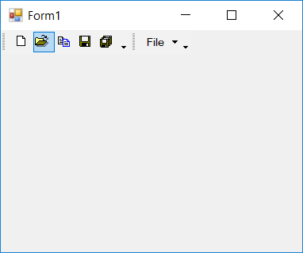
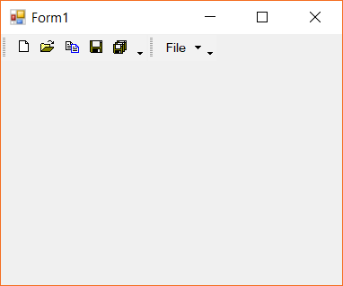
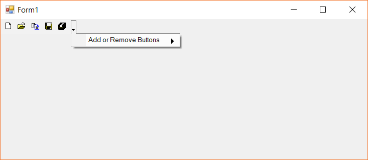
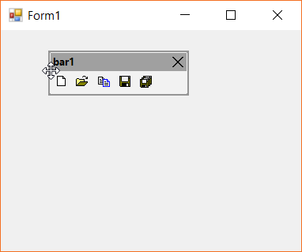
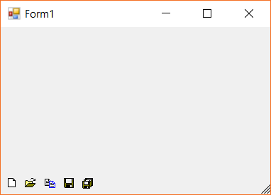
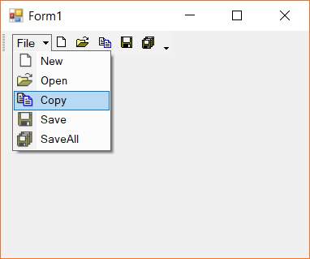
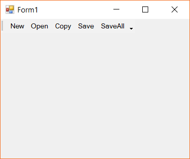
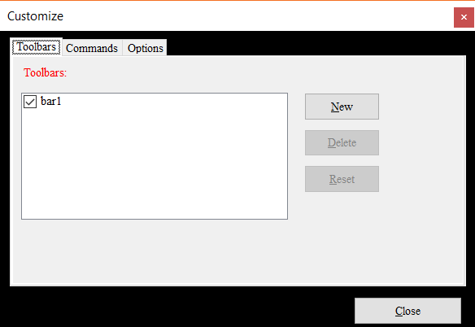
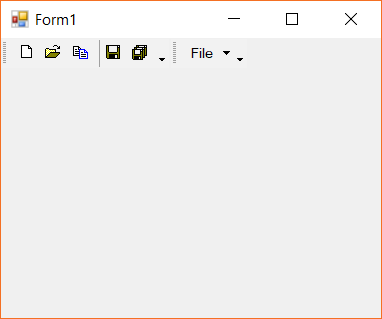

# Appearance Customization in Windows Forms Menu (Menus)

In this section the appearance customization of the menu and child menu items is discussed.

## Customizing images in menu items

The images associated with a menu item can be customized depending upon its state either it is enabled, disabled, highlighted or performed an action upon it.

### Adding normal state images

Images can be added to menu items directly via the property [`Image`](https://help.syncfusion.com/cr/windowsforms/Syncfusion.Windows.Forms.Tools.XPMenus.BarItem.html#Syncfusion_Windows_Forms_Tools_XPMenus_BarItem_Image). The following code snippet shows the image added to a bar item.





barItem1.Image = new ImageExt(Image.FromFile(Application.ExecutablePath + @"\..\..\..\Resources\Copy.ico"));





barItem1.Image = New ImageExt(Image.FromFile(Application.ExecutablePath & "\..\..\..\Resources\Copy.ico"))





#### Properties

The below table discuss the image properties of customizing the image associated with a menu item.

| Properties | Description |
|-------------------|-------------------|
| [`ImageList`](https://help.syncfusion.com/cr/windowsforms/Syncfusion.Windows.Forms.Tools.XPMenus.BarItem.html#Syncfusion_Windows_Forms_Tools_XPMenus_BarItem_ImageList) | Gets or sets the image list associated with a menu a item instance. |
| [`ImageListAdv`](https://help.syncfusion.com/cr/windowsforms/Syncfusion.Windows.Forms.Tools.XPMenus.BarItem.html#Syncfusion_Windows_Forms_Tools_XPMenus_BarItem_ImageListAdv) | Gets or sets the image list associated with a menu item instance. |
| [`ImageSize`](https://help.syncfusion.com/cr/windowsforms/Syncfusion.Windows.Forms.Tools.XPMenus.BarItem.html#Syncfusion_Windows_Forms_Tools_XPMenus_BarItem_ImageSize) | Gets or sets the size of an image. |
| [`LargeImageList`](https://help.syncfusion.com/cr/windowsforms/Syncfusion.Windows.Forms.Tools.XPMenus.BarItem.html#Syncfusion_Windows_Forms_Tools_XPMenus_BarItem_LargeImageList) | Gets or sets the ImageList that contains the images to display in the disabled state, if the bar manager is loaded with large icons mode. |
| [`LargeImageListAdv`](https://help.syncfusion.com/cr/windowsforms/Syncfusion.Windows.Forms.Tools.XPMenus.BarItem.html#Syncfusion_Windows_Forms_Tools_XPMenus_BarItem_LargeImageListAdv) | Gets or sets the ImageList that contains the images to display in the disabled state, if the bar manager is loaded with large icons mode. |
| [`ImageIndex`](https://help.syncfusion.com/cr/windowsforms/Syncfusion.Windows.Forms.Tools.XPMenus.BarItem.html#Syncfusion_Windows_Forms_Tools_XPMenus_BarItem_ImageIndex) | Gets or sets the index of the image list collections. |

N> By default, the `ImageIndex` is set to -1, the corresponding image in the list should be specified with a proper index value.

### Adding disabled state images

When a menu item tends to be in a disabled state, a different image can be associated with that menu item via the property [`DisabledImage`](https://help.syncfusion.com/cr/windowsforms/Syncfusion.Windows.Forms.Tools.XPMenus.BarItem.html#Syncfusion_Windows_Forms_Tools_XPMenus_BarItem_DisabledImage). The following code snippet shows the image associated with a disabled state menu item.





barItem1.DisabledImage = new ImageExt(Image.FromFile(Application.ExecutablePath + @"\..\..\..\Resources\New.ico"));





barItem1.DisabledImage = New ImageExt(Image.FromFile(Application.ExecutablePath & "\..\..\..\Resources\New.ico"))





#### Properties

The below table discuss the image properties of customizing the disabled state image associated with a menu item.

| Properties | Description |
|-------------------|-------------------|
| [`DisabledImageList`](https://help.syncfusion.com/cr/windowsforms/Syncfusion.Windows.Forms.Tools.XPMenus.BarItem.html#Syncfusion_Windows_Forms_Tools_XPMenus_BarItem_DisabledImageList) | Gets or sets the ImageList that contains the images to display in the disabled menu item. |
| [`DisabledImageListAdv`](https://help.syncfusion.com/cr/windowsforms/Syncfusion.Windows.Forms.Tools.XPMenus.BarItem.html#Syncfusion_Windows_Forms_Tools_XPMenus_BarItem_DisabledImageListAdv) | Gets or sets the ImageList that contains the images to display in the disabled menu item. |
| [`DisabledLargeImageList`](https://help.syncfusion.com/cr/windowsforms/Syncfusion.Windows.Forms.Tools.XPMenus.BarItem.html#Syncfusion_Windows_Forms_Tools_XPMenus_BarItem_DisabledLargeImageList) | Gets or sets the ImageList that contains the images to display in the disabled state, if the bar manager is loaded with large icons mode. |
| [`DisabledLargeImageListAdv`](https://help.syncfusion.com/cr/windowsforms/Syncfusion.Windows.Forms.Tools.XPMenus.BarItem.html#Syncfusion_Windows_Forms_Tools_XPMenus_BarItem_DisabledLargeImageListAdv) | Gets or sets the ImageList that contains the images to display in the disabled state, if the bar manager is loaded with large icons mode. |
| [`DisabledImageIndex`](https://help.syncfusion.com/cr/windowsforms/Syncfusion.Windows.Forms.Tools.XPMenus.BarItem.html#Syncfusion_Windows_Forms_Tools_XPMenus_BarItem_DisabledImageIndex) | Gets or sets the index of the image collections. |

N> By default, the `DisabledImageIndex` is set to -1, the corresponding image in the list should be specified with a proper index value.

### Adding highlighted state images

When a menu item is selected or highlighted, the image associated to the menu item can be set via the [`HighlightedImage`](https://help.syncfusion.com/cr/windowsforms/Syncfusion.Windows.Forms.Tools.XPMenus.BarItem.html#Syncfusion_Windows_Forms_Tools_XPMenus_BarItem_HighlightedImage) property. The following code snippet shows the image associated with a highlighted state menu item.





barItem1.HighlightedImage = new ImageExt(Image.FromFile(Application.ExecutablePath + @"\..\..\..\Resources\Cut.ico"));





barItem1.HighlightedImage = New ImageExt(Image.FromFile(Application.ExecutablePath & "\..\..\..\Resources\Cut.ico"))





#### Properties

The below table discuss the image properties of customizing the selected state image associated with a menu item.

| Properties | Description |
|-------------------|-------------------|
| [`HighlightedImageList`](https://help.syncfusion.com/cr/windowsforms/Syncfusion.Windows.Forms.Tools.XPMenus.BarItem.html) | Gets or sets the ImageList that contains the images to display in the disabled menu item. |
| [`HighlightedImageListAdv`](https://help.syncfusion.com/cr/windowsforms/Syncfusion.Windows.Forms.Tools.XPMenus.BarItem.html) | Gets or sets the ImageList that contains the images to display in the disabled menu item. |
| [`HighlightedLargeImageList`](https://help.syncfusion.com/cr/windowsforms/Syncfusion.Windows.Forms.Tools.XPMenus.BarItem.html) | Gets or sets the ImageList that contains the images to display in the disabled state, if the bar manager is loaded with large icons mode. |
| [`HighlightedImageLargeListAdv`](https://help.syncfusion.com/cr/windowsforms/Syncfusion.Windows.Forms.Tools.XPMenus.BarItem.html) | Gets or sets the ImageList that contains the images to display in the disabled state, if the bar manager is loaded with large icons mode. |
| [`HighlightedImageIndex`](https://help.syncfusion.com/cr/windowsforms/Syncfusion.Windows.Forms.Tools.XPMenus.BarItem.html#Syncfusion_Windows_Forms_Tools_XPMenus_BarItem_HighlightedImageIndex) | Gets or sets the index of the image collections. |

N> By default, the `HighlightedImageIndex` is set to -1, the corresponding image in the list should be specified with a proper index value.

### Adding pressed state images

When a menu item is pressed, the image associated to the menu item can be set via the [`PressedImageListAdv`](https://help.syncfusion.com/cr/windowsforms/Syncfusion.Windows.Forms.Tools.XPMenus.BarItem.html#Syncfusion_Windows_Forms_Tools_XPMenus_BarItem_PressedImageListAdv) property. The following code snippet shows the image associated with a pressed state menu item.





ImageListAdv pressedStateImages = new ImageListAdv();
barItem1.PressedImageIndex = 2;
pressedStateImages.Images.AddRange(new Image[]
{
    Image.FromFile(Application.ExecutablePath + @"\..\..\..\Resources\Cut.ico"),
    Image.FromFile(Application.ExecutablePath + @"\..\..\..\Resources\SaveAll.ico"),
    Image.FromFile(Application.ExecutablePath + @"\..\..\..\Resources\New.ico"),
    Image.FromFile(Application.ExecutablePath + @"\..\..\..\Resources\Save.ico")
});
barItem1.PressedImageListAdv = pressedStateImages;





Dim pressedStateImages As New ImageListAdv()
barItem1.PressedImageIndex = 2
pressedStateImages.Images.AddRange(New Image()
{
   Image.FromFile(Application.ExecutablePath & "\..\..\..\Resources\Cut.ico"),
   Image.FromFile(Application.ExecutablePath & "\..\..\..\Resources\SaveAll.ico"),
   Image.FromFile(Application.ExecutablePath & "\..\..\..\Resources\New.ico"),
   Image.FromFile(Application.ExecutablePath & "\..\..\..\Resources\Save.ico")
})
barItem1.PressedImageListAdv = pressedStateImages





#### Properties

The below table discuss the image properties of customizing the pressed state image associated with a menu item.

| Properties | Description |
|-------------------|-------------------|
| [`PressedLargeImageList`](https://help.syncfusion.com/cr/windowsforms/Syncfusion.Windows.Forms.Tools.XPMenus.BarItem.html#Syncfusion_Windows_Forms_Tools_XPMenus_BarItem_PressedLargeImageList) | Gets or sets the ImageList that contains the images to display in the disabled state, if the bar manager is loaded with large icons mode. |
| [`PressedLargeImageListAdv`](https://help.syncfusion.com/cr/windowsforms/Syncfusion.Windows.Forms.Tools.XPMenus.BarItem.html#Syncfusion_Windows_Forms_Tools_XPMenus_BarItem_PressedLargeImageListAdv) | Gets or sets the ImageList that contains the images to display in the disabled state, if the bar manager is loaded with large icons mode. |

## Customizing bar styles

The menu bar appearance can be customized with the usage scenario depending upon the menu items it holds. The following are the bar styles supported in menu control.

* None
* AllowQuickCustomizing
* IsMainMenu
* MultiLine
* RotateWhenVertical
* Visible
* UseWholeRow
* DrawDragBorder
* IsStatusBar
* TextBelowImage

The enum value of `BarStyle` cam also be adjoined to represent the bar with combined applied styles. The below image shows the bar items are combined with the `Visible` value.

The below code snippet shows the bar style is being applied with `IsMainMenu` style.





this.bar1.BarStyle = BarStyle.IsMainMenu | BarStyle.Visible;





Me.bar1.BarStyle = BarStyle.IsMainMenu | BarStyle.Visible





## Customizing paint styles

The menu items rendering mode can be customized with the `PaintStyle` property. The following modes are supported to customize the rendering mode.

* Default mode
* Text only mode
* Text only in menu mode
* Image and text mode

### Default mode

As the name indicates it is the default rendering mode of `PaintStyle` property. Images are drawn only in the child-menus like drop down menu or from parent menu. Otherwise all the bar will be drawn only with its respective image.

The below image shows that the drop-down menu is rendered with both image and text where as the main menu items are rendered only with images.

### Text only mode

This mode ignores the images associated with the menu items. This applies only to the tool bar menu items. The below code snippet shows the menu item is being applied with `TextOnly` mode.





barItem1.PaintStyle = PaintStyle.TextOnly;





barItem1.PaintStyle = PaintStyle.TextOnly





### Text only in menu mode

The menu items can be represented as text only specific to the child-menus either from drop down menu or parent menu. The below code snippet shows the menu items are applied with `TextOnlyInMenus` mode.





barItem1.PaintStyle = PaintStyle.TextOnlyInMenus;





barItem1.PaintStyle = PaintStyle.TextOnlyInMenus





### Image and text only mode

Both the image and text are applied to all the menu items either from main menu or child menu. The below code snippet shows the menu items are applied with `ImageAndText` mode.





barItem1.PaintStyle = PaintStyle.ImageAndText;





barItem1.PaintStyle = PaintStyle.ImageAndText





## Customizing customize dialog

The **Customize Dialog** style can be customized with required colors by using the `ForeColor`, `BackColor` and `Font` properties. The below code snippet shows the modified Customize dialog.





this.mainFrameBarManager1.CustomizationDialog.ForeColor = Color.Red;
this.mainFrameBarManager1.CustomizationDialog.BackColor = Color.Black;
this.mainFrameBarManager1.CustomizationDialog.Font = new Font("Times New Roman", 8.5f);





Me.mainFrameBarManager1.CustomizationDialog.ForeColor = Color.Red
Me.mainFrameBarManager1.CustomizationDialog.BackColor = Color.Black
this.mainFrameBarManager1.CustomizationDialog.Font = New Font("Times New Roman", 8.5f)





## Customizing menu items

The menu items of a tool bar in menu control can be customized. This can be done both design-time and on-demand initialization. This can be done by using the `EnableCustomizing` property. By default, this is enabled to promote on-demand customization. The below code shows the menu items customization is being disabled.





this.mainFrameBarManager1.EnableCustomizing = false;





Me.mainFrameBarManager1.EnableCustomizing = False





The above code could disable the customization to all the bars of the menu control collectively. In order to disable the customize option for a specific bar, the respective bar instance's `AllowCustomizing` property should be set to `false`. The below image shows the customization to _bar1_ is being disabled while _bar2_ is not.





this.bar1.AllowCustomizing = false;





Me.bar1.AllowCustomizing = False





### Customizing events

There are two events associated while customizing the menu items. The [`CustomizingItem`](https://help.syncfusion.com/cr/windowsforms/Syncfusion.Windows.Forms.Tools.XPMenus.BarManager.html#Syncfusion_Windows_Forms_Tools_XPMenus_BarManager_CustomizingItem) property holds the current customizing item.

* [`CustomizationBegin`](https://help.syncfusion.com/cr/windowsforms/Syncfusion.Windows.Forms.Tools.XPMenus.BarManager.html) - Occurs when the customization of a menu item of a tool bar begins.
* [`CustomizationDone`](https://help.syncfusion.com/cr/windowsforms/Syncfusion.Windows.Forms.Tools.XPMenus.BarManager.html) - Occurs when the customization of a menu item gets completed.

## Grouping menu items

The menu items of a tool bar can be grouped together using the [`SeparatorIndices`](https://help.syncfusion.com/cr/windowsforms/Syncfusion.Windows.Forms.Tools.XPMenus.Bar.html#Syncfusion_Windows_Forms_Tools_XPMenus_Bar_SeparatorIndices) property. The specific tool bar instance is used to specific the grouping items. The below code snippet shows the menu items are grouped in a tool bar.





this.bar1.SeparatorIndices.Add(3);





Me.bar1.SeparatorIndices.Add(3)





N> The index value represents the menu items incremental value for grouping. Its not likely to be the bar item index value in a tool bar.

### Grouping methods

| Method | Description |
|----------|--------------------|
| [`BeginGroupAt`](https://help.syncfusion.com/cr/windowsforms/Syncfusion.Windows.Forms.Tools.XPMenus.Bar.html#Syncfusion_Windows_Forms_Tools_XPMenus_Bar_BeginGroupAt_Syncfusion_Windows_Forms_Tools_XPMenus_BarItem_) | Begins the grouping of menu items from the bar item instance specified. |
| [`RemoveGroupAt`](https://help.syncfusion.com/cr/windowsforms/Syncfusion.Windows.Forms.Tools.XPMenus.Bar.html#Syncfusion_Windows_Forms_Tools_XPMenus_Bar_RemoveGroupAt_Syncfusion_Windows_Forms_Tools_XPMenus_BarItem_) | Removes the grouping of menu items from the bar item instance specified. |
| [`IsGroupBeginning`](https://help.syncfusion.com/cr/windowsforms/Syncfusion.Windows.Forms.Tools.XPMenus.Bar.html#Syncfusion_Windows_Forms_Tools_XPMenus_Bar_IsGroupBeginning_Syncfusion_Windows_Forms_Tools_XPMenus_BarItem_) | Returns a boolean value whether the specified bar item instance is at the begining of the grouping or not. |
| [`ClearSeparators`](https://help.syncfusion.com/cr/windowsforms/Syncfusion.Windows.Forms.Tools.XPMenus.Bar.html#Syncfusion_Windows_Forms_Tools_XPMenus_Bar_ClearSeparators) | Removes every grouping of menu items in a given tool bar. |

## Backward compatibility

The menu control supports to customize the appearance and scale modes similar to the older version of the menu control. This can be used by enabling the [`UseBackwardCompatiblity`](https://help.syncfusion.com/cr/windowsforms/Syncfusion.Windows.Forms.Tools.XPMenus.BarManager.html#Syncfusion_Windows_Forms_Tools_XPMenus_BarManager_UseBackwardCompatiblity) property.

The color schemes can be modified by applying and customizing the theme colors.



[Theming](https://help.syncfusion.com/windowsforms/menus/Theming)


