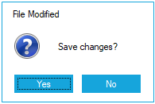

# Getting Started with Windows Forms MessageBox (MessageBoxAdv)

This section explains how to configure [MessageBoxAdv](https://help.syncfusion.com/cr/cref_files/windowsforms/Syncfusion.Shared.Base~Syncfusion.Windows.Forms.MessageBoxAdv_members.html) control in a Windows Forms application.

## Assembly deployment

Refer [control dependencies](https://help.syncfusion.com/windowsforms/control-dependencies#messageboxadv) section to get the list of assemblies or NuGet package needs to be added as reference to use the control in any application.

Please find more details regarding how to install the nuget packages in windows form application in the below link:
 
[How to install nuget packages](https://help.syncfusion.com/windowsforms/nuget-packages)

## Creating simple application with MessageBoxAdv

You can create the Windows Forms application with MessageBoxAdv as follows:

1. [Creating the project](#creating-the-project)
2. [Configure MessageBoxAdv](#configure-messageboxadv)

## Creating the project

Create a new Windows Forms project in the Visual Studio to display the MessageBoxAdv.

## Configure MessageBoxAdv

To add control manually in C#, follow the given steps:

**Step1:** Add the following required assembly references to the project:
	
   * Syncfusion.Shared.Base.dll

**Step2:** Include the namespaces **Syncfusion.Windows.Forms**.





using Syncfusion.Windows.Forms;





Imports Syncfusion.Windows.Forms





**Step3:** Displays the `MessageBoxAdv` by using [MessageBoxAdv.Show](https://help.syncfusion.com/cr/cref_files/windowsforms/Syncfusion.Shared.Base~Syncfusion.Windows.Forms.MessageBoxAdv~Show.html) function.





// Display the MessageBox using [Show](https://help.syncfusion.com/cr/cref_files/windowsforms/Syncfusion.Shared.Base~Syncfusion.Windows.Forms.MessageBoxAdv~Show.html) function.

MessageBoxAdv.MessageBoxStyle = MessageBoxAdv.Style.Metro;

MessageBoxAdv.Show(this,"Save changes?", "File Modified", MessageBoxButtons.YesNo,MessageBoxIcon.Question);





' Display the MessageBox using [Show](https://help.syncfusion.com/cr/cref_files/windowsforms/Syncfusion.Shared.Base~Syncfusion.Windows.Forms.MessageBoxAdv~Show.html) function.

MessageBoxAdv.MessageBoxStyle = MessageBoxAdv.Style.Metro

MessageBoxAdv.Show(this,"Save changes?", "File Modified", MessageBoxButtons.YesNo,MessageBoxIcon.Question)





