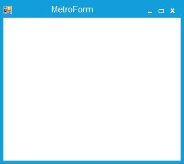
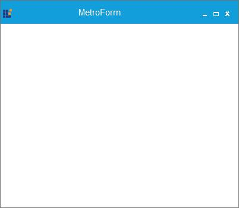

# Appearance

## Border thickness

MetroForm border can be customized using `BorderThickness` property.





this.BorderThickness = 10;





Me.BorderThickness = 10
 




## Border color

`BorderColor` property is used to change the color of the border.





 this.BorderColor = System.Drawing.Color.FromArgb(((int)(((byte)(17)))), ((int)(((byte)(158)))), ((int)(((byte)(218)))));





 Me.BorderColor = System.Drawing.Color.FromArgb(((int)(((byte)(17)))), ((int)(((byte)(158)))), ((int)(((byte)(218)))))
 




## Caption bar height

Caption bar height can be customized using `CaptionBarHeight` property.





this.CaptionBarHeight = 40;





Me.CaptionBarHeight = 40
 




### Retain the caption bar height on maximized mode

By Default, the height of the caption bar will be reduced while form is in maximized state. To retain the height of caption bar, set `SfForm.CaptionBarHeightMode` property as `SameAlwaysOnMaximize`





this.CaptionBarHeightMode = Syncfusion.Windows.Forms.Enums.CaptionBarHeightMode.SameAlwaysOnMaximize;





Me.CaptionBarHeightMode = Syncfusion.Windows.Forms.Enums.CaptionBarHeightMode.SameAlwaysOnMaximize
 




## Caption bar color

Caption bar color can be customized using `CaptionBarColor` property.





this.CaptionBarColor = Color.Pink;





Me.CaptionBarColor = Color.Pink
 




## Caption alignment

MetroForm caption can be aligned vertically using `CaptionAlign` property.

* Left
* Center
* Right





this.CaptionAlign = System.Windows.Forms.HorizontalAlignment.Right;





Me.CaptionAlign = System.Windows.Forms.HorizontalAlignment.Right
 




## Caption vertical alignment

MetroForm caption can be aligned vertically using `CaptionVerticalAlignment` property.

* Top
* Center
* Bottom





 this.CaptionVerticalAlignment = Syncfusion.Windows.Forms.VerticalAlignment.Top;





Me.CaptionVerticalAlignment = Syncfusion.Windows.Forms.VerticalAlignment.Top
 




## Icon alignment support

MetroForm supports Left, Right, and Center alignment for Icon.





this.IconAlign = System.Windows.Forms.HorizontalAlignment.Right;





 Me.IconAlign = System.Windows.Forms.HorizontalAlignment.Right
 




 
